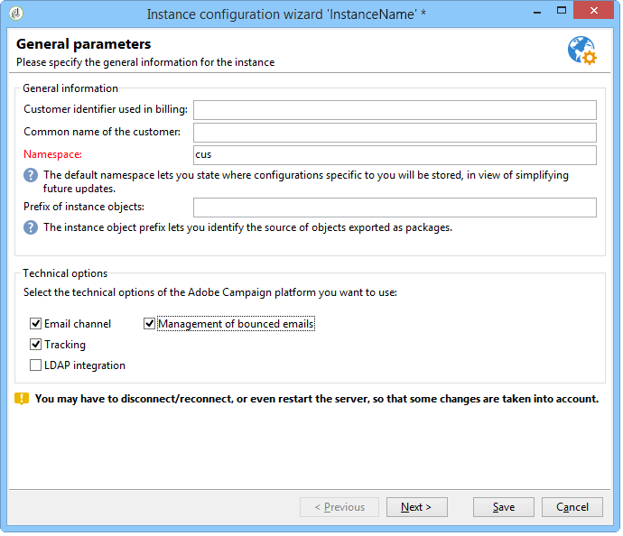

# 部署实例{#deploying-an-instance}

>[!NOTE]
>
>服务器端配置只能由Adobe为Adobe托管的部署执行。 要进一步了解不同的部署，请参阅托 [管模型部分](../../installation/using/hosting-models.md) ，或 [本文](https://helpx.adobe.com/campaign/kb/acc-on-prem-vs-hosted.html)。

## 部署向导 {#deployment-wizard}

Adobe Campaign客户端控制台中提供的图形向导允许您定义要连接到的实例的参数。

要启动部署向导，请选择“工 **具”>“高级”>“部署向导”**。


配置步骤如下：

1. [常规参数](#general-parameters)
1. [电子邮件渠道参数](#email-channel-parameters)
1. [管理退回的电子邮件](#managing-bounced-emails)
1. [跟踪配置](#tracking-configuration)
1. [移动通道参数](#mobile-channel-parameters)
1. [区域设置](#regional-settings)
1. [从Internet访问](#access-from-the-internet)
1. [管理公共资源](#managing-public-resources)
1. [清除数据](#purging-data)

## 常规参数 {#general-parameters}

在部署向导的第一步中，您可以输入有关实例的一般信息。



### 一般信息 {#general-information}

窗口的下半部分允许您选择要激活的选项。

* **[!UICONTROL Customer identifier used in billing]** :这可以是实例的名称和版本号。
* **[!UICONTROL Common name of the customer]** :输入包含公司名称的字符串。 此信息可在取消订阅链接中使用。
* **[!UICONTROL Namespace]** :输入小写形式的短标识符。 其目的是在进行升级时区分您的特定配置和出厂配置。 默认的命名空间 **为cus** - for customer.

### 技术选项 {#technical-options}

窗口的下半部分允许您选择要激活的选项。

可以使用以下选项：

* **[!UICONTROL Email channel]** :以激活电子邮件发送。 请参阅电子 [邮件渠道参数](#email-channel-parameters)。
* **[!UICONTROL Tracking]** :启用目标人口跟踪（打开和单击）。 请参阅 [跟踪配置](#tracking-configuration)。
* **[!UICONTROL Managing bounced emails]** :定义用于接收传入电子邮件的POP帐户。 请参阅管 [理退回的电子邮件](#managing-bounced-emails)。
* **[!UICONTROL LDAP integration]** :通过LDAP目录配置用户身份验证。 请参阅 [通过LDAP连接](../../installation/using/connecting-through-ldap.md)。

## 电子邮件渠道参数 {#email-channel-parameters}

通过以下步骤，您可以定义要在消息标题中显示的信息。

这些参数可能会在交付模板中过载，并且对于每个交付（如果用户具有所需权限）单独地过载。

### 交付电子邮件的参数 {#parameters-for-delivered-emails}


指示以下参数：

* **[!UICONTROL Sender name]** :发送方的姓名、
* **[!UICONTROL Sender address]** :发件人地址，
* **[!UICONTROL Reply address text]** :该名称可自定义，当收件人单击其电子邮件客户端软 **[!UICONTROL Reply]** 件中的按钮时将使用，
* **[!UICONTROL Reply address]** :收件人单击其电子邮件客户端软件 **[!UICONTROL Reply]** 中的按钮时使用的电子邮件地址，
* **[!UICONTROL Error address]** :有错误消息的电子邮件地址。 这是用于处理弹回邮件的技术地址，包括由于目标地址不存在而由Adobe Campaign服务器接收的电子邮件。

除此之外，您还可以指定为发送 **者地址** 、错误地址授权的掩码。 如有必要，这些蒙版可以使用逗号分隔。 此配置是可选的。 输入字段后，Adobe Campaign会在发送时（在分析过程中，如果地址不包含任何变量）检查地址是否有效。 此操作模式可确保没有使用可能触发交付问题的地址。 传送地址必须在传送服务器上配置。

### 地址中授权的字符 {#characters-authorized-in-addresses}

<!--This window enables you to define, for all email campaigns, the delivery and address-quality management options.-->

在Adobe Campaign数据库中，必须按如下方式创建所有电子邮件地址： `x@y.z`. **x**、 **y** 和 **** z字符不得为空，且不得包括未授权的字符。

您可以在此处在数据库的电子邮件字段中定义授权字符（“数据策略”）。 当通过接口、Web表单和导入数据在数据库中输入信息时，列表中未包含的字符将被禁止并因此被拒绝。

有两个列表可用：仅限 **欧洲** , **或仅限美国**。 如有必要，可添加其他字符。

### 传送参数 {#delivery-parameters}

**高级**&#x200B;参数……链接允许您访问传送选项、链接到重试和隔离的参数。


通过此窗口，您可以为所有电子邮件营销活动定义分发和地址质量管理选项。

可以使用以下选项：

* **[!UICONTROL Delivery duration of messages]** :在此时间之后，交付将停止（默认为5天）,
* **[!UICONTROL Online resources validity duration]** :保留收件人配置文件中的信息以生成镜像页面的时间，
* **[!UICONTROL Exclude recipients who no longer wish to be contacted]** :选择此选项后，将不会联系列入黑名单的收件人，
* **[!UICONTROL Automatically ignore doubles]** :选择此选项后，将不会将传送内容复制到地址。

### 重试参数 {#retry-parameters}

有关恢复的信息在恢复期 **间和恢复****数字字段中提供** :当收件人无法访问时（例如，如果其收件箱已满），默认情况下程序将尝试与他们联系5次，每次尝试（在最大发送时间内）间隔1小时。 这些值可以更改以满足您的需求。

### 隔离参数 {#quarantine-parameters}

隔离的配置选项如下：

* **[!UICONTROL Duration between two significant errors]** :默认情况下，输入一个值(“1d”):1天)定义应用程序在出现故障时在增加错误计数器之前等待的时间，
* **[!UICONTROL Maximum number of errors before quarantine]** :到达此值后，将隔离电子邮件地址(默认为“5”:地址将在第六个错误时被隔离。) 这意味着联系人将自动从后续分发中排除。

## 管理退回的电子邮件 {#managing-bounced-emails}

弹回邮件对于确定发送错误非常重要。 这些错误在规则确定其原因后在NP@I中分类。

仅当在部署向导的第一个 **阶段中选择了“电子邮** 件渠道 **”和“弹回邮件** ”管理选项时，此步骤才可用。 请参阅 [常规参数](#general-parameters)。

此阶段允许您定义用于管理弹回邮件的设置。


### 用于检索传入邮件的POP帐户 {#pop-account-used-to-retrieve-incoming-mails}

指示要连接到帐户以检索传入电子邮件的参数。

* **[!UICONTROL Label]** :名称，包括下面给出的所有参数，
* **[!UICONTROL Server]** :用于检索弹回邮件（传入邮件）的服务器，
* **[!UICONTROL Security]** :如有必要， **[!UICONTROL SSL]** 请从下拉列表中选择，
* **[!UICONTROL Port]** :服务器端口（通常为110）,
* **[!UICONTROL Account]** :用于弹回邮件的帐户名称，
* **[!UICONTROL Password]** :与帐户关联的密码。

指定POP设置后，单击“ **Test** （测试）”以确保它们正确。

### 未处理的弹回邮件 {#unprocessed-bounce-mails}

弹回由Adobe Campaign自动处理，并应用“管理”>“营销活动管理”>“非交付项管理”>“交付日志资格 **”节点中列出的规则** 。 有关详细信息，请参阅弹 [回邮件管理](../../delivery/using/understanding-delivery-failures.md#bounce-mail-management)。

未处理的弹回不会显示在Adobe Campaign界面中。 除非使用以下字段将其传输到第三方邮箱，否则这些邮件会自动删除：

* **[!UICONTROL Forwarding address]** :填写此字段可将由Adobe Campaign平台收集的所有错误消息（已处理或未处理）传输到第三方地址。
* **[!UICONTROL Address for errors]** :填写此字段以仅将inMail进程无法确定的错误消息传输到第三方地址。
* **[!UICONTROL SMTP server]** :服务器用于发送未处理的弹回电子邮件。

>[!CAUTION]
>
>要转发未处理的弹回电子邮件，Adobe建议仅填写字 **[!UICONTROL Address for errors]** 段。 但是，请确保定期检查所使用的地址，因为这可能会给邮件服务器带来沉重负载。 有关更多信息，请与您的客户经理联系。

## 跟踪配置 {#tracking-configuration}

通过下一步，您可以配置实例的跟踪。 必须声明实例并向跟踪服务器注册。

仅当在部署向导的第一页 **中选择了“电子邮** 件渠道 **”和“跟踪** ”选项时，才提供此步骤。 请参阅 [常规参数](#general-parameters)。

有关Web跟踪（跟踪模式、创建和插入标记……）的详细信息，请参阅 [本文档](../../configuration/using/about-web-tracking.md)。

### 工作原理 {#operating-principle}

当您激活对实例的跟踪时，发送过程中发送的URL会发生更改，以启用跟踪。

* 在部署向导的此页面上输入的外部URL（无论是否安全）信息用于构建新URL。 除此信息外，修改后的链接还包含：发送、接收和URL的标识符。

   跟踪信息由Adobe Campaign在跟踪服务器上收集，以丰富收件人配置文件和链接到分发的数据(选 **[!UICONTROL Tracking]** 项卡)。

   有关内部URL的信息只能由Adobe Campaign应用程序服务器用来联系跟踪服务器。

   For more on this, refer to [Tracking server](#tracking-server).

* 配置URL后，您需要启用跟踪。 为此，必须在跟踪服务器上注册该实例。

   For more on this, refer to [Saving tracking](#saving-tracking).

### 跟踪服务器 {#tracking-server}


要确保对此实例进行跟踪的效率，必须显示以下信息：
<!--With Mid-sourcing architecture, you can externalize tracking management. To do this:-->

* **[!UICONTROL External URL]** 和／或 **[!UICONTROL Secure external URL]** :输入要在要发送的电子邮件中使用的重定向URL。
* **[!UICONTROL Internal URL(s)]** :仅由Adobe Campaign服务器用来联系跟踪服务器以收集日志和上传URL的URL。 不必将其与实例关联。

   如果未指定URL，则默认情况下将使用跟踪URL。

借助中间采购架构，您可以将跟踪管理外置化。 操作步骤：

1. 选择选项 **[!UICONTROL Externalize tracking management]** :这允许您使用中间采购服务器作为跟踪服务器。
1. 填充 **[!UICONTROL External account]** 和字 **[!UICONTROL Instance name]** 段，以便能够连接到中间采购服务器。

   有关详细信息，请参 [阅中间采购服务器](../../installation/using/mid-sourcing-server.md)。

1. 单击该 **[!UICONTROL Enable the tracking instance]** 按钮可批准与服务器的连接。

   

### 保存跟踪 {#saving-tracking}

填充URL后，必须注册跟踪服务器。

单击跟 **踪服务器上的“注册”链接** ，然后选择一个可用选项。


实现跟踪有三种可能的架构：

1. **在现有实例中添加跟踪支持**

   如果实例已经根据其他需要（MTA服务器等）创建，则此选项适用在用作跟踪服务器的服务器上。

   

   输入重定向服 **务器** 上内部帐户的口令，以配置跟踪实例。

   >[!NOTE]
   >
   >如果使用了多个跟踪服务器，则它们必须使用相同的名称和密码。

   指定实例的名称和口令。

1. **创建专用于跟踪的新实例**

   当跟踪实例被保留用于跟踪并且没有任何其他应用程序模块时，此选项很有用。

   

   输入重定向服 **务器** 上内部帐户的口令，以配置跟踪实例。

   >[!NOTE]
   >
   >如果配置了多个跟踪服务器，则它们必须使用相同的口令。

   指定实例的名称、口令和任何关联的DNS掩码，如 **[!UICONTROL Campaign*]**。

1. **验证已为您预配置的跟踪实例**

   当您没有内部帐户的口令时，会使用 **此选项** ;在这种情况下，跟踪帐户在跟踪服务器上预配置。 输入重定向服务器的跟踪帐户的口令以验证跟踪实例。

   

   指定要验证的实例的名称。

单击 **批准** ，以通过跟踪服务器启动录制过程。

返回到上一个窗口，将显示一条消息，确认在跟踪服务器级别的注册：


对于标准安装，不 **得修改链接到URL搜索** 的参数。 有关所有其他参数，请联系Adobe。

## 移动通道参数 {#mobile-channel-parameters}

下一步允许您定义向手机（SMS和WAP推送）传送的默认设置。

>[!NOTE]
>
>移动渠道是可选的：此阶段仅在已购买时显示。 请检查您的许可协议。


### SMS交付的默认帐户 {#default-account-for-sms-delivery}

输入以下信息：

* **[!UICONTROL Label]** :输入此SMS/Wap推送帐户的名称。 例如，您可能希望使用路由器的名称。
* 对于，, **[!UICONTROL Server]**,, **[!UICONTROL Port]**,,, **[!UICONTROL Account]****[!UICONTROL Password]**, **[!UICONTROL Connector]**&#x200B;字段 **[!UICONTROL Send Endpoint]****[!UICONTROL Reception Endpoint]****[!UICONTROL Notification Endpoint]** :有关所需的设置，请与服务提供商联系。

### 发送的SMS参数 {#parameters-of-sms-sent}

在“优 **先级** ”下拉列表中：选择“正常”、“高”或“紧急”，将其应用于要发送的消息。

### 高级参数 {#advanced-parameters}

**高级**&#x200B;参数……链接允许您访问重试和隔离选项。


重试时间段和重试次数字段 **中提供** “重试 **次数”信息** :默认情况下，当无法访问移动设备时，程序将以至少15分钟的间隔重试5次（对于最大交付周期）。 这些值可以调整以满足您的需求。

隔离的配置选项如下：

* **[!UICONTROL Time between two significant errors]** :输入默认值(默认为“1d”:day)来定义应用程序在增加错误计数器之前等待的时间。
* **[!UICONTROL Maximum number of errors before quarantine]** :到达此值后，将隔离手机号码（默认为“5”）:该号码将在出现第六个错误时被隔离。) 这意味着联系人将自动排除在将来的分发之外。

## 区域设置 {#regional-settings}

此阶段允许您包含数据策略首选项。


* **[!UICONTROL Consider all phone numbers as international ones]** :选择此选项后，应用程序会将国际格式应用于电话号码（国家／地区前缀是必填的，因为在应用格式之前不会检查数字数）。 如果未选择此选项，则必须在国际电话号码前加上“+”或“00”。
* **[!UICONTROL Store all phone numbers using the international format]** :此选项仅涉及导 **入或编辑** 的国内电话号码。 定义您是要使用国内格式（如425 555 0150）还是国际格式(如+1 425 555 0150)

## 从Internet访问 {#access-from-the-internet}

>[!CAUTION]
>
>出于隐私原因，我们建议对所有外部资源使用HTTPS。

通过此步骤，您可以为Internet上公开的Adobe Campaign页面定义访问URL。

您还必须在此处指明链接到Web表单的发布选项。


### Web上公开的服务器 {#servers-exposed-on-the-web}

使用此页可将服务器URL填充到：

1. 访问Internet上公开的应用程序服务器：订阅／取消订阅表单、外部网等。
1. 访问应用程序服务器以获取Web上未公开的资源：表单、内部网、确认页。
1. 访问传送的镜像页面。

   镜像页面是显示电子邮件内容的动态页面。 它通过插入到发送给收件人的消息中的链接来访问，并且可以包含个性化元素。 镜像页面使收件人可以在因特网浏览器而不是电子邮件软件中阅读消息，而不管传送格式（文本或HTML）如何。 但是，仅在定义了所需的HTML内容后，才会为给定交付生成镜像页面。

Adobe Campaign允许您区分这三个URL，从而将负载分散到多个平台上。

## 管理公共资源 {#managing-public-resources}

>[!CAUTION]
>
>出于隐私原因，我们建议对所有外部资源使用HTTPS。

要从外部查看，链接到营销活动的电子邮件和公共资源中使用的图像必须显示在可从外部访问的服务器上。 然后，外部收件人或操作员可使用它们。


对于此步骤，您需要输入：

1. 新的公共资源URL。 有关详细信息，请参阅“公 [共资源URL](#public-resources-url) ”部分。
1. 传送中的图像检测模式。 有关详细信息，请参阅“交 [付图像检测](#delivery-image-detection) ”部分。
1. 发布选项。 有关详细信息，请参阅“发 [布模式](#publication-modes) ”部分。

公共资源可通过Adobe Campaign树 **的“管理”>“资源”>“在线”** >“公共资源”节点访问。 它们会收集在库中，并可以包含在电子邮件中，但也可用于营销活动或任务以及内容管理中。


### 公共资源URL {#public-resources-url}

第一个字段允许您指定上传后用于资源的URL的开头。 上传后，资源可通过此新URL访问。

在传送中，您可以使用存储在公共资源库中的图像或存储在服务器上的任何其他本地图像或图像。

* 对于电子邮件图像，请 **访问** https://**server** /res/img URL。

   对于每个传送，此值可以覆盖。

* 对于公共资源，URL **https://** server **/res/** instance ****，其中&#x200B;**instance**是跟踪实例的名称。

### 传送图像检测 {#delivery-image-detection}

在传送中，您可以使用存储在公共资源库中的图像或存储在服务器上的任何其他本地图像或图像。

通过字 **段URL蒙版** ，您可以指定自动上传图像时要跳过的URL蒙版列表。 例如，如果您使用存储在可从外部访问的站点（特别是Internet站点）上的图像，则可以在此字段中输入站点URL。


可以使用逗号分隔多个URL蒙版。

* 有关在电子邮件中使用和管理图像的信息，请参阅 [此部分](../../delivery/using/defining-the-email-content.md#adding-images)。
* 在传送向导中，从这些URL调用的图像将具有“已忽略”状态。

### 发布模式 {#publication-modes}

在向导的下半部分，您可以选择公共资源和图像的发布选项。 Web表单和调查也提供这些选项。

提供以下发布模式：

* 跟踪服务器

   资源将自动复制到不同的跟踪服务器。 它们是在步骤跟踪配置中 [配置的](#tracking-configuration)。

* 其他Adobe Campaign服务器

   您可以再使用一台其他Adobe Campaign服务器来复制资源。

   服务器端，要使用专用的Adobe Campaign服务器，必须使用以下命令创建一个新实例：

   ```
   nlserver config -addtrackinginstance:<trackingA>/<trackingA*>
   ```

   然后输入密码。

   专用服务器的参数在、和字段 **[!UICONTROL Media URL(s)]**&#x200B;中 **[!UICONTROL Password]** 给 **[!UICONTROL Instance name]** 定。

   

* 手动发布脚本（仅适用于公共资源）

   

   可以使用脚本发布图像：

   * 必须创建此脚本：其内容取决于您的配置。
   * 脚本将由以下命令调用：

      ```
      [INSTALL]/copyToFrontal.vbs "$(XTK_INSTALL_DIR)\var\<instance>\upload\" "img1,img2,img3"
      ```

      其中 `[INSTALL]` 是Adobe Campaign安装文件夹的访问路径。

   * 在Unix中，确保脚本是可执行的。

对于图像，它必须将它们从通过 **** NmsDelivery_ImageSubDirectory选项指定的“images”文件夹复制到一个或多个前端服务器。 这些服务器将存储这些图像，以便通过新配置的URL访问它们。

如果在Adobe Campaign服务器上发布时没有手动发布脚本，默认情况下，传送的图像会存储在中 `$(XTK_INSTALL_DIR)/var/res/img/ directory`。 相应的URL如下： **`https://server/res/img`**.

`XTK_INSTALL_DIR)/var/res/$(INSTANCE_NAME)`. 相应的URL如下：其中 **`https://server/res/instance`** 实例是跟踪实例的名称。

>[!NOTE]
>
>可以更改公共资源存储目录。 有关此问题的详细信息，请参阅 [管理公共资源](#managing-public-resources)。

### 同步公共资源 {#synchronizing-public-resources}

此功能允许您同 **步多台备用服务器** 上的公共资源。

如果跟踪服务器上不存在公共资源，或者如果该资源返回404错误，则跟踪服务器将尝试在其中一台备用服务器上查找该资源。

必须在Marketing server的serverConf.xml文件中声明和配置备 **用服务器** 。 serverConf.xml中可用的所 **有参数都列在本节** 中 [](../../installation/using/the-server-configuration-file.md)。

**声明**

```
<redirection>
<spareServer enabledIf="" id="" url=""/>
</redirection>
```

**配置**

对于每个必须同步的公共资源，您必须向部分中的元素添加 `<url>` 状态属 `<relay>` 性：

状态属性可以是以下三个值之一：

* 备用：公共资源已同步

* 正常：现有行为（无同步）

* 黑名单：如果URL返回404错误，则该URL将列入黑名单。 黑名单的持续时间（以秒为单位）由默认值为60 **s的** “超时”属性定义。

现成的同步配置是：

```
(extracted from the serverConf.xml file)

<redirection P3PCompactPolicy="CAO DSP COR CURa DEVa TAIa OUR BUS IND UNI COM NAV"
databaseId="" defLogCount="30" expirationURL="" maxJobsInCache="100"
startRedirection="true" startRedirectionInModule="true" trackWebVisitors="false" trackingPassword="">
<spareServer enabledIf="" id="1" url=""/>
</redirection>

....


<relay debugRelay="false" forbiddenCharsInAuthority="?#.@/:" forbiddenCharsInPath="?#/"
           modDir="index.html" startRelay="false" startRelayInModule="true" timeout="60">
   <url IPMask="" deny="" hostMask="" relayHost="true" relayPath="true" status="normal" targetUrl="https://localhost:8080" timeout="" urlPath="/view/*"/>
      <url IPMask="" deny="" hostMask="" relayHost="true" relayPath="true" status="blacklist" targetUrl="https://localhost:8080" timeout="" urlPath="*.jsp"/>
      <url IPMask="" deny="" hostMask="" relayHost="true" relayPath="true" status="blacklist" targetUrl="https://localhost:8080" timeout="" urlPath="*.jssp"/>
      <url IPMask="" deny="" hostMask="" relayHost="true" relayPath="true" status="blacklist" targetUrl="https://localhost:8080" timeout="" urlPath="/webApp/*"/>
      <url IPMask="" deny="" hostMask="" relayHost="true" relayPath="true" status="blacklist" targetUrl="https://localhost:8080" timeout="" urlPath="/report/*"/>
      <url IPMask="" deny="" hostMask="" relayHost="true" relayPath="true" status="blacklist" targetUrl="https://localhost:8080" timeout="" urlPath="/jssp/*"/>
      <url IPMask="" deny="" hostMask="" relayHost="true" relayPath="true" status="normal" targetUrl="https://localhost:8080" timeout="" urlPath="/strings/*"/>
      <url IPMask="" deny="" hostMask="" relayHost="true" relayPath="true" status="normal" targetUrl="https://localhost:8080" timeout="" urlPath="/interaction/*"/>
      <url IPMask="" deny="" hostMask="" relayHost="true" relayPath="true" status="normal" targetUrl="https://localhost:8080" timeout="" urlPath="/barcode/*"/>

      <url IPMask="" deny="" hostMask="" relayHost="false" relayPath="false" status="spare" targetUrl="" timeout="" urlPath="/favicon.*"/>
      <url IPMask="" deny="" hostMask="" relayHost="false" relayPath="false" status="spare" targetUrl="" timeout="" urlPath="/*.html"/>
      <url IPMask="" deny="" hostMask="" relayHost="false" relayPath="false" status="spare" targetUrl="" timeout="" urlPath="/*.png"/>
      <url IPMask="" deny="" hostMask="" relayHost="false" relayPath="false" status="spare" targetUrl="" timeout="" urlPath="/*.jpg"/>

 </relay>
```

## 清除数据 {#purging-data}

在部署向导的最后一个阶段，您可以配置对过时数据的自动清除。 这些值以天数表示。


数据会通过数据库清除工作流自动删除。 有关如何配置和操作此工作流以及已删除项目的详细信息，请参阅本 [文档](../../production/using/database-cleanup-workflow.md)。
