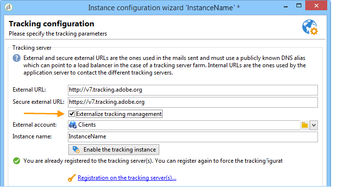

# 部署实例{#deploying-an-instance}

>[!NOTE]
>
>对于由Adobe托管的部署，只能由Adobe执行服务器端配置。 要了解有关不同部署的更多信息，请参阅[托管模型](../../installation/using/hosting-models.md)部分或[此页面](../../installation/using/capability-matrix.md)。

## 部署向导 {#deployment-assistant}

Adobe Campaign提供了一个图形助手(可在Adobe Campaign客户端控制台中使用)，用于定义要连接的实例的参数。

要启动部署向导，请选择&#x200B;**工具>高级>部署向导**。


配置步骤如下：

1. [常规参数](#general-parameters)
1. [电子邮件渠道参数](#email-channel-parameters)
1. [管理退回的电子邮件](#managing-bounced-emails)
1. [跟踪配置](#tracking-configuration)
1. [移动渠道参数](#mobile-channel-parameters)
1. [区域设置](#regional-settings)
1. [从Internet访问](#access-from-the-internet)
1. [管理公共资源](#managing-public-resources)
1. [清除数据](#purging-data)

## 常规参数 {#general-parameters}

部署向导的第一步允许您输入有关实例的一般信息。


### 一般信息 {#general-information}

窗口的下部允许您选择要激活的选项。

* **[!UICONTROL Customer identifier used in billing]** ：这可以是实例的名称和版本号。
* **[!UICONTROL Common name of the customer]** ：输入带有公司名称的字符串。 此信息可在退订链接中使用。
* **[!UICONTROL Namespace]** ：输入小写的短标识符。 目的是区分您的特定配置和工厂配置在升级时发生的情形。 客户的默认命名空间是&#x200B;**cus**。

### 技术选项 {#technical-options}

窗口的下部允许您选择要激活的选项。

可以使用以下选项：

* **[!UICONTROL Email channel]** ：激活电子邮件投放。 请参阅[电子邮件渠道参数](#email-channel-parameters)。
* **[!UICONTROL Tracking]** ：启用目标群体的跟踪（打开数和点击数）。 请参阅[跟踪配置](#tracking-configuration)。
* **[!UICONTROL Managing bounced emails]** ：定义用于接收传入电子邮件的POP帐户。 请参阅[管理退回的电子邮件](#managing-bounced-emails)。
* **[!UICONTROL LDAP integration]** ：通过LDAP目录配置用户身份验证。 请参阅[通过LDAP连接](../../installation/using/connecting-through-ldap.md)。

## 电子邮件渠道参数 {#email-channel-parameters}

以下步骤允许您定义要在邮件标头中显示的信息。

这些参数可能会在投放模板中过载，并且可能会针对每次投放分别过载（如果用户具有所需的权限）。

### 已投放电子邮件的参数 {#parameters-for-delivered-emails}


指示以下参数：

* **[!UICONTROL Sender name]** ：输入发件人的名称。
* **[!UICONTROL Sender address]** ：输入发件人的电子邮件地址。 从Adobe Campaign发送电子邮件时，不会监控&#x200B;**发件人地址**&#x200B;邮箱，因此营销用户无法访问此邮箱。 Adobe Campaign也不提供自动回复或自动转发此邮箱中接收的电子邮件的功能。 请参阅此文档[&#128279;](https://experienceleague.adobe.com/docs/deliverability-learn/deliverability-best-practice-guide/additional-resources/campaign/ac-starting-new-platform.html){_blank}以了解有关可投放性最佳实践的更多信息。

* **[!UICONTROL Reply address text]** ：输入收件人单击&#x200B;**[!UICONTROL Reply]**&#x200B;按钮时使用的名称。
* **[!UICONTROL Reply address]** ：输入收件人单击电子邮件客户端软件中的&#x200B;**[!UICONTROL Reply]**&#x200B;按钮时要使用的电子邮件地址。 **回复地址**&#x200B;字段的用途是您希望收件人回复到&#x200B;**发件人地址**&#x200B;以外的其他地址。  此地址必须是有效的电子邮件地址，链接到受监视的邮箱，并由客户托管。  它可以是支持邮箱，例如`customer-care@customer.com`，在其中读取和响应电子邮件。

* **[!UICONTROL Error address]** ：输入包含错误的消息的电子邮件地址。 这是用于处理退回邮件的技术地址，包括Adobe Campaign服务器因目标地址不存在而收到的电子邮件。 此地址必须是有效的电子邮件地址，链接到受监视的邮箱，并由客户托管。 它可能是退回邮箱，例如`errors@customer.com`。 可以从投放/投放模板属性的&#x200B;**SMTP**&#x200B;选项卡，为投放或投放模板更改此地址。 [了解详情](../../delivery/using/email-parameters.md#managing-bounce-emails-managing-bounce-emails)。


此外，您还可以为发件人地址和错误地址指定授权的&#x200B;**掩码**。 如有必要，可以使用逗号分隔这些掩码。 此配置是可选的。 输入字段后，Adobe Campaign会在投放时（分析期间，如果地址不包含任何变量）检查地址是否有效。 此操作模式可确保不使用可能触发投放问题的地址。 必须在投放服务器上配置投放地址。

>[!NOTE]
>
>* 这些设置保存在Campaign平台选项中。 [了解详情](../../installation/using/configuring-campaign-options.md)。
> 
>* 对于多品牌配置，您可以调整错误地址并从电子邮件路由外部帐户覆盖此配置。 [了解详情](../../installation/using/external-accounts.md#email-routing-external-account)。
>


### 地址中授权的字符 {#characters-authorized-in-addresses}

<!--This window enables you to define, for all email campaigns, the delivery and address-quality management options.-->

在Adobe Campaign数据库中，必须按如下方式创建所有电子邮件地址： `x@y.z`。 **x**、**y**&#x200B;和&#x200B;**z**&#x200B;字符不得为空，且不得包含非授权字符。

您可以在此处定义数据库的电子邮件字段中授权的字符（“数据策略”）。 当通过界面通过Web表单在数据库中输入信息以及导入数据时，列表未包含的字符将被禁止并因此被拒绝。

有两个列表可用：**仅限欧洲**&#x200B;或&#x200B;**仅限美国**。 如有必要，可以添加其他字符。

### 投放参数 {#delivery-parameters}

通过&#x200B;**高级参数……**&#x200B;链接，您可以访问投放选项、链接到重试和隔离的参数。


利用此窗口，您可以为所有电子邮件促销活动定义投放和地址质量管理选项。

可以使用以下选项：

* **[!UICONTROL Delivery duration of messages]** ：在此时间之后，投放将停止（默认为5天）。
* **[!UICONTROL Online resources validity duration]** ：保留收件人配置文件中的信息以生成镜像页面的时间。
* **[!UICONTROL Exclude recipients who no longer wish to be contacted]** ：选择此选项时，将不会联系阻止列表的收件人。
* **[!UICONTROL Automatically ignore doubles]** ：选择此选项时，将不会向重复的地址进行投放。

>[!NOTE]
>
>对于托管或混合安装，如果您已升级到[增强型MTA](../../delivery/using/sending-with-enhanced-mta.md)，则只有在设置为&#x200B;**3.5天或更短的时间内**&#x200B;时才使用&#x200B;**[!UICONTROL Delivery duration of the messages]**。 如果定义的值超过3.5天，则不会将其考虑在内。

### 重试参数 {#retry-parameters}

恢复信息在&#x200B;**恢复周期**&#x200B;和&#x200B;**恢复次数**&#x200B;字段中提供：当无法联系收件人时，例如，当收件人的收件箱已满时，默认情况下，程序将尝试联系他们5次，每次尝试之间间隔一小时（在最大投放时间内）。 可以根据您的需求更改这些值。

>[!NOTE]
>
>对于托管或混合安装，如果您已升级到[增强型MTA](../../delivery/using/sending-with-enhanced-mta.md)，则不再使用Campaign重试参数。 软退回重试次数以及它们之间的时间长度由Enhanced MTA根据从消息的电子邮件域返回的退回响应的类型和严重性确定。

### 隔离参数 {#quarantine-parameters}

隔离的配置选项如下所示：

* **[!UICONTROL Duration between two significant errors]** ：输入一个值（默认为&quot;1d&quot;： 1天），以定义应用程序在失败时增加错误计数之前等待的时间，
* **[!UICONTROL Maximum number of errors before quarantine]** ：达到此值后，将隔离电子邮件地址（默认情况下，“5”：出现第六次错误时将隔离该地址）。 这意味着后续投放中将自动排除改联系人。

## 管理退回的电子邮件 {#managing-bounced-emails}

退回邮件对于确定投放错误非常重要。 一旦规则确定了错误的原因，就会在NP@I中对这些错误进行分类。

只有在部署向导的第一个阶段中选择了&#x200B;**电子邮件渠道**&#x200B;和&#x200B;**退回邮件**&#x200B;管理选项时，此步骤才可用。 请参阅[常规参数](#general-parameters)。

利用此阶段，可定义用于管理退回邮件的设置。


### 用于检索传入邮件的POP帐户 {#pop-account-used-to-retrieve-incoming-mails}

指示连接到用于检索传入电子邮件的帐户的参数。

* **[!UICONTROL Label]** ：包含下面给定所有参数的名称，
* **[!UICONTROL Server]** ：用于检索退回邮件（传入邮件）的服务器，
* **[!UICONTROL Security]** ：如有必要，请从下拉列表中选择&#x200B;**[!UICONTROL SSL]**，
* **[!UICONTROL Port]** ：服务器端口（通常为110），
* **[!UICONTROL Account]** ：用于退回邮件的帐户名称，
* **[!UICONTROL Password]** ：与帐户关联的密码。

指定POP设置后，单击&#x200B;**测试**&#x200B;以确保它们正确。

### 未处理的退回邮件 {#unprocessed-bounce-mails}

退回由Adobe Campaign自动处理，应用&#x200B;**管理> Campaign Management >不可投放项管理>投放日志资格**&#x200B;节点中列出的规则。 有关详情，请参阅[退回邮件管理](../../delivery/using/understanding-delivery-failures.md#bounce-mail-management)。

未处理的退回不会显示在Adobe Campaign界面中。 除非使用以下字段将它们传输到第三方邮箱，否则会自动删除它们：

* **[!UICONTROL Forwarding address]** ：填写此字段以将Adobe Campaign平台收集的所有错误消息（已处理或未处理）传输到第三方地址。
* **[!UICONTROL Address for errors]** ：填写此字段以仅将inMail进程不符合条件的错误消息传输到第三方地址。
* **[!UICONTROL SMTP server]** ：用于发送未处理的退回电子邮件的服务器。

>[!IMPORTANT]
>
>要转发未处理的退回电子邮件，Adobe建议仅填写&#x200B;**[!UICONTROL Address for errors]**&#x200B;字段。 但是，请确保定期检查所使用的地址，因为这可能会给邮件服务器带来大量负载。 有关更多信息，请与您的客户经理联系。

## 跟踪配置 {#tracking-configuration}

下一步允许您为实例配置跟踪。 实例必须声明并在跟踪服务器中注册。

只有在部署向导的第一页中选择了&#x200B;**电子邮件渠道**&#x200B;和&#x200B;**跟踪**&#x200B;选项时，才会提供此步骤。 请参阅[常规参数](#general-parameters)。

有关Web跟踪（跟踪模式、创建和插入标记……）的详细信息，请参阅[本文档](../../configuration/using/about-web-tracking.md)。

### 操作原则 {#operating-principle}

当您在实例上激活跟踪时，投放中的URL会在发送期间发生更改以启用跟踪。

* 使用在部署向导的此页面上输入的关于外部URL（无论是否安全）的信息来构建新URL。 除了此信息外，修改的链接还包含：投放的标识符、收件人和URL。

  Adobe Campaign在跟踪服务器上收集跟踪信息，以扩充收件人用户档案和链接到投放的数据（**[!UICONTROL Tracking]**&#x200B;选项卡）。

  有关内部URL的信息仅供Adobe Campaign应用程序服务器用于联系跟踪服务器。

  有关详细信息，请参阅[跟踪服务器](#tracking-server)。

* 配置URL后，您需要启用跟踪。 为此，必须在跟踪服务器上注册实例。

  有关详细信息，请参阅[保存跟踪](#saving-tracking)。

### 跟踪服务器 {#tracking-server}


为确保此实例上的跟踪效率，必须显示以下信息：
<!--With Mid-sourcing architecture, you can externalize tracking management. To do this:-->

* **[!UICONTROL External URL]**&#x200B;和/或&#x200B;**[!UICONTROL Secure external URL]** ：输入要用于要发送的电子邮件中的重定向URL。
* **[!UICONTROL Internal URL(s)]** ：Adobe Campaign服务器仅用于联系跟踪服务器以收集日志和上传URL的URL。 无需将其与实例关联。

  如果不指定URL，则默认将使用跟踪URL。

借助中间源架构，您可以将跟踪管理外部化。 操作步骤：

1. 选择选项&#x200B;**[!UICONTROL Externalize tracking management]** ：这允许您使用中间源服务器作为跟踪服务器。
1. 填充&#x200B;**[!UICONTROL External account]**&#x200B;和&#x200B;**[!UICONTROL Instance name]**&#x200B;字段以便能够连接到中间源服务器。

   有关详细信息，请参阅[中间源服务器](../../installation/using/mid-sourcing-server.md)。

1. 单击&#x200B;**[!UICONTROL Enable the tracking instance]**&#x200B;按钮批准与服务器的连接。

   

### 正在保存跟踪 {#saving-tracking}

填充URL后，您必须注册跟踪服务器。

单击跟踪服务器&#x200B;**上的**&#x200B;注册链接，然后选择其中一个可用选项。


实施跟踪的体系结构可能具有以下三种类型：

1. **在现有实例中添加跟踪支持**

   如果在将用作跟踪服务器的服务器上已针对其他需求（MTA服务器等）创建了实例，则此选项适用。

   

   输入重定向服务器上&#x200B;**内部**&#x200B;帐户的密码以配置跟踪实例。

   >[!NOTE]
   >
   >如果使用多个跟踪服务器，则它们必须使用相同的名称和密码。

   指定实例的名称和口令。

1. **创建专用于跟踪的新实例**

   当跟踪实例是为跟踪而保留的，没有任何其他应用程序模块时，此选项非常有用。

   

   输入重定向服务器上&#x200B;**内部**&#x200B;帐户的密码以配置跟踪实例。

   >[!NOTE]
   >
   >如果配置了多个跟踪服务器，则它们必须使用相同的密码。

   指定实例的名称、密码和任何关联的DNS掩码，如&#x200B;**[!UICONTROL Campaign*]**。

1. **验证已为您预配置的跟踪实例**

   当没有&#x200B;**internal**&#x200B;帐户的密码时，使用此选项；在这种情况下，跟踪服务器上已为您预配置跟踪帐户。 输入重定向服务器的跟踪帐户的密码以验证跟踪实例。

   

   指定要验证的实例的名称。

单击&#x200B;**批准**&#x200B;以启动跟踪服务器的录制过程。

在上一个窗口中，将显示一条消息，确认在跟踪服务器级别进行注册：


对于标准安装，不能修改链接到URL搜索&#x200B;**的参数**。 有关所有其他参数，请联系Adobe。

## 移动渠道参数 {#mobile-channel-parameters}

下一步允许您定义用于交付到移动设备（短信和WAP推送）的默认设置。

>[!NOTE]
>
>移动渠道是可选的：此阶段仅在购买后才显示。 请核实您的许可协议。


### 短信投放的默认帐户 {#default-account-for-sms-delivery}

输入以下信息：

* **[!UICONTROL Label]** ：输入此SMS/Wap推送帐户的名称。 例如，您可能希望使用路由器的名称。
* 对于&#x200B;**[!UICONTROL Server]**、**[!UICONTROL Port]**、**[!UICONTROL Account]**、**[!UICONTROL Password]**、**[!UICONTROL Connector]**、**[!UICONTROL Send Endpoint]**、**[!UICONTROL Reception Endpoint]**、**[!UICONTROL Notification Endpoint]**&#x200B;字段：请与服务提供商联系以获取所需的设置。

### 已发送短信的参数 {#parameters-of-sms-sent}

在&#x200B;**优先级**&#x200B;下拉列表中：选择“正常”、“高”或“紧急”以将其应用于要发送的消息。

### 高级参数 {#advanced-parameters}

通过&#x200B;**高级参数……**&#x200B;链接，您可以访问重试和隔离选项。


在&#x200B;**重试时段**&#x200B;和&#x200B;**重试次数**&#x200B;字段中提供了有关重试的信息：当无法访问移动设备时，默认情况下，程序将按至少15分钟的时间间隔（最大投放时段）重试5次。 可根据您的需求对这些值进行调整。

隔离的配置选项如下所示：

* **[!UICONTROL Time between two significant errors]** ：输入默认值（默认为“1d”：天），以定义应用程序在递增错误计数器的失败之前等待的时间。
* **[!UICONTROL Maximum number of errors before quarantine]** ：一旦达到此值，将隔离该手机号码（默认情况下，“5”：出现第六次错误时将隔离该号码）。 这意味着该联系人会自动从将来的投放中排除。

## 区域设置 {#regional-settings}

此阶段允许您包含数据策略首选项。


* **[!UICONTROL Consider all phone numbers as international ones]** ：选择此选项时，应用程序会将国际格式应用于电话号码（国家/地区前缀是必填的，因为在应用格式之前不会检查位数）。 如果未选中此选项，则必须在国际电话号码前面加上“+”或“00”。
* **[!UICONTROL Store all phone numbers using the international format]** ：此选项仅涉及导入或编辑的&#x200B;**国内**&#x200B;电话号码。 定义您要使用国内格式（如425 555 0150）还是国际格式（如+1 425 555 0150）

## 从Internet访问 {#access-from-the-internet}

>[!IMPORTANT]
>
>出于隐私原因，我们建议对所有外部资源使用HTTPS。

此步骤允许您为Internet上公开的Adobe Campaign页面定义访问URL。

您还必须在此处指示链接到Web窗体的发布选项。


### Web上公开的服务器 {#servers-exposed-on-the-web}

使用此页可填充服务器URL，以：

1. 访问在Internet上公开的应用程序服务器：订阅/退订表单、外联网等。
1. 访问应用程序服务器以获取Web上未公开的资源：表单、Intranet、确认页。
1. 访问投放的镜像页面。

   镜像页面是显示电子邮件内容的动态页面。 它可通过插入到发送给收件人的消息中的链接来访问，并可包含个性化元素。 利用镜像页面，收件人可以在Internet浏览器而不是电子邮件软件中读取消息，无论投放格式(文本或HTML)如何。 但是，仅当定义了所需的HTML内容时，才会为给定投放生成镜像页面。

Adobe Campaign允许您区分这三个URL，以将负载分散到多个平台上。


>[!NOTE]
>
>* 这些设置保存在Campaign平台选项中。 [了解详情](../../installation/using/configuring-campaign-options.md)。
>* 对于多品牌配置，您可以调整镜像页面URL，并从电子邮件路由外部帐户覆盖此配置。 [了解详情](../../installation/using/configuring-campaign-options.md)。


## 管理公共资源 {#managing-public-resources}

>[!IMPORTANT]
>
>出于隐私原因，我们建议对所有外部资源使用HTTPS。

要从外部查看，必须在外部可访问的服务器上存在电子邮件中使用的图像以及与营销活动关联的公共资源。 然后，外部收件人或操作员可以使用它们。


对于此步骤，您需要输入：

1. 新的公共资源URL。 有关详细信息，请参阅[公共资源URL](#public-resources-url)部分。
1. 投放中的图像检测模式。 有关更多信息，请参阅[投放图像检测](#delivery-image-detection)部分。
1. 发布选项。 有关详细信息，请参阅[发布模式](#publication-modes)部分。

可通过Adobe Campaign树的&#x200B;**管理>资源>联机>公共资源**&#x200B;节点访问公共资源。 它们收集在库中，可以包含在电子邮件中，但也可用于营销活动或任务以及内容管理。


### 公共资源URL {#public-resources-url}

第一个字段允许您指定上传后用于资源的URL的开头。 上传后，可通过此新URL访问资源。

在投放中，您可以使用存储在公共资源库中的图像或存储在服务器上的任何其他本地图像或图像。

* 对于电子邮件图像，**https://**&#x200B;服务器&#x200B;**/res/img** URL。

  每次投放都可以覆盖此值。

* 对于公共资源，URL **https://** server **/res/** instance **&#x200B;**，其中&#x200B;**instance**&#x200B;是跟踪实例的名称。

### 投放图像检测 {#delivery-image-detection}

在投放中，您可以使用存储在公共资源库中的图像或存储在服务器上的任何其他本地图像或图像。

字段&#x200B;**URL掩码**&#x200B;允许您指定在自动上传图像时要跳过的URL掩码列表。 例如，如果您使用的图像存储在可从外部访问的站点上，尤其是在Internet站点上，则可以在此字段中输入站点URL。


您可以使用逗号指定多个URL掩码来分隔每个URL掩码。

* 有关在电子邮件中使用和管理图像的信息，请参阅[此章节](../../delivery/using/defining-the-email-content.md#adding-images)。
* 在投放助手中，从这些URL调用的图像将具有“已忽略”状态。

### 发布模式 {#publication-modes}

该助理的下半部分允许您选择公共资源和图像的发布选项。

可以使用以下发布模式：

* 跟踪服务器

  资源将自动复制到不同的跟踪服务器。 它们在步骤[跟踪配置](#tracking-configuration)中配置。

* 其他Adobe Campaign服务器

  您可以使用将要复制资源的其他Adobe Campaign服务器。

  服务器端，要使用专用的Adobe Campaign服务器，您必须使用以下命令创建新实例：

  ```
  nlserver config -addtrackinginstance:<trackingA>/<trackingA*>
  ```

  然后输入密码。

  专用服务器的参数在&#x200B;**[!UICONTROL Media URL(s)]**、**[!UICONTROL Password]**&#x200B;和&#x200B;**[!UICONTROL Instance name]**&#x200B;字段中给定。

  

* 手动发布脚本（仅适用于公共资源）

  

  您可以使用脚本发布图像：

   * 您必须创建此脚本：其内容取决于您的配置。
   * 该脚本将通过以下命令调用：

     ```
     [INSTALL]/copyToFrontal.vbs "$(XTK_INSTALL_DIR)\var\<instance>\upload\" "img1,img2,img3"
     ```

     其中，`[INSTALL]`是Adobe Campaign安装文件夹的访问路径。

   * 在Unix中，确保脚本可执行。

对于图像，必须将其从通过&#x200B;**NmsDelivery_ImageSubDirectory**&#x200B;选项指定的“图像”文件夹复制到一个或多个前端服务器。 这些服务器将存储图像，以便通过新配置的URL访问它们。

在没有手动发布脚本的Adobe Campaign服务器上发布时，默认情况下，投放的图像存储在`$(XTK_INSTALL_DIR)/var/res/img/ directory`中。 对应的URL如下： **`https://server/res/img`**。

`XTK_INSTALL_DIR)/var/res/$(INSTANCE_NAME)`。 相应的URL如下所示： **`https://server/res/instance`**，其中实例是跟踪实例的名称。

>[!NOTE]
>
>可以更改公共资源存储目录。 有关详细信息，请参阅[管理公共资源](#managing-public-resources)。

### 同步公共资源 {#synchronizing-public-resources}

此功能允许您&#x200B;**同步多个备用服务器上的公共资源**。

如果公共资源在跟踪服务器上不存在，或者如果该资源返回404错误，则跟踪服务器将尝试在其中一个备用服务器上查找该资源。

必须在营销服务器的&#x200B;**serverConf.xml**&#x200B;文件中声明和配置备用服务器。 **serverConf.xml**&#x200B;中的所有可用参数都列在此[部分](../../installation/using/the-server-configuration-file.md)中。

**声明**

```
<redirection>
<spareServer enabledIf="" id="" url=""/>
</redirection>
```

**配置**

对于每个必须同步的公用资源，您必须向`<relay>`部分中的`<url>`元素添加一个状态属性：

状态属性可以是以下三个值之一：

* spare：公共资源已同步

* 正常：现有行为（不同步）

* 列入阻止列表黑名单：如果URL返回404错误，则会将其添加到。 列入阻止列表中URL的持续时间（以秒为单位）由&#x200B;**timeout**&#x200B;属性定义，其默认值为60秒。

此同步的现成配置为：

```
(extracted from the serverConf.xml file)

<redirection P3PCompactPolicy="CAO DSP COR CURa DEVa TAIa OUR BUS IND UNI COM NAV"
databaseId="" defLogCount="30" expirationURL="" maxJobsInCache="100"
startRedirection="true" startRedirectionInModule="true" trackWebVisitors="false" trackingPassword="">
<spareServer enabledIf="" id="1" url=""/>
</redirection>

....


<relay debugRelay="false" forbiddenCharsInAuthority="?#.@/:" forbiddenCharsInPath="?#/"
           modDir="index.html" startRelay="false" startRelayInModule="true" timeout="60">
   <url IPMask="" deny="" hostMask="" relayHost="true" relayPath="true" status="normal" targetUrl="https://localhost:8080" timeout="" urlPath="/view/*"/>
      <url IPMask="" deny="" hostMask="" relayHost="true" relayPath="true" status="blacklist" targetUrl="https://localhost:8080" timeout="" urlPath="*.jsp"/>
      <url IPMask="" deny="" hostMask="" relayHost="true" relayPath="true" status="blacklist" targetUrl="https://localhost:8080" timeout="" urlPath="*.jssp"/>
      <url IPMask="" deny="" hostMask="" relayHost="true" relayPath="true" status="blacklist" targetUrl="https://localhost:8080" timeout="" urlPath="/webApp/*"/>
      <url IPMask="" deny="" hostMask="" relayHost="true" relayPath="true" status="blacklist" targetUrl="https://localhost:8080" timeout="" urlPath="/report/*"/>
      <url IPMask="" deny="" hostMask="" relayHost="true" relayPath="true" status="blacklist" targetUrl="https://localhost:8080" timeout="" urlPath="/jssp/*"/>
      <url IPMask="" deny="" hostMask="" relayHost="true" relayPath="true" status="normal" targetUrl="https://localhost:8080" timeout="" urlPath="/strings/*"/>
      <url IPMask="" deny="" hostMask="" relayHost="true" relayPath="true" status="normal" targetUrl="https://localhost:8080" timeout="" urlPath="/interaction/*"/>
      <url IPMask="" deny="" hostMask="" relayHost="true" relayPath="true" status="normal" targetUrl="https://localhost:8080" timeout="" urlPath="/barcode/*"/>

      <url IPMask="" deny="" hostMask="" relayHost="false" relayPath="false" status="spare" targetUrl="" timeout="" urlPath="/favicon.*"/>
      <url IPMask="" deny="" hostMask="" relayHost="false" relayPath="false" status="spare" targetUrl="" timeout="" urlPath="/*.html"/>
      <url IPMask="" deny="" hostMask="" relayHost="false" relayPath="false" status="spare" targetUrl="" timeout="" urlPath="/*.png"/>
      <url IPMask="" deny="" hostMask="" relayHost="false" relayPath="false" status="spare" targetUrl="" timeout="" urlPath="/*.jpg"/>

 </relay>
```

## 清除数据 {#purging-data}

部署向导的最后一个阶段允许您配置自动清除过时数据的功能。 值以天为单位表示。


通过数据库清理工作流自动删除数据。 有关如何配置和操作此工作流的详细信息以及已删除项目的详细信息，请参阅此[文档](../../production/using/database-cleanup-workflow.md)。
