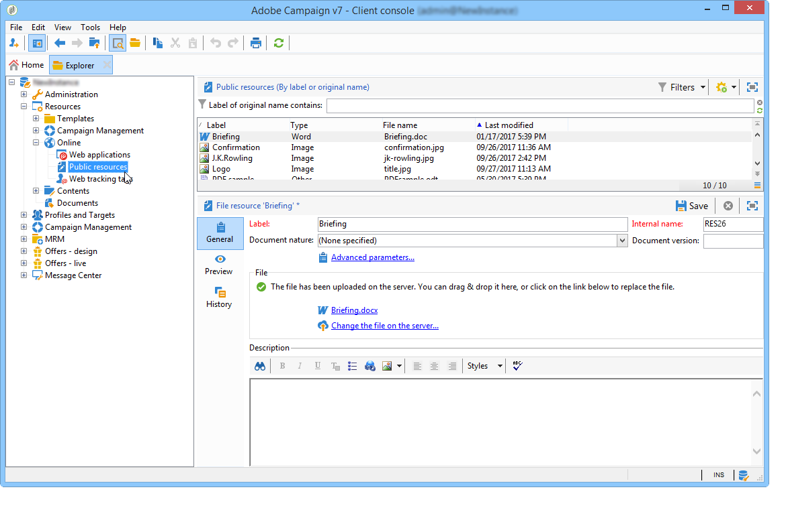

# 部署实例{#deploying-an-instance}


>[!NOTE]
>
>只能通过Adobe对由Adobe托管的部署执行服务器端配置。 要了解有关不同部署的更多信息，请参阅 [托管模型](../../installation/using/hosting-models.md) 或 [本页](../../installation/using/capability-matrix.md).

## 部署向导 {#deployment-wizard}

图形向导(在Adobe Campaign客户端控制台中提供)允许您定义要连接到的实例的参数。

要启动部署向导，请选择 **工具>高级>部署向导**.


配置步骤如下所示：

1. [常规参数](#general-parameters)
1. [电子邮件渠道参数](#email-channel-parameters)
1. [管理退回的电子邮件](#managing-bounced-emails)
1. [跟踪配置](#tracking-configuration)
1. [移动渠道参数](#mobile-channel-parameters)
1. [区域设置](#regional-settings)
1. [从Internet访问](#access-from-the-internet)
1. [管理公共资源](#managing-public-resources)
1. [清除数据](#purging-data)

## 常规参数 {#general-parameters}

在部署向导的第一步中，您可以输入有关实例的常规信息。


### 一般信息 {#general-information}

利用窗口的下部，可选择要激活的选项。

* **[!UICONTROL Customer identifier used in billing]** :这可以是实例的名称和版本号。
* **[!UICONTROL Common name of the customer]** :输入包含公司名称的字符串。 此信息可在退订链接中使用。
* **[!UICONTROL Namespace]** :以小写形式输入短标识符。 目的是在升级时区分您的特定配置和工厂配置。 默认的命名空间为 **木槿**  — 适用于客户。

### 技术选项 {#technical-options}

利用窗口的下部，可选择要激活的选项。

可以使用以下选项：

* **[!UICONTROL Email channel]** :激活电子邮件投放。 请参阅 [电子邮件渠道参数](#email-channel-parameters).
* **[!UICONTROL Tracking]** :启用目标群体（打开数和点击数）的跟踪。 请参阅 [跟踪配置](#tracking-configuration).
* **[!UICONTROL Managing bounced emails]** :定义用于接收传入电子邮件的POP帐户。 请参阅 [管理退回的电子邮件](#managing-bounced-emails).
* **[!UICONTROL LDAP integration]** :通过LDAP目录配置用户身份验证。 请参阅 [通过LDAP连接](../../installation/using/connecting-through-ldap.md).

## 电子邮件渠道参数 {#email-channel-parameters}

通过以下步骤，您可以定义要在消息标题中显示的信息。

这些参数可能会在投放模板中过载，并且会针对每个投放单独执行（如果用户具有所需的权限）。

### 已投放电子邮件的参数 {#parameters-for-delivered-emails}


指示以下参数：

* **[!UICONTROL Sender name]** :发件人的姓名、
* **[!UICONTROL Sender address]** :发件人的地址，
* **[!UICONTROL Reply address text]** :收件人单击 **[!UICONTROL Reply]** 按钮，
* **[!UICONTROL Reply address]** :收件人单击 **[!UICONTROL Reply]** 按钮，
* **[!UICONTROL Error address]** :出错的邮件的电子邮件地址。 这是用于处理退回邮件的技术地址，包括由于目标地址不存在而由Adobe Campaign服务器收到的电子邮件。

除此之外，您还可以指定 **掩码** 已授权发送者地址和错误地址。 如有必要，可以使用逗号分隔这些掩码。 此配置是可选的。 输入字段后，Adobe Campaign会在投放时（在分析期间，如果地址不包含任何变量）检查地址是否有效。 此操作模式可确保不使用可能触发投放问题的地址。 必须在投放服务器上配置投放地址。

### 地址中授权的字符 {#characters-authorized-in-addresses}

<!--This window enables you to define, for all email campaigns, the delivery and address-quality management options.-->

在Adobe Campaign数据库中，必须按如下方式创建所有电子邮件地址： `x@y.z`. 的 **x**, **y** 和 **z** 字符不得为空，且不得包含未授权的字符。

您可以在此处在数据库的电子邮件字段中定义授权字符（“数据策略”）。 当通过界面、Web窗体以及在导入数据时，在数据库中输入信息时，列表中未包含的字符将被禁止，因此会被拒绝。

提供了两个列表： **仅限欧洲** 或 **仅美国**. 如有必要，可以添加其他字符。

### 投放参数 {#delivery-parameters}

的 **高级参数……** 链接允许您访问投放选项、链接到重试和隔离的参数。


利用此窗口，可为所有电子邮件促销活动定义投放和地址质量管理选项。

可以使用以下选项：

* **[!UICONTROL Delivery duration of messages]** :在此时间之后，投放将停止（默认为5天），
* **[!UICONTROL Online resources validity duration]** :保留收件人用户档案信息以生成镜像页面的时间，
* **[!UICONTROL Exclude recipients who no longer wish to be contacted]** :选择此选项后，将不阻止列表会联系收件人，
* **[!UICONTROL Automatically ignore doubles]** :选择此选项后，将不会将投放到重复的地址。

### 重试参数 {#retry-parameters}

有关收回之资料载于 **恢复期** 和 **恢复次数** 字段：当收件人不可访问时，例如，如果收件人的收件箱已满，则默认情况下程序将尝试与他们联系5次，每次尝试之间的间隔为1小时（在最长投放时间）。 这些值可以根据您的需要进行更改。

### 隔离参数 {#quarantine-parameters}

隔离的配置选项如下：

* **[!UICONTROL Duration between two significant errors]** :默认情况下，输入值(“1d”):1天)来定义应用程序在失败时需要等待多久才增加错误计数，
* **[!UICONTROL Maximum number of errors before quarantine]** :达到此值后，会隔离电子邮件地址（默认为“5”个）：第6次出错时，该地址将被隔离)。 这意味着后续投放中将自动排除改联系人。

## 管理退回的电子邮件 {#managing-bounced-emails}

退回邮件对于确定投放错误非常重要。 规则确定其原因后，这些错误将在NP@I中进行分类。

此步骤仅在 **电子邮件渠道** 和 **退回邮件** 在部署向导的第一步中选择管理选项。 请参阅 [常规参数](#general-parameters).

利用此阶段，可定义用于管理退回邮件的设置。


### 用于检索传入邮件的POP帐户 {#pop-account-used-to-retrieve-incoming-mails}

指示连接到帐户以检索传入电子邮件的参数。

* **[!UICONTROL Label]** :名称，其中包含以下所有参数：
* **[!UICONTROL Server]** :用于检索退回邮件（传入邮件）的服务器，
* **[!UICONTROL Security]** :如有必要，请选择 **[!UICONTROL SSL]** 从下拉列表中，
* **[!UICONTROL Port]** :服务器端口（通常为110），
* **[!UICONTROL Account]** :用于退回邮件的帐户名称，
* **[!UICONTROL Password]** :与帐户关联的密码。

指定POP设置后，单击 **测试** 来确保它们正确无误。

### 未处理的退回邮件 {#unprocessed-bounce-mails}

退回由Adobe Campaign自动处理，并应用 **管理>促销活动管理>无法交付项管理>投放日志资格** 节点。 有关更多信息，请参阅 [退回邮件管理](../../delivery/using/understanding-delivery-failures.md#bounce-mail-management).

未处理的退回未显示在Adobe Campaign界面中。 除非使用以下字段将它们传输到第三方邮箱，否则将自动删除它们：

* **[!UICONTROL Forwarding address]** :填写此字段以传输到第三方地址，其中包含Adobe Campaign平台收集的所有错误消息（已处理或未处理）。
* **[!UICONTROL Address for errors]** :填写此字段，以便仅将inMail进程无法确认的错误消息传输到第三方地址。
* **[!UICONTROL SMTP server]** :用于发送未处理的退回电子邮件的服务器。

>[!IMPORTANT]
>
>要转发未处理的退回电子邮件，Adobe建议仅在 **[!UICONTROL Address for errors]** 字段。 但是，请确保定期检查使用的地址，因为这可能会给邮件服务器带来沉重的负载。 有关更多信息，请联系您的客户经理。

## 跟踪配置 {#tracking-configuration}

通过下一步，您可以为实例配置跟踪。 必须向跟踪服务器声明并注册实例。

此步骤仅在 **电子邮件渠道** 和 **跟踪** 选项。 请参阅 [常规参数](#general-parameters).

有关Web跟踪（跟踪模式、创建和插入标记……）的更多详细信息，请参阅 [本文档](../../configuration/using/about-web-tracking.md).

### 操作原则 {#operating-principle}

在实例上激活跟踪时，投放中的URL会在发送过程中发生更改，以启用跟踪。

* 在部署向导的此页面上输入的有关外部URL（无论安全与否）的信息将用于构建新URL。 除了此信息外，修改的链接还包含：投放、收件人和URL的标识符。

   跟踪信息由Adobe Campaign在跟踪服务器上收集，以丰富收件人用户档案和链接到投放的数据( **[!UICONTROL Tracking]** 选项卡)。

   有关内部URL的信息仅供Adobe Campaign应用程序服务器用于联系跟踪服务器。

   有关更多信息，请参阅 [跟踪服务器](#tracking-server).

* 配置URL后，您需要启用跟踪。 要实现此目的，必须在跟踪服务器上注册实例。

   有关更多信息，请参阅 [保存跟踪](#saving-tracking).

### 跟踪服务器 {#tracking-server}


为保证此实例上跟踪的效率，必须显示以下信息：
<!--With Mid-sourcing architecture, you can externalize tracking management. To do this:-->

* **[!UICONTROL External URL]** 和/或 **[!UICONTROL Secure external URL]** :输入要在要发送的电子邮件中使用的重定向URL。
* **[!UICONTROL Internal URL(s)]** :只有Adobe Campaign服务器用于联系跟踪服务器以收集日志和上传URL的URL。 无需将其与实例关联。

   如果您没有指定URL，则默认情况下将使用跟踪URL。

借助中间源架构，您可以将跟踪管理外部化。 操作步骤：

1. 选择选项 **[!UICONTROL Externalize tracking management]** :这允许您将中间源服务器用作跟踪服务器。
1. 填充 **[!UICONTROL External account]** 和 **[!UICONTROL Instance name]** 字段，以便能够连接到中间源服务器。

   有关更多信息，请参阅 [中间源服务器](../../installation/using/mid-sourcing-server.md).

1. 单击 **[!UICONTROL Enable the tracking instance]** 按钮以批准与服务器的连接。

   

### 保存跟踪 {#saving-tracking}

填充URL后，必须注册跟踪服务器。

单击链接 **在跟踪服务器上注册** ，然后选择一个可用选项。


用于实施跟踪的架构有三种可能类型：

1. **在现有实例中添加对跟踪的支持**

   如果已经为其他需求（MTA服务器等）创建了实例，则此选项适用 在用作跟踪服务器的服务器上。

   

   输入 **内部** 帐户来配置跟踪实例。

   >[!NOTE]
   >
   >如果使用了多个跟踪服务器，则它们必须使用相同的名称和密码。

   指定实例的名称和密码。

1. **创建专用于跟踪的新实例**

   当跟踪实例为跟踪而保留，并且没有任何其他应用程序模块时，此选项非常有用。

   

   输入 **内部** 帐户来配置跟踪实例。

   >[!NOTE]
   >
   >如果配置了多个跟踪服务器，则它们必须使用相同的密码。

   指定实例的名称、密码和任何关联的DNS掩码，如 **[!UICONTROL Campaign*]**.

1. **验证已为您预配置的跟踪实例**

   当您没有 **内部** 账户；在这种情况下，跟踪服务器上为您预配置了跟踪帐户。 输入重定向服务器的跟踪帐户的密码以验证跟踪实例。

   

   指定要验证的实例的名称。

单击 **批准** 以通过跟踪服务器启动记录过程。

返回到上一窗口时，将显示一条消息，确认在跟踪服务器级别的注册：


链接到URL搜索的参数 **不得修改** 标准安装。 有关所有其他参数，请联系Adobe。

## 移动渠道参数 {#mobile-channel-parameters}

通过下一步，您可以为投放到手机（短信和WAP推送）的默认设置。

>[!NOTE]
>
>移动渠道是可选的：仅当已购买此阶段时，才会显示该阶段。 请核实您的许可协议。


### 短信投放的默认帐户 {#default-account-for-sms-delivery}

输入以下信息：

* **[!UICONTROL Label]** :输入此短信/Wap推送帐户的名称。 例如，您可能希望使用路由器的名称。
* 对于 **[!UICONTROL Server]**, **[!UICONTROL Port]**, **[!UICONTROL Account]**, **[!UICONTROL Password]**, **[!UICONTROL Connector]**, **[!UICONTROL Send Endpoint]**, **[!UICONTROL Reception Endpoint]**, **[!UICONTROL Notification Endpoint]** 字段：有关所需的设置，请联系您的服务提供商。

### 发送短信的参数 {#parameters-of-sms-sent}

在 **优先级** 下拉列表：选择“正常”、“高”或“紧急”以将其应用于要发送的消息。

### 高级参数 {#advanced-parameters}

的 **高级参数……** 链接允许您访问重试和隔离选项。


有关重试的信息，请参阅 **重试期** 和 **重试次数** 字段：当移动设备不可访问时，默认情况下，程序将重试5次，间隔至少15分钟（最长投放期）。 这些值可以根据您的需求进行调整。

隔离的配置选项如下：

* **[!UICONTROL Time between two significant errors]** :输入默认值（默认为“1d”）：天)，以定义应用程序在增加错误计数之前等待的时间。
* **[!UICONTROL Maximum number of errors before quarantine]** :达到此值后，将隔离该移动设备号码（默认为“5”个）：该号码将在出现第六次错误时被隔离)。 这意味着联系人将自动从将来的投放中排除。

## 区域设置 {#regional-settings}

此阶段允许您包含数据策略首选项。


* **[!UICONTROL Consider all phone numbers as international ones]** :如果选择此选项，则应用程序会将国际格式应用于电话号码（国家/地区前缀是必填的，因为在应用格式之前不会检查位数）。 如果未选择此选项，则必须自行为国际电话号码添加“+”或“00”前缀。
* **[!UICONTROL Store all phone numbers using the international format]** :这个选项只涉及 **国内** 导入或编辑的电话号码。 定义您是希望使用国内格式（如425 555 0150）还是国际格式(如+1 425 555 0150)

## 从Internet访问 {#access-from-the-internet}

>[!IMPORTANT]
>
>出于隐私原因，我们建议对所有外部资源使用HTTPS。

此步骤允许您为Internet上公开的Adobe Campaign页面定义访问URL。

您还必须在此处指示链接到Web窗体的发布选项。


### Web上公开的服务器 {#servers-exposed-on-the-web}

使用此页可填充服务器URL以：

1. 访问Internet上公开的应用程序服务器：订阅/退订表、外联网等
1. 访问应用程序服务器以获取Web上未公开的资源：表单、内联网、确认页。
1. 访问投放的镜像页面。

   镜像页面是显示电子邮件内容的动态页面。 该活动可通过插入到发送给收件人的消息中的链接进行访问，该链接可以包含个性化元素。 镜像页面使收件人能够在Internet浏览器中而不是电子邮件软件中阅读消息，而不管投放格式(文本或HTML)如何。 但是，仅当定义了所需的HTML内容时，才会为给定投放生成镜像页面。

Adobe Campaign允许您区分这三个URL，以将负载分散到多个平台。

## 管理公共资源 {#managing-public-resources}

>[!IMPORTANT]
>
>出于隐私原因，我们建议对所有外部资源使用HTTPS。

要从外部查看，链接到营销活动的电子邮件和公共资源中使用的图像必须显示在可外部访问的服务器上。 然后，外部收件人或操作员可使用这些值。


对于此步骤，您需要输入：

1. 新的公共资源URL。 有关详细信息，请参阅 [公共资源URL](#public-resources-url) 中。
1. 投放中的图像检测模式。 有关更多信息，请参阅 [投放图像检测](#delivery-image-detection) 中。
1. 发布选项。 有关更多信息，请参阅 [发布模式](#publication-modes) 中。

公共资源可通过 **管理>资源>在线>公共资源** Adobe Campaign树的节点。 这些量度收集在库中，并可包含在电子邮件中，但也可用于营销活动或任务，以及内容管理中。



### 公共资源URL {#public-resources-url}

第一个字段允许您指定上传后用于资源的URL的开始位置。 上传后，即可通过此新URL访问资源。

在投放中，您可以使用公共资源库中存储的图像，或服务器上存储的任何其他本地图像或图像。

* 对于电子邮件图像， **https://**&#x200B;服务器&#x200B;**/res/img** URL。

   可以覆盖每个投放的此值。

* 对于公共资源，为URL **https://**&#x200B;服务器&#x200B;**/res/**&#x200B;实例&#x200B;****where **实例**是跟踪实例的名称。

### 投放图像检测 {#delivery-image-detection}

在投放中，您可以使用公共资源库中存储的图像，或服务器上存储的任何其他本地图像或图像。

字段 **URL掩码** 允许您指定在自动上传图像时要跳过的URL掩码列表。 例如，如果您使用的图像存储在可从外部访问的网站上，特别是在互联网网站上，则可以在此字段中输入网站URL。


您可以指定多个URL掩码，方法是使用逗号分隔每个掩码。

* 有关在电子邮件中使用和管理图像的信息，请参阅 [此部分](../../delivery/using/defining-the-email-content.md#adding-images).
* 在投放向导中，从这些URL调用的图像将状态为“已忽略”。

### 发布模式 {#publication-modes}

在向导的下半部分，您可以选择公共资源和图像的发布选项。

提供了以下发布模式：

* 跟踪服务器

   资源将自动复制到不同的跟踪服务器。 这些配置在步骤中进行 [跟踪配置](#tracking-configuration).

* 其他Adobe Campaign服务器

   您可以使用其他一个Adobe Campaign服务器来复制资源。

   在服务器端，要使用专用的Adobe Campaign服务器，您必须使用以下命令创建新实例：

   ```
   nlserver config -addtrackinginstance:<trackingA>/<trackingA*>
   ```

   然后输入密码。

   在 **[!UICONTROL Media URL(s)]**, **[!UICONTROL Password]** 和 **[!UICONTROL Instance name]** 字段。

   

* 手动发布脚本（仅用于公共资源）

   

   您可以使用脚本发布图像：

   * 您必须创建此脚本：其内容取决于您的配置。
   * 脚本将通过以下命令调用：

      ```
      [INSTALL]/copyToFrontal.vbs "$(XTK_INSTALL_DIR)\var\<instance>\upload\" "img1,img2,img3"
      ```

      where `[INSTALL]` 是Adobe Campaign安装文件夹的访问路径。

   * 在Unix中，确保脚本是可执行的。

对于图像，必须从通过 **NmsDelivery_ImageSubDirectory** 选项连接到一个或多个前端服务器。 这些服务器将存储图像，以便通过新配置的URL访问它们。

如果在Adobe Campaign服务器上发布时没有手动发布脚本，则默认情况下，投放的图像存储在 `$(XTK_INSTALL_DIR)/var/res/img/ directory`. 相应的URL如下： **`https://server/res/img`**.

`XTK_INSTALL_DIR)/var/res/$(INSTANCE_NAME)`. 相应的URL如下： **`https://server/res/instance`** 其中， instance是跟踪实例的名称。

>[!NOTE]
>
>可以更改公共资源存储目录。 有关更多信息，请参阅 [管理公共资源](#managing-public-resources).

### 同步公共资源 {#synchronizing-public-resources}

此功能允许您 **同步公共资源** 在多个备用服务器上。

如果跟踪服务器上不存在公共资源，或者如果该资源返回404错误，则跟踪服务器将尝试在其中一个备用服务器上查找该资源。

必须在营销服务器的 **serverConf.xml** 文件。 中所有可用的参数 **serverConf.xml** 此 [部分](../../installation/using/the-server-configuration-file.md).

**声明**

```
<redirection>
<spareServer enabledIf="" id="" url=""/>
</redirection>
```

**配置**

对于每个必须同步的公共资源，您必须向 `<url>` 元素 `<relay>` 部分：

状态属性可以是以下三个值之一：

* 备用：公共资源已同步

* 正常：现有行为（不进行同步）

* 黑名单：如果URL返回404错阻止列表误，则会将其添加到。 中URL的持续时间(以秒阻止列表为单位)由 **超时** 默认值为60秒的属性。

同步的现成配置是：

```
(extracted from the serverConf.xml file)

<redirection P3PCompactPolicy="CAO DSP COR CURa DEVa TAIa OUR BUS IND UNI COM NAV"
databaseId="" defLogCount="30" expirationURL="" maxJobsInCache="100"
startRedirection="true" startRedirectionInModule="true" trackWebVisitors="false" trackingPassword="">
<spareServer enabledIf="" id="1" url=""/>
</redirection>

....


<relay debugRelay="false" forbiddenCharsInAuthority="?#.@/:" forbiddenCharsInPath="?#/"
           modDir="index.html" startRelay="false" startRelayInModule="true" timeout="60">
   <url IPMask="" deny="" hostMask="" relayHost="true" relayPath="true" status="normal" targetUrl="https://localhost:8080" timeout="" urlPath="/view/*"/>
      <url IPMask="" deny="" hostMask="" relayHost="true" relayPath="true" status="blacklist" targetUrl="https://localhost:8080" timeout="" urlPath="*.jsp"/>
      <url IPMask="" deny="" hostMask="" relayHost="true" relayPath="true" status="blacklist" targetUrl="https://localhost:8080" timeout="" urlPath="*.jssp"/>
      <url IPMask="" deny="" hostMask="" relayHost="true" relayPath="true" status="blacklist" targetUrl="https://localhost:8080" timeout="" urlPath="/webApp/*"/>
      <url IPMask="" deny="" hostMask="" relayHost="true" relayPath="true" status="blacklist" targetUrl="https://localhost:8080" timeout="" urlPath="/report/*"/>
      <url IPMask="" deny="" hostMask="" relayHost="true" relayPath="true" status="blacklist" targetUrl="https://localhost:8080" timeout="" urlPath="/jssp/*"/>
      <url IPMask="" deny="" hostMask="" relayHost="true" relayPath="true" status="normal" targetUrl="https://localhost:8080" timeout="" urlPath="/strings/*"/>
      <url IPMask="" deny="" hostMask="" relayHost="true" relayPath="true" status="normal" targetUrl="https://localhost:8080" timeout="" urlPath="/interaction/*"/>
      <url IPMask="" deny="" hostMask="" relayHost="true" relayPath="true" status="normal" targetUrl="https://localhost:8080" timeout="" urlPath="/barcode/*"/>

      <url IPMask="" deny="" hostMask="" relayHost="false" relayPath="false" status="spare" targetUrl="" timeout="" urlPath="/favicon.*"/>
      <url IPMask="" deny="" hostMask="" relayHost="false" relayPath="false" status="spare" targetUrl="" timeout="" urlPath="/*.html"/>
      <url IPMask="" deny="" hostMask="" relayHost="false" relayPath="false" status="spare" targetUrl="" timeout="" urlPath="/*.png"/>
      <url IPMask="" deny="" hostMask="" relayHost="false" relayPath="false" status="spare" targetUrl="" timeout="" urlPath="/*.jpg"/>

 </relay>
```

## 清除数据 {#purging-data}

在部署向导的最后一步中，您可以配置自动清除过时的数据。 值以天表示。


数据通过数据库清理工作流自动删除。 有关如何配置和操作此工作流的详细信息以及已删除项目的详细信息，请参阅此 [文档](../../production/using/database-cleanup-workflow.md).
