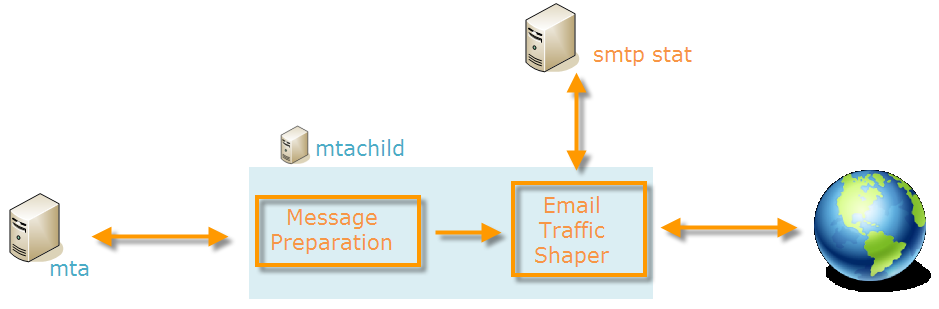
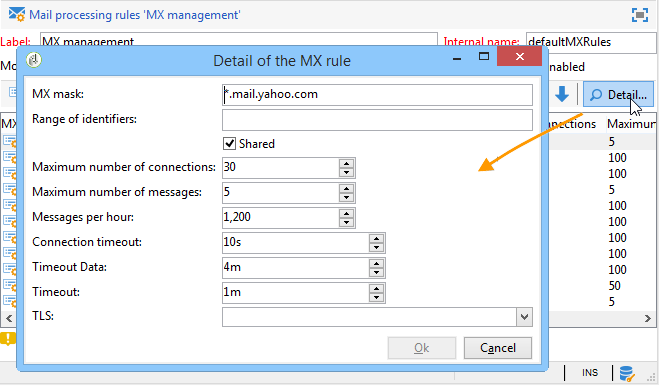
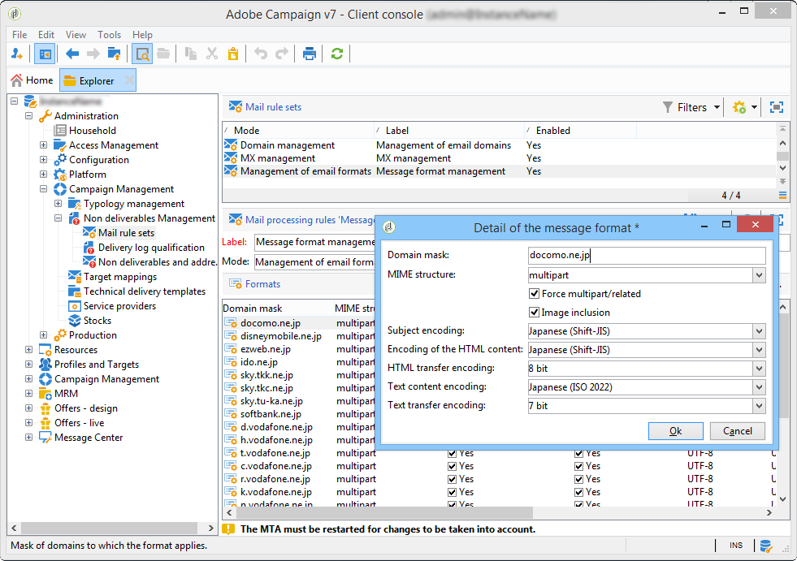

# 技术电子邮件配置{#email-deliverability}


## 概述 {#overview}

以下部分概述了在投放电子邮件时控制Adobe Campaign实例输出所需的配置。

>[!NOTE]
>
>某些配置只能由Adobe托管的部署的Adobe执行，例如访问服务器和实例配置文件。 要了解有关不同部署的更多信息，请参阅[托管模型](../../installation/using/hosting-models.md)部分或[此页面](../../installation/using/capability-matrix.md)。

有关与Adobe Campaign可投放性相关的概念和最佳实践的更多信息，请参阅此[部分](../../delivery/using/about-deliverability.md)。

有关什么是可投放性的更深入探讨，包括有关Adobe平台有效发送和接收电子邮件的所有技术建议，请参阅[Adobe可投放性最佳实践指南](https://experienceleague.adobe.com/docs/deliverability-learn/deliverability-best-practice-guide/introduction.html?lang=zh-Hans)。

## 操作原则 {#operating-principle}

可以控制一个或多个Adobe Campaign实例的输出，以根据域限制发送的电子邮件数量。 例如，您可以将&#x200B;**yahoo.com**&#x200B;地址的输出限制为每小时20,000，而为所有其他域配置每小时100,000条消息。

对于投放服务器(**mta**)使用的每个IP地址，需要控制消息输出。 划分为多台计算机并属于各种Adobe Campaign实例的多个&#x200B;**mta**&#x200B;可以共享相同的IP地址以进行电子邮件投放：需要设置一个进程来协调这些IP地址的使用。

这是&#x200B;**stat**&#x200B;模块的作用：它将一组IP地址的所有连接请求和要发送到邮件服务器的消息转发。 统计服务器跟踪投放情况，可根据设置的配额启用或禁用发送。


* 统计信息服务器(**stat**)已链接到Adobe Campaign基以加载其配置。
* 投放服务器(**mta**)使用UDP来联系统计信息服务器，该服务器并不总是属于其自己的实例。

### 投放服务器 {#delivery-servers}

**mta**&#x200B;模块将消息分发到其&#x200B;**mtachild**&#x200B;子模块。 每个&#x200B;**mtachild**&#x200B;在请求统计服务器的授权并发送之前准备邮件。

步骤如下：

1. **mta**&#x200B;选择符合条件的邮件并为其分配可用的&#x200B;**mtachild**。
1. **mtachild**&#x200B;加载生成邮件所需的所有信息（内容、个性化元素、附件、图像等），并将邮件转发到&#x200B;**电子邮件流量整形器**。
1. 一旦电子邮件流量生成器收到统计服务器的授权(**smtp stat**)，邮件就会发送给收件人。



### 电子邮件服务器统计和限制 {#email-server-statistics-and-limitations}

统计信息服务器维护接收消息的每个电子邮件服务器的以下统计信息：

* 打开的时间点连接数，
* 过去一小时内发送的消息数，
* 成功/拒绝连接的速率，
* 与无法访问服务器的连接速率。

同时，模块会加载特定电子邮件服务器的限制列表：

* 最大同时连接数，
* 每小时最大消息数，
* 每个连接的最大消息数。

### 管理IP地址 {#managing-ip-addresses}

统计服务器可以组合多个实例或具有相同公共IP地址的多台计算机。 因此，它不会链接到特定的实例，但必须联系实例才能恢复每个域的限制。

保留每个目标MX和每个源IP的投放统计信息。 例如，如果目标域具有5个MX，并且平台可以使用3个不同的IP地址，则服务器可以管理此域的最多15系列指标。

源IP地址与公共IP地址匹配，即远程电子邮件服务器看到的地址。 如果提供了NAT路由器，则此IP地址可能与承载&#x200B;**mta**&#x200B;的计算机的地址不同。 这就是统计信息服务器使用与公共IP (**publicId**)匹配的标识符的原因。 本地地址与此标识符之间的关联在&#x200B;**serverConf.xml**&#x200B;配置文件中声明。 **serverConf.xml**&#x200B;中的所有可用参数都列在此[部分](../../installation/using/the-server-configuration-file.md)中。

## 投放输出控制 {#delivery-output-controlling}

为了将邮件传递到电子邮件服务器，**电子邮件流量生成器**&#x200B;组件从统计信息服务器请求连接。 请求被接受后，连接即会打开。

在发送消息之前，模块会从服务器请求“令牌”。 这些令牌通常至少包含10个令牌集，可减少向服务器查询的次数。

服务器将保存与连接和投放相关的所有统计信息。 在重新启动时，信息会暂时丢失：每个客户端都会保留其发送统计信息的本地副本，并定期（每2分钟）将其返回服务器。 然后，服务器可以重新聚合数据。

以下部分介绍了&#x200B;**电子邮件流量生成器**&#x200B;组件处理邮件的过程。

### 消息投放 {#message-delivery}

发送消息时，可能有3个结果：

1. **成功**：已成功发送消息。 消息已更新。
1. **消息失败**：联系的服务器拒绝所选收件人的消息。 此结果与550到599的返回代码匹配，但可以定义例外。
1. **会话失败**（5.11以上）：如果&#x200B;**mta**&#x200B;收到此消息的应答，则放弃该消息（请参阅[消息放弃](#message-abandonment)）。 消息将发送到其他路径，如果没有其他可用路径，则设置为待定（请参阅[消息待定](#message-pending)）。

   >[!NOTE]
   >
   >**路径**&#x200B;是Adobe Campaign **mta**&#x200B;和目标&#x200B;**mta**&#x200B;之间的连接。 Adobe Campaign **mta**&#x200B;可以从多个起始IP和多个目标域IP中进行选择。

### 消息放弃 {#message-abandonment}

已放弃的消息返回到&#x200B;**mta**，不再由&#x200B;**mtachild**&#x200B;管理。

**mta**&#x200B;根据响应代码和规则决定此邮件的过程（恢复、放弃、隔离等）。

### 消息待定 {#message-pending}

当消息到达活动队列且没有可用路径时，该消息将被挂起。

路径通常会在连接错误后的不同时间段内标记为不可用。 不可用期取决于错误的频率和持续时间。

## 统计服务器配置 {#statistics-server-configuration}

统计信息服务器可供多个实例使用：它必须独立于将使用它的实例进行配置。

首先，定义将托管配置的Adobe Campaign数据库。

### 开始配置 {#start-configuration}

默认情况下，将为每个实例启动&#x200B;**stat**&#x200B;模块。 当实例池位于同一台计算机上或实例共享同一IP地址时，将使用单个统计服务器：必须禁用其他服务器。

### 服务器端口的定义 {#definition-of-the-server-port}

默认情况下，统计服务器侦听端口7777。 可以在&#x200B;**serverConf.xml**&#x200B;文件中修改此端口。 **serverConf.xml**&#x200B;中的所有可用参数都列在此[部分](../../installation/using/the-server-configuration-file.md)中。

```
<stat port="1234"/>
```

## MX配置 {#mx-configuration}

>[!IMPORTANT]
>
>对于托管或混合安装，如果您已升级到[增强型MTA](../../delivery/using/sending-with-enhanced-mta.md)，则不再使用&#x200B;**[!UICONTROL MX management]**&#x200B;投放吞吐量规则。 Enhanced MTA会使用自己的MX规则，根据您自己的历史电子邮件信誉以及来自您发送电子邮件之域名的实时反馈，按域自定义您的吞吐量。

### 关于MX规则 {#about-mx-rules}

>[!NOTE]
>
>本节及以下部分仅适用于使用旧版Campaign MTA的内部部署和托管/混合安装。

MX规则（邮件交换器）是管理发送服务器和接收服务器之间通信的规则。

这些规则每天早上6点（服务器时间）自动重新加载，以定期提供客户端实例。

根据材料容量和内部政策， ISP将接受每小时预定义数量的连接和消息。 ISP系统可能会根据IP和发送域的信誉自动修改这些变量。 通过其可投放性平台，Adobe Campaign可由ISP管理150多条特定规则，此外，一条适用于其他域的通用规则。

最大连接数并不完全取决于MTA使用的公共IP地址数。

例如，如果您在MX规则中允许了5个连接，并且配置了2个公共IP，您可能会认为不能同时打开超过10个连接到此域。 这不是真的，事实上，最大连接数是指路径和由我们的MTA公共IP之一和客户端MTA的公共IP组成的路径。

在以下示例中，用户配置了两个公共IP地址，域为yahoo.com。

```
user:~ user$ host -t mx yahoo.com
                yahoo.com mail is handled by 1 mta5.am0.yahoodns.net.
                yahoo.com mail is handled by 1 mta6.am0.yahoodns.net.
                yahoo.com mail is handled by 1 mta7.am0.yahoodns.net.
```

yahoo.com的MX记录告诉我们，yahoo.com有3个邮件交换器。 为了连接对等邮件交换器，MTA将向DNS请求其IP地址。

```
user:~ user$ host -t a mta5.am0.yahoodns.net
                mta5.am0.yahoodns.net has address 98.136.216.26
                mta5.am0.yahoodns.net has address 98.136.217.202
                mta5.am0.yahoodns.net has address 98.138.112.38
                mta5.am0.yahoodns.net has address 66.196.118.37
                mta5.am0.yahoodns.net has address 63.250.192.46
                mta5.am0.yahoodns.net has address 66.196.118.240
                mta5.am0.yahoodns.net has address 98.136.217.203
                mta5.am0.yahoodns.net has address 98.138.112.35
```

对于此记录，用户可以联系8个对等IP地址。 由于用户具有2个公共IP地址，因此这为他们提供了8 * 2 = 16个组合以访问yahoo.com邮件服务器。 这些组合中的每一个都称为路径。

第二条　MX记录显示为：

```
user:~ user$ host -t a mta6.am0.yahoodns.net
                mta6.am0.yahoodns.net has address 98.138.112.38
                mta6.am0.yahoodns.net has address 98.136.216.26
                mta6.am0.yahoodns.net has address 63.250.192.46
                mta6.am0.yahoodns.net has address 66.196.118.35
                mta6.am0.yahoodns.net has address 98.136.217.203
                mta6.am0.yahoodns.net has address 98.138.112.32
                mta6.am0.yahoodns.net has address 98.138.112.37
                mta6.am0.yahoodns.net has address 66.196.118.33
```

这8个IP地址中有4个已在mta5中使用（98.136.216.26、98.138.112.38、63.250.192.46和98.136.217.203）。 此记录允许用户使用4个新的IP地址。 第三条　MX记录也是一样。

我们总共有16个远程IP地址。 结合我们的2个本地公共IP，我们有32条路径可访问yahoo.com邮件服务器。

>[!NOTE]
>
>如果2条MX记录引用了相同的IP地址，则这条记录将计为一条路径，而不是两条路径。

以下是使用MX规则的一些示例：


在下面的示例中，对于特定域，用户具有每小时10,000条消息的限制，但MTA吞吐量容量高于此限制。

在这种情况下，流量被划分为每小时5分钟的12个时段，实际限制为每时段833条消息。

将尽快发送这些消息。


### 配置MX管理 {#configuring-mx-management}

在树的&#x200B;**[!UICONTROL Administration > Campaign Management > Non deliverables Management > Mail rule sets]**&#x200B;节点的&#x200B;**[!UICONTROL MX management]**&#x200B;文档中定义了MX要遵守的规则。

如果节点中不存在&#x200B;**[!UICONTROL MX management]**&#x200B;文档，则可以手动创建它。 操作步骤：

1. 创建一组新的邮件规则。
1. 选择&#x200B;**[!UICONTROL MX management]**&#x200B;模式。

   

1. 在&#x200B;**[!UICONTROL Internal name]**&#x200B;字段中输入&#x200B;**defaultMXRules**。

为了将更改考虑在内，您需要重新启动统计服务器。

要重新加载配置而不重新启动统计服务器，请在承载服务器的计算机上使用以下命令： `nlserver stat -reload`

>[!NOTE]
>
>此命令行比&#x200B;**nlserver重新启动**&#x200B;更可取。 它可防止在重新启动丢失之前收集的统计信息，并避免可能违反MX规则中定义的配额的使用峰值。

### 配置MX规则 {#configuring-mx-rules}

**[!UICONTROL MX management]**&#x200B;文档列出了链接到MX规则的所有域。

这些规则将按顺序应用：将应用其MX掩码与目标MX兼容的第一个规则。

以下参数可用于每个规则：

* **[!UICONTROL MX mask]**：应用规则的域。 每个规则都为MX定义一个地址掩码。 因此，任何名称与此掩码匹配的MX都是合格的。 掩码可以包含“&#42;”和“？” 通用字符。

  例如，以下地址：

   * a.mx.yahoo.com
   * b.mx.yahoo.com
   * c.mx.yahoo.com

  与以下掩码兼容：

   * &#42;.yahoo.com
   * ？.mx.yahoo.com

  例如，电子邮件地址foobar@gmail.com的域为gmail.com ，MX记录为：

  ```
  gmail.com mail exchanger = 20 alt2.gmail-smtp-in.l.google.com.
  gmail.com mail exchanger = 10 alt1.gmail-smtp-in.l.google.com.
  gmail.com mail exchanger = 40 alt4.gmail-smtp-in.l.google.com.
  gmail.com mail exchanger = 5  gmail-smtp-in.l.google.com.
  gmail.com mail exchanger = 30 alt3.gmail-smtp-in.l.google.com.
  ```

  在这种情况下，将使用MX规则`*.google.com`。 如您所见，MX规则掩码并不一定与邮件中的域匹配。 应用于gmail.com电子邮件地址的MX规则将是掩码为`*.google.com`的规则。

* **[!UICONTROL Range of identifiers]**：通过此选项可指示规则适用的标识符(publicID)范围。 您可以指定：

   * 数字：该规则将仅适用于此publicId，
   * 数字范围(**number1-number2**)：规则将应用于这两个数字之间的所有publicId。

  >[!NOTE]
  >
  >如果字段为空，则该规则将应用于所有标识符。

  公共ID是一个或多个MTA使用的公共IP的内部标识符。 这些ID是在&#x200B;**config-instance.xml**&#x200B;文件的MTA服务器中定义的。

  

* **[!UICONTROL Shared]**：定义此MX规则的属性范围。 选中后，所有参数将在实例上可用的所有IP上共享。 取消选中后，将为每个IP定义MX规则。 最大消息数乘以可用IP数。
* **[!UICONTROL Maximum number of connections]**：同时连接到发件人域的最大数目。
* **[!UICONTROL Maximum number of messages]**：在连接上可发送的最大消息数。 当消息超过此数目时，连接将关闭并打开一个新连接。
* **[!UICONTROL Messages per hour]**：一小时内发送到发件人域的最大邮件数。
* **[!UICONTROL Connection time out]**：连接到域的时间阈值。

  >[!NOTE]
  >
  >Windows可以在此阈值之前发出&#x200B;**超时**，具体取决于您的Windows版本。

* **[!UICONTROL Timeout Data]**：发送邮件内容后的最长等待时间（SMTP协议的DATA部分）。
* **[!UICONTROL Timeout]**：与SMTP服务器进行其他交换的最长等待时间。
* **[!UICONTROL TLS]**：允许您加密电子邮件投放的TLS协议可以选择性地启用。 对于每个MX掩码，可使用以下选项：

   * **[!UICONTROL Default configuration]**：这是所应用的serverConf.xml配置文件中指定的常规配置。

     >[!IMPORTANT]
     >
     >建议不要修改默认配置。

   * **[!UICONTROL Disabled]** ：邮件将系统地发送，而不进行加密。
   * **[!UICONTROL Opportunistic]** ：如果接收服务器(SMTP)可以生成TLS协议，则对邮件投放进行加密。

配置示例：



>[!NOTE]
>
>有关在Adobe Campaign中使用MX服务器的详细信息，请参阅[此部分](../../installation/using/using-mx-servers.md)。

### 管理电子邮件格式 {#managing-email-formats}

您可以定义已发送消息的格式，以便显示的内容可以根据每个收件人地址的域自动进行调整。

为此，请转到位于&#x200B;**[!UICONTROL Administration]** > **[!UICONTROL Campaign management]** > **[!UICONTROL Non deliverables management]** > **[!UICONTROL Mail rule sets]**&#x200B;中的&#x200B;**[!UICONTROL Management of email formats]**&#x200B;文档。

本文档包含所有预定义域的列表，这些域对应于Adobe Campaign管理的日语格式。 有关详细信息，请参阅[本文档](../../delivery/using/defining-the-email-content.md#sending-emails-on-japanese-mobiles)。



**MIME结构** （多用途Internet邮件扩展）参数允许您定义将发送到不同邮件客户端的消息结构。 提供了三个选项：

* **Multipart**：消息以文本或HTML格式发送。 如果不接受HTML格式，则消息仍能够以文本格式显示。

  默认情况下，多部分结构为&#x200B;**multipart/alternative**，但在向消息添加图像时，它会自动变为&#x200B;**multipart/related**。 默认情况下，某些提供程序需要&#x200B;**multipart/related**&#x200B;格式，即使未附加图像，**[!UICONTROL Force multipart/related]**&#x200B;选项也会强制采用此格式。

* **HTML**：只发送HTML消息。 如果不接受HTML格式，则不会显示消息。
* **文本**：以纯文本格式发送消息。 文本格式消息的优点在于其非常小。

如果启用了&#x200B;**[!UICONTROL Image inclusion]**&#x200B;选项，这些选项将直接显示在电子邮件的正文中。 然后，将上传图像，并将URL链接替换为其内容。

日本市场特别使用此选项来处理&#x200B;**装饰邮件**、**装饰邮件**&#x200B;或&#x200B;**装饰邮件**。 有关详细信息，请参阅[本文档](../../delivery/using/defining-the-email-content.md#sending-emails-on-japanese-mobiles)。

>[!IMPORTANT]
>
>在电子邮件中插入图像会显着增加其大小。

## 投放服务器配置 {#delivery-server-configuration}

### 时钟同步 {#clock-synchronization}

组成Adobe Campaign平台的所有服务器（包括数据库）的时钟必须同步，并且其系统设置为相同的时区。

### 统计服务器的坐标 {#coordinates-of-the-statistics-server}

必须在&#x200B;**mta**&#x200B;中提供统计服务器的地址。

配置中&#x200B;**mta**&#x200B;元素的&#x200B;**statServerAddress**&#x200B;属性允许您指定要使用的端口的地址和编号。

```
<mta statServerAddress="emailStatServer:7777">
   [...]
 </mta>
```

若要在同一台计算机上使用统计信息服务器，必须至少输入具有&#x200B;**localhost**&#x200B;值的计算机名称：

```
 <mta statServerAddress="localhost">
```

>[!IMPORTANT]
>
>如果未填充此字段，则&#x200B;**mta**&#x200B;将不会启动。

### 要使用的IP地址列表 {#list-of-ip-addresses-to-use}

有关流量管理的配置位于配置文件的&#x200B;**mta/child/smtp**&#x200B;元素中。

对于每个&#x200B;**IPAffinity**&#x200B;元素，您需要声明可用于计算机的IP地址。

例如：

```
<IPAffinity localDomain="<domain>" name="default">
  <IP address="192.168.0.11" publicId="1" weight="5"/>
  <IP address="192.168.0.12" heloHost="revdns1.campaign.com" publicId="2" weight="5"/>
  <IP address="192.168.0.13" publicId="3" weight="1"/>
</IPAffinity>
```

参数如下：

* **地址**：这是要使用的MTA主机的IP地址。
* **heloHost**：此标识符表示SMTP服务器将看到的IP地址。

* **publicId**：当IP地址由NAT路由器后面的多个Adobe Campaign **mta**&#x200B;共享时，此信息非常有用。 统计信息服务器使用此标识符来记忆此起始点和目标服务器之间的连接和发送统计信息。
* **权重**：用于定义地址的相对使用频率。 默认情况下，所有地址的权重均等于1。

>[!NOTE]
>
>在serverConf.xml文件中，您需要验证该IP是否与具有唯一标识符(public_id)的单个主机相对应。 它无法映射到多个主机，这可能会导致投放限制问题。

在上一个示例中，在正常条件下，地址将按如下方式进行分配：

    * “1”：5 / (5+5+1) = 45%
    * “2”：5 / (5+5+1) = 45%
    * “3”：1 / (5+5+1) = 10%

例如，如果第一个地址不能用于特定MX，则将按如下方式发送消息：

    * “2”：5 / (5+1) = 83%
    * “3”：1 / (5+1) = 17%

* **includeDomains**：允许您为属于特定域的电子邮件保留此IP地址。 此掩码列表可包含一个或多个通配符(“&#42;”)。 如果未指定属性，则所有域都可以使用此IP地址。

  示例： **includeDomains=&quot;wanadoo.com，orange.com，yahoo.&#42;&quot;**

* **excludeDomains**：排除此IP地址的域列表。 此筛选器在&#x200B;**includeDomains**&#x200B;筛选器之后应用。

  

## 电子邮件发送优化 {#email-sending-optimization}

Adobe Campaign **mta**&#x200B;的内部架构对优化电子邮件投放的配置产生影响。 以下是有关改进投放的一些提示。

### 调整maxWaitingMessages参数 {#adjust-the-maxwaitingmessages-parameter}

**maxWaitingMessages**&#x200B;参数表示&#x200B;**mtachild**&#x200B;预先准备的最大消息数。 只有在发送或放弃消息后，才会从此列表中删除这些消息。

此参数非常重要，并且在消息未按域排序时尤为关键。

一旦达到&#x200B;**maxWorkingSetMb** (256)阈值，投放服务器就会停止发送消息。 性能将显着降低，直到&#x200B;**mtachild**&#x200B;再次启动。 要避免此问题，您可以提高&#x200B;**maxWorkingSetMb**&#x200B;参数的阈值，或降低&#x200B;**maxWaitingMessages**&#x200B;参数的阈值。

**maxWorkingSetMb**&#x200B;参数是经验计算的，方法是将最大消息数乘以平均消息大小，并将结果乘以2.5。例如，如果消息的平均大小为50 kB，且&#x200B;**maxWaitingMessages**&#x200B;参数等于1,000，则使用的内存将平均为125 MB。

### 调整匹配项数 {#adjust-the-number-of-mtachild}

子级数量不应超过计算机中处理器的数量(约 1000个会话)。 我们建议您不要超过8 **mtachild**。 然后，您可以增加每个&#x200B;**子级** (**maxMsgPerChild**)的消息数量，以获得足够的生命周期。
