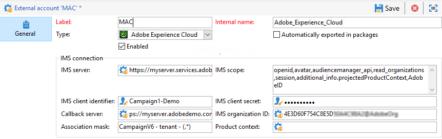

# 外部帐户{#external-accounts}


Adobe Campaign 提供了一组预定义的外部帐户。要设置与外部系统的连接，您可以创建新的外部帐户。

技术工作流或营销策划工作流等技术流程，会使用外部帐户。例如，在工作流中设置文件传输或与任何其他应用程序(Adobe Target、Experience Manager等)进行数据交换时，您需要选择外部帐户。

## 创建外部帐户 {#creating-an-external-account}

要创建新的外部帐户，请执行以下步骤。 详细设置取决于外部帐户的类型。

1. 从Campaign **[!UICONTROL Explorer]**，选择 **[!UICONTROL Administration]** &#39;>&#39; **[!UICONTROL Platform]** &#39;>&#39; **[!UICONTROL External accounts]**.

   

1. 单击 **[!UICONTROL New]** 按钮。

   

1. 输入 **[!UICONTROL Label]** 和 **[!UICONTROL Internal Name]**.
1. 选择外部帐户 **[!UICONTROL Type]** 要创建的。
1. 通过根据所选外部帐户类型指定凭据来配置对帐户的访问。

   所连接服务器的提供者通常会提供必需的信息。

1. 检查 **[!UICONTROL Enabled]** 选项来激活连接。
1. 单击 **[!UICONTROL Save]**。

创建外部帐户并将其添加到外部帐户列表。

## 特定于促销活动的外部帐户

### 退回邮件 {#bounce-mails-external-account}

的 **退回邮件** 外部帐户指定用于连接到电子邮件服务的外部POP3帐户。 有关此外部帐户的更多信息，请参阅此 [页面](../../workflow/using/inbound-emails.md).

为POP3访问配置的所有服务器都可用于接收回信。


配置 **[!UICONTROL Bounce mails (defaultPopAccount)]** 外部帐户：

* **[!UICONTROL Server]**

   POP3服务器的URL。

* **[!UICONTROL Port]**

   POP3连接端口号。 默认端口为110。

* **[!UICONTROL Account]**

   用户的名称。

* **[!UICONTROL Password]**

   用户帐户密码。

* **[!UICONTROL Encryption]**

   之间选择的加密类型 **[!UICONTROL By default]**, **[!UICONTROL POP3 + STARTTLS]**, **[!UICONTROL POP3]** 或 **[!UICONTROL POP3S]**.

### 路由{#routing-external-account}

的 **[!UICONTROL Routing]** 外部帐户允许您根据安装的包配置Adobe Campaign中可用的每个渠道。


可以配置以下渠道：

* [电子邮件](../../installation/using/deploying-an-instance.md#email-channel-parameters)
* [手机（短信）](../../delivery/using/sms-set-up.md#creating-an-smpp-external-account)
* [电话](../../delivery/using/steps-about-delivery-creation-steps.md#other-channels)
* [直邮](../../delivery/using/about-direct-mail-channel.md)
* [代理](../../delivery/using/steps-about-delivery-creation-steps.md#other-channels)
* [Twitter](../../social/using/configuring-publishing-on-twitter.md)
* [iOS渠道](../../delivery/using/configuring-the-mobile-application.md)
* [Android渠道](../../delivery/using/configuring-the-mobile-application-android.md)

### 执行实例  {#execution-instance-external-account}

如果您具有划分的架构，则需要指定链接到控制实例的执行实例并连接它们。 事务型消息模板将部署到执行实例


* **[!UICONTROL URL]**

   安装执行实例的服务器的URL。

* **[!UICONTROL Account]**

   帐户名称中，必须与操作员文件夹中定义的消息中心代理相匹配。

* **[!UICONTROL Password]**

   在操作员文件夹中定义的帐户密码。

有关此配置的详细信息，请参阅此 [页面](../../message-center/using/configuring-instances.md#control-instance).

## 访问外部系统外部帐户

### FTP {#ftp-external-account}

利用FTP外部帐户，可配置和测试对Adobe Campaign以外服务器的访问。 要设置与外部系统（如用于文件传输的FTP服务器898）的连接，您可以创建自己的外部帐户。 有关详细信息，请参见此 [ 页面](../../workflow/using/file-transfer.md)。

为此，请在此外部帐户中指定用于建立与FTP服务器连接的地址和凭据


* **[!UICONTROL Server]**

   FTP服务器的名称。

* **[!UICONTROL Port]**

   FTP连接端口号。 默认端口为21。

* **[!UICONTROL Account]**

   用户的名称。

* **[!UICONTROL Password]**

   用户帐户密码。

* **[!UICONTROL Encryption]**

   之间选择的加密类型 **[!UICONTROL None]** 或 **[!UICONTROL SSL]**.

要了解在何处查找这些凭据，请参阅 [页面](https://help.dreamhost.com/hc/en-us/articles/115000675027-FTP-overview-and-credentials).

### SFTP {#sftp-external-account}

通过SFTP外部帐户，您可以配置和测试对Adobe Campaign以外服务器的访问权限。 要设置与外部系统（如用于文件传输的SFTP）的连接，您可以创建自己的外部帐户。 有关详细信息，请参见此 [ 页面](../../workflow/using/file-transfer.md)。


* **[!UICONTROL Server]**

   SFTP服务器的URL。

* **[!UICONTROL Port]**

   FTP连接端口号。 默认端口为22。

* **[!UICONTROL Account]**

   用于连接到SFTP服务器的帐户名称。

* **[!UICONTROL Password]**

   用于连接到SFTP服务器的密码。

### 外部数据库（联合数据访问） {#external-database-external-account}

使用 **外部数据库** 键入外部帐户以连接到外部数据库。 在 [此部分](../../installation/using/about-fda.md).

与Campaign兼容的外部数据库列在 [兼容性矩阵](../../rn/using/compatibility-matrix.md)


外部帐户配置设置取决于数据库引擎。 请通过以下部分了解更多信息：

* 配置对 [韦尔蒂察](../../installation/using/configure-fda-vertica.md)
* 配置对 [Snowflake](../../installation/using/configure-fda-snowflake.md)
* 配置对 [Google BigQuery](../../installation/using/configure-fda-google-big-query.md)
* 配置对 [azure synapse](../../installation/using/configure-fda-synapse.md)
* 配置对 [Hadoop](../../installation/using/configure-fda-hadoop.md)
* 配置对 [Oracle](../../installation/using/configure-fda-oracle.md)
* 配置对 [Netezza](../../installation/using/configure-fda-netezza.md)
* 配置对 [SAP HANA](../../installation/using/configure-fda-sap-hana.md)
* 配置对 [Snowflake](../../installation/using/configure-fda-snowflake.md)
* 配置对 [sybase IQ](../../installation/using/configure-fda-sybase.md)
* 配置对 [Teradata](../../installation/using/configure-fda-teradata.md)

### Facebook connect {#facebook-connect-external-account}

的 **[!UICONTROL Facebook Connect]** 外部帐户允许您在Facebook应用程序中显示个性化内容，从而更便于通过此社交网络获取潜在客户。

对于每个Facebook应用程序，您需要创建 **[!UICONTROL Facebook Connect]** 键入外部帐户。 有关更多信息，请参阅 [页面](../../social/using/creating-a-facebook-application.md#configuring-external-accounts).


* **[!UICONTROL Hosting mode]**

   之间应用程序的托管模式 **[!UICONTROL hosted by a partner]** 或 **[!UICONTROL hosted by this instance]**.

* **[!UICONTROL Application ID]**

   您的Facebook应用程序的应用程序ID。

* **[!UICONTROL Application secret]**

   您的Facebook应用程序的应用程序密钥。

如果您选择由此实例模式托管的，则需要将安全画布URL粘贴到 **Facebook Web游戏(https)** 字段在Facebook

要了解在何处查找这些凭据，请参阅 [页面](https://developers.facebook.com/docs/facebook-login/access-tokens).

## Adobe解决方案集成外部帐户

### Adobe Experience Cloud {#adobe-experience-cloud-external-account}

要使用Adobe Campaign连接到Adobe ID控制台，您必须配置 **[!UICONTROL Adobe Experience Cloud (MAC)]** 外部帐户。



* **[!UICONTROL IMS server]**

   您的IMS服务器的URL。 确保暂存实例和生产实例指向相同的IMS生产端点。

* **[!UICONTROL IMS scope]**

   此处定义的范围必须是IMS设置的范围的子集。

* **[!UICONTROL IMS client identifier]**

   您的IMS客户端的ID。

* **[!UICONTROL IMS client secret]**

   IMS客户端密钥的凭据。

* **[!UICONTROL Callback server]**

   访问Adobe Campaign实例的URL。

* **[!UICONTROL IMS organization ID]**

   您组织的ID。 要查找您的组织ID，请参阅 [本页](https://experienceleague.adobe.com/docs/core-services/interface/administration/organizations.html?lang=zh-Hans){_blank}。

* **[!UICONTROL Association mask]**

   允许将Enterprise Dashboard中的配置名称与Adobe Campaign中的组同步的语法。

* **[!UICONTROL Server]**

   Adobe Experience Cloud实例的URL。

* **[!UICONTROL Tenant]**

   您的Adobe Experience Cloud租户的名称。

有关此配置的详细信息，请参阅 [本页](../../integrations/using/configuring-ims.md).

## 网络分析 {#web-analytics-external-account}

的 **[!UICONTROL Web Analytics]** 外部帐户允许您以区段形式将数据从Adobe Analytics转发到Adobe Campaign。 相反，它会将Adobe Campaign提供的电子邮件促销活动的指标和属性发送到Adobe Analytics连接器。


对于此外部帐户，必须扩充跟踪URL的计算公式，并批准两个解决方案之间的连接。 有关详细信息，请参见此 [ 页面](../../platform/using/adobe-analytics-connector.md#external-account-classic)。

### Adobe Experience Manager {#adobe-experience-manager-external-account}

的 **[!UICONTROL AEM (AEM instance)]** 外部帐户允许您直接在Adobe Experience Manager中管理电子邮件投放内容和表单。


* **[!UICONTROL Server]**

   Adobe Experience Manager服务器的URL。

* **[!UICONTROL Port]**

   用于连接到Adobe Experience Manager创作实例的帐户名称。

* **[!UICONTROL Password]**

   用于连接到Adobe Experience Manager创作实例的密码。

有关更多信息，请参阅此](../../integrations/using/about-adobe-experience-manager.md)章节[。

## CRM连接器外部帐户

### Microsoft Dynamics CRM {#microsoft-dynamics-crm-external-account}

>[!NOTE]
>
> **[!UICONTROL On-premise]** 和 **[!UICONTROL Office 365]** 部署类型现已弃用。 [了解详情](../../rn/using/deprecated-features.md)。

的 **[!UICONTROL Microsoft Dynamics CRM]** 外部帐户允许您将Microsoft Dynamics数据导入和导出到Adobe Campaign。

在此处了解有关Campaign - Microsoft Dynamics CRM连接器的更多信息 [页面](../../platform/using/crm-ms-dynamics.md).

使用 **[!UICONTROL Web API]** 部署类型和 **[!UICONTROL Password credentials]** 身份验证时，您需要提供以下详细信息：


* **[!UICONTROL Account]**

   用于登录到Microsoft CRM的帐户。

* **[!UICONTROL Server]**

   Microsoft CRM服务器的URL。

   查找Microsoft CRM **[!UICONTROL Server URL]**，访问Microsoft Dynamics CRM帐户，然后单击 **Dynamics 365** ，然后选择您的应用程序。 然后，您可以找到 **[!UICONTROL Server URL]** ，例如 `https://myserver.crm.dynamics.com/`.

* **[!UICONTROL Client identifier]**

   客户端ID，可从Microsoft Azure管理门户的 **[!UICONTROL Update your code]** 类别， **[!UICONTROL Client ID]** 字段。

* **[!UICONTROL CRM version]**

   选择 **[!UICONTROL Dynamics CRM 365]** CRM版本。

使用 **[!UICONTROL Web API]** 部署类型和 **[!UICONTROL Certificate]** 身份验证时，您需要提供以下详细信息：


* **[!UICONTROL Server]**

   Microsoft CRM服务器的URL。

   查找Microsoft CRM **[!UICONTROL Server URL]**，访问Microsoft Dynamics CRM帐户，然后单击 **Dynamics 365** ，然后选择您的应用程序。 然后，您可以找到 **[!UICONTROL Server URL]** ，例如 `https://myserver.crm.dynamics.com/`.

* **[!UICONTROL Private Key (Base64 encoded)]**

   请注意，私钥需要编码为Base64。

   要实现此目的，您可以使用Base64编码器的帮助或使用命令行 `base64 -w0 private.key` 的URL。

* **[!UICONTROL Custom Key identifier]**

* **[!UICONTROL Key ID]**

* **[!UICONTROL Client identifier]**

   客户端ID，可从Microsoft Azure管理门户的 **[!UICONTROL Update your code]** 类别， **[!UICONTROL Client ID]** 字段。

* **[!UICONTROL CRM version]**

   之间的CRM版本 **[!UICONTROL Dynamics CRM 2007]**, **[!UICONTROL Dynamics CRM 2015]** 或 **[!UICONTROL Dynamics CRM 2016]**.

有关此配置的详细信息，请参阅此 [页面](../../platform/using/crm-connectors.md).

### Salesforce.com CRM  {#salesforce-crm-external-account}

的 **[!UICONTROL Salesforce CRM]** 外部帐户允许您将Salesforce数据导入和导出到Adobe Campaign。


要配置Salesforce CRM外部帐户以与Adobe Campaign配合使用，您需要提供以下详细信息：

* **[!UICONTROL Account]**

   用于登录到Salesforce CRM的帐户。

* **[!UICONTROL Password]**

   用于登录到Salesforce CRM的密码。

* **[!UICONTROL Client identifier]**

   要了解在何处查找客户端标识符，请参阅 [页面](https://help.salesforce.com/articleView?id=000205876&amp;type=1).

* **[!UICONTROL Security token]**

   要了解在何处查找安全令牌，请参阅此 [页面](https://help.salesforce.com/articleView?id=000205876&amp;type=1).

* **[!UICONTROL API version]**

   选择API的版本。

对于此外部帐户，您需要使用配置向导配置Salesforce CRM。

有关此配置的详细信息，请参阅此 [页面](../../platform/using/crm-connectors.md).

## 传输数据外部帐户

### Amazon Simple Storage Service(S3) {#amazon-simple-storage-service--s3--external-account}

Amazon Simple Storage Service(S3)连接器可用于将数据导入或导出到Adobe Campaign。 可以在工作流活动中进行设置。 有关详细信息，请参见此 [ 页面](../../workflow/using/file-transfer.md)。


在设置此新外部帐户时，您需要提供以下详细信息：

* **[!UICONTROL AWS S3 Account Server]**

   服务器的URL，其填充方式如下：

   ```
   <S3bucket name>.s3.amazonaws.com/<s3object path>
   ```

* **[!UICONTROL AWS access key ID]**

   要了解在何处查找您的AWS访问密钥ID，请参阅此 [页面](https://docs.aws.amazon.com/general/latest/gr/aws-sec-cred-types.html#access-keys-and-secret-access-keys) .

* **[!UICONTROL Secret access key to AWS]**

   要了解在何处查找到AWS的密钥，请参阅此 [页面](https://aws.amazon.com/fr/blogs/security/wheres-my-secret-access-key/).

* **[!UICONTROL AWS Region]**

   要了解有关AWS地区的更多信息，请参阅 [页面](https://aws.amazon.com/about-aws/global-infrastructure/regions_az/).

* 的 **[!UICONTROL Use server side encryption]** 复选框允许您以S3加密模式存储文件。

要了解在何处查找访问密钥ID和密钥访问密钥，请参阅Amazon Web服务 [文档](https://docs.aws.amazon.com/general/latest/gr/aws-sec-cred-types.html#access-keys-and-secret-access-keys).

### Azure Blob存储 {#azure-blob-external-account}

的 **Azure Blob存储** 外部帐户可用于使用 **[!UICONTROL Transfer file]** 工作流活动。 有关更多信息，请参阅此](../../workflow/using/file-transfer.md)章节[。


配置 **[!UICONTROL Azure external account]** 要与Adobe Campaign合作，您需要提供以下详细信息：

* **[!UICONTROL Server]**

   您的Azure Blob存储服务器的URL。

* **[!UICONTROL Encryption]**

   之间选择的加密类型 **[!UICONTROL None]** 或 **[!UICONTROL SSL]**.

* **[!UICONTROL Access key]**

   知道在何处查找 **[!UICONTROL Access key]**，请参见 [页面](https://docs.microsoft.com/en-us/azure/storage/common/storage-account-keys-manage?tabs=azure-portal).
