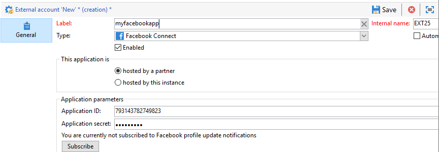
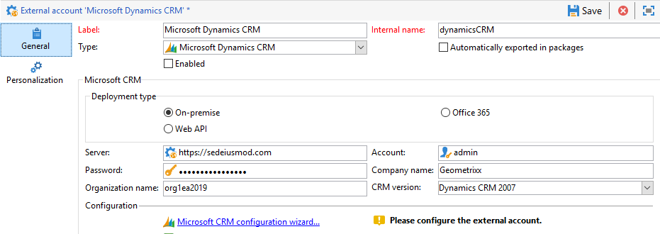

# 外部帐户{#external-accounts}

Adobe Campaign 提供了一组预定义的外部帐户。要设置与外部系统的连接，您可以创建新外部帐户。

技术工作流或营销策划工作流等技术流程，会使用外部帐户。在工作流中设置文件传输或与任何其他应用程序（Adobe Target、Experience Manager 等）进行数据交换时，您需要选择外部帐户。

您可以设置以下类型的外部帐户：

* [路由外部帐户](#routing-external-account)
* [FTP外部帐户](#ftp-external-account)
* [外部数据库外部帐户](#external-database-external-account)
* [Web分析外部帐户](#web-analytics-external-account)
* [Facebook连接外部帐户](#facebook-connect-external-account)
* [执行实例外部帐户](#execution-instance-external-account)
* [Adobe Experience Cloud外部帐户](#adobe-experience-cloud-external-account)
* [SFTP 外部帐户](#sftp-external-account)
* [Adobe Experience Manager 外部帐户](#adobe-experience-manager-external-account)
* [Amazon简单存储服务(S3)外部帐户](#amazon-simple-storage-service--s3--external-account)
* [Microsoft Dynamics CRM外部帐户](#microsoft-dynamics-crm-external-account)
* [Oracle按需外部帐户](#oracle-on-demand-external-account)
* [Salesforce CRM外部帐户](#salesforce-crm-external-account)

## 创建外部帐户{#creating-an-external-account}

要创建新外部帐户，请按照以下步骤操作。 详细设置取决于外部帐户类型。

1. 从活动 **[!UICONTROL Explorer]**&#x200B;中， **[!UICONTROL Administration]** 选择“>” **[!UICONTROL Platform]** “>” **[!UICONTROL External accounts]**。

   

1. 单击 **[!UICONTROL New]** 按钮。

   

1. Enter a **[!UICONTROL Label]** and an **[!UICONTROL Internal Name]**.
1. 选择要 **[!UICONTROL Type]** 创建的外部帐户。
1. 根据所选的外部帐户类型指定凭据，以配置对帐户的访问。

   所连接服务器的提供者通常会提供必需的信息。

1. 选中选 **[!UICONTROL Enabled]** 项以激活连接。
1. 单击 **[!UICONTROL Save]**.

将创建外部帐户并将其添加到外部帐户列表。

## 弹回邮件外部帐户 {#bounce-mails-external-account}

弹 **回邮件** 外部帐户指定用于连接电子邮件服务的外部POP3帐户。 For more on this external account, refer to this [page](../../workflow/using/inbound-emails.md).

为POP3访问配置的所有服务器都可用于接收返回邮件。


配置 **[!UICONTROL Bounce mails (defaultPopAccount)]** 外部帐户:

* **[!UICONTROL Server]**

   POP3服务器的URL。

* **[!UICONTROL Port]**

   POP3连接端口号。 默认端口为110。

* **[!UICONTROL Account]**

   用户的名称。

* **[!UICONTROL Password]**

   用户帐户密码。

* **[!UICONTROL Encryption]**

   在、或之间选 **[!UICONTROL By default]**&#x200B;择 **[!UICONTROL POP3 + STARTTLS]**&#x200B;的加 **[!UICONTROL POP3]** 密类型 **[!UICONTROL POP3S]**。

## 路由外部帐户 {#routing-external-account}

该 **[!UICONTROL Routing]** 外部帐户允许您根据所安装的包配置Adobe Campaign中可用的每个渠道。


可以配置以下渠道:

* [电子邮件](../../installation/using/deploying-an-instance.md#email-channel-parameters)
* [手机（短信）](../../delivery/using/sms-channel.md#creating-an-smpp-external-account)
* [电话](../../delivery/using/steps-about-delivery-creation-steps.md#other-channels)
* [直邮](../../delivery/using/about-direct-mail-channel.md)
* [代理](../../delivery/using/steps-about-delivery-creation-steps.md#other-channels)
* [Facebook](../../social/using/publishing-on-facebook-walls.md#delegating-write-access-to-adobe-campaign)
* [Twitter](../../social/using/configuring-publishing-on-twitter.md)
* [iOS渠道](../../delivery/using/configuring-the-mobile-application.md)
* [Android渠道](../../delivery/using/configuring-the-mobile-application-android.md)

## FTP外部帐户 {#ftp-external-account}

FTP外部帐户允许您配置和测试对Adobe Campaign外服务器的访问。 要与外部系统（如用于文件传输的FTP服务器898）建立连接，您可以创建自己的外部帐户。 有关详细信息，请参见此 [ 页面](../../workflow/using/file-transfer.md)。

为此，请在此外部帐户中指定用于建立与FTP服务器连接的地址和凭据


* **[!UICONTROL Server]**

   FTP服务器的名称。

* **[!UICONTROL Port]**

   FTP连接端口号。 默认端口为21。

* **[!UICONTROL Account]**

   用户的名称。

* **[!UICONTROL Password]**

   用户帐户密码。

* **[!UICONTROL Encryption]**

   在或之间选择的加 **[!UICONTROL None]** 密的类 **[!UICONTROL SSL]**&#x200B;型。

要了解这些凭据的位置，请参阅此 [页](https://help.dreamhost.com/hc/en-us/articles/115000675027-FTP-overview-and-credentials)。

## 外部数据库外部帐户 {#external-database-external-account}

使用“外 **部数据库** ”类型外部帐户连接到外部数据库。 在本节中进一步了解联合数据访问( [联合数据访问)选项](../../installation/using/about-fda.md)。

兼容性矩阵中列出了与活动兼容的 [外部数据库](../../rn/using/compatibility-matrix.md)


外部帐户配置设置取决于数据库引擎。 请通过以下部分了解更多信息：

* 配置访问 [Azure synapse](../../installation/using/configure-fda-synapse.md)
* 配置访问 [Hadoop](../../installation/using/configure-fda-hadoop.md)
* 配置访问 [Oracle](../../installation/using/configure-fda-oracle.md)
* 配置访问 [Netezza](../../installation/using/configure-fda-netezza.md)
* 配置访问 [SAP HANA](../../installation/using/configure-fda-sap-hana.md)
* 配置对Snowflake的 [访问](../../installation/using/configure-fda-snowflake.md)
* 配置访问 [Sybase IQ](../../installation/using/configure-fda-sybase.md)
* 配置访问 [Teradata](../../installation/using/configure-fda-teradata.md)

## Web分析外部帐户 {#web-analytics-external-account}

外部帐户 **[!UICONTROL Web Analytics (Adobe Analytics - Data connector)]** 允许您以细分形式将数据从Adobe Analytics转发到Adobe Campaign。 相反，它会通过Adobe Campaign向Adobe Analytics-数据连接器发送电子邮件活动的指标和属性。


对于此外部帐户，必须丰富跟踪URL的计算公式，并批准两个解决方案之间的连接。 有关详细信息，请参见此 [ 页面](../../platform/using/adobe-analytics-data-connector.md#step-2--create-the-external-account-in-campaign)。

## Facebook连接外部帐户 {#facebook-connect-external-account}

该外部帐户 **[!UICONTROL Facebook Connect]** 允许您在Facebook应用程序中显示个性化内容，从而更轻松地通过此社交网络获取潜在客户。

对于每个Facebook应用程序，您需要创建一个类 **[!UICONTROL Facebook Connect]** 型外部帐户。 For more on this, refer to [page](../../social/using/creating-a-facebook-application.md#configuring-external-accounts).



* **[!UICONTROL Hosting mode]**

   或之间的应用程序的 **[!UICONTROL hosted by a partner]** 托管模 **[!UICONTROL hosted by this instance]**&#x200B;式。

* **[!UICONTROL Application ID]**

   您的Facebook应用程序的应用程序ID。

* **[!UICONTROL Application secret]**

   您的Facebook应用程序的应用程序机密。

如果选择由此实例模式托管，则“安全Canvas URL”需要粘贴到Facebook **上的Facebook Web Games(https)** 字段中

要了解这些凭据的位置，请参阅此 [页](https://developers.facebook.com/docs/facebook-login/access-tokens)。

## 执行实例外部帐户 {#execution-instance-external-account}

如果您有分解的架构，则需要指定链接到执行实例的控制实例并连接它们。 事务性消息模板部署到执行实例


* **[!UICONTROL URL]**

   安装执行实例的服务器的URL。

* **[!UICONTROL Account]**

   帐户的名称，必须与操作符文件夹中定义的消息中心代理匹配。

* **[!UICONTROL Password]**

   操作符文件夹中定义的帐户密码。

For more information on this configuration, refer to this [page](../../message-center/using/creating-a-shared-connection.md#control-instance).

## Adobe Experience Cloud external account {#adobe-experience-cloud-external-account}

要使用Adobe ID连接到Adobe Campaign控制台，必须配置外部帐户 **[!UICONTROL Adobe Experience Cloud (MAC)]** 。


* **[!UICONTROL IMS server]**

   IMS服务器的URL。 确保舞台和生产实例指向同一IMS生产端点。

* **[!UICONTROL IMS scope]**

   此处定义的范围必须是IMS提供的范围的子集。

* **[!UICONTROL IMS client identifier]**

   IMS客户端的ID。

* **[!UICONTROL IMS client secret]**

   您的IMS客户端机密的凭据。

* **[!UICONTROL Callback server]**

   访问Adobe Campaign实例的URL。

* **[!UICONTROL IMS organization ID]**

   IMS组织的ID。 要查找您的组织ID，请参 [阅本页](https://docs.adobe.com/content/help/en/core-services/interface/manage-users-and-products/faq.html) (**在哪里可以找到我的IMS组织ID?**)。

* **[!UICONTROL Association mask]**

   允许在企业仪表板中与Adobe Campaign中的组同步的配置名称的语法。

* **[!UICONTROL Server]**

   您的Adobe Experience Cloud实例的URL。

* **[!UICONTROL Tenant]**

   你的Adobe Experience Cloud租户的名字。

For more information on this configuration, refer to this [page](../../integrations/using/configuring-ims.md).

## SFTP 外部帐户{#sftp-external-account}

SFTP外部帐户允许您配置和测试对Adobe Campaign外服务器的访问。 要与外部系统（如用于文件传输的SFTP）建立连接，您可以创建自己的外部帐户。 有关详细信息，请参见此 [ 页面](../../workflow/using/file-transfer.md)。


* **[!UICONTROL Server]**

   SFTP服务器的URL。

* **[!UICONTROL Port]**

   FTP连接端口号。 默认端口为22。

* **[!UICONTROL Account]**

   用于连接到SFTP服务器的帐户名称。

* **[!UICONTROL Password]**

   用于连接到SFTP服务器的口令。

## Adobe Experience Manager 外部帐户{#adobe-experience-manager-external-account}

该 **[!UICONTROL AEM (AEM instance)]** 外部帐户允许您直接在Adobe Experience Manager管理电子邮件投放和表单的内容。


* **[!UICONTROL Server]**

   Adobe Experience Manager服务器的URL。

* **[!UICONTROL Port]**

   用于连接到Adobe Experience Manager创作实例的帐户名称。

* **[!UICONTROL Password]**

   用于连接到Adobe Experience Manager创作实例的口令。

有关更多信息，请参阅此](../../integrations/using/about-adobe-experience-manager.md)章节[。

## Amazon简单存储服务(S3)外部帐户 {#amazon-simple-storage-service--s3--external-account}

Amazon简单存储服务(S3)连接器可用于将数据导入或导出到Adobe Campaign。 可以在工作流活动中设置。 有关详细信息，请参见此 [ 页面](../../workflow/using/file-transfer.md)。


在设置此新外部帐户时，您需要提供以下详细信息：

* **[!UICONTROL AWS S3 Account Server]**

   服务器的URL，应按如下方式填写：

   ```
   <S3bucket name>.s3.amazonaws.com/<s3object path>
   ```

* **[!UICONTROL AWS access key ID]**

   要了解在何处找到您的AWS访问密钥ID，请参阅本 [页](https://docs.aws.amazon.com/general/latest/gr/aws-sec-cred-types.html#access-keys-and-secret-access-keys) 。

* **[!UICONTROL Secret access key to AWS]**

   要了解在何处找到AWS的秘密访问密钥，请参阅本 [页](https://aws.amazon.com/fr/blogs/security/wheres-my-secret-access-key/)。

* **[!UICONTROL AWS Region]**

   要了解有关AWS区域的更多信息，请参阅本 [页](https://aws.amazon.com/about-aws/global-infrastructure/regions_az/)。

* 此复 **[!UICONTROL Use server side encryption]** 选框允许您以S3加密模式存储文件。

要了解在何处查找访问密钥ID和秘密访问密钥，请参阅AmazonWeb服务 [文档](https://docs.aws.amazon.com/general/latest/gr/aws-sec-cred-types.html#access-keys-and-secret-access-keys) 。

## Microsoft Dynamics CRM外部帐户 {#microsoft-dynamics-crm-external-account}

该 **[!UICONTROL Microsoft Dynamics CRM]** 外部帐户允许您将Microsoft Dynamics数据导入并导出到Adobe Campaign。

Microsoft Dynamics连接器的Adobe Campaign配置取决于您的部署类型。
对于 **[!UICONTROL On-premise]** 和 **[!UICONTROL Office 365]** 部署类型，您需要提供以下详细信息：



* **[!UICONTROL Account]**

   用于登录Microsoft CRM的帐户。

* **[!UICONTROL Server]**

   Microsoft CRM服务器的URL。

* **[!UICONTROL Password]**

   用于登录Microsoft CRM的口令。

* **[!UICONTROL Company name]** 用于内部部署和Office 365部署

   公司的名称。

* **[!UICONTROL Organization name]** 用于内部部署

   您的组织的名称。
组织名称，可在Microsoft Dynamics的“开发人员资源”仪表板中找到该 **[!UICONTROL Unique Name]** 名称。

* **[!UICONTROL CRM version]** 适用于内部部署

   或之间的CRM **[!UICONTROL Dynamics CRM 2007]**&#x200B;版 **[!UICONTROL Dynamics CRM 2015]** 本 **[!UICONTROL Dynamics CRM 2016]**。

在部 **[!UICONTROL Web API]** 署类型和 **[!UICONTROL Password credentials]** 身份验证方面，您需要提供以下详细信息：


* **[!UICONTROL Account]**

   用于登录Microsoft CRM的帐户。

* **[!UICONTROL Server]**

   Microsoft CRM服务器的URL。

* **[!UICONTROL Client identifier]**

   客户端ID，可从Microsoft Azure管理门户的“类别”字 **[!UICONTROL Update your code]** 段中找 **[!UICONTROL Client ID]** 到。

* **[!UICONTROL CRM version]**

   或之间的CRM **[!UICONTROL Dynamics CRM 2007]**&#x200B;版 **[!UICONTROL Dynamics CRM 2015]** 本 **[!UICONTROL Dynamics CRM 2016]**。

在部 **[!UICONTROL Web API]** 署类型和 **[!UICONTROL Certificate]** 身份验证方面，您需要提供以下详细信息：


* **[!UICONTROL Server]**

   Microsoft CRM服务器的URL。

* **[!UICONTROL Private Key (Base64 encoded)]**

   已编码为Base64的私钥

* **[!UICONTROL Custom Key identifier]**

* **[!UICONTROL Key ID]**

* **[!UICONTROL Client identifier]**

   客户端ID，可从Microsoft Azure管理门户的“类别”字 **[!UICONTROL Update your code]** 段中找 **[!UICONTROL Client ID]** 到。

* **[!UICONTROL CRM version]**

   或之间的CRM **[!UICONTROL Dynamics CRM 2007]**&#x200B;版 **[!UICONTROL Dynamics CRM 2015]** 本 **[!UICONTROL Dynamics CRM 2016]**。

For more information on this configuration, refer to this [page](../../platform/using/crm-connectors.md#example-for-microsoft-dynamics).

## Oracle按需外部帐户 {#oracle-on-demand-external-account}

外部帐户 **[!UICONTROL Oracle on demand]** 允许您将Oracle数据导入并导出到Adobe Campaign。


要将Oracle按需外部帐户配置为与Adobe Campaign结合使用，您需要提供以下详细信息：

* **[!UICONTROL Account]**

   用于登录OracleCRM（按需）的帐户。

* **[!UICONTROL Server]**

   您的OracleCRM点播服务器的URL。

* **[!UICONTROL Password]**

   用于按需登录OracleCRM的密码。

For more information on this configuration, refer to this [page](../../platform/using/crm-connectors.md#example-for-oracle-on-demand).

## Salesforce CRM外部帐户 {#salesforce-crm-external-account}

该 **[!UICONTROL Salesforce CRM]** 外部帐户允许您将Salesforce数据导入并导出到Adobe Campaign。


要配置Salesforce CRM外部帐户以与Adobe Campaign配合使用，您需要提供以下详细信息：

* **[!UICONTROL Account]**

   用于登录Salesforce CRM的帐户。

* **[!UICONTROL Password]**

   用于登录Salesforce CRM的口令。

* **[!UICONTROL Client identifier]**

   要了解在何处查找客户端标识符，请参阅此 [页](https://help.salesforce.com/articleView?id=000205876&amp;type=1)。

* **[!UICONTROL Security token]**

   要了解在何处找到您的安全令牌，请参阅此 [页](https://help.salesforce.com/articleView?id=000205876&amp;type=1)。

* **[!UICONTROL API version]**

   或之间的API **[!UICONTROL Version 37]**&#x200B;的 **[!UICONTROL Version 21]** 版本 **[!UICONTROL Version 15]**。

对于此外部帐户，您需要使用配置向导配置Salesforce CRM。

For more information on this configuration, refer to this [page](../../platform/using/crm-connectors.md#example-for-salesforce-com).
