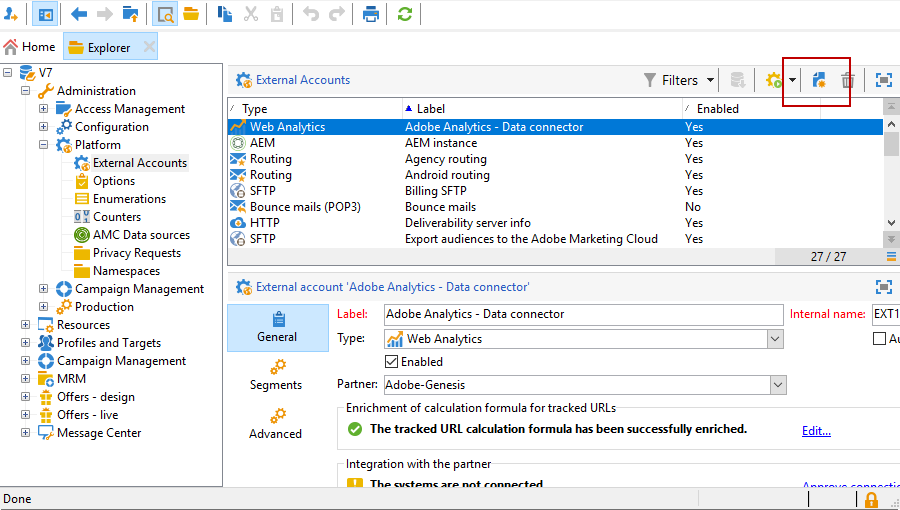

# 外部帐户{#external-accounts}

Adobe Campaign 提供了一组预定义的外部帐户。要设置与外部系统的连接，您可以创建新的外部帐户。

技术工作流或营销策划工作流等技术流程，会使用外部帐户。例如，在工作流中设置文件传输或与任何其他应用程序(Adobe Target、Experience Manager等)进行数据交换时，您需要选择外部帐户。

## 创建外部帐户 {#creating-an-external-account}

要创建新的外部帐户，请执行以下步骤。 详细设置取决于外部帐户的类型。

1. 从营销活动&#x200B;**[!UICONTROL Explorer]**&#x200B;中，选择&#x200B;**[!UICONTROL Administration]**“>”**[!UICONTROL Platform]**“>”**[!UICONTROL External accounts]**。

   

1. 单击 **[!UICONTROL New]** 按钮。

   

1. 输入&#x200B;**[!UICONTROL Label]**&#x200B;和&#x200B;**[!UICONTROL Internal Name]**。
1. 选择要创建的外部帐户&#x200B;**[!UICONTROL Type]**。
1. 根据所选外部帐户类型指定凭据，以配置对帐户的访问权限。

   所连接服务器的提供者通常会提供必需的信息。

1. 选中&#x200B;**[!UICONTROL Enabled]**&#x200B;选项以激活连接。
1. 单击 **[!UICONTROL Save]**。

外部帐户已创建并添加到外部帐户列表。

## 特定于Campaign的外部帐户

### 退回电子邮件 {#bounce-mails-external-account}

**退回邮件**&#x200B;外部帐户指定要用于连接到电子邮件服务的外部POP3帐户。 有关此外部帐户的详细信息，请参阅此[页面](../../workflow/using/inbound-emails.md)。

所有配置为POP3访问的服务器都可以接收回邮。


要配置&#x200B;**[!UICONTROL Bounce mails (defaultPopAccount)]**&#x200B;外部帐户：

* **[!UICONTROL Server]**

  pop3服务器的URL。

* **[!UICONTROL Port]**

  POP3连接端口号。 默认端口为110。

* **[!UICONTROL Account]**

  用户的名称。

* **[!UICONTROL Password]**

  用户帐户密码。

* **[!UICONTROL Encryption]**

  选择的加密类型，介于&#x200B;**[!UICONTROL By default]**、**[!UICONTROL POP3 + STARTTLS]**、**[!UICONTROL POP3]**&#x200B;或&#x200B;**[!UICONTROL POP3S]**&#x200B;之间。

* **[!UICONTROL Function]**

  入站电子邮件或SOAP路由器

>[!IMPORTANT]
>
>在使用Microsoft OAuth 2.0配置POP3外部帐户之前，您首先需要在Azure门户中注册应用程序。 有关详细信息，请参见[此页面](https://docs.microsoft.com/en-us/azure/active-directory/develop/quickstart-register-app)。

要使用&#x200B;**Microsoft OAuth 2.0**&#x200B;配置POP3外部，请选中&#x200B;**[!UICONTROL Microsoft OAuth 2.0]**&#x200B;选项并填写以下字段：

* **[!UICONTROL Azure tenant]**

  Azure ID(或目录（租户）ID)可以在Azure门户中应用程序概述的&#x200B;**Essentials**&#x200B;下拉菜单中找到。

* **[!UICONTROL Azure Client ID]**

  可以在Azure门户中应用程序概述的&#x200B;**Essentials**&#x200B;下拉列表中找到客户端ID(或应用程序（客户端）ID)。

* **[!UICONTROL Azure Client secret]**

  可以在Azure门户中应用程序的&#x200B;**证书和密码**&#x200B;菜单的&#x200B;**客户端密码**&#x200B;列中找到客户端密码ID。

* **[!UICONTROL Azure Redirect URL]**

  可在Azure门户中应用程序的&#x200B;**身份验证**&#x200B;菜单中找到重定向URL。 它应使用以下语法`nl/jsp/oauth.jsp`结束，如`https://redirect.adobe.net/nl/jsp/oauth.jsp`。

安装和使用客户端控制台中的&#x200B;**[!UICONTROL Test Connection]**&#x200B;按钮需要Internet访问。 设置完成后，inMail进程可以与Microsoft服务器通信，而无需互联网。

输入其他凭据后，可单击&#x200B;**[!UICONTROL Setup the connection]**&#x200B;以完成外部帐户配置。

### 路由{#routing-external-account}

**[!UICONTROL Routing]**&#x200B;外部帐户允许您根据安装的包配置Adobe Campaign中可用的每个渠道。


可以配置以下渠道：

* [电子邮件](#email-routing-external-account)
* [手机（短信）](../../delivery/using/sms-set-up.md#creating-an-smpp-external-account)
* [电话](../../delivery/using/communication-channels.md#other-channels)
* [直邮](../../delivery/using/about-direct-mail-channel.md)
* [代理](../../delivery/using/communication-channels.md#other-channels)
* [X(以前称为Twitter)](../../social/using/about-social-marketing.md)
* [iOS 渠道](../../delivery/using/configuring-the-mobile-application.md)
* [Android 渠道](../../delivery/using/configuring-the-mobile-application-android.md)

### 电子邮件路由 {#email-routing-external-account}

默认情况下，会根据您的配置提供电子邮件路由外部帐户。

作为内部部署/混合部署客户，您可以创建新的路由外部帐户或更新参数，如下所述。 此配置仅供专家用户使用，可能会影响您的可投放性。 如有任何问题，请联系Adobe客户关怀团队或您的Adobe代表。

* 您可以使用&#x200B;**中间源**、**外部**&#x200B;路由或&#x200B;**批量**&#x200B;投放路由类型。

* 对于&#x200B;**批量**&#x200B;和&#x200B;**中间源**&#x200B;交付模式，您可以在&#x200B;**品牌策略**&#x200B;选项卡中指定品牌策略参数。 这些参数用于使用特定于您品牌的设置覆盖&#x200B;**镜像页面URL**&#x200B;和&#x200B;**错误地址**&#x200B;的[默认参数](../../installation/using/deploying-an-instance.md#email-channel-parameters)。

  

* 要配置中间源外部帐户，请参阅[此部分](mid-sourcing-server.md)

### 执行实例  {#execution-instance-external-account}

如果您具有分解的体系结构，则需要指定链接到控制实例的执行实例并将它们连接起来。 将事务性消息模板部署到执行实例。


* **[!UICONTROL URL]**

  安装执行实例的服务器的URL。

* **[!UICONTROL Account]**

  帐户的名称，它必须与操作员文件夹中定义的消息中心代理匹配。

* **[!UICONTROL Password]**

  运算符文件夹中定义的帐户密码。

有关此配置的更多信息，请参阅此[页面](../../message-center/using/configuring-instances.md#control-instance)。

## 访问外部系统外部帐户

### FTP {#ftp-external-account}

FTP外部帐户允许您配置和测试对Adobe Campaign外部服务器的访问。 要与外部系统（如用于文件传输的FTP服务器898）建立连接，您可以创建自己的外部帐户。 有关详细信息，请参见此 [ 页面](../../workflow/using/file-transfer.md)。

为此，请在此外部帐户中指定用于建立与FTP服务器连接的地址和凭据


* **[!UICONTROL Server]**

  ftp服务器的名称。

* **[!UICONTROL Port]**

  FTP连接端口号。 默认端口为21。

* **[!UICONTROL Account]**

  用户的名称。

* **[!UICONTROL Password]**

  用户帐户密码。

* **[!UICONTROL Encryption]**

  选择的加密类型，介于&#x200B;**[!UICONTROL None]**&#x200B;或&#x200B;**[!UICONTROL SSL]**&#x200B;之间。

要了解在何处查找这些凭据，请参阅此[页面](https://help.dreamhost.com/hc/en-us/articles/115000675027-FTP-overview-and-credentials)。

### SFTP {#sftp-external-account}

SFTP外部帐户允许您配置和测试对Adobe Campaign外部服务器的访问。 要与外部系统（如用于文件传输的SFTP）建立连接，您可以创建自己的外部帐户。 有关详细信息，请参见此 [ 页面](../../workflow/using/file-transfer.md)。


* **[!UICONTROL Server]**

  SFTP服务器的URL。

* **[!UICONTROL Port]**

  FTP连接端口号。 默认端口为22。

* **[!UICONTROL Account]**

  用于连接到SFTP服务器的帐户名称。

* **[!UICONTROL Password]**

  用于连接到SFTP服务器的密码。

<!--To add SSH keys on Windows:

1. Create the **HOME** environment variable with value set as the installation directory.

2. Add your private key to the `/$HOME/.ssh/id_rsa` folder.

3. Restart the Adobe Campaign services.
-->

### 外部数据库（联合数据访问） {#external-database-external-account}

使用&#x200B;**外部数据库**&#x200B;类型的外部帐户连接到外部数据库。 在[本节](../../installation/using/about-fda.md)中了解联合数据访问(FDA)选项的更多信息。

与Campaign兼容的外部数据库列在[兼容性矩阵](../../rn/using/compatibility-matrix.md)中


外部帐户配置设置取决于数据库引擎。 请在以下部分中了解详情：

* 配置对[Vertica analytics](../../installation/using/configure-fda-vertica.md)的访问权限
* 配置对[Snowflake](../../installation/using/configure-fda-snowflake.md)的访问权限
* 配置对[Google BigQuery](../../installation/using/configure-fda-google-big-query.md)的访问权限
* 配置对[Azure synapse](../../installation/using/configure-fda-synapse.md)的访问权限
* 配置对[Hadoop](../../installation/using/configure-fda-hadoop.md)的访问权限
* 配置对[Oracle](../../installation/using/configure-fda-oracle.md)的访问权限
* 配置对[Netezza](../../installation/using/configure-fda-netezza.md)的访问权限
* 配置对[SAP HANA](../../installation/using/configure-fda-sap-hana.md)的访问权限
* 配置对[Snowflake](../../installation/using/configure-fda-snowflake.md)的访问权限
* 配置对[Sybase IQ](../../installation/using/configure-fda-sybase.md)的访问权限
* 配置对[Teradata](../../installation/using/configure-fda-teradata.md)的访问权限


## Adobe解决方案集成外部帐户

### Adobe Experience Cloud {#adobe-experience-cloud-external-account}

要使用Adobe ID连接到Adobe Campaign控制台，您必须配置&#x200B;**[!UICONTROL Adobe Experience Cloud (MAC)]**&#x200B;外部帐户。


* **[!UICONTROL IMS server]**

  IMS服务器的URL。 确保暂存实例和生产实例都指向同一个IMS生产端点。

* **[!UICONTROL IMS scope]**

  此处定义的范围必须是IMS设置的范围的子集。

* **[!UICONTROL IMS client identifier]**

  IMS客户端的ID。

* **[!UICONTROL IMS client secret]**

  IMS客户端密钥的凭据。

* **[!UICONTROL Callback server]**

  访问Adobe Campaign实例的URL。

* **[!UICONTROL IMS organization ID]**

  您组织的ID。 要查找您的组织ID，请参阅[此页面](https://experienceleague.adobe.com/docs/core-services/interface/administration/organizations.html?lang=zh-hans){_blank}。

* **[!UICONTROL Association mask]**

  语法允许Enterprise Dashboard中的配置名称与Adobe Campaign中的组同步。

* **[!UICONTROL Server]**

  Adobe Experience Cloud实例的URL。

* **[!UICONTROL Tenant]**

  您的Adobe Experience Cloud租户的名称。

有关此配置的更多信息，请参阅[此页面](../../integrations/using/configuring-ims.md)。

## Web 分析 {#web-analytics-external-account}

**[!UICONTROL Web Analytics]**&#x200B;外部帐户允许您以区段形式将数据从Adobe Analytics转发到Adobe Campaign。 反过来，它会将Adobe Campaign投放的电子邮件营销活动的指标和属性发送到Adobe Analytics连接器。


对于此外部帐户，必须扩充跟踪URL的计算公式，并且必须批准两个解决方案之间的连接。 有关详细信息，请参见此 [ 页面](../../integrations/using/gs-aa.md)。

### Adobe Experience Manager {#adobe-experience-manager-external-account}

**[!UICONTROL AEM (AEM instance)]**&#x200B;外部帐户允许您直接在Adobe Experience Manager中管理电子邮件投放的内容以及表单。


* **[!UICONTROL Server]**

  Adobe Experience Manager服务器的URL。

* **[!UICONTROL Port]**

  用于连接到Adobe Experience Manager创作实例的帐户名称。

* **[!UICONTROL Password]**

  用于连接到Adobe Experience Manager创作实例的密码。

有关更多信息，请参阅此](../../integrations/using/about-adobe-experience-manager.md)章节[。

## CRM连接器外部帐户

### Microsoft Dynamics CRM {#microsoft-dynamics-crm-external-account}

>[!NOTE]
>
> **[!UICONTROL On-premise]**&#x200B;和&#x200B;**[!UICONTROL Office 365]**&#x200B;部署类型现已弃用。 [了解详情](../../rn/using/deprecated-features.md)。

**[!UICONTROL Microsoft Dynamics CRM]**&#x200B;外部帐户允许您将Microsoft Dynamics数据导入和导出到Adobe Campaign中。

在此[页面](../../platform/using/crm-ms-dynamics.md)中了解有关Campaign - Microsoft Dynamics CRM连接器的更多信息。

对于&#x200B;**[!UICONTROL Web API]**&#x200B;部署类型和&#x200B;**[!UICONTROL Password credentials]**&#x200B;身份验证，您需要提供以下详细信息：


* **[!UICONTROL Account]**

  用于登录到Microsoft CRM的帐户。

* **[!UICONTROL Server]**

  Microsoft CRM服务器的URL。

  要查找您的Microsoft CRM **[!UICONTROL Server URL]**，请访问您的Microsoft Dynamics CRM帐户，然后单击&#x200B;**Dynamics 365**&#x200B;并选择您的应用程序。 然后，您可以在浏览器的地址栏中找到您的&#x200B;**[!UICONTROL Server URL]**，例如`https://myserver.crm.dynamics.com/`。

* **[!UICONTROL Client identifier]**

  可以在&#x200B;**[!UICONTROL Update your code]**&#x200B;类别&#x200B;**[!UICONTROL Client ID]**&#x200B;字段中从Microsoft Azure管理门户找到客户端ID。

* **[!UICONTROL CRM version]**

  选择&#x200B;**[!UICONTROL Dynamics CRM 365]** CRM版本。

对于&#x200B;**[!UICONTROL Web API]**&#x200B;部署类型和&#x200B;**[!UICONTROL Certificate]**&#x200B;身份验证，您需要提供以下详细信息：


* **[!UICONTROL Server]**

  Microsoft CRM服务器的URL。

  要查找您的Microsoft CRM **[!UICONTROL Server URL]**，请访问您的Microsoft Dynamics CRM帐户，然后单击&#x200B;**Dynamics 365**&#x200B;并选择您的应用程序。 然后，您可以在浏览器的地址栏中找到您的&#x200B;**[!UICONTROL Server URL]**，例如`https://myserver.crm.dynamics.com/`。

* **[!UICONTROL Private Key (Base64 encoded)]**

  请注意，私钥需要编码为Base64。

  为此，您可以使用Base64编码器帮助或使用适用于Linux的命令行`base64 -w0 private.key`。

* **[!UICONTROL Custom Key identifier]**

* **[!UICONTROL Key ID]**

* **[!UICONTROL Client identifier]**

  可以在&#x200B;**[!UICONTROL Update your code]**&#x200B;类别&#x200B;**[!UICONTROL Client ID]**&#x200B;字段中从Microsoft Azure管理门户找到客户端ID。

* **[!UICONTROL CRM version]**

  介于&#x200B;**[!UICONTROL Dynamics CRM 2007]**、**[!UICONTROL Dynamics CRM 2015]**&#x200B;或&#x200B;**[!UICONTROL Dynamics CRM 2016]**&#x200B;之间的CRM版本。

有关此配置的更多信息，请参阅此[页面](../../platform/using/crm-connectors.md)。

### Salesforce.com CRM  {#salesforce-crm-external-account}

**[!UICONTROL Salesforce CRM]**&#x200B;外部帐户允许您将Salesforce数据导入和导出到Adobe Campaign中。


要将Salesforce CRM外部帐户配置为与Adobe Campaign配合使用，您需要提供以下详细信息：

* **[!UICONTROL Account]**

  用于登录到Salesforce CRM的帐户。

* **[!UICONTROL Password]**

  用于登录到Salesforce CRM的密码。

* **[!UICONTROL Client identifier]**

  要了解在何处查找您的客户端标识符，请参阅此[页面](https://help.salesforce.com/articleView?id=000205876&amp;type=1)。

* **[!UICONTROL Security token]**

  要了解在何处查找您的安全令牌，请参阅此[页面](https://help.salesforce.com/articleView?id=000205876&amp;type=1)。

* **[!UICONTROL API version]**

  选择API的版本。

对于此外部帐户，您需要使用Configuration Assistant配置Salesforce CRM。

有关此配置的更多信息，请参阅此[页面](../../platform/using/crm-connectors.md)。

## 传输数据外部帐户

### Amazon Simple Storage Service (S3) {#amazon-simple-storage-service--s3--external-account}

Amazon Simple Storage Service (S3)连接器可用于将数据导入或导出Adobe Campaign。 它可以在工作流活动中设置。 有关详细信息，请参见此 [ 页面](../../workflow/using/file-transfer.md)。


在设置此新外部帐户时，您需要提供以下详细信息：

* **[!UICONTROL AWS S3 Account Server]**

  服务器的URL，应按如下方式填写：

  ```
  <S3bucket name>.s3.amazonaws.com/<s3object path>
  ```

* **[!UICONTROL AWS access key ID]**

  要了解在何处查找您的AWS访问密钥ID，请参阅此[页面](https://docs.aws.amazon.com/general/latest/gr/aws-sec-cred-types.html#access-keys-and-secret-access-keys) 。

* **[!UICONTROL Secret access key to AWS]**

  要了解在何处查找您的AWS访问密钥，请参阅此[页面](https://aws.amazon.com/fr/blogs/security/wheres-my-secret-access-key/)。

* **[!UICONTROL AWS Region]**

  要了解有关AWS地区的更多信息，请参阅此[页面](https://aws.amazon.com/about-aws/global-infrastructure/regions_az/)。

* **[!UICONTROL Use server side encryption]**&#x200B;复选框允许您以S3加密模式存储文件。

要了解在何处查找访问密钥ID和访问密钥，请参阅Amazon Web服务[文档](https://docs.aws.amazon.com/general/latest/gr/aws-sec-cred-types.html#access-keys-and-secret-access-keys)。

### Azure Blob Storage {#azure-blob-external-account}

**Azure Blob Storage**&#x200B;外部帐户可用于通过&#x200B;**[!UICONTROL Transfer file]**&#x200B;工作流活动将数据导入或导出到Adobe Campaign。 有关更多信息，请参阅此](../../workflow/using/file-transfer.md)章节[。


要将&#x200B;**[!UICONTROL Azure external account]**&#x200B;配置为与Adobe Campaign配合使用，您需要提供以下详细信息：

* **[!UICONTROL Server]**

  Azure Blob Storage服务器的URL。

* **[!UICONTROL Encryption]**

  选择的加密类型，介于&#x200B;**[!UICONTROL None]**&#x200B;或&#x200B;**[!UICONTROL SSL]**&#x200B;之间。

* **[!UICONTROL Access key]**

  若要了解在何处查找您的&#x200B;**[!UICONTROL Access key]**，请参阅此[页面](https://docs.microsoft.com/en-us/azure/storage/common/storage-account-keys-manage?tabs=azure-portal)。
