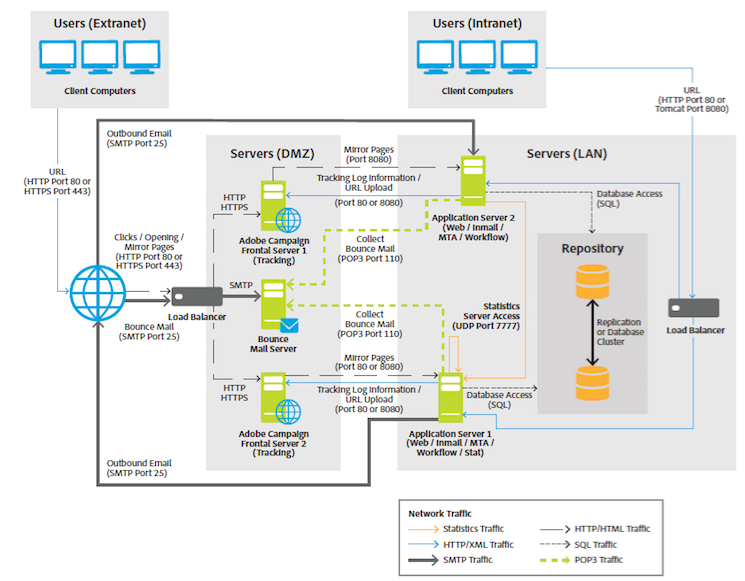

# 一般架构{#general-architecture}

典型的Adobe Campaign解决方案部署包含以下组件：

* **个性化客户端环境**

  直观的图形界面，用户可以在其中交流和跟踪营销优惠、创建营销活动、查看和管理所有营销活动、项目和计划（包括电子邮件、工作流和登陆页面）、创建和管理客户用户档案，以及定义客户受众类型。

* **开发环境**

  根据用户界面中定义的规则和工作流，通过选定的通信渠道（包括电子邮件、短信、推送通知、直邮、Web或社交）执行营销活动的服务器端软件。

* **数据库容器**

  Adobe Campaign数据库基于关系数据库技术，将所有客户信息、活动组件、选件和工作流程以及活动结果存储在客户数据库容器中。

Adobe Campaign基于面向服务的架构(SOA)，由多个功能模块组成。 这些模块可以部署在一台或多台计算机上的单个或多个实例中，具体取决于可扩展性、可用性和服务隔离方面的限制。 因此，部署配置的范围非常广泛，从单个中央计算机到包括多个站点上的多个专用服务器的配置。

>[!NOTE]
>
>作为软件供应商，我们指定兼容的硬件和软件基础架构。 此处提供的硬件建议仅供参考，并且基于我们的经验。 Adobe对据此作出的任何决定概不负责。 它还将取决于您的业务规则和惯例以及项目的关键性和所需的性能级别。

>[!CAUTION]
>
>如果没有另行明确说明，则托管某个Adobe Campaign平台所有组件的计算机管理员应负责对这些组件进行安装、更新和维护。 这包括实施Adobe Campaign应用程序的先决条件以及遵守Campaign [兼容性矩阵](../../rn/using/compatibility-matrix.md) 组件之间。

## 表示层 {#presentation-layer}

根据用户的需求，可以通过不同的方式访问应用程序：富客户端、瘦客户端或API集成。

* **富客户端**：应用程序的主要用户界面是一个富客户端，换句话说，是一个仅通过标准互联网协议（SOAP、HTTP等）与Adobe Campaign应用程序服务器通信的本机应用程序(Windows)。 此控制台为工作效率提供了极大的用户友好性，使用的带宽非常少（通过使用本地缓存），并且易于部署。 此控制台可以从互联网浏览器部署，可以自动更新，并且不需要任何特定的网络配置，因为它只生成HTTP(S)流量。
* **瘦客户端**：可以通过使用HTML用户界面的简单Web浏览器访问应用程序的某些部分，包括报告模块、投放批准阶段、分布式营销模块（中央/本地）的功能、实例监控等。 利用此模式，可以在Intranet或Extranet中包含Adobe Campaign功能。
* **通过API集成**：在某些情况下，可以使用通过SOAP协议公开的Web服务API从外部应用程序调用系统。

## 逻辑应用层 {#logical-application-layer}

Adobe Campaign是一个平台，其上提供了多种应用程序，通过组合来创建一个开放且可扩展的架构。 Adobe Campaign平台编写在灵活的应用层上，可轻松配置以满足公司的业务需求。 这从功能和技术角度满足了企业不断增长的需求。 分布式架构可确保线性系统可扩展性，从数千条报文扩展到数百万条报文。

Adobe Campaign依赖一组可共同工作的服务器端进程。

主要流程为：

**应用程序服务器** (nlserver web)

此进程通过Web服务API (SOAP - HTTP + XML)公开所有Adobe Campaign功能。 此外，它可以动态生成用于基于HTML的访问（报表、Web窗体等）的网页。 为实现此目的，此过程包括一个Apache Tomcat JSP服务器。 这是控制台连接的进程。

**工作流引擎** (nlserver wfserver)

它执行在应用程序中定义的工作流进程。

它还处理定期执行的技术工作流，包括：

* 跟踪：恢复和整合跟踪日志。 它使您能够从重定向服务器检索日志，并创建报告模块使用的聚合指示器。
* 清理：数据库清理。 用于清除旧记录并避免数据库呈指数级增长。
* 计费：自动发送平台的活动报告（数据库大小、营销行动数量、活动用户档案数量等）。

**投放服务器** (nlserver mta)

Adobe Campaign具有本机电子邮件广播功能。 此过程可充当SMTP邮件传输代理(MTA)。 它执行消息的“一对一”个性化并处理消息的物理投放。 它使用投放作业运行，并处理自动重试。 此外，启用跟踪后，会自动替换URL，以便它们指向重定向服务器。

此过程可处理自定义以及向第三方路由器自动发送短信、传真和直邮的功能。

**重定向服务器** (nlserver webmdl)

对于电子邮件，Adobe Campaign会自动处理打开和点击跟踪（还可能在网站级别进行事务性跟踪）。 要实现此目的，将重写电子邮件中纳入的URL，以便指向此模块，该模块会注册Internet用户的传递，然后再将用户重定向到所需的URL。

为了保证最高可用性，此过程完全独立于数据库：其他服务器进程仅使用SOAP调用(HTTP、HTTP(S)和XML)与其通信。 从技术上讲，此功能是在HTTP服务器的扩展模块（IIS中的ISAPI扩展或DSO Apache模块等）中实现的 和仅在Windows中可用。

其他更技术性的流程也可使用：

**管理退回电子邮件** (nlserver inMail)

通过此过程，您可以从配置为接收在投放失败时返回的退回邮件的邮箱自动选取电子邮件。 然后，这些邮件将进行基于规则的处理，以确定未投放的原因（未知收件人、超出配额等） 和更新数据库中的投放状态。

所有这些操作都是完全自动且已预配置的。

**短信投放状态** (nlserver sms)

此过程会轮询SMS路由器以收集进度状态并更新数据库。

**正在写入日志消息** (nlserver syslogd)

此技术进程会捕获其他进程生成的日志消息和跟踪，并将它们写入硬盘。 这样一来，在出现问题时就可以获得充分的信息进行诊断。

**写入跟踪日志** (nlserver trackinglogd)

此过程将重定向过程生成的跟踪日志保存到磁盘。

**编写入站事件** (nlserver interactiond)

此过程确保在交互的框架内将入站事件记录到磁盘。

**监控模块** (nlserver watchdog)

此技术流程充当一个主要流程，可生成其他流程。 它还监控这些服务器，并在发生事件时自动重新启动它们，从而保持最长的系统正常运行时间。

**统计服务器** (nlserver stat)

此进程维护有关连接数、每个邮件服务器发送的邮件以及邮件的限制（最大同时连接数、每小时邮件数/和/或连接数）的统计信息。 它还允许您联合多个实例或计算机（如果它们共享相同的公共IP地址）。

>[!NOTE]
>
>Adobe Campaign模块的完整列表请参见 [本文档](../../production/using/operating-principle.md).

## 持久层 {#persistence-layer}

该数据库用作持久层，包含几乎所有由Adobe Campaign管理的信息。 这包括功能数据（用户档案、订阅、内容等）、技术数据（投放作业和日志、跟踪日志等） 和工作数据（购买、商机）。

数据库的可靠性至关重要，因为大多数Adobe Campaign组件都需要访问数据库才能执行其任务（重定向模块显着除外）。

该平台预定义了以营销为中心的数据集市，或者可以使用任何主要的关系数据库管理系统(RDBMS)轻松位于现有的数据集市和架构之上。 Adobe Campaign平台可通过从Adobe Campaign到数据库的SQL调用访问数据集市中的所有数据。 Adobe Campaign还提供了提取转换和加载(ETL)工具的完整补充，用于执行数据导入和导出到系统中的数据。
