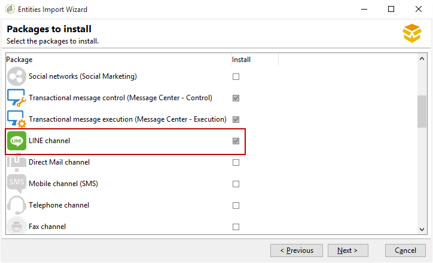

# 安装Campaign Classic标准包{#installing-campaign-standard-packages}

## 关于标准包 {#campaign-standard-packages}

包是一组功能，可根据您的需要安装。 它们允许您向实例添加更多选项。

>[!CAUTION]
>
>您只能安装与许可合同中所述选项相对应的包。
>
>安装包后，便无法卸载它。 安装新包可能会影响您的所有平台：在最终部署之前，它必须经过测试和验证。

安装标准包：

1. 从Adobe Campaign客户端控制台 **[!UICONTROL Tools > Advanced > Package import...]** 中访问包导入向导。
1. Select **[!UICONTROL Install a standard package]**.
1. 在显示的列表中，检查要安装的包。
   >[!NOTE]
   >
   >如果包灰显，则无法安装它。 这表示已安装或与实例不兼容。 例如，您无法在营销实 **例上安装Mid-sourcing平台包** 。 您将在下表中找到此信息。
1. 单 **[!UICONTROL Next]**&#x200B;击，然 **[!UICONTROL Start]** 后开始安装包。

   安装包后，进度栏显示 **100%** ，并且您可以在安装日志中看到以下消息： **[!UICONTROL Installation of packages successful]**.

1. **[!UICONTROL Close]** 安装窗口。

现在已安装包。

### 现成包列表 {#list-of-standard-packages}

下表列出了所有标准包及其说明、可安装的实例类型（Marketing、Mid等）和其他信息。

<table> 
 <thead> 
  <tr> 
   <th> 包 </th> 
   <th> 说明 </th> 
   <th> 实例类型 </th> 
   <th> 更多信息 </th> 
  </tr> 
 </thead> 
 <tbody> 
  <tr> 
   <td> 投放<br /> </td> 
   <td> 监控发送消息时遇到的问题和最终问题。<br /> </td> 
   <td> 全部</td> 
   <td> <a href="../../delivery/using/monitoring-a-delivery.md">了解更多</a></td> 
  </tr> 
  <tr> 
   <td> 营销活动（营销活动）<br /> </td> 
   <td> 定义、优化、执行和分析通信和营销活动。<br /> </td> 
   <td> 营销</td> 
   <td> <a href="../../campaign/using/designing-marketing-campaigns.md">了解更多</a> </td> 
  </tr> 
  <tr> 
   <td> 营销资源(MRM)<br /> </td> 
   <td> 通过提供任务、预算和营销资源的管理和跟踪，以协作模式控制营销活动。<br /> </td> 
   <td> 营销</td> 
   <td> <a href="../../campaign/using/about-marketing-resource-management.md">了解更多</a> </td> 
  </tr> 
  <tr> 
   <td> 优惠引擎（交互）<br /> </td> 
   <td> 在与给定联系人（客户或目标）的交互过程中，通过使其成为单个或多个调整后的优惠，实时做出响应。 <br /> </td> 
   <td> 全部<br /> </td> 
   <td> 可选，了 <a href="../../interaction/using/interaction-and-offer-management.md">解更多</a></td> 
  </tr> 
  <tr> 
   <td> 具有执行实例的选件引擎的控制<br /> </td> 
   <td> </td> 
   <td> 营销<br /> </td> 
   <td> 可选</td> 
  </tr> 
  <tr> 
   <td> 执行实例的选件引擎<br /> </td> 
   <td> </td> 
   <td> Mid，执行 <br /> </td> 
   <td> 可选</td> 
  </tr> 
  <!--tr> 
   <td> Lead Management (Leads) (deprecated)<br /> </td> 
   <td> Simplifies the process of building and maintaining the entire leads management life cycle. <br /> </td> 
   <td> Yes<br /> </td> 
   <td> Optional, <a href="https://helpx.adobe.com/campaign/kb/deprecated-and-removed-features.html">Learn More</a> </td> 
  </tr--> 
  <tr> 
   <td> 社交网络（社交营销） <br /> </td> 
   <td> 将Adobe Campaign与Twitter和Facebook同步。<br /> </td> 
   <td> 全部</td> 
   <td> <a href="../../social/using/starting-workflows.md">了解更多</a> </td> 
  </tr> 
  <tr> 
   <td> 事务性消息控制（消息中心——控制）<br /> </td> 
   <td> 管理从信息系统触发的事件生成的触发消息。<br /> </td> 
   <td> 营销<br /> </td> 
   <td> 可选，了 <a href="../../message-center/using/about-transactional-messaging.md">解更多</a> </td> 
  </tr> 
  <tr> 
   <td> 事务性消息执行（消息中心——执行） <br /> </td> 
   <td> 确保更高的可用性和更好的负载管理。<br /> </td> 
   <td> 执行<br /> </td> 
   <td> 可选，了 <a href="../../message-center/using/about-transactional-messaging.md">解更多</a> </td> 
  </tr> 
  <tr> 
   <td> 线路通道<br /> </td> 
   <td> 通过Adobe Campaign使用LINE渠道发送交付，<br /> </td> 
   <td> 全部<br /> </td> 
   <td> 可选，必填消息中心</td> 
  </tr> 
  <tr> 
   <td> 直邮渠道<br /> </td> 
   <td> 使用Adobe Campaign的直邮渠道发送分发。<br /> </td> 
   <td> 全部<br /> </td> 
   <td> 可选，了 <a href="../../delivery/using/about-direct-mail-channel.md">解更多</a> </td> 
  </tr> 
  <tr> 
   <td> 移动渠道(SMS) <br /> </td> 
   <td> 使用Adobe Campaign的移动／短信渠道发送分发。<br /> </td> 
   <td> 全部<br /> </td> 
   <td> 可选，了 <a href="../../delivery/using/sms-channel.md">解更多</a> </td> 
  </tr> 
  <tr> 
   <td> 电话频道<br /> </td> 
   <td> 使用Adobe Campaign的电话渠道发送交付。<br /> </td> 
   <td> 全部<br /> </td> 
   <td> 可选</td> 
  </tr> 
  <tr> 
   <td> 传真频道<br /> </td> 
   <td> 使用Adobe Campaign的传真渠道发送分发。<br /> </td> 
   <td> 全部<br /> </td> 
   <td> 可选</td> 
  </tr> 
  <tr> 
   <td> 移动应用程序渠道<br /> </td> 
   <td> 使用Adobe Campaign平台通过应用程序向iOS和Android终端发送个性化通知。 <br /> </td> 
   <td> 全部<br /> </td> 
   <td> 可选，了 <a href="../../delivery/using/about-mobile-app-channel.md">解更多</a> </td> 
  </tr> 
  <tr> 
   <td> 内容管理器<br /> </td> 
   <td> 创建经常性新闻稿或网站，然后验证并发布您的消息。<br /> </td> 
   <td> </td> 
   <td> <a href="../../delivery/using/about-content-management.md">了解更多</a> </td> 
  </tr> 
  <tr> 
   <td> 在线调查（调查管理器）<br /> </td> 
   <td> 创建和管理在线表单以添加或修改个人资料信息、订阅、取消订阅或竞争条目表单。<br /> </td> 
   <td> 营销<br /> </td> 
   <td> 可选，了 <a href="../../web/using/about-surveys.md">解更多</a> </td> 
  </tr> 
  <tr> 
   <td> 营销分析<br /> </td> 
   <td> 使您能够分析和测量数据、计算统计数据、简化和优化报表创建和计算。 此外，您还可以创建报告并构建目标人群。 <br /> </td> 
   <td> 营销<br /> </td> 
   <td> 可选，了 <a href="../../reporting/using/about-cubes.md">解更多</a> </td> 
  </tr> 
  <tr> 
   <td> 响应管理器<br /> </td> 
   <td> 衡量营销活动的成功和盈利能力，或为所有通信渠道提供建议。<br /> </td> 
   <td> 营销<br /> </td> 
   <td> 可选，了 <a href="../../campaign/using/about-response-manager.md">解更多</a> </td> 
  </tr> 
  <tr> 
   <td> 访问外部数据（联合数据访问）<br /> </td> 
   <td> Provides the Federated Data Access (FDA) option in order to process information stored in one or more external databases so that you can access external data without changing the structure of Adobe Campaign data.<br /> </td> 
   <td> 全部<br /> </td> 
   <td> 可选，了 <a href="../../workflow/using/accessing-an-external-database--fda-.md">解更多</a> </td> 
  </tr> 
  <tr> 
   <td> 营销活动优化<br /> </td> 
   <td> 控制、过滤和监控发送的内容，使发送的消息能够最好地满足客户的需求和期望，并符合公司通信策略。 <br /> </td> 
   <td> 营销<br /> </td> 
   <td> 可选，了 <a href="../../campaign/using/about-campaign-typologies.md">解更多</a> </td> 
  </tr> 
  <tr> 
   <td> 交付性监控（电子邮件交付性）<br /> </td> 
   <td> 衡量营销活动到达收件人收件箱的成功程度，而不会弹跳或标记为垃圾邮件。<br /> </td> 
   <td> 全部 </td> 
   <td> 可选，了 <a href="https://docs.campaign.adobe.com/doc/AC/getting_started/EN/deliverability.html">解更多</a> </td> 
  </tr> 
  <tr> 
   <td> 优惠券管理<br /> </td> 
   <td> 创建一组优惠券，以添加到即将推出的营销推广信息中。<br /> </td> 
   <td> 营销<br /> </td> 
   <td> 可选，了 <a href="../../delivery/using/personalized-coupons.md">解更多</a> </td> 
  </tr> 
  <tr> 
   <td> 收件箱渲染(IR)<br /> </td> 
   <td> 使您能够预览在可能接收消息的不同上下文中发送的消息，并检查主要桌面和应用程序的兼容性。 你需要个利特姆斯账户。<br /> </td> 
   <td> 营销<br /> </td> 
   <td> 可选，了 <a href="../../delivery/using/inbox-rendering.md">解更多</a> </td> 
  </tr> 
  <tr> 
   <td> 中央／本地营销（分布式营销）<br /> </td> 
   <td> 在中央实体（总部、营销部门等）之间实施合作活动地方实体（销售点、区域代理等）。<br /> </td> 
   <td> 营销 </td> 
   <td> 可选，了 <a href="../../campaign/using/about-distributed-marketing.md">解更多</a> </td> 
  </tr> 
  <tr> 
   <td> CRM连接器<br /> </td> 
   <td> Provides various CRM connectors for linking your Adobe Campaign platform to your third-party systems.<br /> </td> 
   <td> 营销</td> 
   <td> <a href="../../platform/using/crm-connectors.md">了解更多</a> </td> 
  </tr> 
  <tr> 
   <td> Web Analytics连接器<br /> </td> 
   <td> 允许Adobe Campaign和Adobe Analytics通过Web Analytics连接器包进行交互。<br /> </td> 
   <td> 营销 </td> 
   <td> 与交易消息不兼容，了解 <a href="../../platform/using/adobe-analytics-data-connector.md">更多</a> </td> 
  </tr> 
  <tr> 
   <td> AEM集成<br /> </td> 
   <td> 允许您直接在Adobe Experience manager中管理电子邮件分发和表单的内容，以便从AEM的内容编辑功能以及Adobe Campaign的分发能力中获益。<br /> </td> 
   <td> 营销</td> 
   <td> <a href="../../integrations/using/about-adobe-experience-manager.md">了解更多</a> </td> 
  </tr> 
  <tr> 
   <td> Adobe Marketing cloud共享受众集成<br /> </td> 
   <td> 允许您使用Adobe Experience cloud解决方案和核心服务交换和共享受众／细分。<br /> </td> 
   <td> 营销<br /> </td> 
   <td> 需要IMS，了 <a href="../../integrations/using/sharing-audiences-with-adobe-experience-cloud.md">解更多</a> </td> 
  </tr> 
  <tr> 
   <td> 与Adobe Marketing cloud集成<br /> </td> 
   <td> 使您能够将不同Adobe Marketing cloud解决方案中的受众／区段导入和导出到Adobe Campaign中。 </td> 
   <td> 营销</td> 
   <td> 可选，了 <a href="../../integrations/using/configuring-ims.md#installing-the-package">解更多</a> </td> 
  </tr> 
  <tr> 
   <td> 隐私数据保护规定<br /> </td> 
   <td> 包含其他功能，可帮助您在Campaign Classic中实现隐私合规性。<br /> </td> 
   <td> 全部</td> 
   <td> <a href="https://helpx.adobe.com/campaign/kb/acc-privacy.html">了解更多</a> </td> 
  </tr> 
  <tr> 
   <td> 转移至中间采购 <br /> </td> 
   <td> 详细说明了中间采购服务器的安装和配置，以及允许第三方在中间采购模式下发送消息的实例的部署。<br /> </td> 
   <td> 营销 </td> 
   <td> 可选，了 <a href="../../installation/using/mid-sourcing-server.md">解更多</a> </td> 
  </tr> 
  <tr> 
   <td> 中部采购平台<br /> </td> 
   <td> 此配置是在托管(ASP)配置和内部化之间的最佳中间解决方案。 面向外的执行组件在Adobe Campaign托管的“中间采购”服务器上执行。<br /> </td> 
   <td> 中部采购 </td> 
   <td> 可选，了 <a href="../../installation/using/mid-sourcing-server.md">解更多</a> </td> 
  </tr> 
  <tr> 
   <td> ACS连接器<br /> </td> 
   <td> 将Adobe Campaign v7和Adobe Campaign Standard结合起来。 它是Campaign v7中的一个集成功能，可自动将数据复制到Campaign Standard，将两个应用程序的最佳功能结合在一起。 <br /> </td> 
   <td> 营销 </td> 
   <td> 可选，了 <a href="../../integrations/using/acs-connector-principles-and-data-cycle.md">解更多</a> </td> 
  </tr> 
 </tbody> 
</table>

### 消息中心包 {#message-center-package}

要添加传送渠道（移动渠道、移动应用程序渠道等），必须在安装消息中心包之前执行此操作。 如果您已在电子邮件渠道上启动了消息中心项目，那么在项目的中间，您决定添加新渠道，则必须执行以下步骤：

1. 使用包导入向导()安装 **所需的渠道**，例如移动渠 **[!UICONTROL Tools > Advanced > Import package > Adobe Campaign package]**&#x200B;道。
1. 导入文件( **[!UICONTROL Tools > Advanced > Import package > File]**)，然后选择：

   ```
   \datakit\nms\[Your language]\package\messageCenter.xml
   ```

1. 在中， **[!UICONTROL XML data content to import]**&#x200B;仅保留与附加渠道对应的消息中心传送模板。 例如，如果您已经添加了 **Mobile通道**，则只保留与(smsTriggerMessage)模板对应的 **entities****[!UICONTROL Mobile transactional message]** 元素。 如果已添加移动应 **用程序渠道**，则仅保留 **iOS事务消息模板(iosTriggerMessage)和** Android事务消息 **** (androidTriggerMessage)。

   

### LINE包 {#line-package}

要能够通过Adobe Campaign使用LINE渠道发送交货，您必须安装LINE包。

安装LINE包是标准安装，详见“导入包” [一节](../../platform/using/working-with-data-packages.md#importing-packages) 。



>[!CAUTION]
>
>如果“邮件中心”包安装在“LINE”之前，则“LINE”的“邮件中心”交付模板将不可用。
