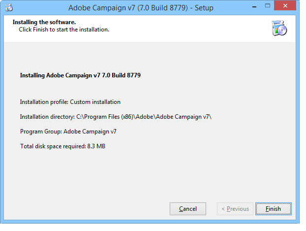

# 安装服务器{#installing-the-server}

## 执行安装项目 {#executing-the-installation-program}

对于Windows 32位平台，安装32位Adobe Campaign。 对于Windows 64位平台，安装64位Adobe Campaign。

Adobe Campaign服务器的安装步骤如下：

1. 执行文 **件setup.exe**。

   

1. 选择安装类型。

   

   有几种安装类型可用：

   * **[!UICONTROL Installation of an application server]** :安装Adobe Campaign应用服务器和客户端控制台。
   * **[!UICONTROL Minimal installation (Network)]** :从网络安装客户端计算机。 如果需要，只有有限数量的DLL将安装在计算机上，所有其他组件将从网络驱动器中使用。
   * **[!UICONTROL Installation of a client]** :安装Adobe Campaign客户端所需的组件。
   * **[!UICONTROL Custom installation]** :用户选择要安装的元素。

   选 **择应用程序服务器**，然后执行以下不同步骤：

   

1. 选择安装目录：

   

1. 单击 **[!UICONTROL Finish]** 以开始安装：

   

   进度栏显示安装的距离：

   

   安装完成后，将显示一条消息，通知您：

   

   >[!NOTE]
   >
   >服务器安装完成后，需要重新启动服务器以避免可能出现的网络问题。

   安装完成后，将开始Adobe Campaign创建配置文件。 请参 [阅服务器的第一个开始](#first-start-up-of-the-server)。

## 摘要安装测试 {#summary-installation-testing}

可以使用以下命令测试初始安装：

```
nlserver pdump
```

如果Adobe Campaign未启动，则响应为：

```
No task
```

## 服务器的首次开始 {#first-start-up-of-the-server}

安装测试完成后，通过菜单打开命令提 **[!UICONTROL Start > Programs > Adobe Campaign]** 示符并输入以下命令：

```
nlserver web
```


安装目录中的文件用于配置Adobe Campaign服务器模块。

将显示以下信息：

```
15:30:12 >   Application server for Adobe Campaign Classic (7.X YY.R build XXX@SHA1) of DD/MM/YYYY
15:30:12 >   Web server start (pid=664, tid=4188)...
15:30:12 >   Creation of server configuration file '[INSTALL]bin..confserverConf.xml' server via '[INSTALL]bin..conffraserverConf.xml.sample
15:30:12 >   Creation of server configuration file '[INSTALL]bin..confconfig-default.xml' server via '[INSTALL]bin..confmodelsconfig-default.xml
15:30:12 >   Server started
15:30:12 >   Stop requested (pid=664)
15:30:12 >   Web server stop (pid=664, tid=4188)...
```

按 **Ctrl+C** 可停止该进程，然后输入以下命令：

```
nlserver start web
```

将显示以下信息：

```
12:17:21 >   Application server for Adobe Campaign Classic (7.X YY.R build XXX@SHA1) of DD/MM/YYYY
12:17:21 >   Start of the 'web@default' ('nlserver web -tracefile:web@default -instance:default -detach -tomcat -autorepair') task in a new process 
12:17:21 >   Application server for Adobe Campaign Classic (7.X YY.R build XXX@SHA1) of DD/MM/YYYY
12:17:21 >   Web server start (pid=29188, tid=-1224824320)...
12:17:21 >   Generation of configuration changes '[INSTALL]bin..confserverConf.xml.diff' between '[INSTALL]bin..confserverConf.xml' and '[INSTALL]bin..conffraserverConf.xml.sample'
12:17:22 >   Tomcat started
12:17:22 >   Server started
```

要停止它，请输入：

```
nlserver stop web
```

将显示以下信息：

```
12:18:31 >   Application server for Adobe Campaign Classic (7.X YY.R build XXX@SHA1) of DD/MM/YYYY
12:18:31 >   Stop requested for 'web@default' ('nlserver web -tracefile:web@default -instance:default -detach -tomcat -autorepair', pid=29188, tid=-1224824320)...
12:18:31 >   Stop requested (pid=29188)
12:18:31 >   Web server stopped (pid=29188, tid=-1224824320)...
```

## 内部标识符的口令 {#password-for-the-internal-identifier}

Adobe Campaign服务器定义名为internal的技术登 **录名** ，该登录名对所有实例具有所有权限。 安装后，登录名没有密码。 必须定义一个。

请参阅部 [分内部标识符](../../installation/using/campaign-server-configuration.md#internal-identifier)。

## 启动Adobe Campaign服务 {#starting-adobe-campaign-services}

要开始Adobe Campaign服务，您可以使用服务管理器或在命令行中输入以下内容（具有相应权限）:

```
net start nlserver6
```

如果您需要稍后停止Adobe Campaign进程，请使用以下命令：

```
net stop nlserver6
```

## 安装LibreOffice {#installing-libreoffice}

例如，从https://www.libreoffice.org/download/libreoffice-fresh/下载LibreOffice [](https://www.libreoffice.org/download/libreoffice-fresh/) ，然后按照常规安装步骤操作。

添加以下环境变量：

```
OOO_BASIS_INSTALL_DIR="C:\Program Files (x86)\LibreOffice 6\"
```

