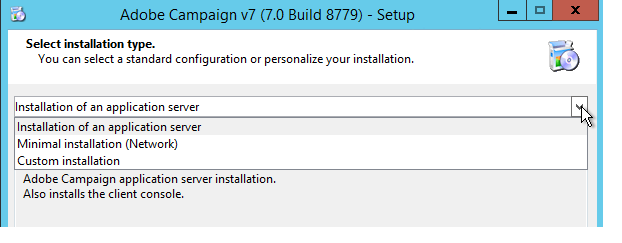

# 安装服务器{#installing-the-server}


## 执行安装程序 {#executing-the-installation-program}

对于Windows 32位平台，请安装Adobe Campaign 32位。 对于Windows 64位平台，请安装Adobe Campaign 64位。

Adobe Campaign服务器的安装步骤如下：

1. 执行文件&#x200B;**setup.exe**。

   

1. 选择安装类型。

   

   有几种安装类型可供使用：

   * **[!UICONTROL Installation of an application server]** :安装Adobe Campaign应用程序服务器和客户端控制台。
   * **[!UICONTROL Minimal installation (Network)]** :从网络安装客户机。如有必要，计算机上将只安装有限数量的DLL，所有其他组件将从网络驱动器中使用。
   * **[!UICONTROL Installation of a client]** :安装Adobe Campaign客户端所需的组件。
   * **[!UICONTROL Custom installation]** :用户选择要安装的元素。

   选择&#x200B;**安装应用程序服务器**，然后完成如下所示的不同步骤：

   

1. 选择安装目录：

   

1. 单击&#x200B;**[!UICONTROL Finish]**&#x200B;以开始安装：

   

   进度栏显示安装的深度：

   

   安装完成后，会显示一条消息，告知您：

   

   >[!NOTE]
   >
   >服务器安装完成后，需要重新启动服务器以避免可能出现的网络问题。

   安装完成后，启动Adobe Campaign以创建配置文件。 请参阅[服务器的首次启动](#first-start-up-of-the-server)。

## 安装测试摘要 {#summary-installation-testing}

您可以使用以下命令测试初始安装：

```
nlserver pdump
```

如果Adobe Campaign未启动，则响应为：

```
No task
```

## 服务器的首次启动 {#first-start-up-of-the-server}

安装测试完成后，通过&#x200B;**[!UICONTROL Start > Programs > Adobe Campaign]**&#x200B;菜单打开命令提示符，然后输入以下命令：

```
nlserver web
```


安装目录中的文件用于配置Adobe Campaign服务器模块。

将显示以下信息：

```
15:30:12 >   Application server for Adobe Campaign Classic (7.X YY.R build XXX@SHA1) of DD/MM/YYYY
15:30:12 >   Web server start (pid=664, tid=4188)...
15:30:12 >   Creation of server configuration file '[INSTALL]bin..confserverConf.xml' server via '[INSTALL]bin..conffraserverConf.xml.sample
15:30:12 >   Creation of server configuration file '[INSTALL]bin..confconfig-default.xml' server via '[INSTALL]bin..confmodelsconfig-default.xml
15:30:12 >   Server started
15:30:12 >   Stop requested (pid=664)
15:30:12 >   Web server stop (pid=664, tid=4188)...
```

按&#x200B;**Ctrl+C**&#x200B;以停止进程，然后输入以下命令：

```
nlserver start web
```

将显示以下信息：

```
12:17:21 >   Application server for Adobe Campaign Classic (7.X YY.R build XXX@SHA1) of DD/MM/YYYY
12:17:21 >   Start of the 'web@default' ('nlserver web -tracefile:web@default -instance:default -detach -tomcat -autorepair') task in a new process 
12:17:21 >   Application server for Adobe Campaign Classic (7.X YY.R build XXX@SHA1) of DD/MM/YYYY
12:17:21 >   Web server start (pid=29188, tid=-1224824320)...
12:17:21 >   Generation of configuration changes '[INSTALL]bin..confserverConf.xml.diff' between '[INSTALL]bin..confserverConf.xml' and '[INSTALL]bin..conffraserverConf.xml.sample'
12:17:22 >   Tomcat started
12:17:22 >   Server started
```

要停止该活动，请输入：

```
nlserver stop web
```

将显示以下信息：

```
12:18:31 >   Application server for Adobe Campaign Classic (7.X YY.R build XXX@SHA1) of DD/MM/YYYY
12:18:31 >   Stop requested for 'web@default' ('nlserver web -tracefile:web@default -instance:default -detach -tomcat -autorepair', pid=29188, tid=-1224824320)...
12:18:31 >   Stop requested (pid=29188)
12:18:31 >   Web server stopped (pid=29188, tid=-1224824320)...
```

## 内部标识符的密码 {#password-for-the-internal-identifier}

Adobe Campaign服务器定义名为&#x200B;**internal**&#x200B;的技术登录，该登录对所有实例具有所有权限。 安装后，登录名没有密码。 必须定义一个。

在[此部分](../../installation/using/configuring-campaign-server.md#internal-identifier)中了解详情。

## 启动Adobe Campaign服务 {#starting-adobe-campaign-services}

要启动Adobe Campaign服务，您可以使用服务管理器，或在命令行中输入以下内容（具有相应的权限）：

```
net start nlserver6
```

如果您稍后需要停止Adobe Campaign进程，请使用命令：

```
net stop nlserver6
```

## 安装LibreOffice {#installing-libreoffice}

例如，从[https://www.libreoffice.org/download/libreoffice-fresh/](https://www.libreoffice.org/download/libreoffice-fresh/)下载LibreOffice，然后按照常规安装步骤操作。

添加以下环境变量：

```
OOO_BASIS_INSTALL_DIR="C:\Program Files (x86)\LibreOffice 6\"
```
