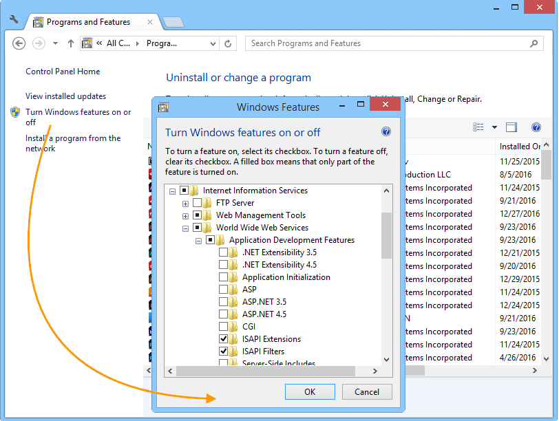

# 集成到 Windows 版 Web 服务器{#integration-into-a-web-server-for-windows}


Adobe Campaign包括Apache Tomcat，它通过HTTP（和SOAP）充当应用程序服务器中的入口点。

您可以使用此集成的Tomcat服务器来处理HTTP请求。

在本例中：

* 默认侦听端口为8080。 要更改它，请参阅 [本节](../../installation/using/configure-tomcat.md).
* 然后，客户端控制台使用URL进行连接，例如 ```https:// `<computer>`:8080```.

但是，出于安全和管理原因，当运行Adobe Campaign的计算机在Internet上公开并且您希望打开访问网络外部的控制台时，我们建议使用专用的Web服务器作为HTTP流量的主要入口点。

Web服务器还允许您通过HTTPs协议保证数据机密性。

同样，当您希望使用跟踪功能时，必须使用Web服务器，该功能仅作为Web服务器扩展模块提供。

>[!NOTE]
>
>如果不使用跟踪功能，则可以执行Apache或IIS的标准安装，并重定向到Campaign。 不需要跟踪Web服务器扩展模块。

## 配置IIS Web服务器 {#configuring-the-iis-web-server}

IIS Web服务器的配置过程大多是图形化的。 它涉及使用网站（已创建或挂起的创建）访问Adobe Campaign服务器的资源：Java (.jsp)文件、样式表(.css、.xsl)、图像(.png)、用于重定向的ISAPI DLL等。

以下部分详细介绍了IIS 7中的配置。 IIS8的配置基本相同。

如果计算机上尚未安装Web IIS服务器，则可以通过 **[!UICONTROL Add > Remove Programs > Enable or disable Windows functionalities]** 菜单。

在IIS 7中，除了标准服务之外，您还需要安装ISAPI扩展和ISAPI过滤器。



### 配置步骤 {#configuration-steps}

应用以下配置步骤：

1. 通过以下方式打开IIS： **[!UICONTROL Control panel > Administrative tools > Services]** 菜单。
1. 根据网络参数（TCP连接端口、DNS主机、IP地址）创建和配置站点(例如，Adobe Campaign)。

   

   必须至少指定站点的名称和虚拟目录的访问路径。 由于不使用Website目录的访问路径，因此可以使用以下目录。

   ```
   C:\inetpub\wwwroot
   ```

   

1. A **VBS** 脚本允许您在我们刚刚创建的虚拟目录上自动配置Adobe Campaign服务器使用的资源。 要启动它，请双击 **iis_neolane_setup.vbs** 文件位于 `[INSTALL]\conf` 文件夹，其中 `[INSTALL]` 是访问Adobe Campaign安装文件夹的路径。

   

   >[!NOTE]
   >
   >如果是Windows Server 2008/IIS7安装，您必须以管理员身份登录才能运行VBS脚本或以管理员身份执行该脚本。

   单击 **[!UICONTROL OK]** 如果将Web服务器用作跟踪重定向服务器，则单击 **[!UICONTROL Cancel]**.

   当Web服务器上已配置了多个站点时，将显示一个中间页面，用于指定安装应用于哪个网站：输入链接到该站点的编号，然后单击 **[!UICONTROL OK]**.

   

   应显示确认消息：

   

1. 在 **[!UICONTROL Content View]** 选项卡上，确保使用Adobe Campaign资源正确配置了网站：

   

   如果未显示树，请重新启动IIS。

### 管理权限 {#managing-rights}

接下来，必须配置ISAPI DLL和Adobe Campaign安装目录中的资源的安全设置。

要执行此操作，请应用以下步骤：

1. 选择 **[!UICONTROL Features View]** 选项卡，并双击 **身份验证** 链接。

   

1. 在 **目录安全** 选项卡中，确保已启用匿名访问。 如有必要，请单击 **[!UICONTROL Edit]** 用于更改设置的链接。

   

### 启动Web服务器并测试配置 {#launching-the-web-server-and-testing-the-configuration}

您现在必须测试配置是否正确。

要实现此目的，请执行以下步骤：

1. 使用重新启动IIS服务器 **iisreset** 命令行。

1. 启动Adobe Campaign服务，然后确保该服务正在运行。

1. 通过将以下URL插入到Web浏览器中来测试跟踪模块：

   ```
   https://<computer>/r/test
   ```

   浏览器应显示以下响应：

   ```
   <redir status='OK' date='YYYY/MM/DD HH:MM:SS' build='XXXX' host='myserver.mydomain.com' localHost='localhost'/>
   ```

要测试重定向模块是否存在，请运行以下命令行：

```
nlserver pdump
```

必须返回以下信息：

```
12:00:33 >   Application server for Adobe Campaign Classic (7.X YY.R build XXX@SHA1) of DD/MM/YYYY
webmdl@default (1644) - 18.2 Mo
```

您还可以确保ISAPI DLL已正确加载。

要执行此操作，请应用以下步骤：

1. Adobe Campaign通过单击 **[!UICONTROL Driver mapping]** 图标。
1. 检查ISAPI过滤器的内容：

   

## 其他配置 {#additional-configurations}

### 更改上载文件大小限制 {#changing-the-upload-file-size-limit}

在配置IIS Web服务器时，对于上载到服务器的设置文件，会自动限制大约28 MB。

这可能会在Adobe Campaign中造成影响，特别是当您要上传大于此限制的文件时。

例如，如果您使用 **数据加载（文件）** 在工作流中键入活动以导入50 MB的文件，如果出现错误，工作流将无法正确执行。

在这种情况下，您必须提高此限制：

1. 通过以下方式打开IIS： **[!UICONTROL Start > (Control panel) > Administration tools]** 菜单。
1. 在 **连接** 窗格，选择为Adobe安装创建的站点，然后双击 **请求筛选** 在主窗格中。
1. 在 **操作** 窗格，选择 **编辑功能设置** 能够编辑中的值 **最大授权内容大小（字节）** 字段。

   例如，要授权上传50 MB的文件，必须指定大于“52428800”字节的值。

>[!NOTE]
>
>有关此IIS选项的更多信息，请参阅 [官方文档](https://www.iis.net/configreference/system.webserver/security/requestfiltering/requestlimits).

