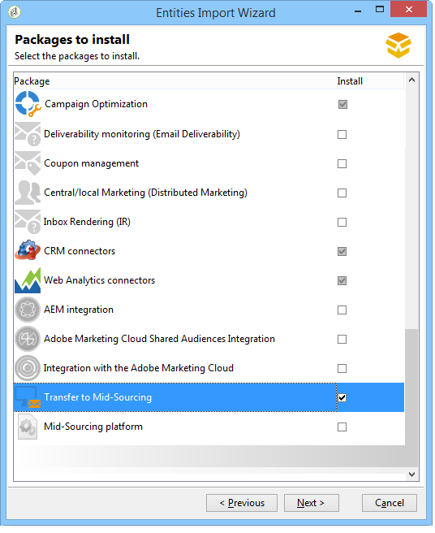
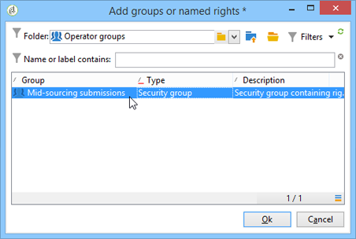
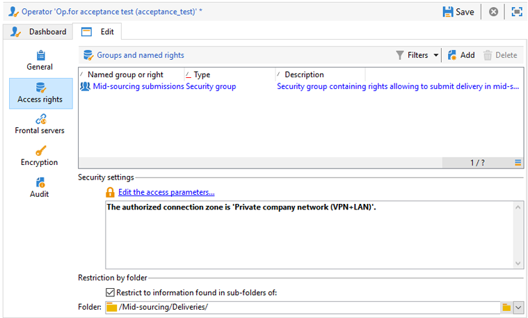
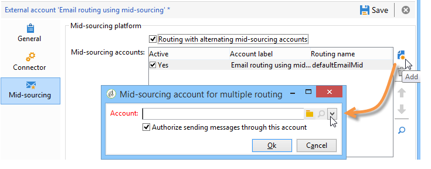

# 中间源服务器{#mid-sourcing-server}

本节详细介绍中间源服务器的安装和配置，以及使第三方能够在&#x200B;**中间源**&#x200B;模式下发送消息的实例的部署。

[中间源部署](../../installation/using/mid-sourcing-deployment.md)中介源架构。

安装中间源服务器的过程与以正常方式安装服务器的过程相同（请参阅标准配置）。 它是一个独立实例，其自己的数据库可用于运行投放。 简而言之，它包含额外的配置，以允许远程实例在中间源模式下通过它执行投放。

>[!CAUTION]
>
>设置中间源服务器并首次运行[同步工作流](../../workflow/using/about-technical-workflows.md)后，请确保不更新中间源外部帐户的内部名称。

## 安装和配置实例{#steps-for-installing-and-configuring-an-instance}的步骤

### 安装和配置实例{#prerequisites-for-installing-and-configuring-an-instance}的先决条件

* 应用程序服务器上的JDK。
* 访问应用程序服务器上的数据库服务器。
* 防火墙配置为打开HTTP(80)或HTTPS(443)端口到中间源服务器。

以下步骤使用单个中间源服务器详细描述配置。 也可以使用多个服务器。 同样，也可以从内部配置发送某些消息（例如，工作流通知）。

### 安装和配置应用程序服务器以进行中间源部署{#installing-and-configuring-the-application-server-for-mid-sourcing-deployment}

安装过程与独立实例的安装过程相同。 请参阅[安装和配置（单台计算机）](../../installation/using/standalone-deployment.md#installing-and-configuring--single-machine-)。

但是，您必须应用以下内容：

* 在步骤&#x200B;**5**&#x200B;中，必须禁用&#x200B;**mta**（投放）和&#x200B;**inMail**（退回邮件）模块。 但是， **wfserver**（工作流）模块必须保持激活状态。

   ```
   <?xml version='1.0'?>
   <serverconf>  
     <shared>    
       <!-- add lang="eng" to dataStore to force English for the instance -->    
       <dataStore hosts="console.campaign.net*">      
         <mapping logical="*" physical="default"/>    
       </dataStore>  </shared>  
       <mta autoStart="false"/>  
       <wfserver autoStart="true"/>  
       <inMail autoStart="false"/>  
       <sms autoStart="false"/>  
       <listProtect autoStart="false"/>
   </serverconf>
   ```

   如需详细信息，请参阅[此部分](../../installation/using/configuring-campaign-server.md#enabling-processes)。

* 无需执行步骤&#x200B;**6**、**9**&#x200B;和&#x200B;**10**。
* 在步骤&#x200B;**12**&#x200B;和&#x200B;**13**&#x200B;期间，您需要在连接URL中指示8080端口（因为控制台直接与Tomcat通信，而不是通过Web服务器）。 URL将变为[http://console.campaign.net:8080](http://console.campaign.net)。 在步骤&#x200B;**13**&#x200B;中，选择&#x200B;**[!UICONTROL Issue towards Mid-sourcing]**&#x200B;包以及要安装的包。

   

   >[!CAUTION]
   >
   >技术投放的默认路由会自动替换为通过中间源的电子邮件路由。

### 安装和配置中间源服务器{#installing-and-configuring-the-mid-sourcing-server}

在客户端控制台中，找到使用中间源&#x200B;**中间源帐户的**&#x200B;电子邮件路由（在&#x200B;**/Administration/External accounts/**&#x200B;文件夹中）。 使用托管中间源服务器的服务器提供商提供的信息填充服务器&#x200B;**、**&#x200B;帐户&#x200B;**、** password **和**&#x200B;镜像页面URL **的**&#x200B;设置。 测试连接。

>[!NOTE]
>
>**mid-sourcingEmitter**&#x200B;选项创建两个&#x200B;**中间源**&#x200B;工作流。 默认情况下，每1小时20分钟运行一次该进程，并在中间源服务器上收集投放信息。

## 部署中间源服务器{#deploying-a-mid-sourcing-server}

1. 安装应用程序服务器：

   >[!CAUTION]
   >
   >如果您安装中间源服务器并想要安装额外的Adobe Campaign模块，我们建议您使用“投放”模块，而不是Campaign模块。

   按照与标准部署相同的步骤操作，只选择&#x200B;**[!UICONTROL Mid-sourcing platform]**&#x200B;选项。

   

1. 用于在中间源模式下接收的配置

   设置提交帐户密码：在&#x200B;**/Mid-sourcing/Access Management/Operators/**&#x200B;文件夹中，远程实例在中间源模式下使用&#x200B;**mid**&#x200B;运算符进行提交。 您必须为此运算符设置一个密码，并将其提供给提交实例的管理员。

   **中间源平台**&#x200B;选项会创建用于存储已提交投放的默认文件夹，以及执行提交的默认运算符。

## 多路复用中间源服务器{#multiplexing-the-mid-sourcing-server}

>[!CAUTION]
>
>仅内部部署环境支持多路复用。

中间源实例可能由多个提交实例共享。 每个实例都需要与中间源数据库中的运算符关联。 要在中间源服务器上创建第二个帐户，请执行以下操作：

1. 在&#x200B;**[!UICONTROL Mid-sourcing > Deliveries]**&#x200B;节点中创建一个将与默认中间源帐户关联的文件夹(例如：prod)。
1. 在&#x200B;**[!UICONTROL Mid-sourcing > Deliveries]**&#x200B;节点中创建与帐户同名的文件夹(例如：acception_test)。

   

1. 在&#x200B;**[!UICONTROL Mid-sourcing > Access Management > Operators]**&#x200B;中，创建新帐户。

   

1. 在&#x200B;**[!UICONTROL Access rights]**&#x200B;选项卡中，为此运算符分配&#x200B;**中间源提交**&#x200B;组的权限。 此访问权限在&#x200B;**[!UICONTROL Mid-sourcing > Access Management > Operator groups]**&#x200B;中可用。

   

1. 选择&#x200B;**[!UICONTROL Restrict to data in the sub-folders of]**&#x200B;选项，然后选择投放文件夹，以将此运算符限制为中间源投放文件夹。

   

1. 使用以下命令重新启动Web模块：**nlserver重新启动web**。

必须更改serverConf.xml文件中的中间源服务器设置。 必须在现有行的“使用IP地址管理任务共用性”部分中添加以下行：

```
<IPAffinity IPMask="" localDomain="" name=""/>
```

“@name”属性必须遵循以下规则：

**&#39;marketing_account_operator_name&#39;。&#39;affinity_name&#39;。&#39;affinity_group&grave;**

“marketing_account_operator_name”与在中间源实例中声明的中间源帐户的内部名称相关。

“affinity_name”与给定给该亲和度的任意名称相关。 此名称必须唯一。 授权字符为`[a-z]``[A-Z]``[0-9]`。 目的是声明一组公共IP地址。

“affinity_group”与在每个投放中使用的目标映射中声明的子亲和度相关联。 最后一部分，包括“。” 如果没有子亲和度，则忽略。 授权字符为`[a-z]``[A-Z]``[0-9]`。

您必须停止并重新启动服务器才能考虑修改。

## 在中间源服务器{#configuring-tracking-on-a-mid-sourcing-server}上配置跟踪

**配置中间源服务器**

1. 转到“operators”并选择运算符&#x200B;**[!UICONTROL mid]**。
1. 在&#x200B;**[!UICONTROL Frontal servers]**&#x200B;选项卡中，输入跟踪服务器连接参数。

   要创建跟踪实例，请输入跟踪服务器的URL、跟踪服务器内部帐户密码、实例名称、其密码以及与其关联的DNS掩码。

   

1. 输入连接参数后，单击&#x200B;**[!UICONTROL Confirm the configuration]**。
1. 如有必要，请指定存储投放中包含的图像的位置。 为此，请从下拉列表中选择一种发布模式。

   

   如果选择&#x200B;**[!UICONTROL Tracking server(s)]**&#x200B;选项，则图像将复制在中间源服务器上。

**配置客户平台**

1. 转到外部中间源路由帐户。
1. 在&#x200B;**[!UICONTROL Mid-Sourcing]**&#x200B;选项卡中，指定中间源服务器连接参数。

   

1. 单击&#x200B;**[!UICONTROL Test the connection]**&#x200B;确认您的配置。
1. 声明中间源服务器上引用的跟踪实例：

   单击链接&#x200B;**[!UICONTROL Use this platform as a proxy to access the tracking servers]**,

   指定跟踪实例的名称，然后确认与跟踪服务器的连接。

   

如果消息传递由多个中间源服务器管理，请选择选项&#x200B;**[!UICONTROL Routing with alternating mid-sourcing accounts]**&#x200B;并指定不同的服务器。


