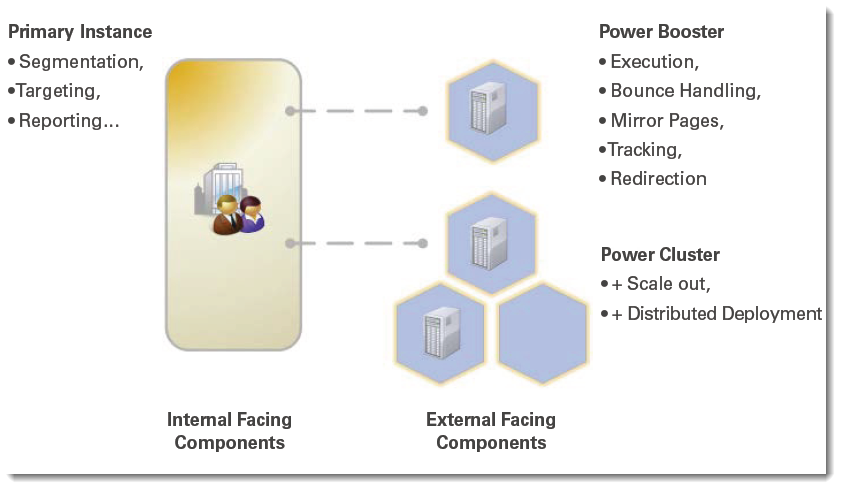

# Power Booster 和 Power Cluster{#power-booster-and-power-cluster}

## 概述 {#overview}

Adobe Campaign为您提供两组预打包的架构选项，用于标注部署维度：

* **Power Booster**

   此选项支持与主Adobe Campaign应用程序实例分离的单个附加执行实例。 专用执行实例可以远程托管，也可以由第三方托管。 实施后，电子邮件执行、跟踪、镜像页面和退回消息的处理与中央应用程序功能无关。

* **电源群集**

   此选项支持相对于给定应用程序从主Adobe Campaign应用程序实例分离出的2到N个集群执行实例。 群集可以远程托管、在分布式部署中托管，也可以由第三方托管。 除了流程隔离的好处之外，Adobe Campaign电源群集选项还支持使用商品化硬件的冗余和横向扩展策略，以简化SLA或性能的演变。

## 符合条件的应用程序 {#eligible-applications}

Power Booster和Power Cluster选项可供以下应用程序使用：

* 营销活动
* 投放
* 消息中心

## 体系结构建议矩阵 {#matrix-of-architectural-recommendations}

<table> 
 <tbody> 
  <tr> 
   <td> </td> 
   <td> <strong>标准架构</strong>  </td> 
   <td> <strong>Power Booster</strong>  </td> 
   <td> <strong>电源群集</strong>  </td> 
  </tr> 
  <tr> 
   <td> 电子邮件营销活动和出站交互  </td> 
   <td> 每月最多可发送约3000万封电子邮件  </td> 
   <td> 每月发送3千到1亿封电子邮件  </td> 
   <td> 每月超过1亿封电子邮件  </td> 
  </tr> 
  <tr> 
   <td> 事务性消息  </td> 
   <td> 每执行服务器每小时50,000  </td> 
   <td> 每执行服务器每小时50,000  </td> 
   <td> 每执行服务器每小时50,000  </td> 
  </tr> 
  <tr> 
   <td> 可用性  </td> 
   <td> 主数据库的  </td> 
   <td> 执行实例的维护窗口和停机时间除外，全天候  </td> 
   <td> 24/7/365可能提供服务  </td> 
  </tr> 
  <tr> 
   <td> 安全性  </td> 
   <td> 可以从公共Internet访问数据集  </td> 
   <td> 数据集市与面向互联网的前端组件隔离开来  </td> 
   <td> 数据集市与面向互联网的前端组件隔离开来  </td> 
  </tr> 
  <tr> 
   <td> 部署模板  </td> 
   <td> 全部位于一个站点上（可以在内部部署或在云中）  </td> 
   <td> 可在云中执行的内部部署营销  </td> 
   <td> 可在云中执行的内部部署；可在不同地理位置执行  </td> 
  </tr> 
 </tbody> 
</table>

## 推荐 {#recommendations}

* 执行实例必须专用于服务。 您无法为尚未订阅的服务安装包。 例如，如果您订阅 **Power Booster** 的选项 **消息中心** 服务，您只能安装 **[!UICONTROL Execution of transactional messages]** 专用执行实例上的包。 请核实您的许可协议。
* 由于专用实例（或集群）是Adobe Campaign实例，因此建议案与主实例的建议案相同。 有关更多信息，请参阅 [本文档](../../production/using/foreword.md).
* 要从数据库/硬件组件角度正确配置实例，请联系Adobe Campaign专业服务。
