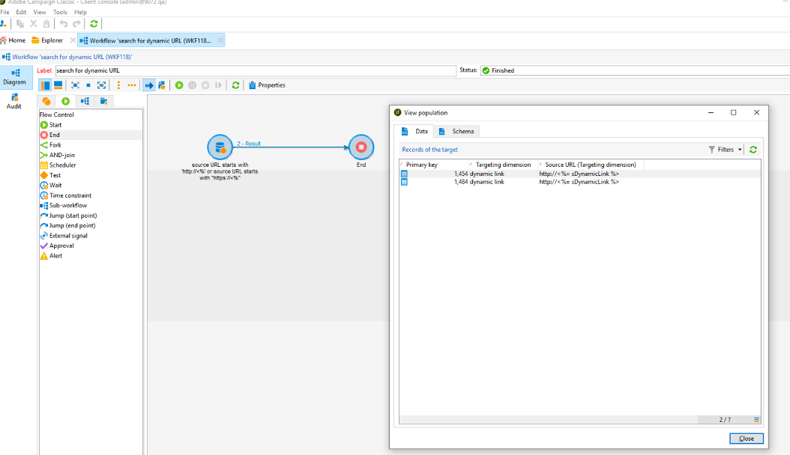

# 隐私 {#privacy}


## 隐私请求

Adobe Campaign 提供一套工具，可帮助您确保符合《欧盟通用数据保护条例》(GDPR) 和《加州消费者隐私法案》(CCPA) 的隐私政策。

请参阅 [本页](../../platform/using/privacy-management.md) 有关隐私管理概念及Adobe Campaign中实施步骤的一般信息。 您还可以找到最佳实践以及用户流程和角色的概述。

## URL个性化 {#url-personalization}

在向内容添加个性化链接时，应始终避免在URL的主机名部分进行任何个性化，以避免潜在的安全漏洞。 以下示例绝不应用于所有URL属性&lt;`a href="">` 或 ``:

* `<%= url >`
* `https://<%= url >`
* `https://<%= domain >/path`
* `https://<%= sub-domain >.domain.tld/path`
* `https://sub.domain<%= main domain %>/path`

### 推荐

要验证并确保您未使用上面的代码，请通过 [Campaign通用查询编辑器](../../platform/using/steps-to-create-a-query.md) 或在 [查询活动](../../workflow/using/query.md).

示例:

1. 创建工作流并添加 **查询** 活动。 [了解详情](../../workflow/using/query.md)。

1. 打开 **查询** 活动并在 `nmsTrackingUrl` 表如下：

   `source URL starts with http://<% or source URL starts with https://<%`

1. 运行工作流并检查是否存在结果。

1. 如果是，请打开输出过渡以查看URL列表。

   


### URL签名

为了提高安全性，引入了用于跟踪电子邮件中链接的签名机制。 从内部版本19.1.4(9032@3a9dc9c)和20.2开始，该功能可用。默认情况下，此功能处于启用状态。

>[!NOTE]
>
>单击格式错误的签名URL时，会返回以下错误： `Requested URL '…' was not found.`

此外，您还可以使用增强功能来禁用在以前的内部版本中生成的URL。 此功能默认处于禁用状态。 您可以联系 [客户关怀](https://helpx.adobe.com/cn/enterprise/admin-guide.html/enterprise/using/support-for-experience-cloud.ug.html) 启用此功能。

如果您在19.1.4内部版本上运行，则可能会遇到使用跟踪链接的推送通知投放问题，或使用锚点标记的投放问题。 如果是，我们建议您禁用URL签名。

作为Campaign托管客户、托管Cloud Services或混合客户，您必须联系 [客户关怀](https://helpx.adobe.com/cn/enterprise/using/support-for-experience-cloud.html) 禁用URL签名。

如果您在混合架构中运行Campaign，则在启用URL签名之前，请确保已按如下方式升级托管的中间源实例：

* 首先是内部部署营销实例
* 然后，升级到与内部部署营销实例相同的版本，或升级到略高的版本

否则，可能会出现以下某些问题：

* 在升级中间源实例之前，将通过此实例发送不带签名的URL。
* 升级中间源实例并在这两个实例上启用URL签名后，之前未经签名而发送的URL将被拒绝。 原因是营销实例提供的跟踪文件请求了签名。

要禁用在以前的内部版本中生成的URL，请同时在所有Campaign服务器上执行以下步骤：

1. 在服务器配置文件(`serverConf.xml`)，请更改 **blockRedirectForUnsignedTrackingLink** 选项 **true**.
1. 重新启动 `nlserver` 服务。
1. 在 `tracking` 服务器，重新启动 `web` 服务器（Debian上的apache2、CentOS/RedHat上的httpd、Windows上的IIS）。

要启用URL签名，请同时在所有Campaign服务器上执行以下步骤：

1. 在服务器配置文件(`serverConf.xml`)，更改 **signEmailLinks** 选项，到 **true**.
1. 重新启动 **nlserver** 服务。
1. 在 `tracking` 服务器，重新启动 `web` 服务器（Debian上的apache2、CentOS/RedHat上的httpd、Windows上的IIS）。

## 数据限制

您必须确保经过身份验证的低权限用户无法访问加密密码。 要实现此目的，请仅限制对密码字段或整个实体的访问（需要内部版本>= 8770）。

此限制允许您删除密码字段，但允许所有用户从界面访问外部帐户。 [了解详情](../../configuration/using/restricting-pii-view.md)。

要执行此操作，请执行以下步骤：

1. 浏览到 **[!UICONTROL Administration]** > **[!UICONTROL Configuration]** > **[!UICONTROL Data schemas]** Campaign资源管理器的文件夹。

1. 创建数据架构，作为 **[!UICONTROL Extension of a schema]**.

   

1. 选择 **[!UICONTROL External Account]** (extAccount)。

1. 在最后一个向导屏幕中，编辑新的“srcSchema”以限制对所有密码字段的访问：

   您可以将主元素(`<element name="extAccount" ... >`):

   ```sql
   <element name="extAccount">
       <attribute accessibleIf="$(loginId) = 0 or $(login) = 'admin'" name="password"/>
       <attribute accessibleIf="$(loginId) = 0 or $(login) = 'admin'" name="clientSecret"/>
   
       <element name="s3Account">
           <attribute accessibleIf="$(loginId) = 0 or $(login) = 'admin'" name="awsSecret"/>
       </element>
       <element name="wapPush">
           <attribute accessibleIf="$(loginId) = 0 or $(login) = 'admin'" name="password"/>
           <attribute accessibleIf="$(loginId) = 0 or $(login) = 'admin'" name="clientSecret"/>
       </element>
       <element name="mms">
           <attribute accessibleIf="$(loginId) = 0 or $(login) = 'admin'" name="password"/>
           <attribute accessibleIf="$(loginId) = 0 or $(login) = 'admin'" name="clientSecret"/>
       </element>
   </element>
   ```

   因此，扩展的srcSchema可能如下所示：

   ```sql
   <srcSchema _cs="External Accounts (cus)" created="2017-05-12 07:53:49.691Z" createdBy-id="0"
               desc="Definition of external accounts (Email, SMS...) used by the modules"
               entitySchema="xtk:srcSchema" extendedSchema="nms:extAccount" img="" label="External Accounts"
               labelSingular="External account" lastModified="2017-05-12 08:33:49.365Z"
               mappingType="sql" md5="E9BB0CD6A4375F500027C86EA854E101" modifiedBy-id="0"
               name="extAccount" namespace="cus" xtkschema="xtk:srcSchema">
       <createdBy _cs="Administrator (admin)"/>
       <modifiedBy _cs="Administrator (admin)"/>
       <element name="extAccount">
           <attribute accessibleIf="$(loginId) = 0 or $(login) = 'admin'" name="password"/>
           <attribute accessibleIf="$(loginId) = 0 or $(login) = 'admin'" name="clientSecret"/>
   
           <element name="s3Account">
               <attribute accessibleIf="$(loginId) = 0 or $(login) = 'admin'" name="awsSecret"/>
           </element>
           <element name="wapPush">
               <attribute accessibleIf="$(loginId) = 0 or $(login) = 'admin'" name="password"/>
               <attribute accessibleIf="$(loginId) = 0 or $(login) = 'admin'" name="clientSecret"/>
           </element>
           <element name="mms">
               <attribute accessibleIf="$(loginId) = 0 or $(login) = 'admin'" name="password"/>
               <attribute accessibleIf="$(loginId) = 0 or $(login) = 'admin'" name="clientSecret"/>
           </element>
       </element>
   </srcSchema>    
   ```

   >[!NOTE]
   >
   >您可以将 `$(loginId) = 0 or $(login) = 'admin'` with `hasNamedRight('admin')` 以允许所有具有管理员权限的用户查看这些密码。

## Protect页面与PI

我们强烈建议内部部署客户保护可能包含个人信息(PI)的页面，如镜像页面、Web应用程序等。

此过程的目标是防止这些页面被编入索引，从而避免潜在的安全风险。 以下是一些有用的文章：

* [https://developers.google.com/search/reference/robots_txt](https://developers.google.com/search/reference/robots_txt)
* [https://developers.google.com/search/reference/robots_meta_tag](https://developers.google.com/search/reference/robots_meta_tag)

要保护您的页面，请执行以下步骤：

1. 添加 `robots.txt` 文件(位于Web服务器的根目录（Apache或IIS）中)。 以下是文件的内容：

   ```sql
   # Make changes for all web spiders
   User-agent:
   *Disallow: /
   ```

   对于IIS，请参阅 [本页](https://docs.microsoft.com/en-us/iis/extensions/iis-search-engine-optimization-toolkit/managing-robotstxt-and-sitemap-files).

   对于Apache，可以将文件放置在 **/var/www/robots.txt** (Debian)。

1. 有时添加 **robots.txt** 文件在安全性方面不够。 例如，如果其他网站包含指向您页面的链接，则该链接可能会显示在搜索结果中。

   除 **robots.txt** 文件，建议添加 **X-Robots-Tag** 标题。 您可以在Apache或IIS中，并在 **serverConf.xml** 配置文件。

   有关更多信息，请参阅 [本文](https://developers.google.com/search/reference/robots_meta_tag).
