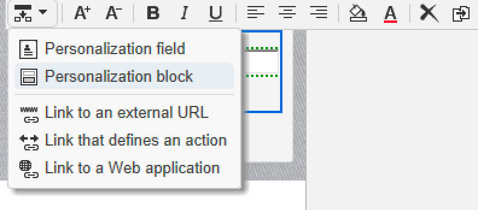

# 脚本和编码准则 {#scripting-coding-guidelines}


## 脚本

有关更多详细信息，请参阅 [Campaign JSAPI文档](https://experienceleague.adobe.com/developer/campaign-api/api/index.html?lang=zh-Hans).

如果您使用工作流、Web应用程序和jssp编写脚本，请遵循以下最佳实践：

* 尽量避免使用SQL语句。

* 如果需要，请使用参数化（prepare语句）函数而不是字符串连接。

  不当做法：

  ```
  sqlGetInt( "select iRecipientId from NmsRecipient where sEmail ='" + request.getParameter('email') +  "'  limit 1" )
  ```

  良好做法：

  ```
  sqlGetInt( "select iRecipientId from NmsRecipient where sEmail = $(sz) limit 1", request.getParameter('email'));
  ```

  >[!IMPORTANT]
  >
  >sqlSelect不支持此功能，因此您必须使用DBEngine类的查询函数：

  ```
  var cnx = application.getConnection()
  var stmt = cnx.query("SELECT sFirstName, sLastName FROM NmsRecipient where sEmail = $(sz)", request.getParameter('email'))
  for each(var row in stmt) logInfo(row[0] + " : " + row[1])
  cnx.dispose()
  ```

列入允许列表要避免SQL注入，必须将SQL函数添加到要在Adobe Campaign中使用的。 将它们添加到允许列表后，您的操作员可在表达式编辑器中看到它们。 请参见[此页面](../../configuration/using/adding-additional-sql-functions.md)。

>[!IMPORTANT]
>
>如果您使用的版本低于8140，则 **XtkPassUnknownSQLFunctionsToRDBMS** 选项可能设置为“1”。 如果要保护数据库，请删除此选项（或将其设置为“0”）。

如果您使用用户输入在查询或SQL语句中构建过滤器，则始终必须转义它们(请参阅 [Campaign JSAPI文档](https://experienceleague.adobe.com/developer/campaign-api/api/index.html?lang=zh-Hans)  — 数据保护：转义功能)。 这些函数包括：

* NL.XML.escape(data)
* NL.SQL.escape(data)
* NL.JS.escape(data)
* NL.XML.escapeAttribute(data)

## 保护您的新数据模型

### 文件夹库

请参阅以下页面：

* [文件夹访问属性](../../platform/using/access-management.md)
* [链接的文件夹](../../configuration/using/configuration.md#linked-folder)

### 已命名权限

除了基于文件夹的安全模型之外，您还可以使用已命名权限来限制操作员操作：

* 您可以添加一些系统筛选器(sysFilter)，以防止读取/写入数据(请参阅 [此页面](../../configuration/using/filtering-schemas.md))。

  ```
  <sysFilter name="writeAccess">    
      <condition enabledIf="hasNamedRight('myNewRole')=false" expr="FALSE"/>  
  </sysFilter>
  ```

* 您还可以保护架构中定义的某些操作（SOAP方法）。 只需将具有相应命名权限的access属性设置为值即可。

  ```
  <method name="grantVIPAccess" access="myNewRole">
      <parameters>
  ...
      </parameters>
  </method>
  ```

  有关详细信息，请参见[此页面](../../configuration/using/implementing-soap-methods.md)。

>[!IMPORTANT]
>
>您可以在导航树的命令节点中使用已命名权限。 它提供了更好的用户体验，但不提供任何保护（仅使用客户端隐藏/禁用它们）。 您必须使用access属性。

### 溢出表

如果您需要根据操作员的访问级别保护机密数据（模式的一部分），请勿在表单定义（enabledIf/visibleIf条件）中隐藏这些数据。

整个实体由屏幕加载，您还可以在列定义中显示它们。 为此，必须创建一个溢出表。 参考 [此页面](../../configuration/using/examples-of-schemas-edition.md#overflow-table).

## 在Web应用程序中添加captcha

好的做法是在公共登陆页面/订阅页面中添加验证码。 不幸的是，在DCE（数字内容编辑器）页面中添加验证码并不容易。 我们将向您说明如何添加v5验证码或Google reCAPTCHA。

在DCE中添加验证码的常规方法是创建个性化块，以轻松地将其包含在页面内容中。 您必须添加 **脚本** 活动和 **测试**.

### 个性化块

1. 转到 **[!UICONTROL Resources]** > **[!UICONTROL Campaign Management]** > **[!UICONTROL Personalization blocks]** 并创建一个新实例。

1. 使用 **[!UICONTROL Web application]** 内容类型和检查 **[!UICONTROL Visible in the customization menus]**.

   有关详细信息，请参见[此页面](../../delivery/using/personalization-blocks.md)。

   以下是 **营销活动验证码**：

   ```javascript
   <%
   var captchaID = CaptchaIDGen();
   %>
   &width=200&height=50&minWordSize=8&maxWordSize=8"/>
   <input id="captchaValue" name="captchaValue" <%= String(ctx.vars.captchaValid) === "false" ? class="ui-state-error" : "" %>>
   <input type="hidden" name="captchaID" value="<%=captchaID%>"/>
   <%
   if( serverForm.isInputErroneous("captchaValue") ) {
   %>
   <script type="text/javascript"> 
   $("#captchaValue").addClass("ui-state-error")
   </script>
   <%
   }
   %>
   ```

   * 第1行至第6行生成所有需要的输入。
   * 第7行到结束句柄错误。
   * 第4行允许您更改验证码灰框大小（宽度/高度）和生成的单词的长度(minWordSize/maxWordSize)。
   * 在使用Google reCAPTCHA之前，您必须在Google上注册并创建一个新的reCAPTCHA站点。

     `<div class="g-recaptcha" data-sitekey="YOUR_SITE_KEY"></div>`

   您应该能够禁用“验证”按钮，但由于我们没有任何标准按钮/链接，因此最好在HTML中禁用该按钮/链接。 要了解如何执行此操作，请参阅 [此页面](https://developers.google.com/recaptcha/).

### 更新Web应用程序

1. 访问Web应用程序的属性以添加名为的布尔变量 **captchavalid**.

   

1. 在最后一页和 **[!UICONTROL Storage]** 活动，添加 **[!UICONTROL Script]** 和 **[!UICONTROL Test]**.

   插入分支 **[!UICONTROL True]** 到 **[!UICONTROL Storage]** 另一个将带有验证码。

   

1. 使用编辑分支条件True `"[vars/captchaValid]"` 等于True。

   

1. 编辑 **[!UICONTROL Script]** 活动。 内容将取决于所选的验证码引擎。

1. 最后，您可以在页面中添加个性化块：请参阅 [此页面](../../web/using/editing-content.md).

   

   

>[!IMPORTANT]
>
>要实现reCAPTCHA集成，您必须在HTML(位于 `<head>...</head>`)：
>
>`<script src="https://www.google.com/recaptcha/api.js" async defer></script>`

### 营销活动验证码

```javascript
var captchaID = request.getParameter("captchaID");
var captchaValue = request.getParameter("captchaValue");
  
if( !CaptchaValidate(captchaID, captchaValue) ) {
  serverForm.logInputError("captchaValue",
                           "The characters you typed for the captcha must match the image ones.",
                           "captchaValue")
  ctx.vars.captchaValid = false
}
else
  ctx.vars.captchaValid = true
```

第6行：您可以输入任何类型的错误消息。

### Google recaptcha

请参阅 [官方文档](https://developers.google.com/recaptcha/docs/verify).

```javascript
ctx.vars.captchaValid = false
var gReCaptchaResponse = request.getParameter("g-recaptcha-response");
  
// Call reCaptcha API to validate it
var req = new HttpClientRequest("https://www.google.com/recaptcha/api/siteverify")
req.method = "POST"
req.header["Content-Type"] = "application/x-www-form-urlencoded"
req.body = "secret=YOUR_SECRET_HERE&response=" + encodeURIComponent(gReCaptchaResponse)
req.execute()
var response = req.response
if( response.code == 200 ) {
  captchaRes = JSON.parse(response.body.toString(response.codePage));
  ctx.vars.captchaValid = captchaRes.success
}
  
if( ctx.vars.captchaValid == false ) {
  serverForm.logInputError("reCaptcha",
                           "Please validate the captcha",
                           "reCaptcha")
  logInfo("reCaptcha not validated")
}
```

要使用JSON.parse，您必须在webApp中包含“shared/json2.js”：


列入允许列表自内部版本8797开始，要使用验证API URL，您必须通过在urlPermission节点中添加它来将其添加到serverConf文件中的：

`<url dnsSuffix="www.google.com" urlRegEx="https://www.google.com/recaptcha/api/siteverify"/>`
