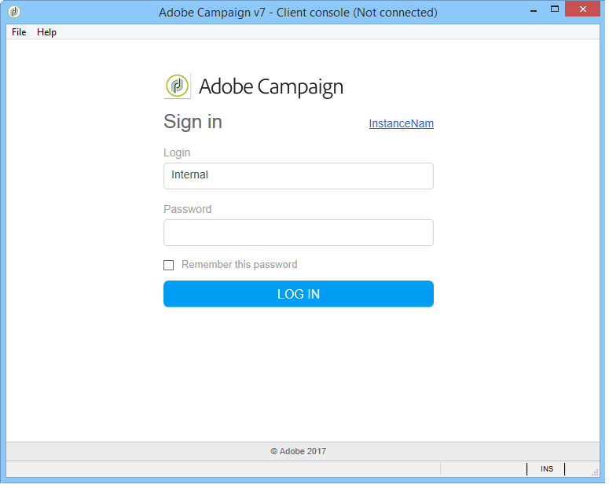
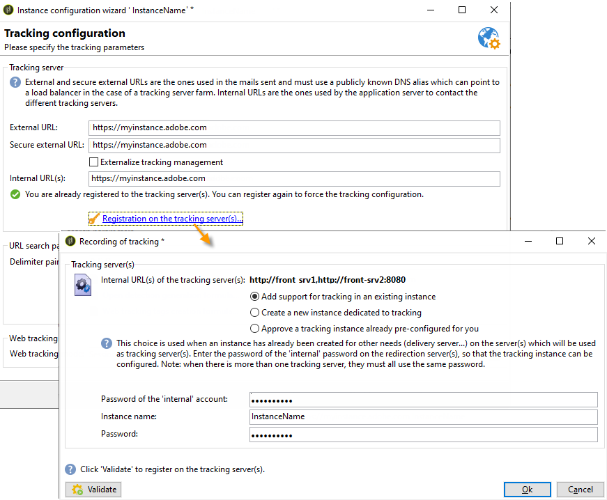

# 独立部署{#standalone-deployment}


此配置包含同一台计算机上的所有组件：

* 应用程序进程(Web)，
* 投放流程(mta)、
* 重定向流程（跟踪）、
* 工作流进程和计划任务(wfserver)、
* 退回邮件流程(inMail)、
* 统计过程(stat)。

进程之间的整体通信按照以下模式进行：


此类配置可在管理少于100,000个收件人的列表时运行，例如，可通过以下软件层运行：

* Linux，
* Apache
* PostgreSQL，
* Qmail。

随着卷的增长，此体系结构的一种变体将数据库服务器移动到另一台计算机，以获得更好的性能。

>[!NOTE]
>
>如果现有数据库服务器具有足够的资源，也可以使用该数据库服务器。

## 功能 {#features}

### 优点 {#advantages}

* 完全独立且配置成本低（如果使用下面列出的开源软件，则不需要收费许可证）。
* 简化了安装和网络配置。

### 缺点 {#disadvantages}

* 发生事故时的关键计算机。
* 广播邮件时带宽有限（根据我们的经验，大约每小时几万封邮件）。
* 播放时应用程序速度可能会减慢。
* 应用程序服务器必须从外部可用（例如，当它位于DMZ中时），因为它托管重定向服务器。

## 安装和配置步骤 {#installation-and-configuration-steps}

### 先决条件 {#prerequisites}

* JDK，
* Web服务器(IIS、Apache)、
* 访问数据库服务器，
* 通过POP3可访问的退回邮箱，
* 创建两个DNS别名：

   * 第一张公开给公众使用公共IP进行跟踪和指向计算机；
   * 向内部用户公开的第二个别名用于控制台访问并指向同一台计算机。

* 防火墙配置为打开SMTP (25)、DNS (53)、HTTP (80)、HTTPS (443)、SQL (1521(Oracle)、5432(PostgreSQL)等) 端口。 有关详细信息，请参阅[网络配置](../../installation/using/network-configuration.md)。

在以下示例中，实例的参数包括：

* 实例的名称： **演示**
* DNS掩码： **console.campaign.net&#42;** （仅适用于客户端控制台连接和报表）
* 数据库： **campaign：demo@dbsrv**

### 安装和配置（单机） {#installing-and-configuring--single-machine-}

应用以下步骤：

1. 请按照Adobe Campaign服务器的安装过程操作：**nlserver** package（在Linux上）或&#x200B;**setup.exe**（在Windows上）。

   有关详细信息，请参阅[在Linux中安装Campaign的先决条件](../../installation/using/prerequisites-of-campaign-installation-in-linux.md) (Linux)和[在Windows中安装Campaign的先决条件](../../installation/using/prerequisites-of-campaign-installation-in-windows.md) (Windows)。

1. 安装Adobe Campaign服务器后，使用命令&#x200B;**nlserver web -tomcat**&#x200B;启动应用程序服务器(web)（通过Web模块，您可以在侦听端口8080的独立Web服务器模式下启动Tomcat），并确保Tomcat正确启动：

   ```sql
   12:08:18 >   Application server for Adobe Campaign Classic (7.X YY.R build XXX@SHA1) of DD/MM/YYYY
   12:08:18 >   Starting Web server module (pid=28505, tid=-1225184768)...
   12:08:18 >   Tomcat started
   12:08:18 >   Server started
   ```

   >[!NOTE]
   >
   >首次执行Web模块时，会在安装文件夹下的&#x200B;**conf**&#x200B;目录中创建&#x200B;**config-default.xml**&#x200B;和&#x200B;**serverConf.xml**&#x200B;文件。 **serverConf.xml**&#x200B;中的所有可用参数都列在此[部分](../../installation/using/the-server-configuration-file.md)中。

   按&#x200B;**Ctrl+C**&#x200B;停止服务器。

   有关更多信息，请参阅以下章节：

   * 对于Linux： [服务器的首次启动](../../installation/using/installing-packages-with-linux.md#first-start-up-of-the-server)，
   * 对于Windows： [服务器的首次启动](../../installation/using/installing-the-server.md#first-start-up-of-the-server)。

1. 使用以下命令更改&#x200B;**internal**&#x200B;密码：

   ```
   nlserver config -internalpassword
   ```

   如需详细信息，请参阅[此小节](../../installation/using/configuring-campaign-server.md#internal-identifier)。

1. 创建具有DNS掩码的&#x200B;**demo**&#x200B;实例，以便跟踪（在本例中为&#x200B;**tracking.campaign.net**）和访问客户端控制台（在本例中为&#x200B;**console.campaign.net**）。 可通过两种方式来做到这一点：

   * 通过控制台创建实例：

     

     有关详细信息，请参阅[创建实例并登录](../../installation/using/creating-an-instance-and-logging-on.md)。

     或者

   * 使用命令行创建实例：

     ```
     nlserver config -addinstance:demo/tracking.campaign.net*,console.campaign.net*
     ```

     有关详细信息，请参阅[创建实例](../../installation/using/command-lines.md#creating-an-instance)。

1. 编辑&#x200B;**config-demo.xml**&#x200B;文件（在上一步中创建的&#x200B;**config-default.xml**&#x200B;旁边），并确保启用了&#x200B;**mta**（投放）、**wfserver**（工作流）、**inMail**（退回邮件）和&#x200B;**stat**（统计数据）进程。 然后配置统计服务器的地址：

   ```
   <?xml version='1.0'?>
   <serverconf>  
     <shared>    
       <!-- add lang="eng" to dataStore to force English for the instance -->    
       <dataStore hosts="tracking.campaign.net*,console.campaign.net*">      
         <mapping logical="*" physical="default"/>    
       </dataStore>  </shared>  
       <mta autoStart="true" statServerAddress="localhost"/>
       <wfserver autoStart="true"/>  
       <inMail autoStart="true"/>  
       <sms autoStart="false"/>  
       <listProtect autoStart="false"/>
   </serverconf>
   ```

   如需详细信息，请参阅[此小节](../../installation/using/configuring-campaign-server.md#enabling-processes)。

1. 编辑&#x200B;**serverConf.xml**&#x200B;文件并指定投放域，然后指定MTA模块用于响应MX类型DNS查询的DNS服务器的IP（或主机）地址。

   ```
   <dnsConfig localDomain="campaign.com" nameServers="192.0.0.1, 192.0.0.2"/>
   ```

   >[!NOTE]
   >
   >**nameServers**&#x200B;参数仅在Windows中使用。

   有关详细信息，请参阅[Campaign服务器配置](../../installation/using/configuring-campaign-server.md)。

1. 将客户端控制台安装程序&#x200B;**setup-client-7.XXX.exe**&#x200B;复制到&#x200B;**/datakit/nl/eng/jsp**&#x200B;文件夹。 [了解详情](../../installation/using/client-console-availability-for-windows.md)。

1. 请按照以下部分中描述的Web服务器集成过程(IIS、Apache)进行操作：

   * 对于Linux： [集成到Linux的Web服务器](../../installation/using/integration-into-a-web-server-for-linux.md)
   * 对于Windows： [集成到Windows的Web服务器](../../installation/using/integration-into-a-web-server-for-windows.md)

1. 启动网站并使用URL测试重定向： https://tracking.campaign.net/r/test。

   浏览器必须显示以下消息：

   ```
   <redir status="OK" date="AAAA/MM/JJ HH:MM:SS" build="XXXX" host="tracking.campaign.net" localHost="localhost"/>
   ```

   有关更多信息，请参阅以下章节：

   * 对于Linux： [正在启动Web服务器并测试配置](../../installation/using/integration-into-a-web-server-for-linux.md#launching-the-web-server-and-testing-the-configuration)
   * 对于Windows： [正在启动Web服务器并测试配置](../../installation/using/integration-into-a-web-server-for-windows.md#launching-the-web-server-and-testing-the-configuration)

1. 启动Adobe Campaign服务器(在Windows中为&#x200B;**net start nlserver6**，在Linux中为&#x200B;**/etc/init.d/nlserver6 start**)，然后再次运行命令&#x200B;**nlserver pdump**&#x200B;以检查是否存在所有启用的模块。

   >[!NOTE]
   >
   >从20.1开始，我们建议改用以下命令（对于Linux）： **systemctl start nlserver**

   ```sql
   12:09:54 >   Application server for Adobe Campaign Classic (7.X YY.R build XXX@SHA1) of DD/MM/YYYY
   syslogd@default (7611) - 9.2 MB
   stat@demo (5988) - 1.5 MB
   inMail@demo (7830) - 11.9 MB
   watchdog (27369) - 3.1 MB
   mta@demo (7831) - 15.6 MB
   wfserver@demo (7832) - 11.5 MB
   web@default (28671) - 40.5 MB
   ```

   此命令还可让您知道计算机上安装的Adobe Campaign服务器的版本号和内部版本号。

1. 使用URL测试&#x200B;**nlserver web**&#x200B;模块： https://console.campaign.net/nl/jsp/logon.jsp

   此URL允许您访问客户端设置程序的下载页面。

   在到达访问控制页面时，输入&#x200B;**内部**&#x200B;登录名和相关密码。 [了解详情](../../installation/using/client-console-availability-for-windows.md)。

   

1. 启动Adobe Campaign客户端控制台（从上一下载页面或直接在服务器上针对Windows安装启动），将服务器连接URL设置为https://console.campaign.net并使用&#x200B;**内部**&#x200B;登录进行连接。

   请参阅[此页面](../../installation/using/creating-an-instance-and-logging-on.md)和[此部分](../../installation/using/configuring-campaign-server.md#internal-identifier)。

   首次登录时将显示数据库创建向导：

   

   按照向导中的步骤创建与连接实例关联的数据库。

   有关详细信息，请参阅[创建和配置数据库](../../installation/using/creating-and-configuring-the-database.md)。

   创建数据库后，注销。

1. 使用不带密码的&#x200B;**管理员**&#x200B;登录重新登录到客户端控制台，然后启动部署向导（**[!UICONTROL Tools > Advanced]**&#x200B;菜单）以完成配置实例。

   有关详细信息，请参阅[部署实例](../../installation/using/deploying-an-instance.md)。

   要设置的主要参数如下：

   * 电子邮件投放：发件人和回复地址以及退回邮件的错误邮箱。
   * 跟踪：填充用于重定向的外部URL和内部URL，在跟踪服务器&#x200B;**上单击**&#x200B;注册，然后在跟踪服务器的&#x200B;**demo**&#x200B;实例上验证它。

     有关详细信息，请参阅[跟踪配置](../../installation/using/deploying-an-instance.md#tracking-configuration)。

     

     由于Adobe Campaign服务器同时用作应用程序服务器和重定向服务器，因此用于收集跟踪日志和传输URL的内部URL是与Tomcat的直接内部连接(https://localhost:8080)。

   * 退回管理：输入用于处理退回邮件的参数（不考虑&#x200B;**未处理的退回邮件**&#x200B;部分）。
   * 访问自：为报表、Web窗体以及镜像页面提供两个URL。

     
