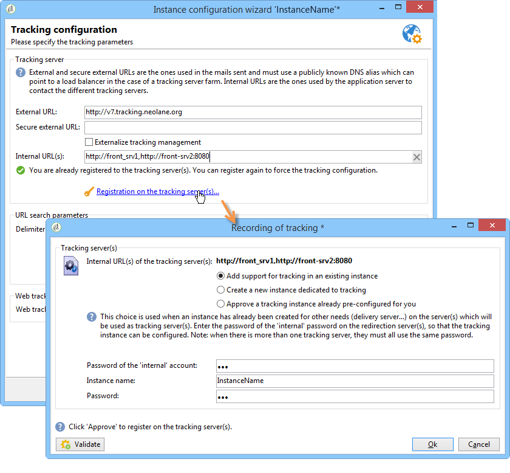

# 标准部署{#standard-deployment}


对于此配置，需要三台计算机：

* LAN内面向最终用户的应用程序服务器（准备营销活动、报告等），
* DMZ中的两个前端服务器位于负载平衡器后面。

DMZ中的两台服务器处理跟踪、镜像页面和交付，并且是冗余服务器，可实现高可用性。

LAN中的应用程序服务器为最终用户提供服务，并执行所有循环过程（工作流引擎）。 因此，当前端服务器上达到峰值负载时，应用程序用户不受影响。

数据库服务器可以托管在与这三台服务器不同的计算机上。 否则，只要Adobe Campaign（Linux或Windows）支持操作系统，应用程序服务器和数据库服务器就会在LAN内共享同一台计算机。

服务器和进程之间的一般通信按照以下模式进行：


这种类型的配置可以处理大量收件人（500,000到1,000,000），因为数据库服务器（和可用带宽）是主要限制因素。

## 功能 {#features}

### 优势 {#advantages}

* 故障切换功能：在出现硬件问题时将进程切换到另一台计算机的能力。
* 整体性能更好，因为MTA和重定向功能可以部署在负载平衡器后的两台计算机上。 利用两个活动的MTA和足够的带宽，可以达到每小时100,000封邮件的广播速率。

## 安装和配置步骤 {#installation-and-configuration-steps}

### 先决条件 {#prerequisites}

* 三台电脑上都有JDK
* Web服务器(IIS、Apache)位于两个前端，
* 访问所有三台计算机上的数据库服务器，
* 通过POP3可访问的退回邮箱，
* 创建两个DNS别名：

   * 第一类是向公众开放，用于跟踪和指向虚拟IP地址(VIP)上的负载平衡器，然后将其分发到两个前端服务器，
   * 第二个通过控制台向内部用户公开以供访问，并指向同一应用程序服务器。

* 配置为打开STMP (25)、DNS (53)、HTTP (80)、HTTPS (443)、SQL (1521(Oracle)、5432(PostgreSQL)等的防火墙 端口。 有关更多信息，请参阅一节 [数据库访问](../../installation/using/network-configuration.md#database-access).

### 安装应用程序服务器 {#installing-the-application-server}

按照从Adobe Campaign应用程序服务器安装独立实例到创建数据库的步骤操作（步骤12）。 请参阅 [安装和配置（单机）](../../installation/using/standalone-deployment.md#installing-and-configuring--single-machine-).

由于计算机不是跟踪服务器，因此不要考虑与Web服务器的集成。

在以下示例中，实例的参数包括：

* 实例的名称： **演示**
* DNS掩码： **console.campaign.net&#42;** （仅适用于客户端控制台连接和报表）
* 语言：英语
* 数据库： **campaign：demo@dbsrv**

### 安装两个前端服务器 {#installing-the-two-frontal-servers}

两台计算机上的安装和配置过程相同。

步骤如下：

1. 安装Adobe Campaign服务器。

   有关更多信息，请参阅 [在Linux中安装Campaign的先决条件](../../installation/using/prerequisites-of-campaign-installation-in-linux.md) (Linux)和 [在Windows中安装Campaign的先决条件](../../installation/using/prerequisites-of-campaign-installation-in-windows.md) (Windows)。

1. 请按照以下部分中所述的Web服务器集成过程(IIS、Apache)进行操作：

   * 对于Linux： [集成到Linux版Web服务器](../../installation/using/integration-into-a-web-server-for-linux.md)
   * 对于Windows： [集成到Windows版Web服务器](../../installation/using/integration-into-a-web-server-for-windows.md)

1. 创建 **演示** 实例。 有两种方法可以做到这一点：

   * 通过控制台创建实例：

      

      有关更多信息，请参阅 [创建实例并登录](../../installation/using/creating-an-instance-and-logging-on.md).

      或者

   * 使用命令行创建实例：

      ```
      nlserver config -addinstance:demo/tracking.campaign.net*
      ```

      有关更多信息，请参阅 [创建实例](../../installation/using/command-lines.md#creating-an-instance).
   实例的名称与应用服务器的名称相同。

   与服务器的连接 **nlserver web** 模块（镜像页面、退订）将从负载平衡器(tracking.campaign.net)的URL中创建。

1. 更改 **内部** 与应用程序服务器相同。

   如需详细信息，请参阅[此部分](../../installation/using/configuring-campaign-server.md#internal-identifier)。

1. 将数据库链接到实例：

   ```
   nlserver config -setdblogin:PostgreSQL:campaign:demo@dbsrv -instance:demo
   ```

1. 在 **config-default.xml** 和 **config-demo.xml** 文件，启用 **Web**， **trackinglogd** 和 **mta** 模块。

   如需详细信息，请参阅[此部分](../../installation/using/configuring-campaign-server.md#enabling-processes)。

1. 编辑 **serverConf.xml** 文件和填充：

   * mta模块的DNS配置：

      ```
      <dnsConfig localDomain="campaign.com" nameServers="192.0.0.1, 192.0.0.2"/>
      ```

      >[!NOTE]
      >
      >此 **nameServer** 参数仅在Windows中使用。

      有关更多信息，请参阅 [投放设置](configure-delivery-settings.md).

   * 冗余跟踪服务器的重定向参数：

      ```
      <spareServer enabledIf="$(hostname)!='front_srv1'" id="1" url="https://front_srv1:8080"/>
      <spareServer enabledIf="$(hostname)!='front_srv2'" id="2" url="https://front_srv2:8080"/>
      ```

      有关更多信息，请参阅 [冗余跟踪](configuring-campaign-server.md#redundant-tracking).

1. 启动网站并从URL测试重定向： [https://tracking.campaign.net/r/test](https://tracking.campaign.net/r/test).

   浏览器应显示以下消息（取决于负载平衡器重定向的URL）：

   ```
   <redir status="OK" date="AAAA/MM/JJ HH:MM:SS" build="XXXX" host="tracking.campaign.net" localHost="front_srv1"/>
   ```

   或者

   ```
   <redir status="OK" date="AAAA/MM/JJ HH:MM:SS" build="XXXX" host="tracking.campaign.net" localHost="front_srv2"/>
   ```

   有关更多信息，请参阅以下章节：

   * 对于Linux： [启动Web服务器并测试配置](../../installation/using/integration-into-a-web-server-for-linux.md#launching-the-web-server-and-testing-the-configuration)
   * 对于Windows： [启动Web服务器并测试配置](../../installation/using/integration-into-a-web-server-for-windows.md#launching-the-web-server-and-testing-the-configuration)

1. 启动Adobe Campaign服务器。
1. 在Adobe Campaign控制台中，使用 **管理员** 不使用密码登录并启动部署向导。

   有关更多信息，请参阅 [部署实例](../../installation/using/deploying-an-instance.md).

   配置与跟踪模块的配置之外的独立实例相同。

1. 填充用于重定向的外部URL（负载平衡器的外部URL）和两个前端服务器的内部URL。

   有关更多信息，请参阅 [跟踪配置](../../installation/using/deploying-an-instance.md#tracking-configuration).

   

   >[!NOTE]
   >
   >我们使用之前创建的两个跟踪服务器的现有实例，并使用 **内部** 登录。
