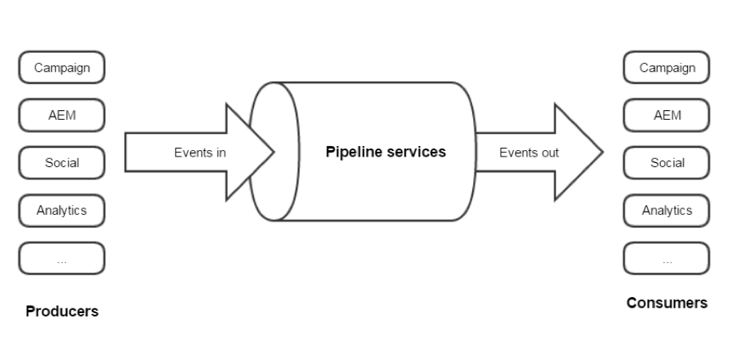

# 关于 Adobe Experience Cloud 触发器{#about-adobe-experience-triggers}

[!DNL Triggers] 是Adobe Campaign和Adobe Analytics利用管道的整合。 管道从您的网站检索用户的操作或触发器。 放弃购物车是触发器的一个示例。 触发器将以Adobe Campaign处理，以近乎实时地发送电子邮件。

[!DNL Triggers] 在用户操作后的短时间内运行营销操作。 典型响应时间不到1小时。

它允许更灵活的集成，因为配置是最小的，不涉及第三方。
它还支持大量流量，而不会影响营销活动的性能。 例如，集成每小时可以处理一百万个触发器。

## [!DNL Triggers] 体系结构 {#triggers-architecture}

### 什么是Pipeline? {#pipeline-explanation}

>[!CAUTION]
>
>只有Adobe云解决方案才能生成和消费Adobe管道服务中的事件。 Adobe外部的系统不能。

Pipeline是托管在Experience Cloud中的一个消息传递系统，它使 [用Apache Kafka](http://kafka.apache.org/)。 它是一种在解决方案之间轻松传递数据的方式。 此外，管道是消息队列而不是数据库。 生产商推动事件进入销售渠道，消费者倾听客户的心声，用事件做他们想做的事。 事件被保管几天，但不再保管。 目的是24/7倾听，立即处理事件。

### Pipeline是如何工作的？ {#how-pipeline-work}

流 [!DNL pipelined] 程始终在Adobe Campaign营销服务器上运行。 它连接到管线，检索事件并立即处理它们。

进 [!DNL pipelined] 程使用身份验证服务登录到Experience Cloud并发送私钥。 身份验证服务返回一个令牌。 在检索事件时，令牌用于进行身份验证。 [!DNL Triggers] 从REST web服务中使用简单的GET请求检索。 响应为JSON格式。 请求的参数包括触发器的名称和指示上次检索的消息的指针。 该流 [!DNL pipelined] 程会自动处理它。

## 使用Adobe Experience Cloud触发器与Adobe Campaign Classic集成

以下是一些最 [!DNL Triggers] 佳实践：

* 数 [!DNL Trigger] 据需要在活动中存储。 不应直接处理它，因为它会创建延迟。
* 应从消息中而不是从数据库中检查时间戳。
* 使用TriggerTimestamp和触发器ID删除重复。

>[!CAUTION]
>
>以下示例不是现成的。 这是各种可能实现的一个特定示例。

管道事件会自动下载。 这些事件可以使用表单进行监视。

管道事件节点未内置，需要添加，并且相关表单需要在活动中创建。 这些操作仅限专家用户。 有关此内容的详细信息，请参阅以下部分： [导航层次](../../configuration/using/about-navigation-hierarchy.md) 和 [编辑表单](../../configuration/using/editing-forms.md)。

触发器上的重复活动工作流查询，如果符合营销标准，它将开始投放。

