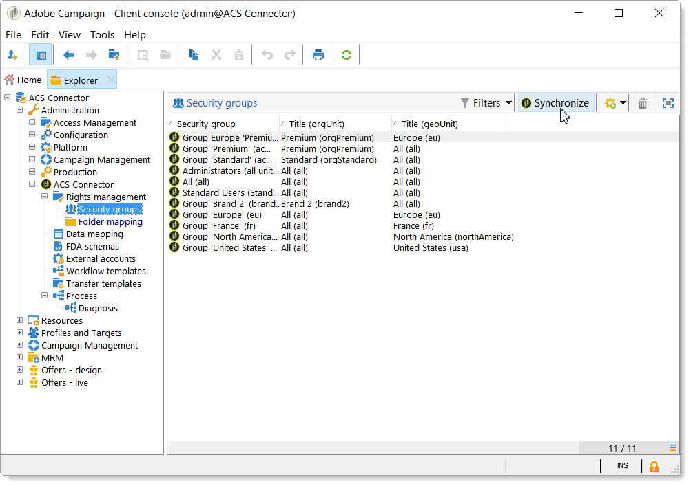
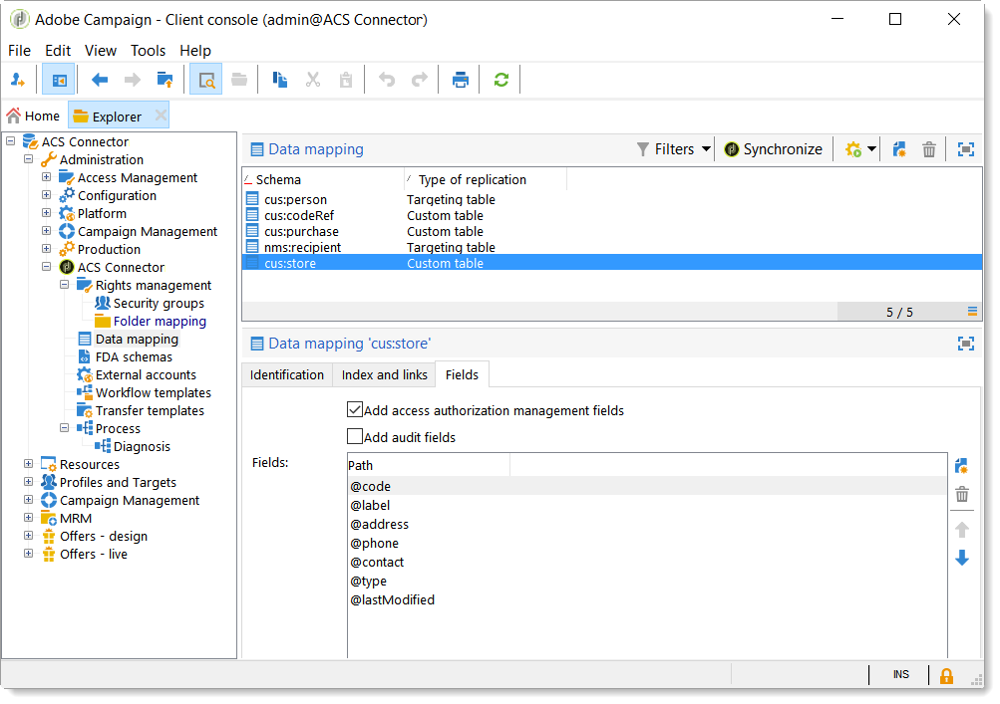

# ACS连接器原则和数据周期{#acs-connector-principles-and-data-cycle}

## 简介 {#introduction}

ACS Connector桥Adobe Campaign v7和Adobe Campaign Standard。 它是Campaign v7中的一项集成功能，可自动将数据复制到Campaign Standard，从而将两个应用程序中的最佳功能结合起来。 Campaign v7具有用于管理主营销数据库的高级工具。 Campaign v7中的数据复制允许Campaign Standard在用户友好的环境中利用丰富的数据。

借助ACS Connector，数字营销人员继续使用Campaign Standard来设计、定位和执行营销活动，而Campaign v7是专为面向数据的用户（如数据库营销人员）量身定制的。

>[!IMPORTANT]
>
>ACS Connector仅作为Adobe Campaign Prime产品的一部分提供。 有关如何授权Adobe Campaign Prime的更多信息，请联系您的客户经理。
>
>ACS Connector仅适用于托管和混合架构。 它不适用于完整的内部部署安装。
>
>要使用此功能，您必须使用Adobe ID(IMS)连接到Campaign。 请参阅[通过Adobe ID连接](../../integrations/using/about-adobe-id.md)。

本文档介绍ACS连接器功能。 以下各节提供了有关该功能如何复制数据的信息以及有关如何使用已复制配置文件的说明。

* [流程](#process):ACS Connector及数据复制管理方式概述。
* [实施](#implementation):概述如何开始使用ACS Connector，以及有关如何复制基本和高级数据的说明。
* [同步用户档案](../../integrations/using/synchronizing-profiles.md):有关如何复制用户档案以及如何使用用户档案创建投放的说明。
* [同步受众](../../integrations/using/synchronizing-audiences.md):有关如何在Campaign v7中定位收件人列表，然后将该列表复制为Campaign Standard作为受众的说明。
* [同步Web应用程序](../../integrations/using/synchronizing-web-applications.md):关于如何将Campaign v7 Web应用程序链接到Campaign Standard的说明。
* [ACS Connector故障排除](../../integrations/using/troubleshooting-the-acs-connector.md):查看常见问题的答案。

>[!NOTE]
>
>根据许可协议，ACS Connector随Campaign v7一起提供。 要使用ACS Connector，请确保您可以在Campaign v7和Campaign Standard之间切换。 如果您不确定您的版本及其包含的功能，请联系您的管理员。

## 印刷色 {#process}

### 数据复制{#data-replication}

ACS Connector会定期将以下项目从Campaign v7复制到Campaign Standard:

* **收件人**
* **订阅**
* **服务**
* **登陆页面**

默认情况下，ACS Connector的定期复制每15分钟一次。 可以根据您的需要调整定期复制的时间范围。 如果需要更改，请联系您的顾问。

收件人、订阅、服务和登陆页面的数据复制是增量复制，这意味着只有新收件人和对现有收件人的修改才会从Campaign v7复制到Campaign Standard。 但是，受众的复制在单个实例中进行。 您可以在Campaign v7中创建受众，然后将其复制一次以进行Campaign Standard。 复制是立即的，无法为常规更新配置。 有关说明，请参阅[同步受众](../../integrations/using/synchronizing-audiences.md)。

>[!NOTE]
>
>请耐心等待大型数据库的初始复制，因为它可能需要几个小时。 但是，后续复制是增量复制，而且速度要快得多。

ACS Connector会定期将以下项目从Campaign Standard复制到Campaign v7:

* **[!UICONTROL Delivery IDs]**
* **[!UICONTROL Email broad logs]**
* **[!UICONTROL Email tracking logs]**

通过复制投放ID和电子邮件日志，可从Campaign v7访问v7收件人的投放和跟踪数据的历史记录。

>[!IMPORTANT]
>
>只有电子邮件广告和跟踪日志才会从Campaign Standard复制到Campaign v7。

### 数据同步{#data-synchronization}

ACS Connector在Campaign v7和Campaign Standard之间同步隔离。

例如，已从Campaign v7复制到Campaign Standard的用户档案包含电子邮件地址。 如果Campaign Standard隔离了电子邮件地址，则在下次同步期间会将数据传递到Campaign v7。 有关隔离的更多信息，请参阅[隔离管理](../../delivery/using/understanding-quarantine-management.md)和[Campaign Standard隔离](https://experienceleague.adobe.com/docs/campaign-standard/using/testing-and-sending/monitoring-messages/understanding-quarantine-management.html)。

### 使用复制的配置文件{#using-replicated-profiles}

Campaign Standard和Campaign v7可使用复制的用户档案来定位营销活动中的工作流。

有关如何使用复制的用户档案在Campaign Standard中发送投放的说明，请参阅[同步用户档案](../../integrations/using/synchronizing-profiles.md)。 提供了在Campaign v7和Campaign Standard之间共享退订数据的其他说明。

### 限制 {#limitations}

复制的用户档案可随时进行投放，但存在一定的Campaign Standard限制。 请查看以下项目，了解如何以最佳方式管理这些项目。

* **用于Campaign Standard的只读配置文件**:复制的用户档案在Campaign Standard中为只读。但是，您可以在Campaign v7中编辑收件人，修改内容将由ACS ConnectorCampaign Standard自动更新。
* **在Campaign Standard中创建的用户档案**:ACS Connector将收件人数据从Campaign v7复制到Campaign Standard。因此，源于Campaign Standard的用户档案不会复制到Campaign v7。
* **Campaign Standard的基本收件人数据**:ACS Connector会复制适合Campaign Standard的收件人数据。它包括收件人的姓名、地址、电子邮件地址、手机号码、家庭电话号码以及其他相关联系信息。 如果Campaign v7中可用的其他收件人字段和自定义定位表对您的工作流至关重要，请与您的顾问联系。
* **导入隔离的用户档案**:可将不希望联系的用户档案列表导入Campaign v7或作为隔离用户档案Campaign Standard。应用程序之间的隔离同步中包含用户档案的状态，不会在投放中使用这些状态。
* **在Campaign Standard中取消订阅服务**:取消订阅投放的选项未从Campaign Standard同步到Campaign v7。但是，您可以配置Campaign Standard投放，以将其退订链接定向到Campaign v7。 单击退订链接的收件人的用户档案将在Campaign v7中更新，并且数据会复制到Campaign Standard。 请参阅[更改退订链接](../../integrations/using/synchronizing-profiles.md#changing-the-unsubscription-link)。
* 只有电子邮件广告和跟踪日志才会从Campaign Standard复制到Campaign v7。

### 帐单 {#billing}

您选择的用于发送投放、Campaign v7或Campaign Standard的应用程序不会对账单产生影响。 账单信息可在Campaign v7和Campaign Standard之间协调。 因此，如果您使用这两个应用程序向同一收件人发送投放内容，则该投放内容仍会计为一个活动用户档案。

## 实施 {#implementation}

ACS Connector有两种实施类型。 这两项操作始终由Adobe Campaign咨询团队执行。

>[!IMPORTANT]
>
>本节仅面向专家用户，旨在为他们提供实施过程及其主要步骤的全局视图。
>
>请勿尝试通过任何方式自行执行其中的任何实施。 它严格由Adobe Campaign顾问负责。

**基本实施**&#x200B;允许您复制收件人（即装即用字段）、服务和订阅、Web应用程序和受众。 这是从Campaign v7到Campaign Standard的单向复制。

**高级实施**&#x200B;将允许您执行更复杂的用例，例如，如果您有其他收件人字段或自定义收件人表（例如事务表）。 请参阅[高级实施](#advanced-implementation)。

### 安装软件包{#installing-the-package}

要使用该功能，需要安装&#x200B;**[!UICONTROL ACS Connector]**&#x200B;包。 这始终由Adobe技术管理员或顾问执行。

与ACS Connector相关的所有技术元素都可在资源管理器的&#x200B;**[!UICONTROL Administration > ACS Connector]**&#x200B;节点中使用。

### 技术和复制工作流{#technical-and-replication-workflows}

安装包后，**[!UICONTROL Administration > ACS Connector > Process]**&#x200B;下提供了两个技术工作流。

>[!IMPORTANT]
>
>切勿尝试修改这些工作流。 它们绝不应出错或暂停。 如果出现这种情况，请联系您的Adobe Campaign顾问。

* **[!UICONTROL `[ACS] Quarantine synchronization`]** (quarantineSync):此工作流可同步所有隔离信息。Campaign v7中的所有新隔离都将复制到Campaign Standard。 所有与Campaign Standard的新隔离都将复制到Campaign v7中。 这可确保所有排除规则在Campaign v7和Campaign Standard之间同步。
* **[!UICONTROL `[ACS] Security group synchronization`]** (securityGroupSync):此工作流用于权限转换。请参阅[权限转换](#rights-conversion)。

以下复制工作流可用作“准备使用”模板。 这些功能需要由您的Adobe Campaign顾问实施。

* **[!UICONTROL `[ACS] Profile replication`]** (newProfileReplication):此增量工作流会将收件人复制到Campaign Standard。默认情况下，它会复制所有现成的收件人字段。 请参阅[默认收件人字段](#default-recipient-fields)。
* **[!UICONTROL `[ACS] Service replication`]** (newServiceReplication):此增量工作流将复制所选服务以进行Campaign Standard。请参阅用例[同步Web应用程序](../../integrations/using/synchronizing-web-applications.md)。
* **[!UICONTROL `[ACS] Landing pages replication`]** (newLandingPageReplication):此增量工作流会复制所选的web应用程序以进行Campaign Standard。Campaign v7 Web应用程序将在Campaign Standard中显示为登陆页。 请参阅用例[同步Web应用程序](../../integrations/using/synchronizing-web-applications.md)。
* **[!UICONTROL `[ACS] New replication`]** （新复制）：此增量工作流是可用于复制自定义表的示例。请参阅[高级实施](#advanced-implementation)。
* **[!UICONTROL `[ACS] Delivery-mesage replication`]** (newDlvMsgQualification):此增量工作流将投放消息从Campaign Standard复制到Campaign v7。
* **[!UICONTROL `[ACS] Profile delivery log replication`]** (newRcpDeliveryLogReplication):此增量工作流将投放ID、电子邮件广泛日志和电子邮件跟踪日志从Campaign Standard复制到Campaign v7。它仅考虑从Campaign Standard向Campaign v7的nms:recipients表所包含的用户档案发送的投放。
* **[!UICONTROL `[ACS] New delivery log replication`]** (newRcpDeliveryLogReplication):此增量工作流将投放ID、电子邮件广泛日志和电子邮件跟踪日志从Campaign Standard复制到Campaign v7。它仅考虑从Campaign Standard向Campaign v7特定表（定义nms:recipients除外）所包含用户档案发送的投放。

### 默认收件人字段{#default-recipient-fields}

如果您有任何其他字段或自定义表（例如，事务表），则默认情况下不会复制这些字段或自定义表。 需要执行高级配置。 请参阅[高级实施](#advanced-implementation)。

下面列出了通过基本实施复制的收件人字段。 这些是现成的字段：

<table> 
 <tbody> 
  <tr> 
   <td> <strong>标签</strong>  </td> 
   <td> <strong>内部名称</strong>  </td> 
  </tr> 
  <tr> 
   <td> 源Id  </td> 
   <td> @sourceId  </td> 
  </tr> 
  <tr> 
   <td> 创建日期  </td> 
   <td> @created  </td> 
  </tr> 
  <tr> 
   <td> 修改日期  </td> 
   <td> @lastModified  </td> 
  </tr> 
  <tr> 
   <td> 电子邮件  </td> 
   <td> @email  </td> 
  </tr> 
  <tr> 
   <td> 姓氏  </td> 
   <td> @lastName  </td> 
  </tr> 
  <tr> 
   <td> 名字  </td> 
   <td> @firstName  </td> 
  </tr> 
  <tr> 
   <td> 中间名  </td> 
   <td> @middleName  </td> 
  </tr> 
  <tr> 
   <td> 手机  </td> 
   <td> @mobilePhone  </td> 
  </tr> 
  <tr> 
   <td> 出生日期  </td> 
   <td> @birthDate  </td> 
  </tr> 
  <tr> 
   <td> 性别  </td> 
   <td> @gender  </td> 
  </tr> 
  <tr> 
   <td> 敬语  </td> 
   <td> @salutation  </td> 
  </tr> 
  <tr> 
   <td> 不再联系（通过任何渠道）  </td> 
   <td> @blackList  </td> 
  </tr> 
  <tr> 
   <td> 不再通过电子邮件联系  </td> 
   <td> @blackListEmail  </td> 
  </tr> 
  <tr> 
   <td> 不再通过SMS 联系 </td> 
   <td> @blackListMobile  </td> 
  </tr> 
  <tr> 
   <td> Phone  </td> 
   <td> @phone  </td> 
  </tr> 
  <tr> 
   <td> 传真  </td> 
   <td> @fax  </td> 
  </tr> 
  <tr> 
   <td> 地址1（公寓）  </td> 
   <td> [location/@address1]  </td> 
  </tr> 
  <tr> 
   <td> 地址2  </td> 
   <td> [location/@address2]  </td> 
  </tr> 
  <tr> 
   <td> 地址3（数字和街道）  </td> 
   <td> [location/@address3]  </td> 
  </tr> 
  <tr> 
   <td> 地址4（县）  </td> 
   <td> [location/@address4]  </td> 
  </tr> 
  <tr> 
   <td> 邮政编码  </td> 
   <td> [location/@zipCode]  </td> 
  </tr> 
  <tr> 
   <td> 城市  </td> 
   <td> [location/@city]  </td> 
  </tr> 
  <tr> 
   <td> 省/自治区代码  </td> 
   <td> [location/@stateCode]  </td> 
  </tr> 
  <tr> 
   <td> 国家/地区代码  </td> 
   <td> [location/@countryCode]  </td> 
  </tr> 
 </tbody> 
</table>

### 权限转换{#rights-conversion}

权限在Campaign v7和Campaign Standard中的处理方式不同。 在Campaign v7中，权限管理基于文件夹，而在Campaign Standard中，权限管理基于单位访问（组织/地理单位）。 Campaign Standard用户属于包含限制上下文的安全组。 因此，需要转换Campaign v7权限系统以匹配Campaign Standard系统。 可通过多种方法执行权限转换。 下方提供了实施示例。

1. 在&#x200B;**[!UICONTROL Administration > ACS Connector > Rights management > Security groups]**&#x200B;下，使用&#x200B;**[!UICONTROL Synchronize]**&#x200B;按钮检索所有Campaign Standard安全组。 排除现成的Campaign Standard组。

   

1. 如果您的权限管理是基于文件夹的，请转到&#x200B;**[!UICONTROL Administration > ACS Connector > Rights management > Folder mapping]** ，然后将每个所需的文件夹映射到一个安全组。

   

1. 然后，复制工作流将使用此信息并将相应的组织/地理单位添加到要复制的每个对象。

### 高级实施{#advanced-implementation}

本节将介绍在高级实施方面的一些可能性。

>[!IMPORTANT]
>
>此信息只能用作一般准则。 请联系您的Adobe Campaign顾问以了解相关实施。

高级实施将根据客户的需求添加自定义复制工作流。 以下是一些示例：

* 交付复制
* 营销活动复制
* 程序复制
* 种子成员复制
* 事务性复制
* 等。

**在收件人上复制扩展字段**

通过基本实施，可复制现成的收件人字段。 如果要复制您添加到收件人架构的自定义字段，则需要标识它们。

1. 在&#x200B;**[!UICONTROL Administration > ACS Connector > Data mapping]**&#x200B;下，在&#x200B;**[!UICONTROL nms:recipient]**&#x200B;表上创建定位映射。

   

1. 选择要复制的其他字段和其他所需信息（索引、链接、标识键）。

   

1. 打开专用的配置文件复制工作流（不是模板，而是工作流实例本身）。 修改&#x200B;**[!UICONTROL Query]**&#x200B;和&#x200B;**[!UICONTROL Update data]**&#x200B;活动以包含这些字段。 请参阅[技术和复制工作流](#technical-and-replication-workflows)。

   

   

**复制自定义配置文件表**

通过基本实施，可复制现成的收件人表。 如果添加了自定义收件人表，请参阅下面的标识方式。

1. 在&#x200B;**[!UICONTROL Administration > ACS Connector > Data mapping]**&#x200B;下，在自定义配置文件表上创建定位映射。

   

1. 定义要复制的标识数据、索引、链接和字段。

   

1. 如果您的权限管理基于文件夹，请转到&#x200B;**[!UICONTROL Administration > ACS Connector > Rights management > Folder mapping]**，然后为链接到自定义表的文件夹定义安全组。 请参阅[权限转换](#rights-conversion)。
1. 使用&#x200B;**[!UICONTROL New replication]**&#x200B;工作流（不是模板，而是工作流实例本身）包含自定义表和要复制的字段。 请参阅[技术和复制工作流](#technical-and-replication-workflows)。
