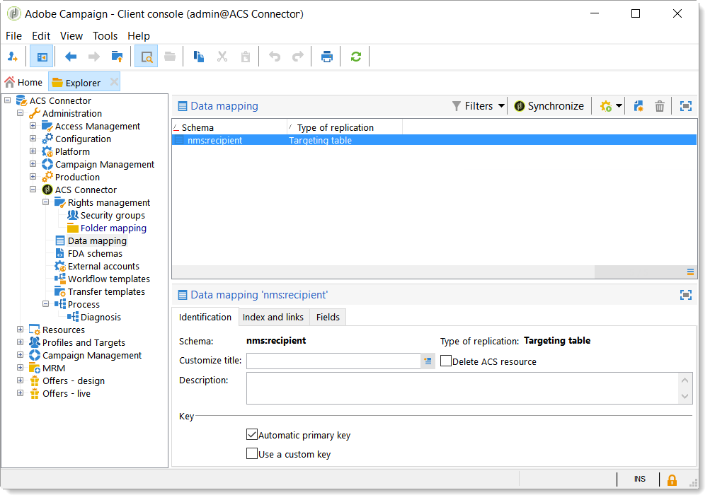

# ACS Connector原理和数据循环{#acs-connector-principles-and-data-cycle}

## 简介 {#introduction}

ACS Connector将Adobe Campaign v7和Adobe Campaign Standard桥接在一起。 它是Campaign v7中的一个集成功能，可自动将数据复制到Campaign Standard，将两个应用程序的最佳功能结合在一起。 Campaign v7具有用于管理主营销数据库的高级工具。 Campaign v7中的数据复制使Campaign standard能够在用户友好的环境中利用丰富的数据。

借助ACS Connector，数字营销人员继续使用Campaign Standard设计、定位和执行营销活动，而Campaign v7为面向数据的用户（如数据库营销人员）量身定制。

>[!CAUTION]
>
>ACS Connector仅作为Adobe Campaign Prime产品的一部分提供。 有关如何许可Adobe Campaign Prime的更多信息，请与客户经理联系。
>
>ACS连接器仅适用于托管和混合架构。 它不适用于完整的内部部署安装。
>
>要使用此功能，您必须使用Adobe ID(IMS)连接到Campaign。 请参 [阅通过Adobe ID连接](../../integrations/using/about-adobe-id.md)。

本文档介绍ACS Connector功能。 以下各节提供了有关该功能如何复制数据的信息以及如何使用复制配置文件的说明。

* [流程](#process):ACS Connector概述以及如何管理数据复制。
* [实施](#implementation):ACS Connector入门概述以及如何复制基本和高级数据的说明。
* [同步配置文件](../../integrations/using/synchronizing-profiles.md):有关如何复制配置文件以及如何使用配置文件创建分发的说明。
* [同步受众](../../integrations/using/synchronizing-audiences.md):有关如何在Campaign v7中定位收件人列表，然后将该列表复制到Campaign standard作为受众的说明。
* [同步Web应用程序](../../integrations/using/synchronizing-web-applications.md):有关如何将Campaign v7 web应用程序关联到Campaign Standard的说明。
* [ACS连接器故障排除](../../integrations/using/troubleshooting-the-acs-connector.md):查看常见问题的答案。

>[!NOTE]
>
>ACS Connector包含在Campaign v7的许可协议中。 要使用ACS连接器，请确保您可以在Campaign v7和Campaign Standard之间切换。 如果您不确定您的版本及其包含的功能，请联系您的管理员。

## 进程 {#process}

### 数据复制 {#data-replication}

ACS Connector会定期将以下项目从Campaign v7复制到Campaign Standard:

* **收件人**
* **订阅**
* **服务**
* **登陆页面**

默认情况下，ACS Connector的定期复制每15分钟一次。 可以调整周期复制的范围以满足您的需求。 如果需要更改，请与顾问联系。

收件人、订阅、服务和登陆页面的数据复制是增量复制，这意味着只有新收件人和对现有收件人的修改才会从Campaign v7复制到Campaign Standard。 但是，受众复制发生在单个实例中。 您可以在Campaign v7中创建受众，然后将其复制一次到Campaign Standard。 复制是即时的，无法为常规更新配置。 有关说明，请参阅 [同步受众](../../integrations/using/synchronizing-audiences.md)。

>[!NOTE]
>
>请耐心等待大型数据库的初始复制，因为它可能需要几个小时。 但是，后续复制是增量的，而且速度要快得多。

ACS Connector会定期将以下项目从Campaign standard复制到Campaign v7:

* **[!UICONTROL Delivery IDs]**
* **[!UICONTROL Email broad logs]**
* **[!UICONTROL Email tracking logs]**

通过复制交付ID和电子邮件日志，可以从Campaign v7访问v7收件人的交付和跟踪数据的历史记录。

>[!CAUTION]
>
>只有电子邮件广播和跟踪日志才会从Campaign standard复制到Campaign v7。

### 数据同步 {#data-synchronization}

ACS连接器可在Campaign v7和Campaign Standard之间同步隔离。

例如，已从Campaign v7复制到Campaign standard的配置文件包括电子邮件地址。 如果电子邮件地址被Campaign standard隔离，则数据将在下次同步期间传递到Campaign v7。 有关隔离的详细信息，请参 [阅隔离管理](../../delivery/using/understanding-quarantine-management.md) 和 [活动标准隔离](https://docs.adobe.com/content/help/en/campaign-standard/using/testing-and-sending/monitoring-messages/understanding-quarantine-management.html)。

### 使用复制的配置文件 {#using-replicated-profiles}

Campaign standard和Campaign v7可以使用复制的配置文件来定位营销活动中的工作流。

有关如何在Campaign standard中使用复制的配置文件发送分发的说明，请参阅同步配 [置文件](../../integrations/using/synchronizing-profiles.md)。 提供了有关在Campaign v7和Campaign standard之间共享取消订阅数据的其他说明。

### 限制 {#limitations}

复制的配置文件可轻松用于分发，但在Campaign standard中有某些限制。 查看以下项目，了解如何最好地管理它们。

* **Campaign standard的只读配置文件**:复制的配置文件在Campaign standard中为只读。 但是，您可以在Campaign v7中编辑收件人，修改内容会由ACS Connector在Campaign standard中自动更新。
* **在Campaign standard中创建的配置文件**:ACS Connector将收件人数据从Campaign v7复制到Campaign Standard中的一个方向。 因此，源自Campaign standard的配置文件不会复制到Campaign v7。
* **Campaign standard的基本收件人数据**:ACS Connector可复制适合Campaign standard的收件人数据。 它包括收件人的姓名、地址、电子邮件地址、手机号码、家庭电话号码和其他相关联系信息。 如果Campaign v7中提供的其他收件人字段和自定义定位表对您的工作流程至关重要，请咨询您的顾问。
* **导入隔离的配置文件**:不希望与之联系的配置文件列表可以作为隔离配置文件导入到Campaign v7或Campaign Standard中。 配置文件的状态包含在应用程序之间的隔离同步中，不会用于交付。
* **在Campaign standard中取消订阅服务**:取消订阅分发的选项未从Campaign standard同步到Campaign v7。 但是，您可以配置Campaign standard交付，以将其取消订阅链接定向到Campaign v7。 单击取消订阅链接的收件人的配置文件将在Campaign v7中更新，并且数据会复制到Campaign Standard。 请参 [阅更改取消订阅链接](../../integrations/using/synchronizing-profiles.md#changing-the-unsubscription-link)。
* 只有电子邮件广播和跟踪日志才会从Campaign standard复制到Campaign v7。

### 计费 {#billing}

您选择要发送分发、Campaign v7或Campaign Standard的应用程序，不会影响计费。 在Campaign v7和Campaign Standard之间协调开单信息。 因此，如果您使用这两个应用程序向同一收件人发送分发内容，该分发内容仍计为一个活动配置文件。

## 实施 {#implementation}

ACS Connector有两种实现类型。 这两者始终由Adobe Campaign咨询团队执行。

>[!CAUTION]
>
>本节仅面向专家用户，为他们提供实施过程及其主要步骤的全局视图。
>
>不要尝试通过任何方式自己执行任何这些实施。 它仅由Adobe Campaign顾问负责。

基 **本实施** ，允许您复制收件人（现成字段）、服务和订阅、Web应用程序和受众。 这是从Campaign v7到Campaign Standard的单向复制。

高 **级实施** ，您可以执行更复杂的用例，例如，如果您有其他收件人字段或自定义收件人表（例如，事务表）。 请参阅 [高级实施](#advanced-implementation)。

### 安装包 {#installing-the-package}

要使用该功能，需 **[!UICONTROL ACS Connector]** 要安装该包。 这始终由Adobe技术管理员或顾问执行。

与ACS连接器相关的所有技术元素都位于资 **[!UICONTROL Administration > ACS Connector]** 源管理器的节点中。

### 技术和复制工作流程 {#technical-and-replication-workflows}

安装包后，可在下面提供两个技术工作流 **[!UICONTROL Administration > ACS Connector > Process]**。

>[!CAUTION]
>
>切勿尝试修改这些工作流。 它们绝不应出错或暂停。 如果发生这种情况，请联系您的Adobe Campaign顾问。

* **[!UICONTROL `[ACS] Quarantine synchronization`]** (quarantineSync):此工作流将同步所有隔离信息。 Campaign v7中的所有新隔离均被复制到Campaign Standard中。 所有从Campaign standard隔离的新隔离均被复制到Campaign v7中。 这可保证所有排除规则在Campaign v7和Campaign Standard之间同步。
* **[!UICONTROL `[ACS] Security group synchronization`]** (securityGroupSync):此工作流用于权限转换。 请参阅 [权限转换](#rights-conversion)。

以下复制工作流程可作为“准备使用”模板使用。 这些建议需要由Adobe Campaign顾问实施。

* **[!UICONTROL `[ACS] Profile replication`]** (newProfileReplication):此增量式工作流会将收件人复制到Campaign Standard。 默认情况下，它会复制所有现成的收件人字段。 请参阅 [默认收件人字段](#default-recipient-fields)。
* **[!UICONTROL `[ACS] Service replication`]** (newServiceReplication):此增量式工作流会将选定的服务复制到Campaign Standard。 请参阅同步Web应 [用程序用例](../../integrations/using/synchronizing-web-applications.md)。
* **[!UICONTROL `[ACS] Landing pages replication`]** (newLandingPageReplication):此增量式工作流将所选Web应用程序复制到Campaign Standard。 Campaign v7 web应用程序将在Campaign standard中显示为登录页面。 请参阅同步Web应 [用程序用例](../../integrations/using/synchronizing-web-applications.md)。
* **[!UICONTROL `[ACS] New replication`]** （新复制）:此增量式工作流是一个可用于复制自定义表的示例。 请参阅 [高级实施](#advanced-implementation)。
* **[!UICONTROL `[ACS] Delivery-mesage replication`]** (newDlvMsgEqualition):此增量工作流将Campaign standard中的交付消息复制到Campaign v7。
* **[!UICONTROL `[ACS] Profile delivery log replication`]** (newRcpDeliveryLogReplication):此增量式工作流将交付ID、电子邮件广泛日志和电子邮件跟踪日志从Campaign standard复制到Campaign v7。 它只考虑从Campaign standard发送到属于Campaign v7的nms:recipients表的配置文件的分发。
* **[!UICONTROL `[ACS] New delivery log replication`]** (newRcpDeliveryLogReplication):此增量式工作流将交付ID、电子邮件广泛日志和电子邮件跟踪日志从Campaign standard复制到Campaign v7。 它只考虑从Campaign standard发送到属于Campaign v7特定表（用于定义nms:recipients除外）的配置文件的分发。

### 默认收件人字段 {#default-recipient-fields}

如果您有任何其他字段或自定义表（例如，事务表），则默认情况下不会复制这些字段或表。 需要执行高级配置。 请参阅 [高级实施](#advanced-implementation)。

您将在与基本实施复制的收件人字段列表下方找到。 这些是现成的字段：

<table> 
 <tbody> 
  <tr> 
   <td> <strong>标签</strong>  </td> 
   <td> <strong>内部名称</strong>  </td> 
  </tr> 
  <tr> 
   <td> 源ID  </td> 
   <td> @sourceId  </td> 
  </tr> 
  <tr> 
   <td> 创建日期  </td> 
   <td> @created  </td> 
  </tr> 
  <tr> 
   <td> 修改日期  </td> 
   <td> @lastModified  </td> 
  </tr> 
  <tr> 
   <td> 电子邮件  </td> 
   <td> @email  </td> 
  </tr> 
  <tr> 
   <td> 姓氏  </td> 
   <td> @lastName  </td> 
  </tr> 
  <tr> 
   <td> 名字  </td> 
   <td> @firstName  </td> 
  </tr> 
  <tr> 
   <td> 中间名  </td> 
   <td> @middleName  </td> 
  </tr> 
  <tr> 
   <td> 移动  </td> 
   <td> @mobilePhone  </td> 
  </tr> 
  <tr> 
   <td> 出生日期  </td> 
   <td> @birthDate  </td> 
  </tr> 
  <tr> 
   <td> 性别  </td> 
   <td> @gender  </td> 
  </tr> 
  <tr> 
   <td> 问候语  </td> 
   <td> @salution  </td> 
  </tr> 
  <tr> 
   <td> 不再联系（通过任何渠道）  </td> 
   <td> @blackList  </td> 
  </tr> 
  <tr> 
   <td> 不再通过电子邮件联系  </td> 
   <td> @blackListEmail  </td> 
  </tr> 
  <tr> 
   <td> 不再通过SMS联系  </td> 
   <td> @blackListMobile  </td> 
  </tr> 
  <tr> 
   <td> 电话  </td> 
   <td> @phone  </td> 
  </tr> 
  <tr> 
   <td> 传真  </td> 
   <td> @fax  </td> 
  </tr> 
  <tr> 
   <td> 地址1（公寓）  </td> 
   <td> [位置/@address1]  </td> 
  </tr> 
  <tr> 
   <td> 地址2  </td> 
   <td> [位置/@address2]  </td> 
  </tr> 
  <tr> 
   <td> 地址3（编号和街道）  </td> 
   <td> [位置/@address3]  </td> 
  </tr> 
  <tr> 
   <td> 地址4（县）  </td> 
   <td> [位置/@address4]  </td> 
  </tr> 
  <tr> 
   <td> 邮政编码  </td> 
   <td> [location/@zipCode]  </td> 
  </tr> 
  <tr> 
   <td> 城市  </td> 
   <td> [位置/@city]  </td> 
  </tr> 
  <tr> 
   <td> 州／省代码  </td> 
   <td> [location/@stateCode]  </td> 
  </tr> 
  <tr> 
   <td> 国家／地区代码  </td> 
   <td> [location/@countryCode]  </td> 
  </tr> 
 </tbody> 
</table>

### 权限转换 {#rights-conversion}

权限在Campaign v7和Campaign standard中的处理方式不同。 在Campaign v7中，权限管理基于文件夹，而在Campaign Standard中，权限管理基于单位访问（组织／地理单位）。 Campaign standard用户属于包含限制上下文的安全组。 因此，需要将Campaign v7权限系统转换为与Campaign Standard系统匹配。 可通过多种方式执行权限转换。 您将在下面找到一个实施示例。

1. 在下 **[!UICONTROL Administration > ACS Connector > Rights management > Security groups]**&#x200B;面，使用 **[!UICONTROL Synchronize]** 按钮检索所有Campaign standard安全组。 现成的Campaign standard组被排除。

   

1. 如果您的权限管理基于文件夹，请转到并将 **[!UICONTROL Administration > ACS Connector > Rights management > Folder mapping]** 每个需要的文件夹与安全组映射。

   

1. 然后，复制工作流将使用此信息，并将相应的组织／地理单元添加到每个要复制的对象。

### 高级实施 {#advanced-implementation}

本节介绍在高级实施方面的一些可能性。

>[!CAUTION]
>
>这些信息只能用作一般准则。 与Adobe Campaign顾问联系以了解实施情况。

高级实施将根据客户的需要添加自定义复制工作流。 以下是几个示例：

* 交付复制
* 营销活动复制
* 程序复制
* 种子成员复制
* 交易复制
* 等等。

**在收件人上复制扩展字段**

通过基本实施，可复制现成的收件人字段。 如果要复制已添加到收件人架构的自定义字段，则需要识别这些字段。

1. 在 **[!UICONTROL Administration > ACS Connector > Data mapping]**&#x200B;下，在表上创建定位映 **[!UICONTROL nms:recipient]** 射。

   

1. 选择要复制的其他字段和其他所需信息（索引、链接、标识键）。

   

1. 打开专用的配置文件复制工作流程（不是模板，而是工作流实例本身）。 修改和 **[!UICONTROL Query]** 活动 **[!UICONTROL Update data]** 以包括这些字段。 请参 [阅技术和复制工作流程](#technical-and-replication-workflows)。

   

   

**复制自定义配置文件表**

通过基本实施，可复制现成的收件人表。 如果您添加了自定义收件人表，则以下是您如何识别这些表。

1. 在下 **[!UICONTROL Administration > ACS Connector > Data mapping]**&#x200B;面，在自定义配置文件表上创建定位映射。

   

1. 定义要复制的标识数据、索引、链接和字段。

   

1. 如果您的权限管理基于文件夹，请转到 **[!UICONTROL Administration > ACS Connector > Rights management > Folder mapping]**&#x200B;并为链接到自定义表的文件夹定义安全组。 请参阅 [权限转换](#rights-conversion)。
1. 使用工 **[!UICONTROL New replication]** 作流（不是模板，而是工作流实例本身）来包含要复制的自定义表和字段。 请参 [阅技术和复制工作流程](#technical-and-replication-workflows)。

