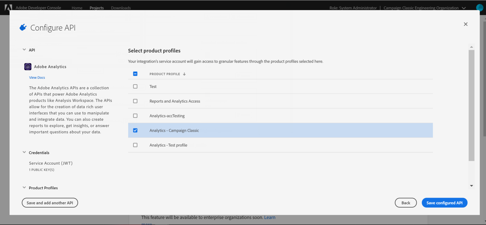
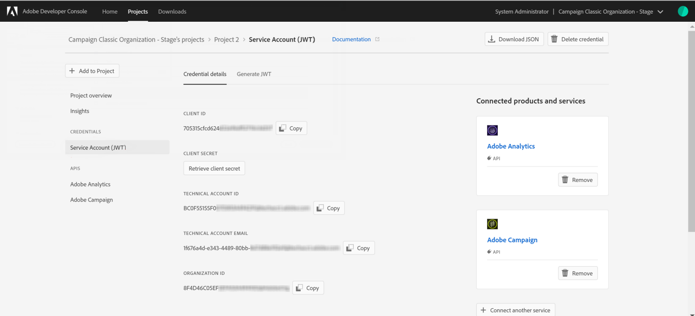

# Configuring Adobe I/O for Adobe Experience Cloud Triggers {#configuring-adobe-io}

>[!CAUTION]
>
>如果您使用的是通过身份验证进行触发器集成的旧 **版本，则需要按如下所述移**&#x200B;动到AdobeI/O。 旧版身份验证模式将于2021年4月30日停用。 [了解详情](https://github.com/AdobeDocs/analytics-1.4-apis/blob/master/docs/APIEOL.md)

## 先决条件{#adobe-io-prerequisites}

在开始此实施之前，请检查您具有：

* 最新版Adobe Campaign:19.1.8或20.2.1版及更高版本，
* 有效的IMSOrgID:identity management系统(IMS)组织标识符是Adobe Experience Cloud内的唯一标识符，例如用于VisitorID服务和IMS单点登录(SSO),
* 开发者访问IMS组织。

>[!NOTE]
>
>如果您需要请求IMS组织的系统管理员权限，请按照本页中详细 [的过程](https://helpx.adobe.com/ca/enterprise/admin-guide.html/ca/enterprise/using/manage-developers.ug.html) ，为所有产品用户档案提供此访问权限。


## 第1步：创建／更新AdobeI/O项目 {#creating-adobe-io-project}

1. 访问AdobeI/O，并与IMSorg的系统管理员一起登录。

   >[!NOTE]
   >
   > 确保您登录到正确的IMSorg门户。

1. 从实例配置文件ims/authIMSTAClientId提取现有集成客户端ID。 非现有或空属性表示未配置客户端ID。

   >[!NOTE]
   >
   >如果客户端ID为空，则可以直接 **[!UICONTROL Create a New project]** 在AdobeI/O中。

1. 使用提取的客户端ID标识现有项目。 查找与上一步提取的客户端ID相同的现有项目。

   

1. 选择 **[!UICONTROL + Add to Project]** 并选择 **[!UICONTROL API]**。

   

1. In the **[!UICONTROL Add an API]** window, select **[!UICONTROL Adobe Analytics]**.

   

1. 选择 **[!UICONTROL Service Account (JWT)]** 身份验证类型。

   

1. 如果您的客户端ID为空，则选 **[!UICONTROL Generate a key pair]** 择以创建公共和专用密钥对。

   

1. 上传您的公钥并单击 **[!UICONTROL Next]**。

   

1. 选择名为Analytics-&lt;组 **织名称>的产品用户档案** ，然后单击 **[!UICONTROL Save configured API]**。

   

1. 从您的项目中，选 **[!UICONTROL Service Account (JWT)]** 择并复制以下信息：
   * **[!UICONTROL Client ID]**
   * **[!UICONTROL Client Secret]**
   * **[!UICONTROL Technical account ID]**
   * **[!UICONTROL Organization ID]**

   

## 第2步：在Adobe Campaign中添加项目凭据 {#add-credentials-campaign}

要在Adobe Campaign中添加项目凭据，请在Adobe Campaign实例的所有容器上以“neolane”用户身份运行以下命令，以将凭据插入 **[!UICONTROL Technical Account]** 实例配置文件中。

```
nlserver config -instance:<instance name> -setimsjwtauth:Organization_Id/Client_Id/Technical_Account_ID[/Client_Secret[/Base64_encoded_Private_Key]]
```

>[!NOTE]
>
>您应以base64 UTF-8格式对私钥进行编码。 在编码新行之前，请记住从密钥中删除新行，但私钥除外。 私钥必须与用于创建集成的私钥相同。

## 第3步：更新管道化标签 {#update-pipelined-tag}

要更 [!DNL pipelined] 新标记，您需要将身份验证类型更新为配置文件 **config-&lt; instance-name >.xml中的AdobeI/O项目** ，如下所示：

```
<pipelined ... authType="imsJwtToken"  ... />
```
