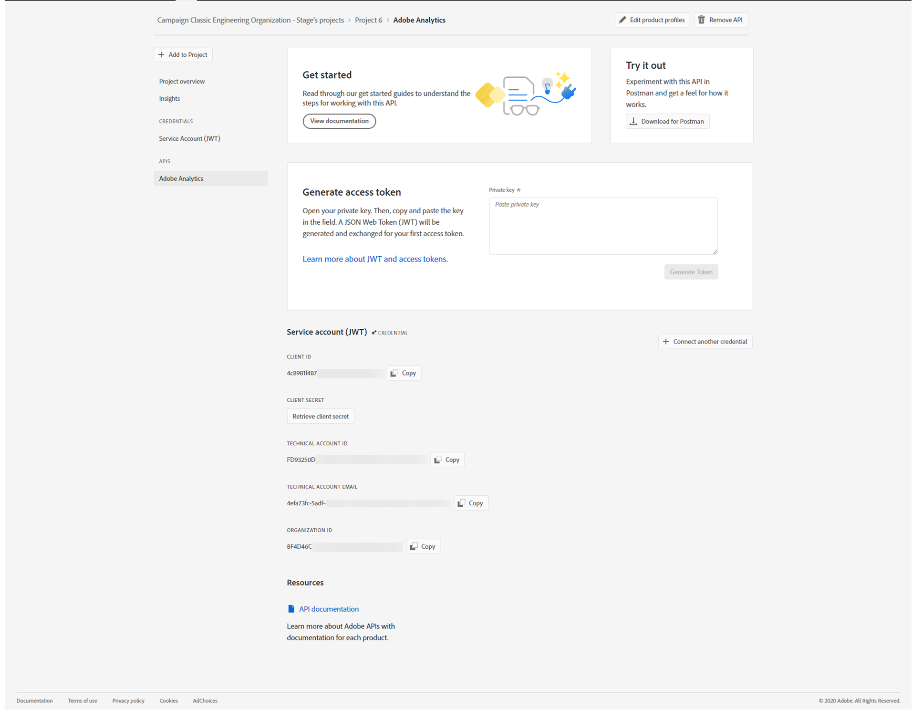

# 为 Adobe Experience Cloud 触发器配置 Adobe I/O {#configuring-adobe-io}


>[!CAUTION]
>
>如果您使用的是通过oAuth身份验证的旧版Triggers集成， **您需要按如下所述转到Adobe I/O**.
>请注意，在迁移到 [!DNL Adobe I/O]，则某些传入触发器可能会丢失。
>
>Campaign的旧版oAuth身份验证模式已在 **2021年10月20日**. 在扩展之前，托管环境将从扩展中受益  **2022年2月23日**. 作为内部部署或混合型客户，请联系Adobe客户关怀团队，将支持延长至2022年2月。 您必须 [提供OAuth应用程序的AppID](../../integrations/using/configuring-pipeline.md?lang=en#step-optional) Adobe。

## 先决条件 {#adobe-io-prerequisites}

此集成仅适用于启动 **Campaign Classic20.2.4及更高版本、 19.1.8和Gold Standard 11版本**.

在启动此实施之前，请检查您具有：

* 有效 **组织标识符**:Identity Management系统(IMS)组织标识符是Adobe Experience Cloud中的唯一标识符，例如用于VisitorID服务和IMS单点登录(SSO)。 [了解详情](https://experienceleague.adobe.com/docs/core-services/interface/manage-users-and-products/organizations.html)
* a **开发人员访问** 到您的组织。 IMS组织的系统管理员需要遵循 **将开发人员添加到单个产品配置文件** 过程详细 [本页](https://helpx.adobe.com/enterprise/admin-guide.html/enterprise/using/manage-developers.ug.html) 为开发人员提供 `Analytics - {tenantID}` 与触发器关联的Adobe Analytics产品的产品配置文件。

## 步骤1:创建/更新Adobe I/O项目 {#creating-adobe-io-project}

1. 访问 [!DNL Adobe I/O] 并使用IMS组织的开发人员访问权限登录。

   >[!NOTE]
   >
   > 确保您已登录到正确的组织门户。

1. 从实例配置文件ims/authIMSTAClientId中提取现有集成客户端标识符（客户端ID）。 非现有或空属性表示未配置客户端标识符。

   >[!NOTE]
   >
   >如果您的客户端标识符为空，则可以直接 **[!UICONTROL Create a New project]** Adobe I/O。

1. 使用提取的客户端标识符标识现有项目。 查找具有与上一步中提取的相同客户端标识符的现有项目。

   

1. 选择 **[!UICONTROL + Add to Project]** 选择 **[!UICONTROL API]**.

   

1. 在 **[!UICONTROL Add an API]** 窗口，选择 **[!UICONTROL Adobe Analytics]**.

   

1. 选择 **[!UICONTROL Service Account (JWT)]** 作为身份验证类型。

   

1. 如果您的客户端ID为空，请选择 **[!UICONTROL Generate a key pair]** 创建公钥和私钥对。

   然后，将自动下载密钥，默认到期日期为365天。 过期后，您将需要创建新密钥对并更新配置文件中的集成。 使用选项2，您可以选择手动创建和上传 **[!UICONTROL Public key]** 的期限。

   >[!CAUTION]
   >
   >当出现下载提示时，您应保存config.zip文件，因为您将无法再次下载它。

   

1. 单击 **[!UICONTROL Next]**。

   

1. 选择任何现有 **[!UICONTROL Product profile]** 或根据需要创建新受众。 无需权限 **[!UICONTROL Product profile]**. 有关 [!DNL Analytics] **[!UICONTROL Product Profiles]**，请参阅 [Adobe Analytics文档](https://experienceleague.adobe.com/docs/analytics/admin/admin-console/home.html#admin-console).

   然后，单击 **[!UICONTROL Save configured API]**.

   

1. 在您的项目中，选择 **[!UICONTROL Adobe Analytics]** 并在 **[!UICONTROL Service Account (JWT)]**:

   * **[!UICONTROL Client ID]**
   * **[!UICONTROL Client Secret]**
   * **[!UICONTROL Technical account ID]**
   * **[!UICONTROL Organization ID]**

   

>[!CAUTION]
>
>Adobe I/O证书将在12个月后过期。 您每年需要生成一个新的密钥对。

## 步骤2:在Adobe Campaign中添加项目凭据 {#add-credentials-campaign}

>[!NOTE]
>
>如果您的客户端标识符在 [步骤1:创建/更新Adobe I/O项目](#creating-adobe-io-project).

私钥应以base64 UTF-8格式进行编码。 为实现此操作，请执行以下步骤：

1. 使用在 [步骤1:创建/更新Adobe I/O项目部分](#creating-adobe-io-project). 私钥必须与用于创建集成的私钥相同。

1. 使用以下命令对私钥进行编码： `base64 ./private.key > private.key.base64`. 这会将base64内容保存到新文件 `private.key.base64`.

   >[!NOTE]
   >
   >有时，在复制/粘贴私钥时，会自动添加额外的行。 在对私钥进行编码之前，请记得将其删除。

1. 从文件复制内容 `private.key.base64`.

1. 通过SSH登录到安装了Adobe Campaign实例的每个容器，并通过以下命令(如 `neolane` 用户。 这将插入 **[!UICONTROL Technical Account]** 实例配置文件中的凭据。

   ```
   nlserver config -instance:<instance name> -setimsjwtauth:Organization_Id/Client_Id/Technical_Account_ID/<Client_Secret>/<Base64_encoded_Private_Key>
   ```

## 步骤3:更新流水线标记 {#update-pipelined-tag}

>[!NOTE]
>
>如果您的客户端标识符在 [步骤1:创建/更新Adobe I/O项目](#creating-adobe-io-project).

要更新 [!DNL pipelined] 标记时，您需要更新身份验证类型以Adobe I/O配置文件中的项目 **config-&lt; instance-name >.xml** 如下所示：

```
<pipelined ... authType="imsJwtToken"  ... />
```

然后，运行 `config -reload` 重启 [!DNL pipelined] ，以便考虑更改。
