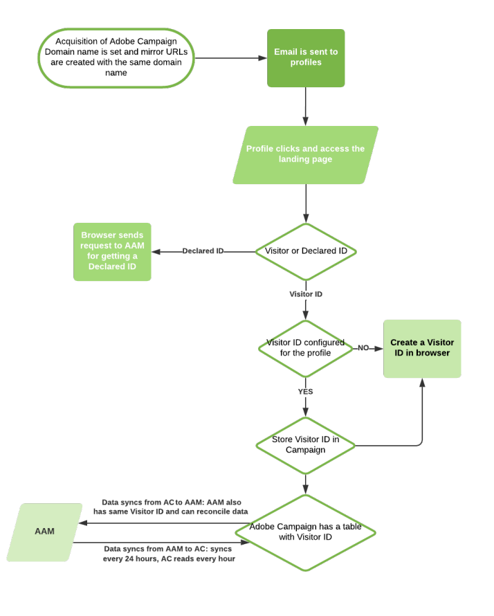

# 在Adobe Campaign中配置共享受众集成{#configuring-shared-audiences-integration-in-adobe-campaign}


提交此请求后，Adobe将继续为您预配集成，并联系您以提供完成配置所需的详细信息和信息：

1. [步骤1：在Adobe Campaign中配置或检查外部帐户](#step-1--configure-or-check-the-external-accounts-in-adobe-campaign)
1. [步骤2：配置数据Source](#step-2--configure-the-data-source)
1. [步骤3：配置Campaign跟踪服务器](#step-3--configure-campaign-tracking-server)
1. [步骤4：配置访客ID服务](#step-4--configure-the-visitor-id-service)

>[!IMPORTANT]
>
>如果您使用Demdex域，并且为导入外部帐户使用&#x200B;**ftp-out.demdex.com**&#x200B;语法，为导出外部帐户使用&#x200B;**ftp-in.demdex.com**&#x200B;语法，则需要相应地调整实施，并移至Amazon Simple Storage Service (S3)连接器以导入或导出数据。 有关如何使用Amazon S3配置外部帐户的更多信息，请参阅此[部分](../../integrations/using/configuring-shared-audiences-integration-in-adobe-campaign.md#step-1--configure-or-check-the-external-accounts-in-adobe-campaign)。

下图详细说明此集成的工作方式。 在此，AAM表示Adobe Audience Manager，AC表示Adobe Campaign。

{align="center"}

## 步骤1：在Adobe Campaign中配置或检查外部帐户 {#step-1--configure-or-check-the-external-accounts-in-adobe-campaign}

首先，我们需要在Adobe Campaign中配置或检查外部帐户，如下所示：

1. 单击&#x200B;**[!UICONTROL Explorer]**&#x200B;图标。
1. 转到&#x200B;**[!UICONTROL Administration > Platform > External accounts]**。 上述SFTP帐户应已由Adobe配置，且必要信息应已传达给您。

   * **[!UICONTROL importSharedAudience]**：专用于导入受众的帐户。
   * **[!UICONTROL exportSharedAudience]**：专用于导出受众的帐户。

   

1. 选择&#x200B;**[!UICONTROL Export audiences to the Adobe Marketing Cloud]**&#x200B;外部帐户。

1. 从&#x200B;**[!UICONTROL Type]**&#x200B;下拉列表中选择&#x200B;**[!UICONTROL AWS S3]**。

1. 提供以下详细信息：

   * **[!UICONTROL AWS S3 Account Server]**
服务器的URL，应按如下方式填写：

     ```
     <S3bucket name>.s3.amazonaws.com/<s3object path>
     ```

   * **[!UICONTROL AWS access key ID]**
要了解在何处查找您的AWS访问密钥ID，请参阅此[页面](https://docs.aws.amazon.com/general/latest/gr/aws-sec-cred-types.html#access-keys-and-secret-access-keys) 。

   * **[!UICONTROL Secret access key to AWS]**
要了解在何处查找您的AWS访问密钥，请参阅此[页面](https://aws.amazon.com/fr/blogs/security/wheres-my-secret-access-key/)。

   * **[!UICONTROL AWS Region]**
要了解有关AWS地区的更多信息，请参阅此[页面](https://aws.amazon.com/about-aws/global-infrastructure/regions_az/)。

   

1. 单击&#x200B;**[!UICONTROL Save]**&#x200B;并配置&#x200B;**[!UICONTROL Import audiences from the Adobe Marketing Cloud]**&#x200B;外部帐户，如前面的步骤所述。

您的外部帐户现已配置完成。

## 步骤2：配置数据Source {#step-2--configure-the-data-source}

**Recipient - Visitor ID**&#x200B;是在Audience Manager内创建的。 这是为访客ID默认配置的现成数据源。 从Campaign创建的区段将成为此数据源的一部分。

要配置&#x200B;**[!UICONTROL Recipient - Visitor ID]**&#x200B;数据源：

1. 从&#x200B;**[!UICONTROL Explorer]**&#x200B;节点中，选择&#x200B;**[!UICONTROL Administration > Platform > AMC Data sources]**。
1. 选择 **[!UICONTROL Recipient - Visitor ID]**。
1. 输入Adobe提供的&#x200B;**[!UICONTROL Data Source ID]**&#x200B;和&#x200B;**[!UICONTROL AAM Destination ID]**。

   

## 步骤3：配置Campaign跟踪服务器 {#step-3--configure-campaign-tracking-server}

要配置与Audience Manager的集成，我们还需要配置Campaign跟踪服务器。

要使共享受众能够与访客ID配合使用，跟踪服务器域应该是已单击URL的子域或主网站。

>[!IMPORTANT]
>
>您需要确保已在域(CNAME)上注册Campaign跟踪服务器。 您可以在[本文](https://experienceleague.adobe.com/docs/control-panel/using/subdomains-and-certificates/setting-up-new-subdomain.html?lang=zh-Hans)中找到有关域名委派的更多信息。

## 步骤4：配置访客ID服务 {#step-4--configure-the-visitor-id-service}

如果从未在您的Web属性或网站上配置过您的访客ID服务，请参阅以下[文档](https://experienceleague.adobe.com/docs/id-service/using/implementation/setup-aam-analytics.html?lang=zh-Hans)以了解如何配置您的服务或以下[视频](https://helpx.adobe.com/cn/marketing-cloud/how-to/email-marketing.html#step-two)。

使用带有集成代码的Experience CloudID服务中的`setCustomerID`函数将客户标识符与声明的ID同步： `AdobeCampaignID`。 `AdobeCampaignID`应与[步骤2：配置数据源](#step-2--configure-the-data-sources)中配置的收件人数据Source中设置的协调键值匹配。

您的配置和配置已完成，集成现在可用于导入和导出受众或区段。
