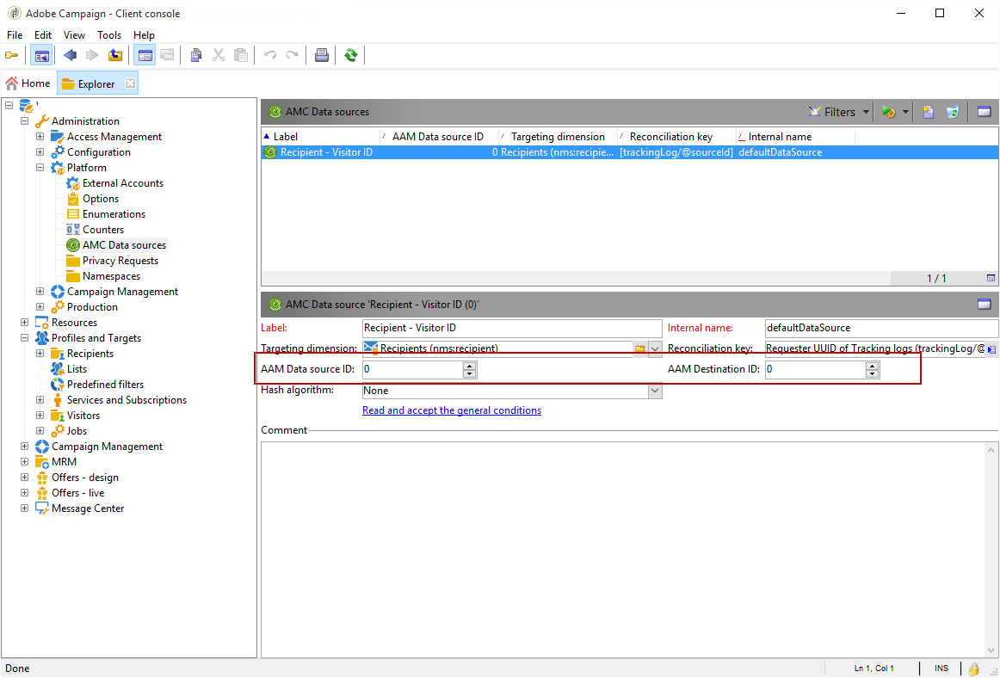

# 在Adobe Campaign{#configuring-shared-audiences-integration-in-adobe-campaign}中配置共享受众集成

提交此请求后，Adobe将继续为您提供集成，并与您联系以提供您必须完成配置的详细信息和信息：

1. [第1步：在Adobe Campaign中配置或检查外部帐户](#step-1--configure-or-check-the-external-accounts-in-adobe-campaign)
1. [第2步：配置数据源](#step-2--configure-the-data-source)
1. [第3步：配置活动跟踪服务器](#step-3--configure-campaign-tracking-server)
1. [第4步：配置访客ID服务](#step-4--configure-the-visitor-id-service)

>[!IMPORTANT]
>
>如果您使用demdex域，并且为导入外部帐户使用语法&#x200B;**ftp-out.demdex.com**&#x200B;和为导出外部帐户使用&#x200B;**ftp-in.demdex.com**，则需要相应地调整实现并移至Amazon Simple 存储 Service(S3)连接器以导入或导出数据。 有关如何使用Amazon S3配置外部帐户的详细信息，请参阅此[部分](../../integrations/using/configuring-shared-audiences-integration-in-adobe-campaign.md#step-1--configure-or-check-the-external-accounts-in-adobe-campaign)。

## 第1步：在Adobe Campaign {#step-1--configure-or-check-the-external-accounts-in-adobe-campaign}中配置或检查外部帐户

首先，我们需要在Adobe Campaign中配置或检查外部帐户，如下所示：

1. 单击&#x200B;**[!UICONTROL Explorer]**&#x200B;图标。
1. 转到&#x200B;**[!UICONTROL Administration > Platform > External accounts]**。 上述SFTP帐户应已通过Adobe配置，并且必要的信息应已发送给您。

   * **[!UICONTROL importSharedAudience]**:专用于导入受众的帐户。
   * **[!UICONTROL exportSharedAudience]**:专门用于导出受众的帐户。

   

1. 选择&#x200B;**[!UICONTROL Export audiences to the Adobe Marketing Cloud]**&#x200B;外部帐户。

1. 从&#x200B;**[!UICONTROL Type]**&#x200B;下拉列表中，选择&#x200B;**[!UICONTROL AWS S3]**。

1. 提供以下详细信息：

   * **[!UICONTROL AWS S3 Account Server]**
服务器的URL，应按如下方式填写：

      ```
      <S3bucket name>.s3.amazonaws.com/<s3object path>
      ```

   * **[!UICONTROL AWS access key ID]**
要了解在何处找到您的AWS访问密钥ID，请参阅本 [页](https://docs.aws.amazon.com/general/latest/gr/aws-sec-cred-types.html#access-keys-and-secret-access-keys) 。

   * **[!UICONTROL Secret access key to AWS]**
要了解在何处找到您的AWS秘密访问密钥，请参阅本 [页](https://aws.amazon.com/fr/blogs/security/wheres-my-secret-access-key/)。

   * **[!UICONTROL AWS Region]**
要了解有关AWS区域的更多信息，请参阅 [本页](https://aws.amazon.com/about-aws/global-infrastructure/regions_az/)。
   

1. 单击&#x200B;**[!UICONTROL Save]**&#x200B;并配置&#x200B;**[!UICONTROL Import audiences from the Adobe Marketing Cloud]**&#x200B;外部帐户，如前面的步骤中所述。

您的外部帐户现已配置。

## 第2步：配置数据源{#step-2--configure-the-data-source}

**收件人-访客ID**&#x200B;在Audience Manager内创建。 这是默认为访客ID配置的现成数据源。 从活动创建的区段将是此数据源的一部分。

配置&#x200B;**[!UICONTROL Recipient - Visitor ID]**&#x200B;数据源：

1. 从&#x200B;**[!UICONTROL Explorer]**&#x200B;节点中，选择&#x200B;**[!UICONTROL Administration > Platform > AMC Data sources]**。
1. 选择 **[!UICONTROL Recipient - Visitor ID]**。
1. 输入Adobe提供的&#x200B;**[!UICONTROL Data Source ID]**&#x200B;和&#x200B;**[!UICONTROL AAM Destination ID]**。

   

## 第3步：配置活动跟踪服务器{#step-3--configure-campaign-tracking-server}

要配置与People Core服务或受众管理器的集成，我们还需要配置活动跟踪服务器。

您需要确保活动跟踪服务器已在域(CNAME)上注册。 您可以在[本文](https://helpx.adobe.com/cn/campaign/kb/domain-name-delegation.html)中找到有关域名委派的更多信息。

## 第4步：配置访客ID服务{#step-4--configure-the-visitor-id-service}

如果您的访客ID服务从未在您的Web属性或网站上配置过，请参阅以下[文档](https://docs.adobe.com/content/help/en/id-service/using/implementation/setup-aam-analytics.html)，了解如何配置您的服务或以下[视频](https://helpx.adobe.com/cn/marketing-cloud/how-to/email-marketing.html#step-two)。

您的配置和设置已完成，集成现在可用于导入和导出受众或区段。
