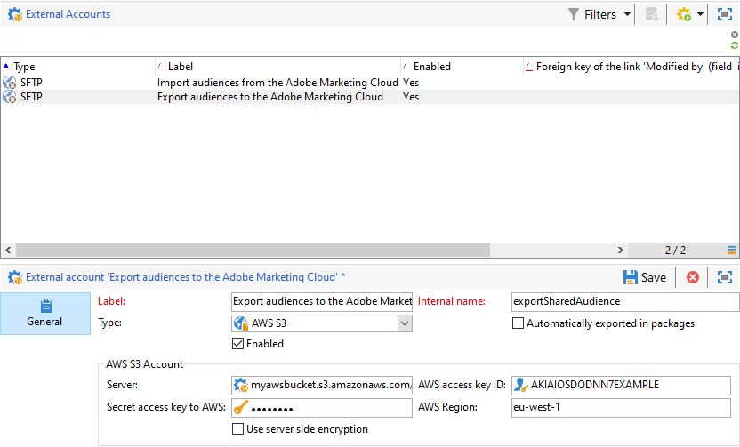

# 在Adobe Campaign中配置共享受众集成{#configuring-shared-audiences-integration-in-adobe-campaign}


提交此请求后，Adobe将继续为您配置集成，并与您联系以提供完成配置所需的详细信息和信息：

1. [步骤1:在Adobe Campaign中配置或检查外部帐户](#step-1--configure-or-check-the-external-accounts-in-adobe-campaign)
1. [步骤2:配置数据源](#step-2--configure-the-data-source)
1. [步骤3:配置促销活动跟踪服务器](#step-3--configure-campaign-tracking-server)
1. [步骤4:配置访客ID服务](#step-4--configure-the-visitor-id-service)

>[!IMPORTANT]
>
>如果您使用demdex域并遵循语法 **ftp-out.demdex.com** 导入外部帐户和 **ftp-in.demdex.com** 对于导出外部帐户，您需要相应地调整实施，并移至Amazon Simple Storage Service(S3)连接器以导入或导出数据。 有关如何使用Amazon S3配置外部帐户的更多信息，请参阅此 [部分](../../integrations/using/configuring-shared-audiences-integration-in-adobe-campaign.md#step-1--configure-or-check-the-external-accounts-in-adobe-campaign).

## 步骤1:在Adobe Campaign中配置或检查外部帐户 {#step-1--configure-or-check-the-external-accounts-in-adobe-campaign}

首先，我们需要在Adobe Campaign中配置或检查外部帐户，如下所示：

1. 单击 **[!UICONTROL Explorer]** 图标。
1. 转到 **[!UICONTROL Administration > Platform > External accounts]**. 上述SFTP帐户应按Adobe配置，并且必要的信息应已传达给您。

   * **[!UICONTROL importSharedAudience]**:专用于导入受众的帐户。
   * **[!UICONTROL exportSharedAudience]**:专门用于导出受众的帐户。

   

1. 选择 **[!UICONTROL Export audiences to the Adobe Marketing Cloud]** 外部帐户。

1. 从 **[!UICONTROL Type]** 下拉列表，选择 **[!UICONTROL AWS S3]**.

1. 提供以下详细信息：

   * **[!UICONTROL AWS S3 Account Server]**
服务器的URL，其填充方式如下：

      ```
      <S3bucket name>.s3.amazonaws.com/<s3object path>
      ```

   * **[!UICONTROL AWS access key ID]**
要了解在何处查找您的AWS访问密钥ID，请参阅此 [页面](https://docs.aws.amazon.com/general/latest/gr/aws-sec-cred-types.html#access-keys-and-secret-access-keys) .

   * **[!UICONTROL Secret access key to AWS]**
要了解在何处查找到AWS的密钥，请参阅此 [页面](https://aws.amazon.com/fr/blogs/security/wheres-my-secret-access-key/).

   * **[!UICONTROL AWS Region]**
要了解有关AWS地区的更多信息，请参阅 [页面](https://aws.amazon.com/about-aws/global-infrastructure/regions_az/).
   

1. 单击 **[!UICONTROL Save]** 和配置 **[!UICONTROL Import audiences from the Adobe Marketing Cloud]** 外部帐户，如前面的步骤中所述。

外部帐户现已配置完成。

## 步骤2:配置数据源 {#step-2--configure-the-data-source}

的 **收件人 — 访客ID** 在Audience Manager中创建。 这是默认为访客ID配置的现成数据源。 从Campaign创建的区段将包含在此数据源中。

配置 **[!UICONTROL Recipient - Visitor ID]** 数据源：

1. 从 **[!UICONTROL Explorer]** 节点，选择 **[!UICONTROL Administration > Platform > AMC Data sources]**.
1. 选择 **[!UICONTROL Recipient - Visitor ID]**。
1. 输入 **[!UICONTROL Data Source ID]** 和 **[!UICONTROL AAM Destination ID]** 由Adobe提供。

   

## 步骤3:配置促销活动跟踪服务器 {#step-3--configure-campaign-tracking-server}

要配置与People Core服务或Audience Manager的集成，我们还需要配置促销活动跟踪服务器。

您需要确保已在域(CNAME)上注册促销活动跟踪服务器。 您可以在 [本文](https://experienceleague.adobe.com/docs/control-panel/using/subdomains-and-certificates/setting-up-new-subdomain.html?lang=zh-Hans).

## 步骤4:配置访客ID服务 {#step-4--configure-the-visitor-id-service}

如果您的Web资产或网站上从未配置过访客ID服务，请参阅以下内容 [文档](https://experienceleague.adobe.com/docs/id-service/using/implementation/setup-aam-analytics.html) 了解如何配置服务或以下内容 [视频](https://helpx.adobe.com/cn/marketing-cloud/how-to/email-marketing.html#step-two).

您的配置和配置已完成，现在，该集成可用于导入和导出受众或区段。
