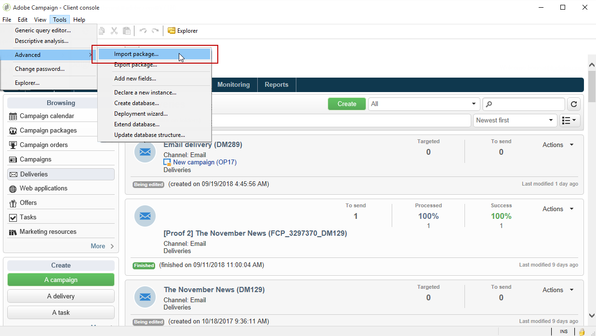
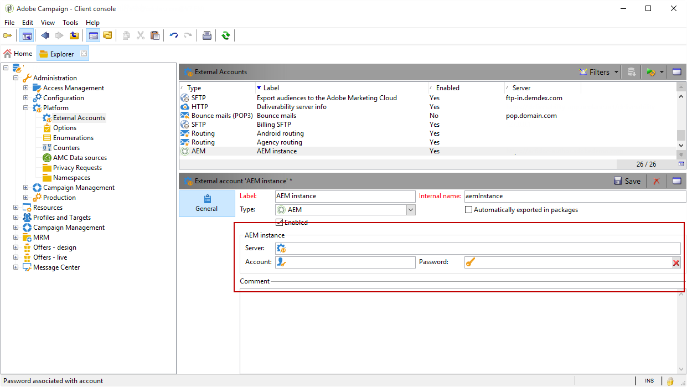

# 配置Campaign-AEM集成{#configuring-the-integration}


## Adobe Campaign中的配置步骤 {#configuring-in-adobe-campaign}

要同时使用这两种解决方案，您必须将它们配置为相互连接。

执行以下步骤，在Adobe Campaign中启动配置：

1. [在Adobe Campaign中安装AEM集成包](#install-the-aem-integration-package-in-adobe-campaign)
1. [配置外部帐户](#configure-the-external-account)
1. [配置AEM资源筛选](#configure-aem-resources-filtering)

用于高级配置，例如管理个性化字段和块。 请参阅Adobe Experience Manager [文档](https://helpx.adobe.com/experience-manager/6-5/sites/administering/using/campaignonpremise.html).

### 在Adobe Campaign中安装AEM集成包 {#install-the-aem-integration-package-in-adobe-campaign}

您首先需要安装 **[!UICONTROL AEM integration]** 包。

1. 从您的Adobe Campaign实例中，选择 **[!UICONTROL Tools]** 从上方工具栏中。
1. 选择 **[!UICONTROL Tools > Advanced > Import package...]**。

   

1. 选择 **[!UICONTROL Install a standard package]**。
1. Check **[!UICONTROL AEM integration]** 然后单击 **[!UICONTROL Next]** 按钮。

   

1. 在下一个窗口中，单击 **[!UICONTROL Start]** 按钮以开始安装包。 安装完成后，请关闭该窗口。

### 为AEM操作员配置安全区域 {#configure-the-security-zone-for-aem-operator}

此 **[!UICONTROL AEM integration]** 包设置 **[!UICONTROL aemserver]** 运算符。 此运算符用于将Adobe Experience Manager服务器连接到Adobe Campaign。

您需要为此操作员配置一个安全区域，以便通过Adobe Experience Manager连接到Adobe Campaign。

>[!CAUTION]
>
>我们强烈建议创建一个专用于AEM的安全区域，以避免任何安全问题。 有关更多信息，请参阅安装 [指南](../../installation/using/security-zones.md).

如果您的Campaign实例由Adobe托管，请联系 [Adobe客户关怀](https://helpx.adobe.com/cn/enterprise/admin-guide.html/enterprise/using/support-for-experience-cloud.ug.html) 团队。 如果您使用的是内部部署Campaign，请执行以下步骤：

1. 打开 **serverConf.xml** 配置文件。
1. 访问 **allowUserPassword** 安全区域的属性，并将其设置为 **true**.

   这将允许Adobe Experience Manager通过登录/密码连接Adobe Campaign。

### 配置外部帐户 {#configure-the-external-account}

此 **[!UICONTROL AEM integration]** 包已为Adobe Experience Cloud创建外部帐户。 您现在需要将其配置为与Adobe Experience Manager实例连接。

要配置AEM外部帐户，请执行以下步骤：

1. 单击 **[!UICONTROL Explorer]** 按钮。

   

1. 选择 **[!UICONTROL Administration > Platform > External accounts]**。
1. 从 **[!UICONTROL External account]** 列表，选择 **[!UICONTROL AEM instance]**.
1. 输入AEM创作实例的参数：

   * **[!UICONTROL Server]**
   * **[!UICONTROL Account]**
   * **[!UICONTROL Password]**

   >[!NOTE]
   >
   >确保您的 **[!UICONTROL Server]** 地址未以尾随斜杠结尾。

   

1. 查看 **[!UICONTROL Enabled]** 盒子。
1. 单击 **[!UICONTROL Save]** 按钮。

### 配置AEM资源筛选 {#configure-aem-resources-filtering}

此 **AEMResourceTypeFilter** 选项用于筛选可以在Adobe Campaign中使用的Experience Manager资源类型。 这允许Adobe Campaign检索专门设计为仅在Adobe Campaign中使用的Experience Manager内容。

检查 **[!UICONTROL AEMResourceTypeFilter]** 选项已配置：

1. 单击 **[!UICONTROL Explorer]** 按钮。
1. 选择 **[!UICONTROL Administration > Platform > Options]**。
1. 从 **[!UICONTROL Options]** 列表，选择 **[!UICONTROL AEMResourceTypeFilter]**.
1. 在 **[!UICONTROL Value (text)]** 字段中，路径应如下所示：

   ```
   mcm/campaign/components/newsletter,mcm/campaign/components/campaign_newsletterpage,mcm/neolane/components/newsletter
   ```

   或者，在某些情况下：

   ```
   mcm/campaign/components/newsletter
   ```

   

## Adobe Experience Manager中的配置步骤 {#configuring-in-adobe-experience-manager}

执行以下步骤，在Adobe Experience Manager中启动配置：

1. 配置 **复制** 从AEM创作实例复制到AEM发布实例。

   要了解如何配置复制，请参阅Adobe Experience Manager [文档](https://helpx.adobe.com/experience-manager/6-5/sites/deploying/using/replication.html).

1. 安装集成 **功能包** 之后，在创作实例上复制发布实例上的安装。 (仅适用于AEM版本5.6.1和6.0)。

   要了解如何安装功能包，请参阅Adobe Experience Manager [文档](https://helpx.adobe.com/experience-manager/aem-previous-versions.html).

1. Adobe Experience Manager Adobe Campaign通过配置专用的 **Cloud Service**.

   要了解如何通过Cloud Services连接两个解决方案，请参阅Adobe Experience Manager [文档](https://helpx.adobe.com/experience-manager/6-5/sites/administering/using/campaignonpremise.html#ConfiguringAdobeExperienceManager) .

1. 配置 **Externalizer服务**.

   要了解如何对其进行配置，请参阅Adobe Experience Manager [文档](https://helpx.adobe.com/experience-manager/6-5/sites/developing/using/externalizer.html).
