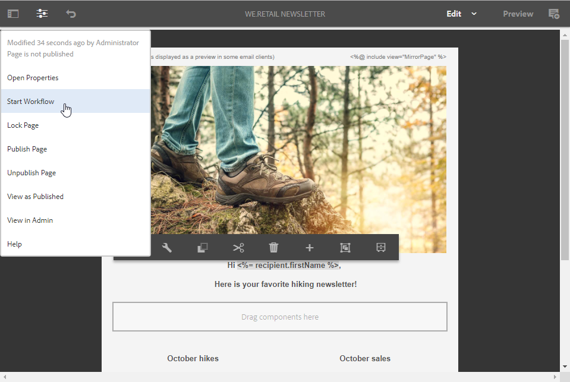

# 创建Experience Manager新闻稿{#creating-an-experience-manager-newsletter}

此集成可用于例如在Adobe Experience Manager中创建新闻稿，然后在Adobe Campaign中作为电子邮件促销活动的一部分使用。

有关如何使用此集成的更详细示例，请参阅此 [分步指南](https://helpx.adobe.com/campaign/kb/acc-aem.html).

**来自Adobe Experience Manager:**

1. 在您的AEM创作实例中，单击 **Adobe Experience** 徽标，然后选择 **[!UICONTROL Sites]**.

   

1. 选择 **[!UICONTROL Campaigns > Name of your brand (here We.Retail) > Main Area > Email campaigns]**。
1. 单击 **[!UICONTROL Create]** 按钮，然后选择 **[!UICONTROL Page]**.

   

1. 选择 **[!UICONTROL Adobe Campaign Email (AC 6.1)]** 模板并命名新闻稿。
1. 创建页面后，访问 **[!UICONTROL Page information]** 菜单，单击 **[!UICONTROL Open Properties]**.

   

1. 在 **[!UICONTROL Cloud Services]** 选项卡，选择 **[!UICONTROL Adobe Campaign]** as **[!UICONTROL Cloud service configuration]** 和您的Adobe Campaign实例。

   

1. 通过添加组件(例如Adobe Campaign中的个性化字段)来编辑电子邮件内容。
1. 电子邮件准备就绪后，访问 **[!UICONTROL Page information]** 菜单，单击 **[!UICONTROL Start workflow]**.

   

1. 从第一个下拉菜单中，选择 **[!UICONTROL Publish to Adobe Campaign]** 作为工作流模型，单击 **[!UICONTROL Start workflow]**.

   

1. 然后，与上一步一样，启动 **[!UICONTROL Approve for Campaign]** 工作流。
1. 免责声明将显示在页面顶部。 单击 **[!UICONTROL Complete]** 确认审阅并单击 **[!UICONTROL Ok]**.

   

1. 再次单击 **[!UICONTROL Complete]** 选择 **[!UICONTROL Newsletter approval]** 在 **[!UICONTROL Next Step]** 下拉菜单。

   

您的新闻稿现已准备就绪，并可在Adobe Campaign中同步。

**来自Adobe Campaign:**

1. 从 **[!UICONTROL Campaigns]** ，单击 **[!UICONTROL Deliveries]** then **[!UICONTROL Create]**.

   

1. 在 **[!UICONTROL Delivery template]** 下拉框中，选择 **[!UICONTROL Email delivery with AEM content (mailAEMContent)]** 模板。

   

1. 添加 **[!UICONTROL Label]** 投放，单击 **[!UICONTROL Continue]**.
1. 单击 **[!UICONTROL Synchronize]** 按钮。

   如果此按钮未显示在界面中，请单击 **[!UICONTROL Properties]** 按钮并选择 **[!UICONTROL Advanced]** 选项卡。 的 **[!UICONTROL Content editing mode]** 字段应设置为 **[!UICONTROL AEM]** 的AEM实例 **[!UICONTROL AEM account]** 字段。

   

1. 选择之前在Adobe Experience Manager中创建的投放，然后单击 **[!UICONTROL Ok]**.
1. 单击 **[!UICONTROL Refresh content]** 按钮。

   

您的电子邮件现已准备好发送给受众。
