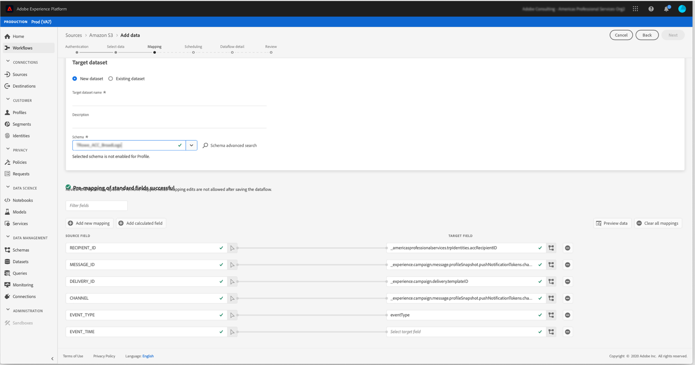

# 将数据从 Campaign 导出到 Adobe Experience Platform {#sources}

要将Campaign Classic数据导出到Adobe Real-time Customer Data Platform (RTCDP)，您首先需要在Campaign Classic中构建一个工作流，以将要共享的数据导出到S3或Azure Blob存储位置。

配置工作流并将数据发送到存储位置后，您需要将S3或Azure Blob存储位置连接为 **来源** 在AdobeExperience Platform中。

>[!NOTE]
>
>请注意，我们建议仅导出Campaign生成的数据（例如，发送、打开、点击等） Adobe Experience Platform。 从第三方源（如您的CRM）摄取的数据应直接导入Adobe Experience Platform。

## 在Campaign Classic中创建导出工作流

要将数据从Campaign Classic导出到S3或Azure Blob存储位置，您需要构建一个工作流以定向要导出的数据，并将其发送到您的存储位置。

为此，请添加并配置：

* An **[!UICONTROL Data extraction (file)]** 活动将目标数据提取到CSV文件中。 有关如何配置此活动的更多信息，请参阅 [本节](../../workflow/using/extraction-file.md).

  

* A **[!UICONTROL File transfer]** 将CSV文件传输到存储位置的活动。 有关如何配置此活动的更多信息，请参阅 [本节](../../workflow/using/file-transfer.md).

  

例如，以下工作流会定期将日志提取到CSV文件中，然后将文件传输到存储位置。

## 将存储位置作为源连接

将S3或Azure Blob存储位置连接为 **来源** Adobe中的Experience Platform如下所列。 有关每个步骤的详细信息，请参见 [源连接器文档](https://experienceleague.adobe.com/docs/experience-platform/sources/home.html?lang=zh-Hans).

1. 在AdobeExperience Platform中 **[!UICONTROL Sources]** 菜单，创建到存储位置的连接：

   * [创建Amazon S3源连接](https://experienceleague.adobe.com/docs/experience-platform/sources/ui-tutorials/create/cloud-storage/s3.html)
   * [Azure Blob连接器](https://experienceleague.adobe.com/docs/experience-platform/sources/connectors/cloud-storage/blob.html)

   >[!NOTE]
   >
   >存储位置可以是Amazon S3、使用密码的SFTP、使用SSH密钥的SFTP或Azure Blob连接。 将数据发送到Adobe Campaign的首选方法是通过Amazon S3或Azure Blob：

   

1. 为云存储批处理连接配置数据流。 数据流是一种计划任务，用于在存储位置检索数据并将其摄取到Adobe Experience Platform数据集。 此步骤允许您从存储位置配置数据摄取，包括数据选择和CSV字段到XDM架构的映射。

   有关详细信息，请参阅 [此页面](https://experienceleague.adobe.com/docs/experience-platform/sources/ui-tutorials/dataflow/cloud-storage.html).

   

1. 配置源后，Adobe Experience Platform将从您提供的存储位置导入文件。

   可以根据您的需要计划此操作。 我们建议每天执行导出多达6次，具体取决于实例中已存在的负载。
