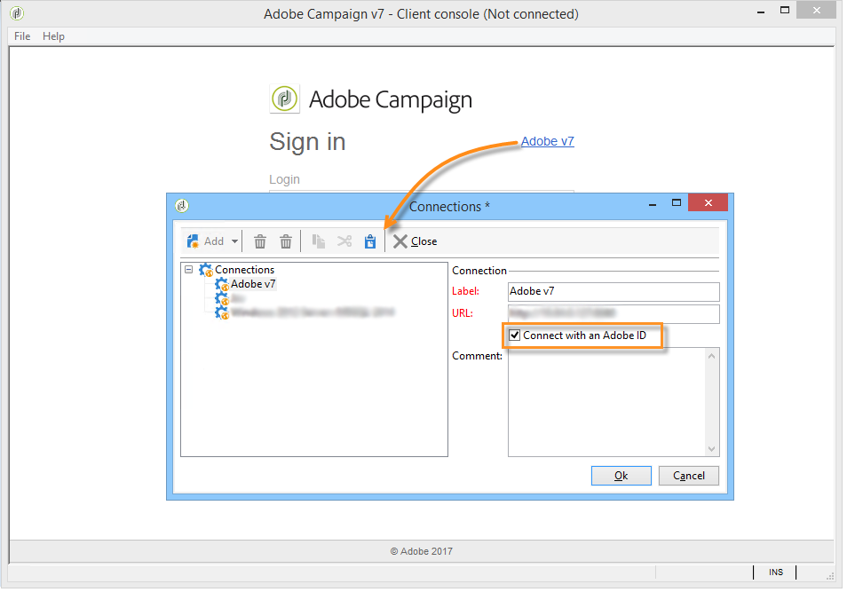

# 实施IMS{#implementing-ims}

完成[IMS配置](configuring-ims.md)后，您可以启用连接。

要在Adobe Campaign中启用IMS身份验证模式，请执行以下步骤：

1. 打开“客户端控制台”的“连接”屏幕。
1. 选择需要为其启用连接的环境。
1. 选中&#x200B;**[!UICONTROL Connect with an Adobe ID]**&#x200B;选项并保存更改。

   

1. 连接到此环境时，请使用您的Adobe ID和密码。
