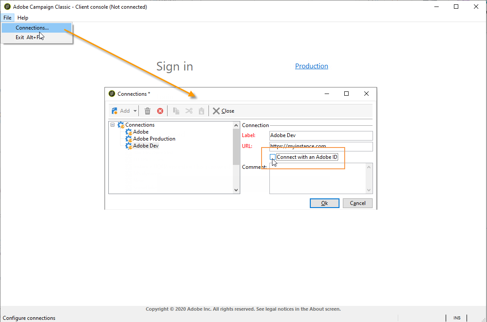

# 实现IMS{#implementing-ims}

## 启用IMS连接 {#enabling-the-ims-connection}

1. 要启用通过IMS进行连接，请在控制台的连接窗口中选中&#x200B;**[!UICONTROL Connect with an Adobe ID]**。

   

1. 输入Adobe ID和密码。 随后将显示Adobe Campaign主屏幕。

   

## 禁用IMS连接 {#disabling-the-ims-connection}

要禁用通过Adobe ID进行连接，请断开连接，单击&#x200B;**[!UICONTROL File > Connections]**&#x200B;并取消选中&#x200B;**[!UICONTROL Connect with an Adobe ID]**。

