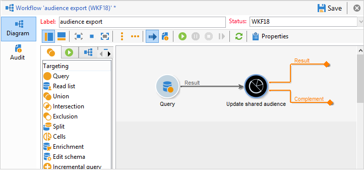

# 导入和导出受众{#importing-and-exporting-audiences}

## 导入受众 {#importing-an-audience}

您可以通过收件人列表将受众/区段从Audience Manager或People核心服务导入Adobe Campaign。

1. 转到 **[!UICONTROL Profiles and Targets]** > **[!UICONTROL Lists]** 节点。
1. 在操作栏中，选择 **[!UICONTROL New]** > **[!UICONTROL Create a shared audience...]**.

   

1. 在打开的窗口中，单击 **[!UICONTROL Select a shared audience]** 转到其他Adobe Experience Cloud解决方案中可用的共享受众/区段列表。
1. 选择受众并进行确认。 受众信息会自动完成。

   请注意，要能够导入共享受众，您应该获得 **[!UICONTROL Audience library]** 产品，并且是管理员Audience Manager。 有关更多信息，请参阅 [管理控制台文档](https://helpx.adobe.com/cn/enterprise/managing/user-guide.html).

   

1. 从 **[!UICONTROL AMC Data source]** 字段来定义预期的数据类型。

   

1. 保存受众。

受众通过技术工作流导入。 导入的列表包含可使用AMC数据源协调的元素。 未被Adobe Campaign识别的元素不会导入。

当区段直接从People核心服务或Audience Manager导入时，导入过程需要24-36小时才能同步。 在此期间后，您将能够在Adobe Campaign中查找和使用新受众。

>[!NOTE]
>
>如果您要将受众从Adobe Analytics导入Adobe Campaign，则需要先在“人员”核心服务或Audience Manager中共享这些受众。 此过程需要12-24小时，而且必须将其添加到与Campaign的24-36小时同步中。
>
>在这种情况下，受众共享的时间范围最长为60小时。 有关在People Core Service和Audience Manager中共享Adobe Analytics受众的更多信息，请参阅 [Adobe Analytics文档](https://experienceleague.adobe.com/docs/analytics/components/segmentation/segmentation-workflow/seg-publish.html).

每次同步受众数据时，受众数据都会被完全替换。 只能导入区段。 不支持粒度数据，包括键值对、特征和规则。

## 导出受众 {#exporting-an-audience}

您可以使用工作流将受众从Adobe Campaign导出到Audience Manager或People核心服务。 有关创建和使用工作流的过程，请参见 [本文档](../../workflow/using/building-a-workflow.md). 导出的受众将另存为People核心服务中的区段：

1. 创建新的定位工作流。
1. 使用可用的不同活动，定位一组收件人。
1. 定位后，拖放 **[!UICONTROL Update shared audience]** 活动，然后将其打开。

   

1. 定义要通过 **[!UICONTROL Select a shared audience]** 选项。 在打开的窗口中，您可以选择现有受众或创建新受众。

   如果您选择了现有受众，则只会向该受众添加新记录。

   要在新受众中导出收件人列表，请完成 **[!UICONTROL Segment name]** 字段，然后单击 **[!UICONTROL Create]** 选择新创建的受众之前。

   单击窗口右上方的复选符号，然后单击 **[!UICONTROL OK]** 按钮。

1. 选择 **[!UICONTROL AMC Data source]** 以指定预期的数据类型。 系统会自动确定架构。

   

1. 保存受众。

随后将导出受众。 保存受众活动具有两个叫客过渡。 主过渡包含已成功导出的收件人。 其他过渡包含无法映射访客ID或声明ID的收件人。

Adobe Campaign与People核心服务之间的同步需要24-36小时。 在此期间后，您将能够在“人员”核心服务中找到新受众，并在其他Adobe Experience Cloud解决方案中重复使用该受众。 有关在“Adobe人员”核心服务中使用Adobe Campaign共享受众的更多信息，请参阅此 [文档](https://experienceleague.adobe.com/docs/core-services/interface/audiences/t-audience-create.html).

>[!NOTE]
>
>要进行协调，记录必须具有Adobe Experience Cloud ID（“访客ID”或“声明的ID”）。 导出和导入受众时，将忽略没有Adobe Experience Cloud ID的记录。
