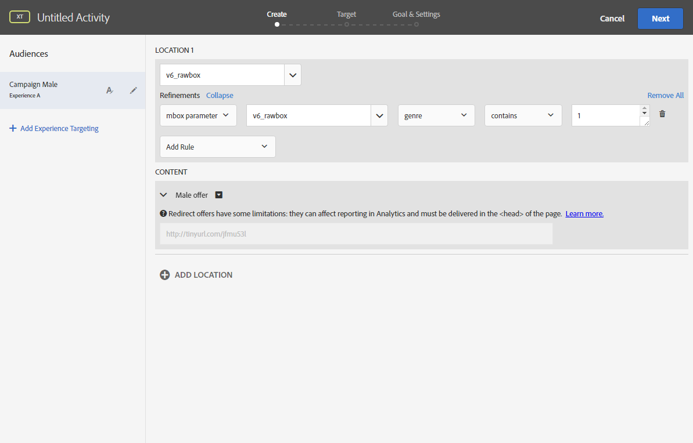

# 插入动态图像{#inserting-a-dynamic-image}

本节详细介绍了在Adobe Campaign中执行的步骤，以将Adobe Target中的图像集成到电子邮件中。

您必须事先在Adobe Target中执行以下操作：

* 创建一个或多个 [重定向选件](https://marketing.adobe.com/resources/help/en_US/tnt/help/t_Creating_a_Redirect_Offer.html)，您必须在其中指定要使用的图像的URL。
* 创建一个或多 [个受众](https://marketing.adobe.com/resources/help/en_US/target/target/t_create-audience.html)，以定义活动的目标。
* 创建基 [于表单的体验编写器活动](https://marketing.adobe.com/resources/help/en_US/tnt/help/t_Creating_an_A_B_Test.html) ，您必须在其中选择一个rawbox并根据创建的重定向选件的数量指定多个体验。 对于每个体验，您必须选择一个已创建的重定向选件。

   要指定这些体验，您可以使用Adobe Campaign中的信息创建区段。 要在选件的选择规则中使用Adobe Campaign中的数据，您必须在Adobe Target的rawbox中指定数据。

要在Adobe Campaign交付中插入Adobe Target图像，请执行以下操作：

1. 创建电子邮件分发。
1. 在可用的个性化字段中，选择 **[!UICONTROL Include > Dynamic image served by Adobe Target]**。

   

1. 在打开的窗口中，选择默认将在电子邮件中显示的图像。 您可以指定图像URL或使用共 [享图像](../../integrations/using/sharing-assets-with-adobe-experience-cloud.md)。
1. 输入在Adobe Target中指定的rawbox的名称。
1. 如果希望默认图像重 **[!UICONTROL Landing Page]** 定向到默认登录页面，请在字段中输入URL。 此URL仅适用于默认图像显示在最终电子邮件中且为可选图像的情况。
1. 如果您在Adobe target中的设置中使用Enterprise权限，请在此字段中添加相应的属性。 在本页中进一步了解Target Enterprise [权限](https://marketing.adobe.com/resources/help/en_US/target/target/properties-overview.html)。 如果您未在Target中使用Enterprise权限，则此字段为可选字段，而非必需字段。
1. 在 **[!UICONTROL Additional decision parameters]**&#x200B;中，指定Adobe Target区段中定义的字段与Adobe Campaign字段之间的映射。 在rawbox中必须已指定使用的Adobe Campaign字段。

   

   在Adobe target中定义参数是通过在Adobe Campaign中集成Target图像和优化选项时创建的rawbox **执行的** 。

   

   此处显示的示例演示了如何为男性和女性定义不同的体验。

您还可以根据用户的电子邮件域和地址定义多个案例。 打开电子邮件时，数据会从用户的浏览器中自动恢复。

在预览电子邮件时，您可以在选择不同的配置文件时看到，图像插入的内容会根据Adobe Target活动和Adobe Campaign中指定的参数而发生更改。

您可以在Adobe Target中测量发送结果。

