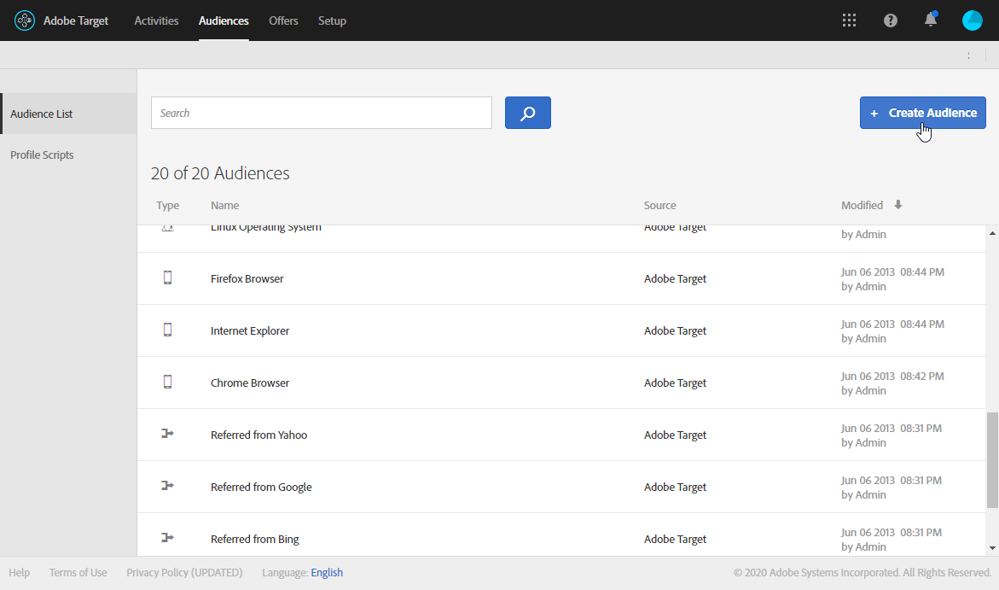

# 插入Target动态内容 {#inserting-a-dynamic-image}

在本指南中，我们将介绍如何将动态选件从Target集成到Adobe Campaign中的电子邮件中。

我们希望创建包含图像块的投放，该图像块将根据收件人所在的国家/地区进行动态更改。 数据随每个mbox请求一起发送，具体取决于访客的IP地址。

在此电子邮件中，我们希望其中一幅图像会根据以下用户体验进行动态更改：

* 电子邮件在法国打开。
* 电子邮件在美国打开。
* 如果这些条件都不适用，则会显示默认图像。

要使此功能正常工作，我们需要在Adobe Campaign和Target中执行以下步骤：

1. [在电子邮件中插入动态选件](../../integrations/using/inserting-a-dynamic-image.md#inserting-dynamic-offer)
1. [创建重定向选件](../../integrations/using/inserting-a-dynamic-image.md#create-redirect-offers)
1. [创建受众](../../integrations/using/inserting-a-dynamic-image.md#audiences-target)
1. [创建体验定位活动](../../integrations/using/inserting-a-dynamic-image.md#creating-targeting-activity)
1. [预览和发送电子邮件](../../integrations/using/inserting-a-dynamic-image.md#preview-send-email)

## 在电子邮件中插入动态选件 {#inserting-dynamic-offer}

在Adobe Campaign中，完成定义电子邮件的目标和内容后，即可从Target插入动态图像。

为此，请指定默认图像的URL、位置名称和要传输到Target的字段。

在Adobe Campaign中，有两种方法可将Target中的动态图像插入电子邮件：

* 如果使用数字内容编辑器，请选择现有图像，然后从工具栏中选择&#x200B;**[!UICONTROL Insert]** > **[!UICONTROL Dynamic image served by Adobe Target]**。

   

* 如果您使用标准编辑器，请将光标放在要插入图像的位置，然后从个性化下拉菜单中选择&#x200B;**[!UICONTROL Include]** > **[!UICONTROL Dynamic image served by Adobe Target...]**。

   

### 定义图像参数 {#defining-image-parameters}

* **[!UICONTROL Default image]**&#x200B;的URL:未满足任何条件时将显示的图像。 您还可以从资产库中选择图像。
* **[!UICONTROL Target location]**:输入动态选件位置的名称。 您必须在Target活动中选择此位置。
* **[!UICONTROL Landing Page]**:如果您希望默认图像重定向到默认登陆页面。 此URL仅适用于默认图像显示在最终电子邮件中的情况，并且是可选的。
* **[!UICONTROL Additional decision parameters]**:指定在Adobe Target区段中定义的字段与Adobe Campaign字段之间的映射。 使用的Adobe Campaign字段必须已在rawbox中指定。 在我们的示例中，我们添加了Country字段。

如果您在Adobe Target的设置中使用企业权限，请在此字段中添加相应的资产。 在[此页面](https://experienceleague.adobe.com/docs/target/using/administer/manage-users/enterprise/properties-overview.html)中了解有关Target企业权限的更多信息。

## 创建重定向选件 {#create-redirect-offers}

在Target中，您可以创建选件的不同版本。 根据每个用户体验，可以创建重定向选件，您可以指定将显示的图像。

在本例中，我们需要两个重定向选件，第三个（默认选件）是在Adobe Campaign中定义。

1. 要在Target Standard中新建重定向选件，请在&#x200B;**[!UICONTROL Content]**&#x200B;选项卡中，单击&#x200B;**[!UICONTROL Code offers]**。

1. 单击 **[!UICONTROL Create]**，然后单击 **[!UICONTROL Redirect Offer]**。

   

1. 输入选件的名称和图像的URL。

   

1. 对于剩余的重定向选件，请按照相同的步骤操作。 有关详细信息，请参见此 [ 页面](https://experienceleague.adobe.com/docs/target/using/experiences/offers/offer-redirect.html)。

## 创建受众 {#audiences-target}

在Target中，您需要创建两个受众，访问您选件的人员将被分类到这两个受众，以获取要交付的不同内容。 对于每个受众，添加一个规则以定义谁将能够查看选件。

1. 要在Target中创建新受众，请在&#x200B;**[!UICONTROL Audiences]**&#x200B;选项卡中，单击&#x200B;**[!UICONTROL Create Audience]**。

   

1. 向受众添加名称。

   

1. 单击&#x200B;**[!UICONTROL Add a rule]**&#x200B;并选择类别。 规则使用特定条件来定位访客。 您可以通过添加条件或在其他类别中创建新规则来优化规则。

1. 对其余受众执行相同的操作步骤。

## 创建体验定位活动 {#creating-targeting-activity}

在Target中，我们需要创建体验定位活动，定义不同的体验，并将它们与相应的选件相关联。

### 定义受众 {#defining-the-audience}

1. 要创建体验定位活动，请在&#x200B;**[!UICONTROL Activities]**&#x200B;选项卡中，单击&#x200B;**[!UICONTROL Create Activity]**，然后单击&#x200B;**[!UICONTROL Experience Targeting]**。

   

1. 选择&#x200B;**[!UICONTROL Form]**&#x200B;作为&#x200B;**[!UICONTROL Experience Composer]**。

1. 单击&#x200B;**[!UICONTROL Change audience]**&#x200B;按钮以选择受众。

   

1. 选择在前面的步骤中创建的受众。

   

1. 通过单击&#x200B;**[!UICONTROL Add Experience Targeting]**&#x200B;创建其他体验。

### 定义位置和内容 {#defining-location-content}

为每个受众添加一个内容：

1. 选择在Adobe Campaign中插入动态选件时选择的位置名称。

   

1. 单击下拉按钮，然后选择&#x200B;**[!UICONTROL Change Redirect Offer]**。

   

1. 选择您之前创建的重定向选件。

   

1. 对第二个体验执行相同的步骤。

### 定义活动 {#defining-activity}

**[!UICONTROL Target]**&#x200B;窗口将汇总您的活动。 如有必要，您可以添加其他体验。

利用&#x200B;**[!UICONTROL Goal & Settings]**&#x200B;窗口，可通过设置优先级、目标或持续时间来个性化活动。

通过&#x200B;**[!UICONTROL Reporting Settings]**&#x200B;部分，您可以选择一项操作并编辑将决定何时实现目标的参数。

## 在Campaign Classic中预览和发送电子邮件 {#preview-send-email}

在Adobe Campaign中，您现在可以预览电子邮件并在不同的收件人上测试其呈现效果。 您会注意到图像会根据创建的不同体验而发生更改。 要了解有关创建电子邮件的更多信息，请参阅此[页面](../../delivery/using/defining-the-email-content.md)。

现在，您即可发送包含Target动态选件的电子邮件。

