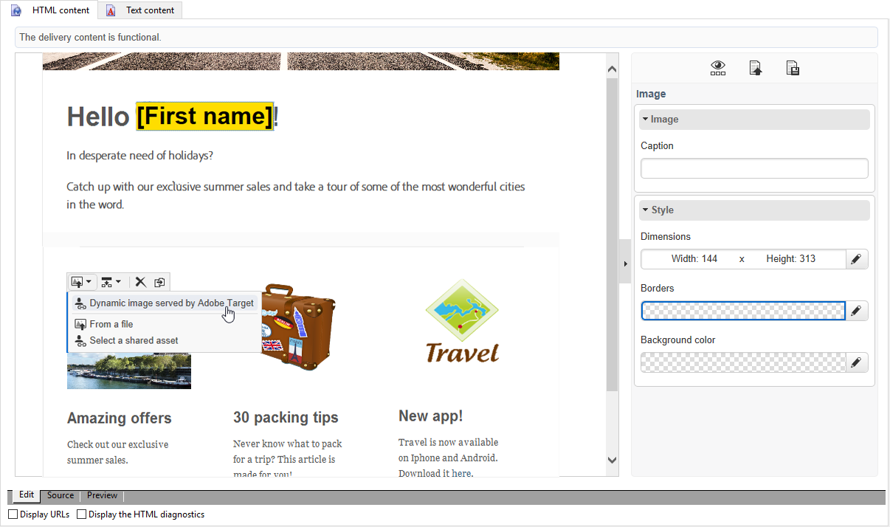

# 插入Target动态内容 {#inserting-a-dynamic-image}

在本页中，了解如何将Adobe Target中的动态选件集成到Adobe Campaign中的电子邮件中。

其目的是创建一个包含图像块的投放，该图像块会根据收件人的国家/地区进行动态更改：数据随每个mbox请求一起发送，并取决于收件人的IP地址。

在此消息中，图像可根据以下用户体验动态变化：

* 该电子邮件在法国开立。
* 此电子邮件在美国开立。
* 如果这些条件都不适用，则会显示默认图像。

要执行此操作，请应用以下步骤：

1. [在电子邮件中插入动态选件](../../integrations/using/inserting-a-dynamic-image.md#inserting-dynamic-offer)
1. [创建重定向选件](../../integrations/using/inserting-a-dynamic-image.md#create-redirect-offers)
1. [创建受众](../../integrations/using/inserting-a-dynamic-image.md#audiences-target)
1. [创建体验定位活动](../../integrations/using/inserting-a-dynamic-image.md#creating-targeting-activity)
1. [预览并发送电子邮件](../../integrations/using/inserting-a-dynamic-image.md#preview-send-email)

## 在电子邮件中插入动态选件 {#inserting-dynamic-offer}

在Adobe Campaign中，定义完电子邮件的目标和内容后，可以从Target插入动态图像。

为此，请指定默认图像的URL、位置名称以及要传输到Target的字段。

在Adobe Campaign中，可通过两种方式将动态图像从Target插入到电子邮件中：

* 如果您使用的是数字内容编辑器，请选择现有图像并选择 **[!UICONTROL Insert]** > **[!UICONTROL Dynamic image served by Adobe Target]** 工具栏中。

  

* 如果使用标准编辑器，请将光标置于要插入图像的位置，然后选择 **[!UICONTROL Include]** > **[!UICONTROL Dynamic image served by Adobe Target...]** 从个性化下拉菜单中。

  

### 定义图像参数 {#defining-image-parameters}

* 此 **[!UICONTROL Default image]**&#x200B;的URL：在任何条件都不满足时将显示的图像。 您还可以从资源库中选择图像。
* 此 **[!UICONTROL Target location]**：输入动态选件位置的名称。 您必须在Target活动中选择此位置。
* 此 **[!UICONTROL Landing Page]**：如果您希望将默认图像重定向到默认登陆页面。 此URL仅适用于默认图像显示在最终电子邮件中的情况，并且是可选的。
* 此 **[!UICONTROL Additional decision parameters]**：指定Adobe Target区段中定义的字段与Adobe Campaign字段之间的映射。 使用的Adobe Campaign字段必须在rawbox中指定。 在我们的示例中，我们添加了“国家/地区”字段。

如果您在Adobe Target的设置中使用企业权限，请在此字段中添加相应的资产。 在中了解有关Target企业权限的更多信息 [此页面](https://experienceleague.adobe.com/docs/target/using/administer/manage-users/enterprise/properties-overview.html).

## 创建重定向选件 {#create-redirect-offers}

在Target中，您可以创建选件的不同版本。 根据每个用户体验，可以创建重定向选件，您可以指定要显示的图像。

在我们的示例中，我们需要两个重定向选件，第三个选件（默认选件）将在Adobe Campaign中定义。

1. 要在Target Standard中创建新重定向选件，请通过 **[!UICONTROL Content]** 选项卡，单击 **[!UICONTROL Code offers]**.

1. 单击 **[!UICONTROL Create]**，然后单击 **[!UICONTROL Redirect Offer]**。

   

1. 输入选件的名称和图像的URL。

   

1. 对其余重定向选件执行相同的过程。 有关详细信息，请参见此 [ 页面](https://experienceleague.adobe.com/docs/target/using/experiences/offers/offer-redirect.html)。

## 创建受众 {#audiences-target}

在Target中，您需要创建两个受众，对于要交付的不同内容，您的选件访问者将分类到该两个受众中。 为每个受众添加规则以定义能够查看选件的人员。

1. 要在Target中创建新受众，请执行以下操作： **[!UICONTROL Audiences]** 选项卡，单击 **[!UICONTROL Create Audience]**.

   

1. 向受众添加名称。

   

1. 单击 **[!UICONTROL Add a rule]** 并选择类别。 规则使用特定标准来定位访客。 您可以通过添加条件或其他类别中创建新规则来优化规则。

1. 对其余受众执行相同的过程。

## 创建体验定位活动 {#creating-targeting-activity}

在Target中，我们需要创建体验定位活动，定义不同的体验，并将它们与相应的选件相关联。

### 定义受众 {#defining-the-audience}

1. 要创建体验定位活动，请从 **[!UICONTROL Activities]** 选项卡，单击 **[!UICONTROL Create Activity]** 则 **[!UICONTROL Experience Targeting]**.

   

1. 选择 **[!UICONTROL Form]** 作为 **[!UICONTROL Experience Composer]**.

1. 通过单击 **[!UICONTROL Change audience]** 按钮。

   

1. 选择在上一步中创建的受众。

   

1. 通过单击创建其他体验 **[!UICONTROL Add Experience Targeting]**.

### 定义位置和内容 {#defining-location-content}

为每个受众添加内容：

1. 选择在Adobe Campaign中插入动态选件时选择的位置名称。

   

1. 单击下拉按钮并选择 **[!UICONTROL Change Redirect Offer]**.

   

1. 选择您之前创建的重定向选件。

   

1. 对第二个体验执行相同的步骤。

### 定义活动 {#defining-activity}

此 **[!UICONTROL Target]** 窗口将汇总您的活动。 如有必要，您可以添加其他体验。

此 **[!UICONTROL Goal & Settings]** 窗口允许您通过设置优先级、目标或持续时间来个性化活动。

此 **[!UICONTROL Reporting Settings]** 部分允许您选择操作并编辑将决定何时实现目标的参数。

## 预览并发送电子邮件 {#preview-send-email}

在Adobe Campaign中，您现在可以预览电子邮件并测试其针对不同收件人的呈现方式。 您会注意到图像会根据创建的不同体验而发生更改。 要了解有关电子邮件创建的更多信息，请参阅此 [页面](../../delivery/using/defining-the-email-content.md).

您现在可以发送包含Target动态选件的电子邮件。

