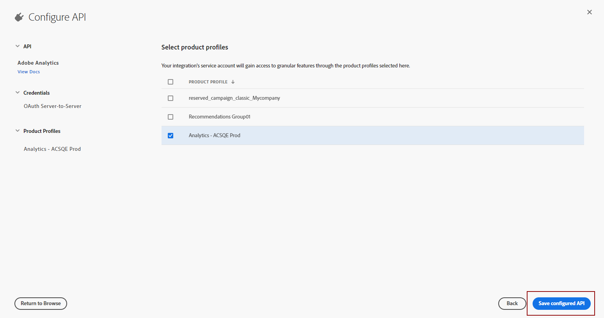

# 创建您的 Adobe 技术帐户 {#create-service-account}

服务器到服务器身份验证凭据允许应用程序的服务器生成访问令牌并代表应用程序本身进行API调用。 [了解详情](https://developer.adobe.com/developer-console/docs/guides/authentication/ServerToServerAuthentication/)

## 迁移现有集成 {#migrate-jwt}

Adobe将弃用服务帐户(JWT)凭据。 Campaign与Adobe解决方案和应用程序的集成现在必须依赖OAuth服务器到服务器凭据。

如果您在2024年6月之前实施了Campaign入站或出站集成，则必须将Campaign环境升级到v7.4.1，并将技术帐户迁移到oAuth，如本文档[&#128279;](https://developer.adobe.com/developer-console/docs/guides/authentication/ServerToServerAuthentication/migration){target="_blank"}中所述。 现有服务帐户(JWT)凭据将继续工作，直到&#x200B;**2025年6月30日**。

迁移完成后，您必须按照[此部分](#add-credentials)中的说明将新凭据关联到Campaign。

## 为新集成创建新的OAuth技术帐户 {#oauth-service}

要为新集成创建您的OAuth技术帐户，请执行以下步骤：

1. 访问Adobe Developer控制台并以您组织的&#x200B;**系统管理员**&#x200B;身份登录。

   有关管理员角色的更多信息，请参阅此[页面](https://helpx.adobe.com/enterprise/using/admin-roles.html)。

1. 单击 **[!UICONTROL Create a new project]**。

   

1. 单击&#x200B;**[!UICONTROL Add to Project]**&#x200B;并选择&#x200B;**[!UICONTROL API]**。

   

1. 选择要与Campaign集成的产品，然后单击&#x200B;**[!UICONTROL Next]**。

1. 选择&#x200B;**[!UICONTROL OAuth Server-to-Server]**&#x200B;作为身份验证类型，然后单击&#x200B;**[!UICONTROL Next]**。

   

1. 选择项目的&#x200B;**[!UICONTROL Product profile]**&#x200B;链接。

   如果需要，您可以创建新插件。 [了解详情](https://helpx.adobe.com/enterprise/using/manage-product-profiles.html)

1. 然后，单击&#x200B;**[!UICONTROL Save Configured API]**。

   

1. 在项目中，在凭据下，选择[!DNL OAuth Server-to-Server]并复制以下信息：

   * **[!UICONTROL Client ID]**
   * **[!UICONTROL Client secret]**
   * **[!UICONTROL Technical account ID]**
   * **[!UICONTROL Organization ID]**

## 在Campaign中添加OAuth项目凭据 {#add-credentials}

执行上述步骤后，在Adobe Campaign中添加您的OAuth项目凭据。

>[!NOTE]
>
>作为托管或托管式云服务客户，不需要执行此步骤： Adobe已将您的OAuth项目凭据添加到您的环境中。
>

对于内部部署或混合型客户，请执行以下步骤：

1. 通过SSH登录到安装了Adobe Campaign实例的每个容器。

1. 通过以`neolane`用户身份运行以下命令，在Adobe Campaign中添加您的OAuth项目凭据。 这将在实例配置文件中插入&#x200B;**[!UICONTROL Technical Account]**&#x200B;凭据。

   ```
   nlserver config -instance:<instance_name> -setimsoauth:ims-org-id/client-id/technical-account-id/client-secret
   ```

   >[!NOTE]
   >
   > 对于低于7.4.1的版本，请使用`setimsauth`或`setimsjwtauth`，而不是`setimsoauth`。


