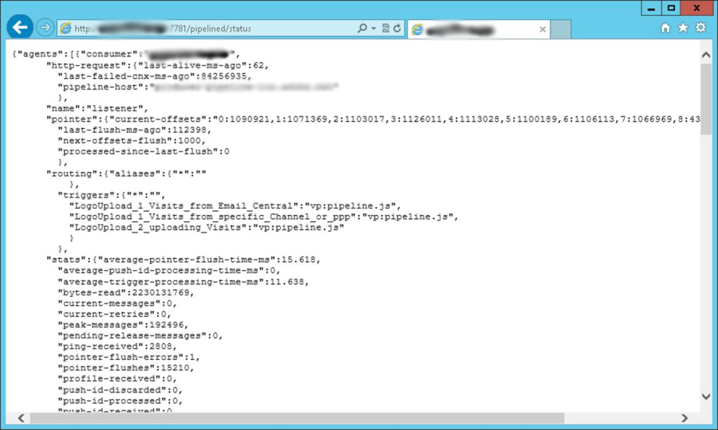

# 管道监测 {#pipeline-monitoring}

此 [!DNL pipelined] 状态web服务提供了有关以下项状态的信息： [!DNL pipelined] 进程。

它可以使用浏览器手动访问，也可以使用监控应用程序自动访问。

它采用REST格式，如下所述。

## 指标 {#indicators}

此部分列出了状态Web服务中的指示器。

建议监测的指标会突出显示。

* 使用者：提取触发器的客户端的名称。 在管道选项中配置。
* http-request
   * last-alive-ms-ago：自进行连接检查以来的时间（以毫秒为单位）。
   * last-failed-cnx-ms-ago：自上次连接检查失败以来的时间（以毫秒为单位）。
   * pipeline-host：从中提取管道数据的主机的名称。
* 指针
   * current-offsets：指针（按子线程）进入管道的值。
   * last-flush-ms-ago：自检索到一批触发器以来的时间（以毫秒为单位）。
   * next-offsets-flush：完成时等到下一个批次的时间。
   * processed-since-last-flush：上一批次中处理的触发器数。
* 路由
   * triggers：检索到的触发器列表。 在中配置 [!DNL pipelined] 选项。
* 统计信息
   * average-pointer-flush-time-ms：一批触发器的平均处理时间。
   * average-trigger-processing-time-ms：分析触发器数据所用的平均时间。
   * bytes-read：自进程启动以来从队列中读取的字节数。
   * current-messages：当前已从队列提取并等待处理的待处理消息数。 **此指标应接近零**.
   * current-retries：处理失败并等待重试的当前消息数。
   * peak-messages：进程自启动以来处理的最大挂起消息数。
   * 指针刷新：自启动以来处理的消息批次数。
   * routing-JS-custom：由自定义JS处理的消息数。
   * trigger-discarded：因处理错误而重试过多后丢弃的消息数。
   * trigger-processed：已处理但未出现错误的消息数。
   * trigger-received：从队列接收的消息数。

这些统计信息按处理线程显示。

* average-trigger-processing-time-ms：分析触发器数据所用的平均时间。
* is-JS-processor：如果此线程使用自定义JS，则值为“1”。
* trigger-discarded：因处理错误而重试过多后丢弃的消息数。 **此指标应为零**.
* trigger-failures： JS中的处理错误数。 **此指标应为零**.
* trigger-received：从队列接收的消息数。

* 设置：在配置文件中设置它们。
   * flush-pointer-msg-count：批次中的消息数。
   * flush-pointer-period-ms：两个批次之间的时间（以毫秒为单位）。
   * processing-threads-JS：运行自定义JS的处理线程数。
   * retry-period-ms：发生处理错误时两次重试之间的时间。
   * retry-validity-duration-ms：重试处理直至丢弃消息的持续时间。
   * 管道消息报表

## 管道消息报表 {#pipeline-report}

此报表显示过去五天内每小时的消息数。

