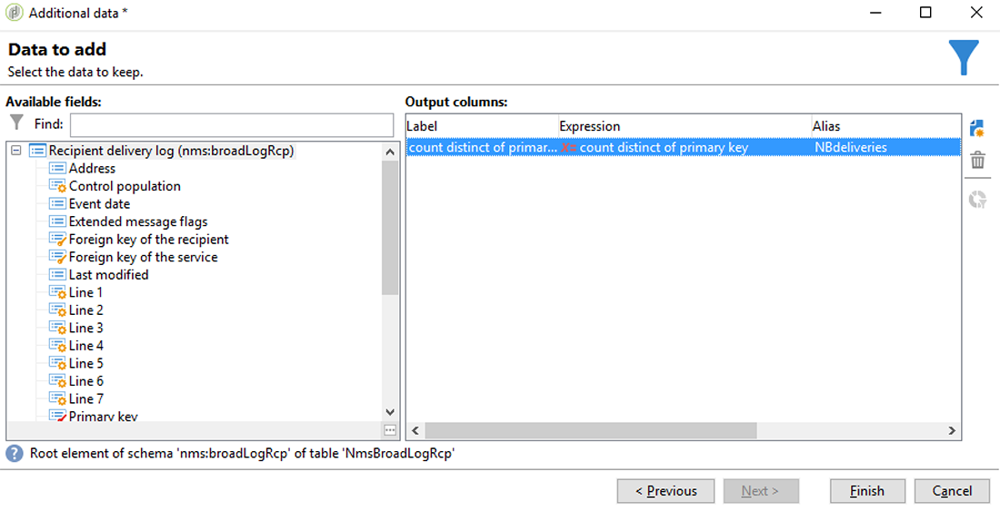

# 同步受众{#synchronizing-audiences}

您可以使用Campaign v7高级功能构建一个复杂的列表，并以无缝方式直接实时地作为受众与Campaign Standard（包括其他数据）共享此列表。 然后，您的Campaign Standard用户可以在Adobe Campaign Standard中使用受众。

复杂的定位涉及Campaign Standard中未复制的附加数据，只能使用Campaign v7实现。

您还只需共享通过连接器（如Microsoft Dynamics）的收件人列表或数据，即可Campaign Standard。

此用例展示了如何在Campaign v7中准备投放的目标，以及如何在随Adobe Campaign Standard创建和发送的投放中重复使用此目标及其附加数据。

>[!NOTE]
>
>如果您需要的所有数据都已复制，则还可以在Adobe Campaign Standard中使用聚合和集合来扩充数据。

## 先决条件 {#prerequisites}

要实现此目的，您需要：

* 收件人存储在Campaign v7数据库中，并与Campaign Standard同步。 请参阅[同步配置文件](../../integrations/using/synchronizing-profiles.md)一节。
* 其他数据，如存储在与Campaign v7数据库中nms:recipients相关的表中的订阅或交易。 这些数据可以来自Campaign v7 OOB模式或自定义表。 默认情况下，由于未同步，因此它们在Campaign Standard中不可用。
* 有权在Campaign v7和Campaign Standard中执行工作流。
* 有权在Campaign Standard中创建和执行投放。

## 在Campaign v7中使用附加数据创建定位工作流 {#create-a-targeting-workflow-with-additional-data-in-campaign-v7}

复杂的定位涉及Campaign Standard中未复制的附加数据，只能使用Campaign v7实现。

定义目标及其附加数据后，可以将其另存为可与Campaign Standard共享的列表。

>[!NOTE]
>
>这是一个示例。 根据您的要求，您只需查询收件人列表并与ACS共享该列表即可，无需进一步处理。 您还可以使用其他数据管理活动来准备最终目标。

要获取最终受众及其附加数据，请执行以下操作：

1. 从&#x200B;**[!UICONTROL Profiles and Targets]** > **[!UICONTROL Jobs]** > **[!UICONTROL Targeting workflows]**&#x200B;创建新工作流。
1. 添加&#x200B;**[!UICONTROL Query]**&#x200B;活动，并选择要向其发送最终电子邮件的收件人。 例如，所有18至30岁的收件人都居住在法国。

   

1. 从查询中添加其他数据。 有关更多信息，请参阅[添加数据](../../workflow/using/query.md#adding-data)一节。

   此示例显示如何添加聚合以计算收件人一年中收到的投放数量。

   在&#x200B;**[!UICONTROL Query]**&#x200B;中，选择&#x200B;**[!UICONTROL Add data...]**。

   

1. 选择 **[!UICONTROL Data linked to the filtering dimension]** 并单击 **[!UICONTROL Next]**。

   

1. 选择&#x200B;**[!UICONTROL Data linked to the filtering dimension]**，然后选择&#x200B;**[!UICONTROL Recipient delivery logs]**&#x200B;节点，然后单击&#x200B;**[!UICONTROL Next]**。

   

1. 在&#x200B;**[!UICONTROL Data collected]**&#x200B;字段中选择&#x200B;**[!UICONTROL Aggregates]**，然后单击&#x200B;**[!UICONTROL Next]**。

   

1. 添加筛选条件以仅考虑过去365天内创建的日志，然后单击&#x200B;**[!UICONTROL Next]**。

   

1. 定义输出列。 在此，只需要一列来计数投放数量。 为此，请执行以下操作：

   * 选择窗口右侧的&#x200B;**[!UICONTROL Add]**。
   * 在&#x200B;**[!UICONTROL Select field]**&#x200B;窗口中，单击&#x200B;**[!UICONTROL Advanced selection]**。
   * 选择&#x200B;**[!UICONTROL Aggregate]**，然后选择&#x200B;**[!UICONTROL Count]**。 选中&#x200B;**[!UICONTROL Distinct]**&#x200B;选项，然后单击&#x200B;**[!UICONTROL Next]**。
   * 在字段列表中，选择用于&#x200B;**Count**&#x200B;函数的字段。 选择将始终填充的字段，例如&#x200B;**[!UICONTROL Primary key]**&#x200B;字段，然后单击&#x200B;**[!UICONTROL Finish]**。
   * 更改&#x200B;**[!UICONTROL Alias]**&#x200B;列中的表达式。 利用此别名，可轻松检索最终投放中添加的列。 例如&#x200B;**NBdeliveries**。
   * 单击&#x200B;**[!UICONTROL Finish]**&#x200B;并保存&#x200B;**[!UICONTROL Query]**&#x200B;活动配置。

   

1. 保存工作流。下一部分将演示如何与ACS共享群体。

## 与Campaign Standard共享目标 {#share-the-target-with-campaign-standard}

定义目标群体后，您可以通过&#x200B;**[!UICONTROL List update]**&#x200B;活动与ACS共享该群体。

1. 在之前创建的工作流中，添加&#x200B;**[!UICONTROL List update]**&#x200B;活动，并指定要更新或创建的列表。

   指定要在Campaign v7中保存列表的文件夹。 列表受实施期间定义的文件夹映射的约束，在Campaign Standard中共享后，该映射会对其可见性产生影响。 请参阅[权限转换](../../integrations/using/acs-connector-principles-and-data-cycle.md#rights-conversion)一节。

1. 确保选中&#x200B;**[!UICONTROL Share with ACS]**&#x200B;选项。 默认勾选。

   

1. 保存并执行工作流。

   目标及其附加数据会保存在Campaign v7的列表中，并立即作为列表受众在Campaign Standard中共享。 只有已复制的用户档案才会与ACS共享。

如果&#x200B;**[!UICONTROL List update]**&#x200B;活动发生错误，则表示与Campaign Standard的同步可能失败。 要查看有关问题的更多详细信息，请转到&#x200B;**[!UICONTROL Administration]** > **[!UICONTROL ACS Connector]** > **[!UICONTROL Process]** > **[!UICONTROL Diagnosis]**。 此文件夹包含由&#x200B;**[!UICONTROL List update]**&#x200B;活动执行触发的同步工作流。 请参阅[ACS Connector](../../integrations/using/troubleshooting-the-acs-connector.md)疑难解答一节。

## 在Campaign Standard中检索数据，并将其用在投放中 {#retrieve-the-data-in-campaign-standard-and-use-it-in-a-delivery}

在Campaign v7中执行定位工作流后，您便能够从&#x200B;**[!UICONTROL Audiences]** Campaign Standard菜单中以只读模式找到列表受众。

通过在Campaign Standard中创建投放工作流，可以使用此受众以及投放中包含的附加数据。

1. 从&#x200B;**[!UICONTROL Marketing activities]**&#x200B;菜单创建新工作流。
1. 添加&#x200B;**[!UICONTROL Read audience]**&#x200B;活动，并选择您之前从Campaign v7中共享的受众。

   此活动用于检索选定受众的数据。 如果需要，您还可以使用此活动的相应选项卡，应用额外的&#x200B;**[!UICONTROL Source Filtering]**。

1. 添加&#x200B;**[!UICONTROL Email delivery]**&#x200B;活动，并将其配置为任何其他[电子邮件投放活动](https://experienceleague.adobe.com/docs/campaign-standard/using/managing-processes-and-data/channel-activities/email-delivery.html)。
1. 打开投放内容。
1. 添加个性化字段。从弹出窗口中，找到&#x200B;**[!UICONTROL Additional data (targetData)]**&#x200B;节点。 此节点包含在初始定位工作流中计算的受众附加数据。 您可以将它们用作任何其他个性化字段。

   对于此示例，来自原始定位工作流的附加数据是过去365天内发送给每个收件人的投放数量。 此处显示定位工作流中指定的NBdeliveries别名。

   

1. 保存投放和工作流。

   工作流现已准备就绪，可供执行。 将分析投放并准备发送。

   

## 发送并监控投放 {#send-and-monitor-your-delivery}

投放及其内容准备就绪后，发送投放：

1. 执行投放工作流。 此步骤将准备要发送的电子邮件。
1. 在投放仪表板中，手动确认可以发送投放。
1. 监控投放的报告和日志：

   * **在Campaign Standard**&#x200B;中：作为任  何  投放，访问与投放相关的报表和日志。
   * **在Campaign v7和Campaign Standard中**:投放ID、电子邮件广泛日志和电子邮件跟踪日志均同步到Campaign v7。然后，您可以从Campaign v7以360°的方式查看营销活动。

      隔离会自动同步回Campaign v7。 这允许将不可交付信息考虑在Campaign v7中执行的下一个定位。

      您可以在[此部分](https://experienceleague.adobe.com/docs/campaign-standard/using/testing-and-sending/monitoring-messages/understanding-quarantine-management.html?lang=en)的Campaign Standard中找到有关隔离管理的详细信息。
