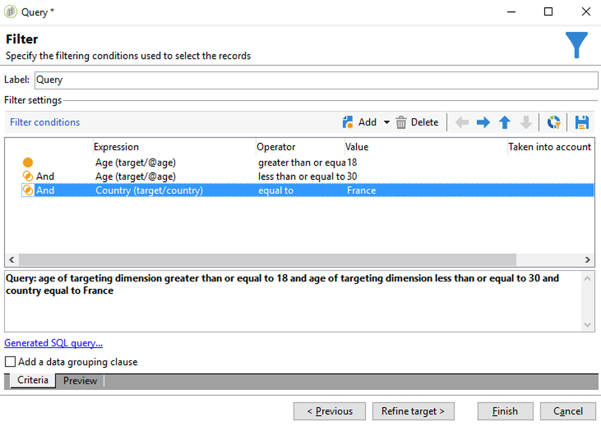
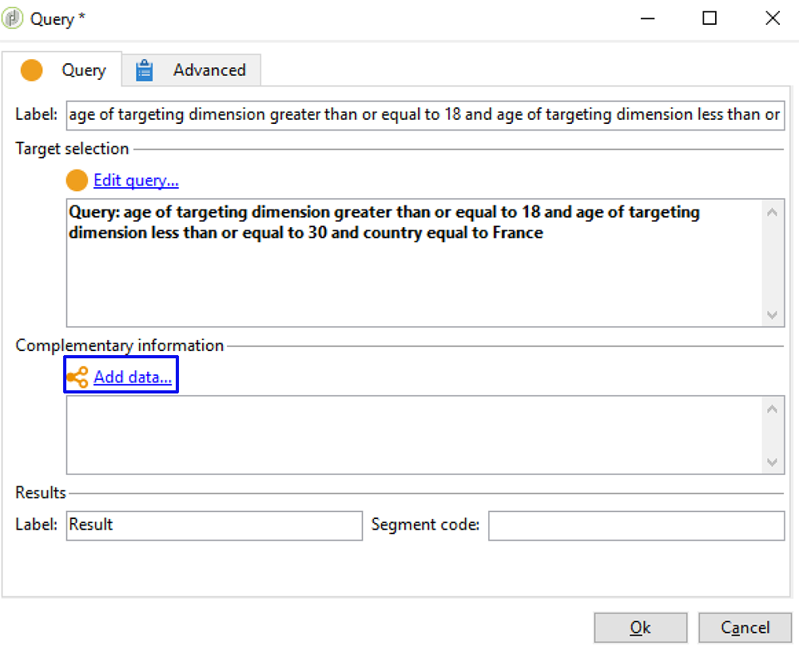
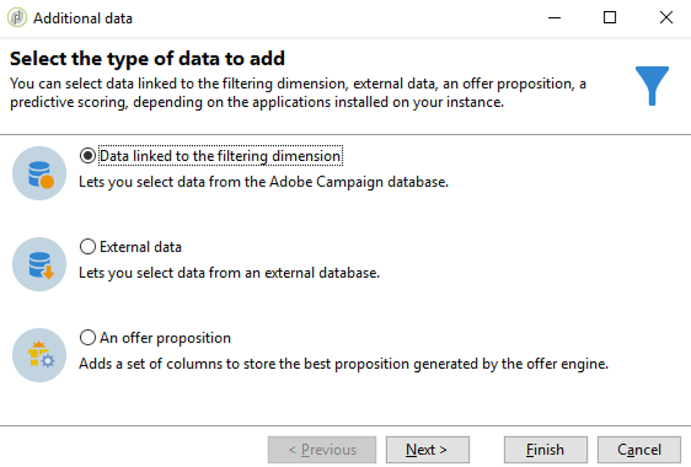
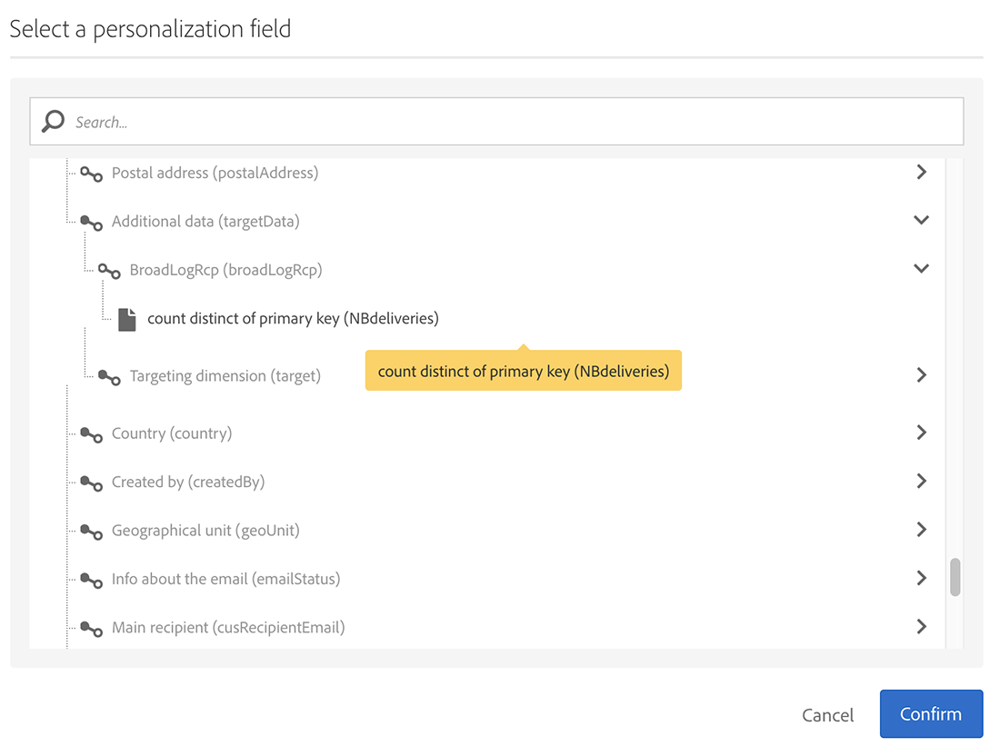
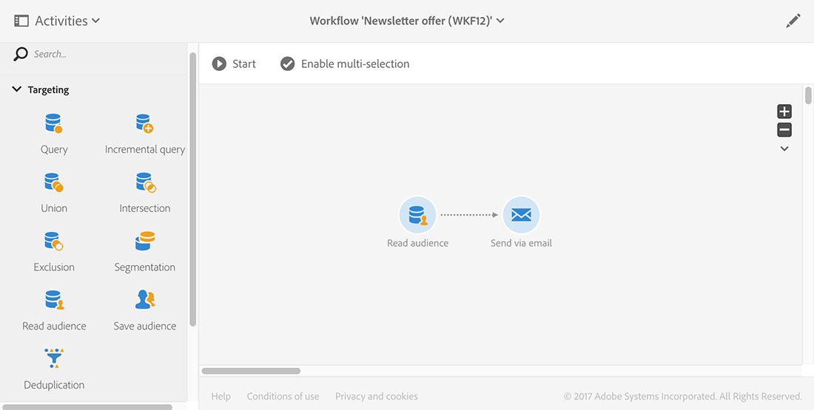

# 同步受众{#synchronizing-audiences}

您可以使用Campaign v7高级功能构建一个复杂的列表，并以受众身份无缝地直接实时与Campaign Standard（包括其他数据）共享此列表。 然后，您的Campaign Standard用户即可使用Adobe Campaign Standard中的受众。

涉及未在Campaign Standard中复制的其他数据的复杂定位，只能使用Campaign v7实现。

您还可以通过Campaign Standard共享通过Microsoft Dynamics等连接器的收件人列表或数据。

此用例展示了如何在Campaign v7中准备投放目标，以及如何在使用Adobe Campaign Standard创建和发送的投放中重用此目标及其附加数据。

>[!NOTE]
>
>如果您所需的所有数据都已复制，您还可以使用Adobe Campaign Standard中的聚合和集合来扩充数据。

## 先决条件 {#prerequisites}

要实现此目的，您需要：

* 收件人存储在Campaign v7数据库中并与Campaign Standard同步。 请参阅[同步用户档案](../../integrations/using/synchronizing-profiles.md)部分。
* 其他数据，例如存储在Campaign v7数据库中与nms:recipients相关的表中的订阅或交易。 这些数据可以来自Campaign v7 OOB架构或自定义表。 默认情况下，由于它们未同步，在Campaign Standard中不可用。
* 有权在Campaign v7和Campaign Standard中执行工作流。
* 有权在Campaign Standard中创建和执行投放。

## 在Campaign v7中创建包含附加数据的定位工作流 {#create-a-targeting-workflow-with-additional-data-in-campaign-v7}

涉及未在Campaign Standard中复制的其他数据的复杂定位，只能使用Campaign v7实现。

定义目标及其附加数据后，可以将其另存为可与Campaign Standard共享的列表。

>[!NOTE]
>
>举个例子。 根据您的要求，您只需查询收件人列表并将其与ACS共享即可，无需任何进一步处理。 您还可以使用其他数据管理活动来准备最终目标。

要获取最终受众及其附加数据，请执行以下操作：

1. 从&#x200B;**[!UICONTROL Profiles and Targets]** > **[!UICONTROL Jobs]** > **[!UICONTROL Targeting workflows]**&#x200B;创建新工作流。
1. 添加&#x200B;**[!UICONTROL Query]**&#x200B;活动并选择要向其发送最终电子邮件的收件人。 例如，所有年龄在18至30岁之间且居住在法国的收件人。

   

1. 从查询中添加其他数据。 有关详细信息，请参阅[添加数据](../../workflow/using/query.md#adding-data)部分。

   此示例说明如何添加聚合以计算收件人在一年内接收的投放数量。

   在&#x200B;**[!UICONTROL Query]**&#x200B;中选择&#x200B;**[!UICONTROL Add data...]**。

   

1. 选择 **[!UICONTROL Data linked to the filtering dimension]** 并单击 **[!UICONTROL Next]**。

   

1. 选择&#x200B;**[!UICONTROL Data linked to the filtering dimension]**，然后选择&#x200B;**[!UICONTROL Recipient delivery logs]**&#x200B;节点并单击&#x200B;**[!UICONTROL Next]**。

   

1. 在&#x200B;**[!UICONTROL Data collected]**&#x200B;字段中选择&#x200B;**[!UICONTROL Aggregates]**&#x200B;并单击&#x200B;**[!UICONTROL Next]**。

   

1. 添加筛选条件以仅考虑过去365天内创建的日志，然后单击&#x200B;**[!UICONTROL Next]**。

   

1. 定义输出列。 在此，唯一需要的列是计算投放数量的列。 为此，请执行以下操作：

   * 选择窗口右侧的&#x200B;**[!UICONTROL Add]**。
   * 从&#x200B;**[!UICONTROL Select field]**&#x200B;窗口，单击&#x200B;**[!UICONTROL Advanced selection]**。
   * 选择&#x200B;**[!UICONTROL Aggregate]**，然后选择&#x200B;**[!UICONTROL Count]**。 选中&#x200B;**[!UICONTROL Distinct]**&#x200B;选项，然后单击&#x200B;**[!UICONTROL Next]**。
   * 在字段列表中，选择用于&#x200B;**Count**&#x200B;函数的字段。 选择一个将始终填充的字段，例如&#x200B;**[!UICONTROL Primary key]**&#x200B;字段，然后单击&#x200B;**[!UICONTROL Finish]**。
   * 更改&#x200B;**[!UICONTROL Alias]**&#x200B;列中的表达式。 利用此别名，可轻松地在最终投放中检索添加的列。 例如&#x200B;**NBdeliveries**。
   * 单击&#x200B;**[!UICONTROL Finish]**&#x200B;并保存&#x200B;**[!UICONTROL Query]**&#x200B;活动配置。

   

1. 保存工作流。 下一部分将演示如何与ACS共享群体。

## 与Campaign Standard共享目标 {#share-the-target-with-campaign-standard}

定义目标群体后，可以通过&#x200B;**[!UICONTROL List update]**&#x200B;活动与ACS共享该群体。

1. 在之前创建的工作流中，添加&#x200B;**[!UICONTROL List update]**&#x200B;活动并指定要更新或创建的列表。

   在Campaign v7中指定要保存列表的文件夹。 列表受在实施期间定义的文件夹映射的约束，一旦在Campaign Standard中共享，这可能会影响其可见性。 请参阅[权限转换](../../integrations/using/acs-connector-principles-and-data-cycle.md#rights-conversion)部分。

1. 确保选中&#x200B;**[!UICONTROL Share with ACS]**&#x200B;选项。 默认情况下，该复选框处于选中状态。

   

1. 保存并执行工作流。

   目标及其附加数据保存在Campaign v7的列表中，并立即作为Campaign Standard中的列表受众共享。 只有已复制的配置文件才会与ACS共享。

如果&#x200B;**[!UICONTROL List update]**&#x200B;活动发生错误，则意味着与Campaign Standard的同步可能已失败。 要能够查看有关所发生问题的更多详细信息，请转到&#x200B;**[!UICONTROL Administration]** > **[!UICONTROL ACS Connector]** > **[!UICONTROL Process]** > **[!UICONTROL Diagnosis]**。 此文件夹包含由&#x200B;**[!UICONTROL List update]**&#x200B;活动执行触发的同步工作流。 请参阅[ACS连接器故障排除](../../integrations/using/troubleshooting-the-acs-connector.md)部分。

## 在Campaign Standard中检索数据并将其用于投放 {#retrieve-the-data-in-campaign-standard-and-use-it-in-a-delivery}

在Campaign v7中执行定位工作流后，您便能够从Campaign Standard的&#x200B;**[!UICONTROL Audiences]**&#x200B;菜单中以只读模式找到列表受众。

通过在Campaign Standard中创建投放工作流，随后可以使用此受众及其在投放中包含的其他数据。

1. 从&#x200B;**[!UICONTROL Marketing activities]**&#x200B;菜单创建新工作流。
1. 添加&#x200B;**[!UICONTROL Read audience]**&#x200B;活动并选择您之前从Campaign v7共享的受众。

   此活动用于检索所选受众的数据。 如果需要，您还可以使用此活动的相应选项卡应用额外的&#x200B;**[!UICONTROL Source Filtering]**。

1. 添加&#x200B;**[!UICONTROL Email delivery]**&#x200B;活动，并将其配置为任何其他[电子邮件投放活动](https://experienceleague.adobe.com/docs/campaign-standard/using/managing-processes-and-data/channel-activities/email-delivery.html?lang=zh-Hans)。
1. 打开投放内容。
1. 添加个性化字段。 从弹出窗口中，找到&#x200B;**[!UICONTROL Additional data (targetData)]**&#x200B;节点。 此节点包含在初始定位工作流中计算的受众附加数据。 您可以像使用任何其他个性化字段一样使用它们。

   在本例中，来自原始定位工作流的附加数据是最近365天内发送给每个收件人的投放数量。 此处显示定向工作流中指定的NBdeliveries别名。

   

1. 保存投放和工作流。

   工作流现已准备就绪，可供执行。 将分析投放并准备发送。

   

## 发送并监视您的投放 {#send-and-monitor-your-delivery}

投放及其内容准备就绪后，发送投放：

1. 执行投放工作流。 此步骤用于准备要发送的电子邮件。
1. 在投放仪表板中，手动确认可以发送投放。
1. 监测投放的报告和日志：

   * 在Campaign Standard **中**：与任何投放一样，访问与该投放相关的[报告](https://experienceleague.adobe.com/docs/campaign-standard/using/reporting/about-reporting/about-dynamic-reports.html)和[日志](https://experienceleague.adobe.com/docs/campaign-standard/using/testing-and-sending/monitoring-messages/monitoring-a-delivery.html?lang=zh-Hans)。
   * Campaign v7和Campaign Standard中的&#x200B;**&#x200B;**：投放ID、电子邮件广泛日志和电子邮件跟踪日志已同步到Campaign v7。 然后，您可以从Campaign v7全面了解营销活动。

     隔离会自动同步回Campaign v7。 这允许将无法投放的信息考虑在内，以便在Campaign v7中执行下一个定位。

     您可以在[此部分](https://experienceleague.adobe.com/docs/campaign-standard/using/testing-and-sending/monitoring-messages/understanding-quarantine-management.html?lang=zh-Hans)中找到有关Campaign Standard中隔离管理的更多信息。
