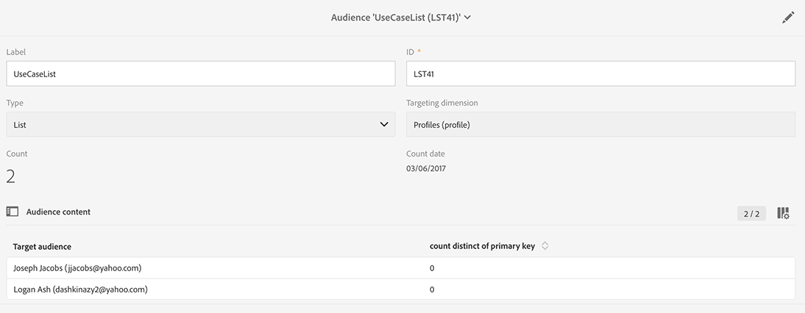

# 同步受众{#synchronizing-audiences}

您可以使用活动 v7高级功能构建一个复杂的列表，并以无缝方式将此列表作为一个直接、实时的受众与Campaign Standard（包括其他数据）共享。 然后，您的Campaign Standard用户可以在Adobe Campaign Standard中使用受众。

只能使用活动 v7实现包含未在Campaign Standard中复制的其他数据的复杂定位。

您还可以直接与Campaign Standard共享通过连接器（如Microsoft Dynamics）传输的列表收件人或数据。

此用例说明如何准备活动 v7中投放的目标，以及如何在使用Adobe Campaign Standard创建和发送的投放中重用此目标及其附加数据。

>[!NOTE]
>
>如果您需要的所有数据都已复制，您还可以使用Adobe Campaign Standard中的聚合和集合来丰富数据。

## 先决条件{#prerequisites}

要实现此目标，您需要：

* 收件人存储在活动 v7数据库中并与Campaign Standard同步。 请参阅[同步用户档案](../../integrations/using/synchronizing-profiles.md)部分。
* 其他订阅，如存储在与活动 v7收件人库中nms：相关的表中的或事务。 这些数据可以来自活动 v7 OOB模式或自定义表。 默认情况下，它们在Campaign Standard中不可用，因为它们未同步。
* 有权在活动 v7和Campaign Standard中执行工作流。
* 在Campaign Standard中创建和执行投放的权利。

## 使用活动 v7 {#create-a-targeting-workflow-with-additional-data-in-campaign-v7}中的其他数据创建定位工作流

只能使用活动 v7实现包含未在Campaign Standard中复制的其他数据的复杂定位。

定义目标及其附加数据后，可以将其另存为可与Campaign Standard共享的列表。

>[!NOTE]
>
>这是一个例子。 根据您的要求，您只需查询一列表收件人并与ACS共享，无需进一步处理。 您还可以使用其他数据管理活动来准备最终目标。

要获取最终受众及其其他数据，请执行以下操作：

1. 从&#x200B;**[!UICONTROL Profiles and Targets]** > **[!UICONTROL Jobs]** > **[!UICONTROL Targeting workflows]**&#x200B;创建新工作流。
1. 添加&#x200B;**[!UICONTROL Query]**&#x200B;活动，并选择要向其发送最终电子邮件的收件人。 例如，所有18至30岁的收件人都居住在法国。

   

1. 从查询中添加其他数据。 有关详细信息，请参阅[添加数据](../../workflow/using/query.md#adding-data)部分。

   此示例说明如何添加聚合，以计算收件人在一年中收到的投放数。

   在&#x200B;**[!UICONTROL Query]**&#x200B;中，选择&#x200B;**[!UICONTROL Add data...]**。

   

1. 选择 **[!UICONTROL Data linked to the filtering dimension]** 并单击 **[!UICONTROL Next]**。

   

1. 选择&#x200B;**[!UICONTROL Data linked to the filtering dimension]**，然后选择&#x200B;**[!UICONTROL Recipient delivery logs]**&#x200B;节点并单击&#x200B;**[!UICONTROL Next]**。

   

1. 在&#x200B;**[!UICONTROL Data collected]**&#x200B;字段中选择&#x200B;**[!UICONTROL Aggregates]**，然后单击&#x200B;**[!UICONTROL Next]**。

   

1. 添加过滤条件，以仅考虑在过去365天内创建的日志，然后单击&#x200B;**[!UICONTROL Next]**。

   

1. 定义输出列。 此处，唯一需要的列是计数投放数的列。 为此：

   * 选择窗口右侧的&#x200B;**[!UICONTROL Add]**。
   * 在&#x200B;**[!UICONTROL Select field]**&#x200B;窗口中，单击&#x200B;**[!UICONTROL Advanced selection]**。
   * 选择&#x200B;**[!UICONTROL Aggregate]**，然后选择&#x200B;**[!UICONTROL Count]**。 选中&#x200B;**[!UICONTROL Distinct]**&#x200B;选项，然后单击&#x200B;**[!UICONTROL Next]**。
   * 在字段列表中，选择用于&#x200B;**Count**&#x200B;函数的字段。 选择将始终填充的字段，例如&#x200B;**[!UICONTROL Primary key]**&#x200B;字段，然后单击&#x200B;**[!UICONTROL Finish]**。
   * 更改&#x200B;**[!UICONTROL Alias]**&#x200B;列中的表达式。 此别名将允许您轻松检索在最终投放中添加的列。 例如&#x200B;**NBdeliveries**。
   * 单击&#x200B;**[!UICONTROL Finish]**&#x200B;并保存&#x200B;**[!UICONTROL Query]**&#x200B;活动配置。

   

1. 保存工作流。下一节将介绍如何与ACS共享人口。

## 与Campaign Standard {#share-the-target-with-campaign-standard}共享目标

定义目标群后，您可以通过&#x200B;**[!UICONTROL List update]**&#x200B;活动与ACS共享。

1. 在以前创建的工作流中，添加&#x200B;**[!UICONTROL List update]**&#x200B;活动并指定要更新或创建的列表。

   指定要在活动 v7中保存列表的文件夹。 列表受实施过程中定义的文件夹映射的约束，一旦在Campaign Standard中共享，该映射会对其可见性产生影响。 请参阅[权限转换](../../integrations/using/acs-connector-principles-and-data-cycle.md#rights-conversion)部分。

1. 确保选中&#x200B;**[!UICONTROL Share with ACS]**&#x200B;选项。 默认情况下选中它。

   

1. 保存并执行工作流。

   目标及其附加数据将保存在活动 v7中的列表中，并立即作为Campaign Standard中的列表受众共享。 只有已复制的用户档案才会与ACS共享。

如果&#x200B;**[!UICONTROL List update]**&#x200B;活动发生错误，则表示与Campaign Standard的同步可能已失败。 要查看更多关于问题的详细信息，请转到&#x200B;**[!UICONTROL Administration]** > **[!UICONTROL ACS Connector]** > **[!UICONTROL Process]** > **[!UICONTROL Diagnosis]**。 此文件夹包含由&#x200B;**[!UICONTROL List update]**&#x200B;活动执行触发的同步工作流。 请参阅[ACS Connector](../../integrations/using/troubleshooting-the-acs-connector.md)疑难解答部分。

## 在Campaign Standard中检索数据并在{#retrieve-the-data-in-campaign-standard-and-use-it-in-a-delivery}投放中使用

在活动 v7中执行定位工作流后，您可以从列表的&#x200B;**[!UICONTROL Audiences]**&#x200B;菜单中以只读模式查找Campaign Standard受众。

通过在Campaign Standard中创建投放工作流，可以使用此受众以及它包含在投放中的其他数据。

1. 从&#x200B;**[!UICONTROL Marketing activities]**&#x200B;菜单创建新工作流。
1. 添加&#x200B;**[!UICONTROL Read audience]**&#x200B;活动，并选择您之前从活动 v7共享的受众。

   此活动用于检索所选受众的数据。 如果需要，您还可以使用此活动的“accoring”选项卡，再应用一个&#x200B;**[!UICONTROL Source Filtering]**。

1. 添加&#x200B;**[!UICONTROL Email delivery]**&#x200B;活动，并将其配置为任何其他[电子邮件投放活动](https://docs.adobe.com/content/help/en/campaign-standard/using/managing-processes-and-data/channel-activities/email-delivery.html)。
1. 打开投放内容。
1. 添加个性化字段。从弹出窗口中，找到&#x200B;**[!UICONTROL Additional data (targetData)]**&#x200B;节点。 此节点包含在初始定位工作流中计算的受众的其他数据。 您可以将它们用作任何其他个性化字段。

   在此示例中，来自原始定位工作流的其他投放是过去365天内发送给每个收件人的数据数。 在定位工作流中指定的NBdeliveries别名在此处可见。

   

1. 保存投放和工作流。

   该工作流现在已准备好执行。 将分析投放并准备发送。

   

## 发送并监视您的投放{#send-and-monitor-your-delivery}

投放及其内容准备就绪后，请发送投放，如[本节](https://docs.adobe.com/content/help/en/campaign-standard/using/managing-processes-and-data/channel-activities/email-delivery.html)中的更多详细信息所述：

1. 执行投放工作流。 此步骤将准备要发送的电子邮件。
1. 在投放仪表板中，手动确认可以发送投放。
1. 监视投放的报告和日志：

   * **Campaign Standard**:对任  何投放  访问与投放相关的报表和日志。
   * **在活动 v7和Campaign Standard中**:投放ID、电子邮件广泛日志和电子邮件跟踪日志已同步到活动 v7。然后，您可以从活动 v7中获得360度营销活动视图。

      隔离会自动同步回活动 v7。 这允许考虑在活动 v7中执行的下一个定位的不可交付信息。

      在[本节](https://docs.adobe.com/content/help/en/campaign-standard/using/testing-and-sending/monitoring-messages/understanding-quarantine-management.html)中可以找到有关Campaign Standard中隔离管理的更多信息。

