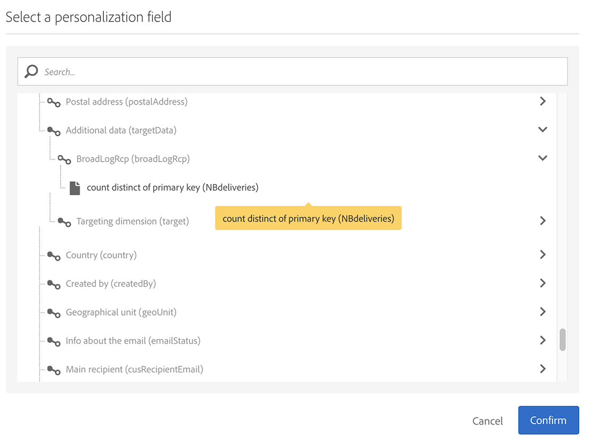

# 同步受众{#synchronizing-audiences}

您可以使用Campaign v7高级功能构建一个复杂的列表，并以无缝方式直接实时地作为受众与Campaign Standard（包括其他数据）共享此列表。 然后，您的Campaign Standard用户可以在Adobe Campaign Standard中使用受众。

复杂的定位涉及Campaign Standard中未复制的附加数据，只能使用Campaign v7实现。

您还只需使用Campaign Standard共享通过连接器(如Microsoft Dynamics)的收件人或数据列表。

此用例展示了如何在Campaign v7中准备投放的目标，以及如何在随Adobe Campaign Standard创建和发送的投放中重复使用此目标及其附加数据。

>[!NOTE]
>
>如果您需要的所有数据都已复制，则还可以在Adobe Campaign Standard中使用聚合和集合来扩充数据。

## 先决条件 {#prerequisites}

要实现此目的，您需要：

* 收件人存储在Campaign v7数据库中，并与Campaign Standard同步。 请参阅 [同步用户档案](../../integrations/using/synchronizing-profiles.md) 中。
* 其他数据，如存储在与Campaign v7数据库中nms:recipients相关的表中的订阅或交易。 这些数据可以来自Campaign v7 OOB模式或自定义表。 默认情况下，由于未同步，因此它们在Campaign Standard中不可用。
* 有权在Campaign v7和Campaign Standard中执行工作流。
* 有权在Campaign Standard中创建和执行投放。

## 在Campaign v7中使用附加数据创建定位工作流 {#create-a-targeting-workflow-with-additional-data-in-campaign-v7}

复杂的定位涉及Campaign Standard中未复制的附加数据，只能使用Campaign v7实现。

定义目标及其附加数据后，可以将其另存为可与Campaign Standard共享的列表。

>[!NOTE]
>
>这是一个示例。 根据您的要求，您只需查询收件人列表并与ACS共享该列表即可，无需进一步处理。 您还可以使用其他数据管理活动来准备最终目标。

要获取最终受众及其附加数据，请执行以下操作：

1. 从创建新工作流 **[!UICONTROL Profiles and Targets]** > **[!UICONTROL Jobs]** > **[!UICONTROL Targeting workflows]**.
1. 添加 **[!UICONTROL Query]** 活动，然后选择要向其发送最终电子邮件的收件人。 例如，所有18至30岁的收件人都居住在法国。

   

1. 从查询中添加其他数据。 有关更多信息，请参阅 [添加数据](../../workflow/using/query.md#adding-data) 中。

   此示例显示如何添加聚合以计算收件人一年中收到的投放数量。

   在 **[!UICONTROL Query]**，选择 **[!UICONTROL Add data...]**.

   

1. 选择 **[!UICONTROL Data linked to the filtering dimension]** 并单击 **[!UICONTROL Next]**。

   

1. 选择 **[!UICONTROL Data linked to the filtering dimension]** ，然后选择 **[!UICONTROL Recipient delivery logs]** 节点，单击 **[!UICONTROL Next]**.

   

1. 选择 **[!UICONTROL Aggregates]** 在 **[!UICONTROL Data collected]** 字段，单击 **[!UICONTROL Next]**.

   

1. 添加筛选条件，以便仅考虑过去365天内创建的日志，然后单击 **[!UICONTROL Next]**.

   

1. 定义输出列。 在此，只需要一列来计数投放数量。 为此，请执行以下操作：

   * 选择 **[!UICONTROL Add]** 在窗户的右侧。
   * 从 **[!UICONTROL Select field]** 窗口，单击 **[!UICONTROL Advanced selection]**.
   * 选择 **[!UICONTROL Aggregate]**，则 **[!UICONTROL Count]**. 检查 **[!UICONTROL Distinct]** 选项，然后单击 **[!UICONTROL Next]**.
   * 在字段列表中，选择用于 **计数** 函数。 选择将始终填充的字段，例如 **[!UICONTROL Primary key]** ，然后单击 **[!UICONTROL Finish]**.
   * 更改 **[!UICONTROL Alias]** 列。 利用此别名，可轻松检索最终投放中添加的列。 例如 **NBdeliveries**.
   * 单击 **[!UICONTROL Finish]** 并保存 **[!UICONTROL Query]** 活动配置。

   

1. 保存工作流。下一部分将演示如何与ACS共享群体。

## 与Campaign Standard共享目标 {#share-the-target-with-campaign-standard}

定义目标群体后，即可通过 **[!UICONTROL List update]** 活动。

1. 在之前创建的工作流中，添加 **[!UICONTROL List update]** 活动，并指定要更新或创建的列表。

   指定要在Campaign v7中保存列表的文件夹。 列表受实施期间定义的文件夹映射的约束，在Campaign Standard中共享后，该映射会对列表的可见性产生影响。 请参阅 [权限转换](../../integrations/using/acs-connector-principles-and-data-cycle.md#rights-conversion) 中。

1. 确保 **[!UICONTROL Share with ACS]** 选项。 默认勾选。

   

1. 保存并执行工作流。

   目标及其附加数据会保存在Campaign v7的列表中，并立即作为列表受众在Campaign Standard中共享。 只有已复制的用户档案才会与ACS共享。

如果 **[!UICONTROL List update]** 活动，则表示与Campaign Standard的同步可能失败。 要查看有关错误情况的更多详细信息，请转到 **[!UICONTROL Administration]** > **[!UICONTROL ACS Connector]** > **[!UICONTROL Process]** > **[!UICONTROL Diagnosis]**. 此文件夹包含由 **[!UICONTROL List update]** 活动执行。 请参阅 [ACS Connector故障排除](../../integrations/using/troubleshooting-the-acs-connector.md) 中。

## 在Campaign Standard中检索数据，并将其用在投放中 {#retrieve-the-data-in-campaign-standard-and-use-it-in-a-delivery}

在Campaign v7中执行定位工作流后，您便能够在 **[!UICONTROL Audiences]** 菜单Campaign Standard。

通过在Campaign Standard中创建投放工作流，可以使用此受众以及投放中包含的附加数据。

1. 从 **[!UICONTROL Marketing activities]** 菜单。
1. 添加 **[!UICONTROL Read audience]** 活动，然后选择您之前从Campaign v7共享的受众。

   此活动用于检索选定受众的数据。 您还可以应用附加 **[!UICONTROL Source Filtering]** （如果需要）使用此活动的“根据”选项卡。

1. 添加 **[!UICONTROL Email delivery]** 活动，并将其配置为任何其他活动 [电子邮件投放活动](https://experienceleague.adobe.com/docs/campaign-standard/using/managing-processes-and-data/channel-activities/email-delivery.html).
1. 打开投放内容。
1. 添加个性化字段。从弹出窗口中，找到 **[!UICONTROL Additional data (targetData)]** 节点。 此节点包含在初始定位工作流中计算的受众附加数据。 您可以将它们用作任何其他个性化字段。

   对于此示例，来自原始定位工作流的附加数据是过去365天内发送给每个收件人的投放数量。 此处显示定位工作流中指定的NBdeliveries别名。

   

1. 保存投放和工作流。

   工作流现已准备就绪，可供执行。 将分析投放并准备发送。

   

## 发送并监控投放 {#send-and-monitor-your-delivery}

投放及其内容准备就绪后，发送投放：

1. 执行投放工作流。 此步骤将准备要发送的电子邮件。
1. 在投放仪表板中，手动确认可以发送投放。
1. 监控投放的报告和日志：

   * **Campaign Standard**:访问 [报告](https://experienceleague.adobe.com/docs/campaign-standard/using/reporting/about-reporting/about-dynamic-reports.html) 和 [日志](https://experienceleague.adobe.com/docs/campaign-standard/using/testing-and-sending/monitoring-messages/monitoring-a-delivery.html) 与投放相关联。
   * **在Campaign v7和Campaign Standard中**:投放ID、电子邮件广泛日志和电子邮件跟踪日志均同步到Campaign v7。 然后，您可以从Campaign v7以360°的方式查看营销活动。

      隔离会自动同步回Campaign v7。 这允许将不可交付信息考虑在Campaign v7中执行的下一个定位。

      您可以在中的Campaign Standard中找到有关隔离管理的详细信息 [此部分](https://experienceleague.adobe.com/docs/campaign-standard/using/testing-and-sending/monitoring-messages/understanding-quarantine-management.html?lang=en).
