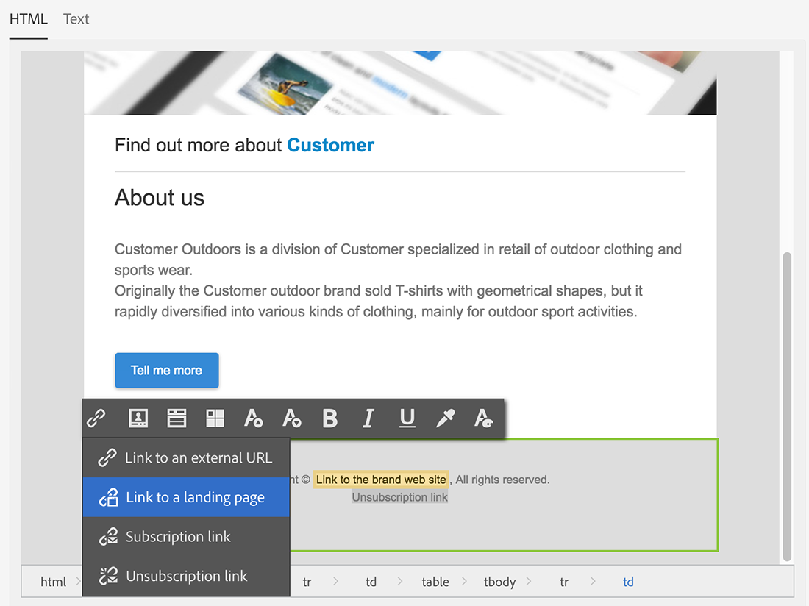

# 同步用户档案{#synchronizing-profiles}

ACS Connector将数据从Campaign v7复制到Campaign Standard。 从Campaign v7收到的数据可用于Campaign Standard创建投放。 您可以通过执行下面列出的操作来查看配置文件的同步方式。

* **添加新收件人**:在Campaign v7中创建新收件人，并确认相应的用户档案已复制到Campaign Standard。请参阅[创建新收件人](#creating-a-new-recipient)。
* **更新收件人**:在Campaign v7中编辑新收件人，并在Campaign Standard中查看相应的用户档案，以确认已复制更新。请参阅[编辑收件人](#editing-a-recipient)。
* **在Campaign Standard中构建工作流**:在Campaign Standard中创建工作流，其中包含从Campaign v7复制的受众或用户档案的查询。请参阅[创建工作流](#creating-a-workflow)。
* **在Campaign Standard中创建投放**:按照工作流完成以发送投放。请参阅[创建投放](#creating-a-delivery)。
* **验证退订链接**:使用Campaign v7 Web应用程序确保将收件人选择的退订服务发送到Campaign v7数据库。停止接收服务的选项会复制到Campaign Standard。 请参阅[更改退订链接](#changing-the-unsubscription-link)。

## 先决条件 {#prerequisites}

以下各节介绍ACS Connector如何帮助您在Campaign v7中添加和编辑收件人，然后在Campaign Standard投放中使用它们。 ACS Connector要求满足以下条件：

* Campaign v7中的收件人已复制到Campaign Standard。
* 在Campaign v7和Campaign Standard中执行工作流的用户权限。
* 在Campaign Standard中创建和执行投放的用户权限。

## 更改退订链接 {#changing-the-unsubscription-link}

当收件人单击由Campaign Standard发送的电子邮件中的退订链接时，Campaign Standard中的相应用户档案会更新。 要确保复制的用户档案包含用户选择的取消订阅服务，必须将该信息发送到Campaign v7，而不是Campaign Standard。 要执行更改，退订服务链接到Campaign v7 Web应用程序，而不是Campaign Standard。

>[!NOTE]
>
>在执行以下步骤之前，请咨询您的顾问为退订服务配置Web应用程序。

## 创建新收件人 {#creating-a-new-recipient}

1. 在Campaign v7中创建新收件人以复制到Campaign Standard。 输入尽可能多的信息，包括收件人的姓氏、名字、电子邮件地址和邮政地址。 但是，请勿选择&#x200B;**[!UICONTROL Salutation]**，因为它将添加在下一节[编辑收件人](#editing-a-recipient)中。 有关更多信息，请参阅[添加收件人](../../platform/using/adding-profiles.md)。

   

1. 确认已将新收件人添加到Campaign Standard。 查看用户档案时，请确保您在Campaign v7中输入的数据也可在Campaign Standard中使用。 要了解在Campaign Standard中的何处查找配置文件，请参阅[导航基础知识](https://experienceleague.adobe.com/docs/campaign-standard/using/getting-started/discovering-the-interface/interface-description.html?lang=zh-Hans)。

   

   默认情况下，ACS Connector的定期复制每15分钟一次。 有关更多信息，请参阅[数据复制](../../integrations/using/acs-connector-principles-and-data-cycle.md#data-replication)。

## 编辑收件人 {#editing-a-recipient}

以下更改单一数据点的步骤提供了一个简单示例，用于说明在使用数据复制时，Campaign v7如何成为Campaign Standard的主数据库。 修改或删除Campaign v7中的复制数据对Campaign Standard中的相应数据具有相同的效果。

1. 从[创建新收件人](#creating-a-new-recipient)中选择新创建的收件人，并编辑收件人的姓名。 例如，为收件人（例如，Mr或Mrs）选择&#x200B;**[!UICONTROL Salutation]**。 有关更多信息，请参阅[编辑配置文件](../../platform/using/editing-a-profile.md)。

   

1. 确认收件人的姓名已在Campaign Standard中更新。 要了解在Campaign Standard中的何处查找配置文件，请参阅[导航基础知识](https://experienceleague.adobe.com/docs/campaign-standard/using/getting-started/discovering-the-interface/interface-description.html)。

   

   默认情况下，ACS Connector的定期复制每15分钟一次。 有关更多信息，请参阅[数据复制](../../integrations/using/acs-connector-principles-and-data-cycle.md#data-replication)。

## 创建工作流 {#creating-a-workflow}

数字营销人员可以使用从Campaign v7复制的用户档案和服务来利用Campaign Standard中的丰富数据。 以下说明演示了如何将查询添加到Campaign Standard工作流，然后将其与复制的数据库一起使用。

有关Campaign Standard工作流的更多信息和完整说明，请参阅[工作流](../../workflow/using/about-workflows.md)。

1. 转到Campaign Standard并单击&#x200B;**[!UICONTROL Marketing Activities]**。
1. 单击右上角的&#x200B;**[!UICONTROL Create]**。
1. 单击 **[!UICONTROL Workflow]**。
1. 单击&#x200B;**[!UICONTROL New workflow]**&#x200B;和&#x200B;**[!UICONTROL Next]**。
1. 在&#x200B;**[!UICONTROL Label]**&#x200B;字段中输入工作流的名称，并根据需要输入其他信息。 单击 **[!UICONTROL Next]**。
1. 从左侧的&#x200B;**[!UICONTROL Targeting]**&#x200B;将&#x200B;**[!UICONTROL Query]**&#x200B;目标拖到工作区。

   

1. 双击&#x200B;**[!UICONTROL Query]**&#x200B;活动，并选择一个可用于复制数据库的参数。 例如，您可以：

   * 将&#x200B;**[!UICONTROL Profiles]**&#x200B;拖到工作区。 使用字段下拉菜单选择&#x200B;**[!UICONTROL Is external resource]**&#x200B;以查找从Campaign v7复制的用户档案。
   * 拖动其他查询参数以进一步定向已复制的用户档案。

## 创建投放 {#creating-a-delivery}

>[!NOTE]
>
>创建投放的说明将继续以[创建工作流](#creating-a-workflow)开始的工作流。

数字营销人员可以利用Campaign v7 Web应用程序确保将收件人选择的退订服务发送到Campaign v7数据库。 在收件人单击退订链接后，停止接收服务的选项将从Campaign v7复制到Campaign Standard。 有关更多详细信息，请参阅[更改退订链接](#changing-the-unsubscription-link)。

按照以下步骤，使用在Campaign v7中创建的退订服务，将电子邮件投放添加到现有工作流。 有关Campaign Standard工作流的更多信息和完整说明，请参阅此[文档](../../workflow/using/about-workflows.md)。

>[!NOTE]
>
>在执行以下步骤之前，请咨询您的顾问为退订服务配置Web应用程序。

1. 单击左侧的&#x200B;**[!UICONTROL Channels]**。
1. 将&#x200B;**[!UICONTROL Email delivery]**&#x200B;拖动到工作区中的现有工作流。

   

1. 双击&#x200B;**[!UICONTROL Email delivery]**&#x200B;活动，然后选择&#x200B;**[!UICONTROL Single send email]**&#x200B;或&#x200B;**[!UICONTROL Recurring email]**。 选择您的选项并单击&#x200B;**[!UICONTROL Next]**。
1. 单击&#x200B;**[!UICONTROL Send via email]**，然后单击&#x200B;**[!UICONTROL Next]**。

   

1. 在&#x200B;**[!UICONTROL Label]**&#x200B;字段中输入投放的名称，并根据需要输入其他信息。 单击 **[!UICONTROL Next]**。

   

1. 在&#x200B;**[!UICONTROL Subject]**&#x200B;字段中，输入将显示在收件人电子邮件收件箱中的主题。
1. 单击&#x200B;**[!UICONTROL Change content]**&#x200B;以添加HTML模板。

   

1. 选择包含链接的内容以取消订阅服务。 单击 **[!UICONTROL Confirm]**。

   

1. 当前退订链接必须替换为使用顾问创建的Web应用程序的新链接。 在电子邮件内容的底部找到退订链接，然后单击一次。 单击垃圾桶图标以删除链接。

   

1. 单击同一内容区域，然后键入&#x200B;**退订链接**。

   

1. 用光标突出显示文本，然后单击链图标。
1. 单击 **[!UICONTROL Link to a landing page]**。

   

1. 单击文件夹图标以选择登陆页面。

   

1. 选择顾问创建的Web应用程序，然后单击&#x200B;**[!UICONTROL Confirm]**。

   

1. 单击 **[!UICONTROL Create]**。
1. 单击投放名称以返回到工作流。

   

1. 单击&#x200B;**[!UICONTROL Start]**&#x200B;以发送投放。 电子邮件投放图标会闪烁，指示正在为投放做好准备。

   

1. 双击&#x200B;**[!UICONTROL Email delivery]**&#x200B;渠道，然后选择&#x200B;**[!UICONTROL Confirm]**&#x200B;以发送电子邮件。 单击&#x200B;**[!UICONTROL OK]**&#x200B;以发送消息。

   

## 验证退订服务 {#verifying-the-unsubscription-service}

按照[创建工作流](#creating-a-workflow)和[创建投放](#creating-a-delivery)中的说明，再转到以下步骤。

1. 收件人单击电子邮件投放中的退订链接。

   

1. 收件人确认退订。

   

1. Campaign v7中的收件人数据已更新，以反映用户已取消订阅。 确认已为收件人选中&#x200B;**[!UICONTROL No longer contact (by any channel)]**&#x200B;框。 要了解如何在Campaign v7中查看收件人，请参阅[编辑用户档案](../../platform/using/editing-a-profile.md)。

   

1. 转到Campaign Standard，然后打开收件人的用户档案详细信息。 确认&#x200B;**[!UICONTROL No longer contact (by any channel)]**&#x200B;旁边出现了复选框。 要了解在Campaign Standard中的何处查找配置文件，请参阅[导航基础知识](https://experienceleague.adobe.com/docs/campaign-standard/using/getting-started/discovering-the-interface/interface-description.html)。

   
