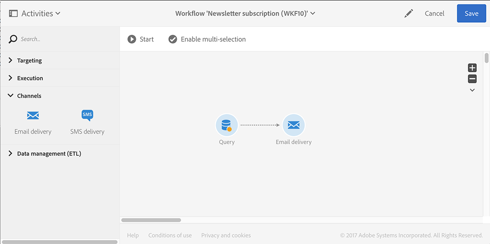
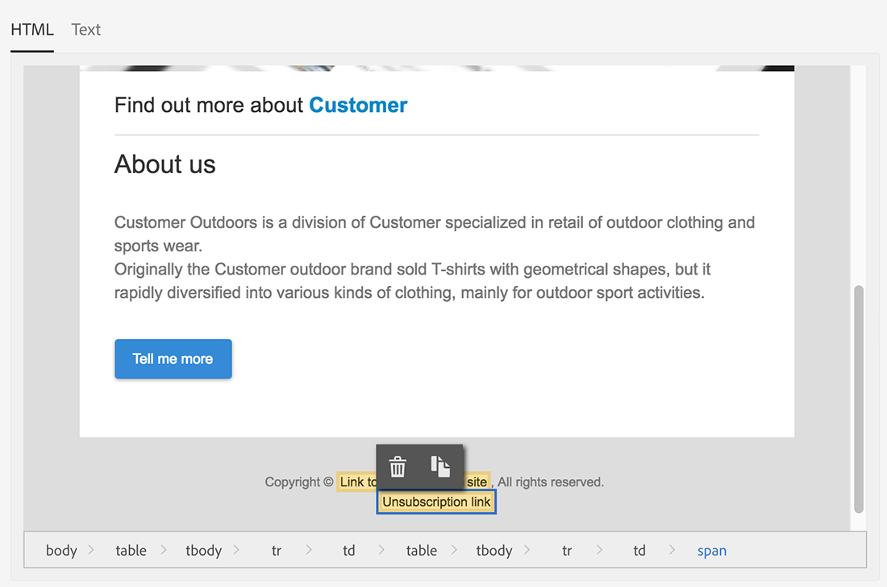

# 同步用户档案{#synchronizing-profiles}

ACS Connector会将数据从Campaign v7复制到Campaign Standard。 从Campaign v7接收的数据可用于Campaign Standard以创建投放。 您可以通过执行以下列出的操作来查看配置文件的同步方式。

* **添加新收件人**：在Campaign v7中创建新收件人，并确认已将相应的用户档案复制到Campaign Standard。 请参阅 [创建新收件人](#creating-a-new-recipient).
* **更新收件人**：在Campaign v7中编辑新收件人，并在Campaign Standard中查看相应的用户档案以确认已复制更新。 请参阅 [编辑收件人](#editing-a-recipient).
* **在Campaign Standard中构建工作流**：在Campaign Standard中创建一个工作流，该工作流包含一个具有一个或多个从Campaign v7复制的用户档案的查询。 请参阅 [创建工作流](#creating-a-workflow).
* **在Campaign Standard中创建投放**：按照工作流完成以发送投放。 请参阅 [创建投放](#creating-a-delivery).
* **验证退订链接**：使用Campaign v7 Web应用程序确保将收件人取消订阅服务的选择发送到Campaign v7数据库。 停止接收服务的选项将复制到Campaign Standard。 请参阅 [更改退订链接](#changing-the-unsubscription-link).

## 先决条件 {#prerequisites}

以下部分介绍ACS Connector如何帮助您在Campaign v7中添加和编辑收件人，然后在Campaign Standard投放中使用这些收件人。 ACS Connector要求满足以下条件：

* Campaign v7中的收件人已复制到Campaign Standard。
* 用于在Campaign v7和Campaign Standard中执行工作流的用户权限。
* 在Campaign Standard中创建和执行投放的用户权限。

## 更改退订链接 {#changing-the-unsubscription-link}

当收件人单击Campaign Standard发送的电子邮件中的退订链接时，Campaign Standard中的相应用户档案会更新。 为了确保复制的用户档案包含用户退订服务的选择，必须将信息发送到Campaign v7而不是Campaign Standard。 为执行更改，退订服务将链接到Campaign v7 Web应用程序而不是Campaign Standard。

>[!NOTE]
>
>在执行以下步骤之前，请让您的顾问为退订服务配置Web应用程序。

## 创建新收件人 {#creating-a-new-recipient}

1. 在Campaign v7中创建新收件人，以复制到Campaign Standard。 输入尽可能多的信息，包括收件人的姓氏、名字、电子邮件地址和邮政地址。 但是，请勿选择 **[!UICONTROL Salutation]** 因为它将被添加到下一部分， [编辑收件人](#editing-a-recipient). 有关详细信息，请参阅 [添加收件人](../../platform/using/adding-profiles.md).

   

1. 确认新收件人已添加到Campaign Standard。 查看用户档案时，请确保您在Campaign v7中输入的数据也可在Campaign Standard中使用。 要了解在Campaign Standard中在何处查找配置文件，请参阅 [导航基础知识](https://experienceleague.adobe.com/docs/campaign-standard/using/getting-started/discovering-the-interface/interface-description.html?lang=zh-Hans).

   

   默认情况下，ACS Connector的定期复制是每15分钟一次。 有关详细信息，请参阅 [数据复制](../../integrations/using/acs-connector-principles-and-data-cycle.md#data-replication).

## 编辑收件人 {#editing-a-recipient}

以下更改单个数据点的步骤提供了一个简单示例，说明在使用数据复制时，Campaign v7如何成为用于Campaign Standard的主数据库。 修改或删除Campaign v7中的复制数据对Campaign Standard中的相应数据具有相同的效果。

1. 从中选择新创建的收件人 [创建新收件人](#creating-a-new-recipient) 并编辑收件人的姓名。 例如，选择 **[!UICONTROL Salutation]** 收件人（例如先生或夫人）。 有关详细信息，请参阅 [编辑用户档案](../../platform/using/editing-a-profile.md).

   

1. 确认收件人的姓名已在Campaign Standard中更新。 要了解在Campaign Standard中在何处查找配置文件，请参阅 [导航基础知识](https://experienceleague.adobe.com/docs/campaign-standard/using/getting-started/discovering-the-interface/interface-description.html?lang=zh-Hans).

   

   默认情况下，ACS Connector的定期复制是每15分钟一次。 有关详细信息，请参阅 [数据复制](../../integrations/using/acs-connector-principles-and-data-cycle.md#data-replication).

## 创建工作流 {#creating-a-workflow}

从Campaign v7复制的用户档案和服务可供数字营销人员利用Campaign Standard中的丰富数据。 下面的说明演示了如何向Campaign Standard工作流添加查询，然后将其用于复制的数据库。

有关Campaign Standard工作流的更多信息和完整说明，请参阅 [工作流](../../workflow/using/about-workflows.md).

1. 转到Campaign Standard并单击 **[!UICONTROL Marketing Activities]**.
1. 单击 **[!UICONTROL Create]** 在右上角。
1. 单击 **[!UICONTROL Workflow]**。
1. 单击 **[!UICONTROL New workflow]** 和 **[!UICONTROL Next]**.
1. 在中输入工作流的名称 **[!UICONTROL Label]** 字段和其他信息（如果需要）。 单击 **[!UICONTROL Next]**。
1. 从 **[!UICONTROL Targeting]** 在左侧，拖动 **[!UICONTROL Query]** 定位到工作区。

   

1. 双击 **[!UICONTROL Query]** 活动并选择可与复制数据库一起使用的参数。 例如，您可以：

   * 拖动 **[!UICONTROL Profiles]** 到工作区。 使用字段下拉菜单选择 **[!UICONTROL Is external resource]** 以查找从Campaign v7复制的用户档案。
   * 拖动其他查询参数以进一步定位复制的用户档案。

## 创建投放 {#creating-a-delivery}

>[!NOTE]
>
>有关创建投放的说明会继续执行工作流开始时使用的 [创建工作流](#creating-a-workflow).

数字营销人员可以利用Campaign v7 Web应用程序，确保将收件人取消订阅服务的选择发送到Campaign v7数据库。 收件人单击退订链接后，用于停止接收服务的选项将从Campaign v7复制到Campaign Standard。 有关其他详细信息，请参阅 [更改退订链接](#changing-the-unsubscription-link).

按照以下步骤使用Campaign v7中创建的退订服务将电子邮件投放添加到现有工作流。 有关Campaign Standard工作流的更多信息和完整说明，请参阅此 [文档](../../workflow/using/about-workflows.md).

>[!NOTE]
>
>在执行以下步骤之前，请让您的顾问为退订服务配置Web应用程序。

1. 单击 **[!UICONTROL Channels]** 左边。
1. 拖动 **[!UICONTROL Email delivery]** 到工作区中的现有工作流。

   

1. 双击 **[!UICONTROL Email delivery]** 活动和选择 **[!UICONTROL Single send email]** 或 **[!UICONTROL Recurring email]**. 选择您的选项并单击 **[!UICONTROL Next]**.
1. 单击 **[!UICONTROL Send via email]** 并单击 **[!UICONTROL Next]**.

   

1. 在中输入交货的名称 **[!UICONTROL Label]** 字段和其他信息（如果需要）。 单击 **[!UICONTROL Next]**。

   

1. 在 **[!UICONTROL Subject]** 字段中，输入要显示在收件人电子邮件收件箱中的主题。
1. 单击 **[!UICONTROL Change content]** 以添加HTML模板。

   

1. 选择包含用于取消订阅服务的链接的内容。 单击 **[!UICONTROL Confirm]**。

   

1. 当前退订链接必须替换为使用您的顾问创建的Web应用程序的新链接。 在电子邮件内容底部找到退订链接，然后单击一次。 单击垃圾桶图标可删除链接。

   

1. 在同一内容区域中单击并键入 **退订链接**.

   

1. 用光标突出显示文本，然后单击链图标。
1. 单击 **[!UICONTROL Link to a landing page]**。

   

1. 单击文件夹图标以选择登陆页面。

   

1. 选择顾问创建的Web应用程序，然后单击 **[!UICONTROL Confirm]**.

   

1. 单击 **[!UICONTROL Create]**。
1. 单击投放名称以返回到工作流。

   

1. 单击 **[!UICONTROL Start]** 以发送投放。 电子邮件投放图标闪烁，表示正在准备投放。

   

1. 双击 **[!UICONTROL Email delivery]** 渠道和选择 **[!UICONTROL Confirm]** 以发送电子邮件。 单击 **[!UICONTROL OK]** 以发送消息。

   

## 验证退订服务 {#verifying-the-unsubscription-service}

请按照 [创建工作流](#creating-a-workflow) 和 [创建投放](#creating-a-delivery) 然后再转到以下步骤。

1. 收件人单击电子邮件投放中的退订链接。

   

1. 收件人确认退订。

   

1. Campaign v7中的收件人数据将更新，以反映用户已取消订阅。 确认此框 **[!UICONTROL No longer contact (by any channel)]** 已检查收件人。 要了解如何在Campaign v7中查看收件人，请参阅 [编辑用户档案](../../platform/using/editing-a-profile.md).

   

1. 转到Campaign Standard并打开收件人的配置文件详细信息。 确认旁边显示复选框 **[!UICONTROL No longer contact (by any channel)]**. 要了解在Campaign Standard中在何处查找配置文件，请参阅 [导航基础知识](https://experienceleague.adobe.com/docs/campaign-standard/using/getting-started/discovering-the-interface/interface-description.html?lang=zh-Hans).

   
