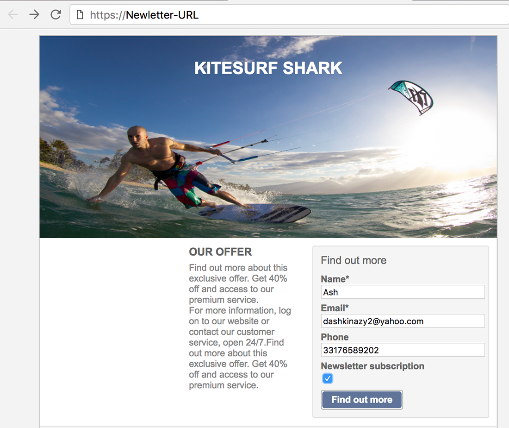
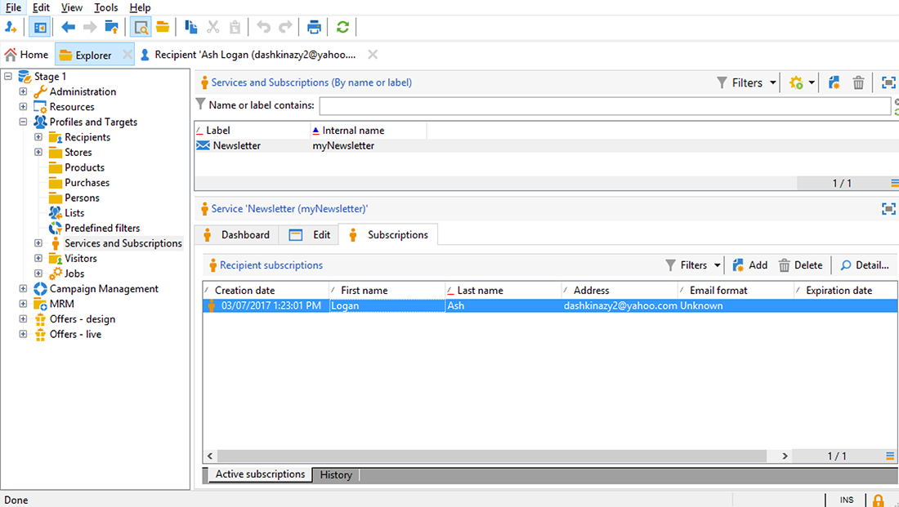

# 同步 Web 应用程序{#synchronizing-web-applications}

在此使用案例中，我们将使用Campaign Standard发送包含指向Campaign v7 Web应用程序链接的通信。 当收件人单击电子邮件中的链接时，Web应用程序会显示一个表单，其中包含多个预加载了收件人数据的字段以及一个指向新闻稿的订阅链接。 收件人可以更新其数据并订阅该服务。 此用户档案将在Campaign v7中更新，并且信息将在Campaign Standard中复制。

如果您在Campaign v7中有许多服务和Web应用程序，您可以选择不以Campaign Standard重新创建它们。 ACS Connector允许您使用所有现有的Campaign v7 Web应用程序和服务，并将它们链接到Campaign Standard发送的投放。

## 先决条件 {#prerequisites}

要实现此目的，您需要：

* 收件人存储在Campaign v7数据库中并与Campaign Standard同步。 请参阅 [同步用户档案](../../integrations/using/synchronizing-profiles.md) 部分。
* 在Campaign v7中创建和发布的服务和Web应用程序。
* Web应用程序必须包含 **[!UICONTROL Pre-loading]** 使用 **[!UICONTROL Adobe Campaign encryption]** 识别方法。

## 创建Web应用程序和服务 {#creating-the-web-application-and-service}

在Campaign v7中，您可以创建允许收件人订阅服务的Web应用程序。 Web应用程序和服务是在Campaign v7中设计和存储的，您可以通过Campaign Standard通信更新此服务。 要了解有关Campaign v7中Web应用程序的更多信息，请参阅 [本节](../../web/using/adding-fields-to-a-web-form.md#subscription-checkboxes).

在Campaign v7中，已创建以下对象：

* 新闻稿服务
* 包含 **[!UICONTROL Pre-loading]**， a **[!UICONTROL Page]** 和 **[!UICONTROL Storage]** 活动。

1. 转到 **[!UICONTROL Resources > Online > Web applications]** 并选择现有的Web应用程序。

   

1. 编辑 **[!UICONTROL Preloading]** 活动。 此 **[!UICONTROL Auto-load data referenced in the form]** 复选框，并且 **[!UICONTROL Adobe Campaign encryption]** 选择了识别方法。 这将允许Web应用程序使用Adobe Campaign数据库中存储的数据预加载表单的字段。 请参阅 [本文档](../../web/using/publishing-a-web-form.md#pre-loading-the-form-data).

   

1. 编辑 **[!UICONTROL Page]**. 其中包括三个字段（姓名、电子邮件和电话），以及一个复选框，用于邀请收件人订阅新闻稿(**[!UICONTROL Newsletter]** 服务)。

   

1. 转到 **[!UICONTROL Profiles and Target > Services and subscriptions]** 然后打开 **[!UICONTROL Newsletter]** 服务。 这是将从Campaign Standard通信中更新的服务。 您可以看到还没有收件人订阅此服务。

   

1. 转到 **[!UICONTROL Profiles and Targets > Recipient]** 并选择收件人。 您可以看到此配置文件尚未订阅该服务。

   

## 复制数据 {#replicating-the-data}

为了在Campaign v7和Campaign Standard之间复制所需的数据，提供了多个复制工作流模板。 此 **[!UICONTROL Profiles replication]** 工作流会自动将所有Campaign v7收件人复制到Campaign Standard。 请参阅 [技术和复制工作流](../../integrations/using/acs-connector-principles-and-data-cycle.md#technical-and-replication-workflows). 此 **[!UICONTROL Landing pages replication]** 工作流可以复制我们想要在Campaign Standard中使用的Web应用程序。

要检查是否已正确复制数据，请按照Campaign Standard中的以下步骤操作：

1. 在主屏幕中，单击 **[!UICONTROL Customer profiles]**.

   

1. 搜索您的Campaign v7收件人，并检查该收件人是否显示在Campaign Standard中。

   

1. 从顶部栏中，单击 **[!UICONTROL Marketing activities]**，并搜索Campaign v7 Web应用程序。 它在Campaign Standard中显示为登录页面。

   

1. 单击 **[!UICONTROL Adobe Campaign]** 徽标，在左上角，然后选择 **“配置文件和受众”>“服务”** 检查新闻稿服务是否也存在。

   

## 设计和发送电子邮件 {#designing-and-sending-the-email}

在本部分中，我们将了解如何在Campaign Standard电子邮件中包含指向从Campaign v7 Web应用程序复制的登陆页面的链接。

创建、设计和发送电子邮件的步骤与创建传统电子邮件的步骤相同。 请参阅 [Adobe Campaign Standard](https://experienceleague.adobe.com/docs/campaign-standard/using/campaign-standard-home.html?lang=zh-Hans) 文档。

1. 创建新电子邮件，然后选择一个或多个复制的用户档案作为受众。
1. 编辑您的内容并插入 **[!UICONTROL Link to a landing page]**.

   

1. 选择从Campaign v7 Web应用程序复制的登陆页面。

   

1. 准备电子邮件、发送校样并发送最终电子邮件。
1. 其中一位收件人打开电子邮件并单击新闻稿订阅链接。

   

1. 此收件人会添加一个电话号码并检查新闻稿订阅框。

   

## 检索更新的信息 {#retrieving-the-updated-information}

当收件人通过Web应用程序从更新其数据时，Adobe Campaign v7会同步检索更新的信息。 然后，将该代码从Campaign v7复制到Campaign Standard。

1. 在Campaign v7中，转到 **[!UICONTROL Profiles and Target > Services and subscriptions]** 然后打开 **[!UICONTROL Newsletter]** 服务。 您可以看到收件人现在显示在订阅者列表中。

   

1. 转到 **[!UICONTROL Profiles and Targets > Recipient]** 并选择收件人。 您可以看到电话号码现已存储。

   

1. 在 **[!UICONTROL Subscriptions]** 选项卡，我们还可以看到此收件人已订阅新闻稿服务。

   

1. 请等待几分钟，以便运行配置文件复制工作流。
1. 在Campaign Standard中，访问您的收件人配置文件，以检查更新数据是否已从Campaign v7正确复制。

   

1. 编辑用户档案。 您可以看到电话号码已更新。

   

1. 单击 **[!UICONTROL Subscriptions]** 选项卡。 新闻稿服务现在将出现。

   
