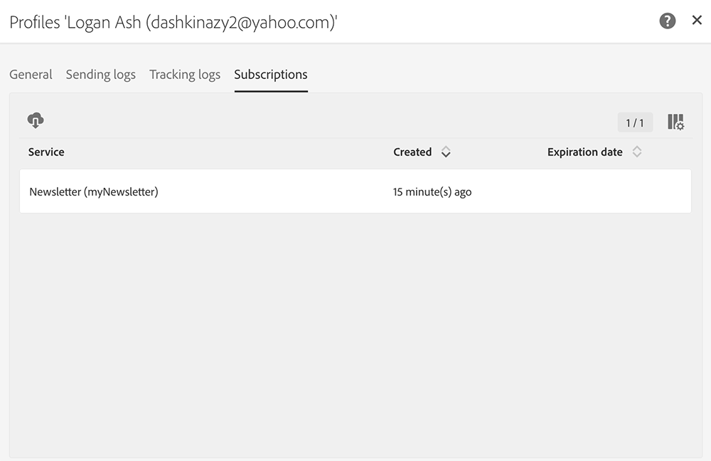

# 同步Web应用程序{#synchronizing-web-applications}

在此用例中，我们将使用Campaign Standard发送通信，其中包含指向Campaign v7 web应用程序的链接。 当收件人单击电子邮件中的链接时，Web应用程序会显示一个表单，其中包含预先加载了收件人数据的多个字段以及指向新闻稿的订阅链接。 收件人可以更新其数据并订阅该服务。 他的个人资料将在Campaign v7中更新，信息将在Campaign standard中复制。

如果您在Campaign v7中有许多服务和Web应用程序，则可能选择不在Campaign standard中重新创建所有服务和Web应用程序。 ACS Connector允许您使用所有现有的Campaign v7 web应用程序和服务，并将它们链接到Campaign standard发送的分发。

## 先决条件 {#prerequisites}

要实现此目标，您需要：

* 收件人存储在Campaign v7数据库中并与Campaign Standard同步。 请参阅同步配 [置文件部分](../../integrations/using/synchronizing-profiles.md) 。
* 在Campaign v7中创建和发布的服务和Web应用程序。
* web应用程序必须包含使 **[!UICONTROL Pre-loading]** 用标识方法的 **[!UICONTROL Adobe Campaign encryption]** 活动。

## 创建Web应用程序和服务 {#creating-the-web-application-and-service}

在Campaign v7中，您可以创建允许收件人订阅服务的Web应用程序。 Web应用程序和服务是在Campaign v7中设计和存储的，您可以通过Campaign standard通信更新此服务。 要了解有关Campaign v7中Web应用程序的更多信息，请参 [阅此部分](../../web/using/adding-fields-to-a-web-form.md#subscription-checkboxes)。

在Campaign v7中，已创建以下对象：

* 新闻稿服务
* 包含活动、 **[!UICONTROL Pre-loading]** a和活动 **[!UICONTROL Page]** 的Web应用 **[!UICONTROL Storage]** 程序。

1. 转到并 **[!UICONTROL Resources > Online > Web applications]** 选择现有Web应用程序。

   

1. 编辑活 **[!UICONTROL Preloading]** 动。 选 **[!UICONTROL Auto-load data referenced in the form]** 中该框并选 **[!UICONTROL Adobe Campaign encryption]** 择识别方法。 这将允许Web应用程序预载表单的字段，其中数据存储在Adobe Campaign数据库中。 请参阅 [此文档](../../web/using/publishing-a-web-form.md#pre-loading-the-form-data)。

   

1. 编辑 **[!UICONTROL Page]**。 包含三个字段（名称、电子邮件和电话）以及一个复选框，邀请收件人订阅新闻稿(服&#x200B;**[!UICONTROL Newsletter]** 务)。

   

1. 转到并 **[!UICONTROL Profiles and Target > Services and subscriptions]** 打开服 **[!UICONTROL Newsletter]** 务。 这是将从Campaign standard通信更新的服务。 您可以看到，尚未有收件人订阅此服务。

   

1. 转到并 **[!UICONTROL Profiles and Targets > Recipient]** 选择收件人。 您可以看到他尚未订阅该服务。

   

## 复制数据 {#replicating-the-data}

为了在Campaign v7和Campaign Standard之间复制所需数据，可以使用多个复制工作流模板。 该工 **[!UICONTROL Profiles replication]** 作流会自动将所有Campaign v7收件人复制到Campaign Standard。 请参 [阅技术和复制工作流程](../../integrations/using/acs-connector-principles-and-data-cycle.md#technical-and-replication-workflows)。 该工 **[!UICONTROL Landing pages replication]** 作流允许复制我们要在Campaign standard中使用的Web应用程序。

要检查数据是否已正确复制，请按照Campaign standard中的以下步骤操作：

1. 在主屏幕中，单击 **[!UICONTROL Customer profiles]**。

   

1. 搜索您的Campaign v7收件人并检查他是否显示在Campaign Standard中。

   

1. 从顶部栏中，单击并 **[!UICONTROL Marketing activities]**&#x200B;搜索Campaign v7 web应用程序。 它在Campaign standard中显示为登录页面。

   

1. 单击左 **[!UICONTROL Adobe Campaign]** 上角的徽标，然后选择 **Profiles &amp; audiences > Services** ，并检查Newsletter服务是否也在此处。

   

## 设计和发送电子邮件 {#designing-and-sending-the-email}

在此部分，我们将了解如何在Campaign standard电子邮件中包含从Campaign v7 web应用程序复制的登录页的链接。

创建、设计和发送电子邮件的步骤与创建经典电子邮件的步骤相同。 请参阅 [Adobe Campaign Standard文档](https://helpx.adobe.com/support/campaign/standard.html) 。

1. 创建新电子邮件，然后选择一个或多个重复的档案作为受众。
1. 编辑您的内容并插入 **[!UICONTROL Link to a landing page]**。

   

1. 选择从Campaign v7 web应用程序复制的登录页面。

   

1. 准备电子邮件、发送校样和发送最终电子邮件。
1. 其中一个收件人打开电子邮件，然后单击新闻稿订阅的链接。

   

1. 他添加一个电话号码并检查新闻稿订阅框。

   

## 检索更新的信息 {#retrieving-the-updated-information}

当收件人通过Web应用程序从中更新其数据时，Adobe Campaign v7会同步检索更新的信息。 然后，它将从Campaign v7复制到Campaign Standard。

1. 在Campaign v7中，转到并 **[!UICONTROL Profiles and Target > Services and subscriptions]** 打开服 **[!UICONTROL Newsletter]** 务。 您可以看到收件人现在显示在订阅者列表中。

   

1. 转到并 **[!UICONTROL Profiles and Targets > Recipient]** 选择收件人。 您可以看到电话号码现在已存储。

   

1. 在该选 **[!UICONTROL Subscriptions]** 项卡中，我们还可以看到他订阅了新闻稿服务。

   

1. 等待几分钟以运行配置文件复制工作流程。
1. 在Campaign standard中，访问您的收件人配置文件以检查更新的数据是否已从Campaign v7中正确复制。

   

1. 编辑配置文件。 您可以看到电话号码已更新。

   

1. 单击选项 **[!UICONTROL Subscriptions]** 卡。 现在会显示新闻稿服务。

   

