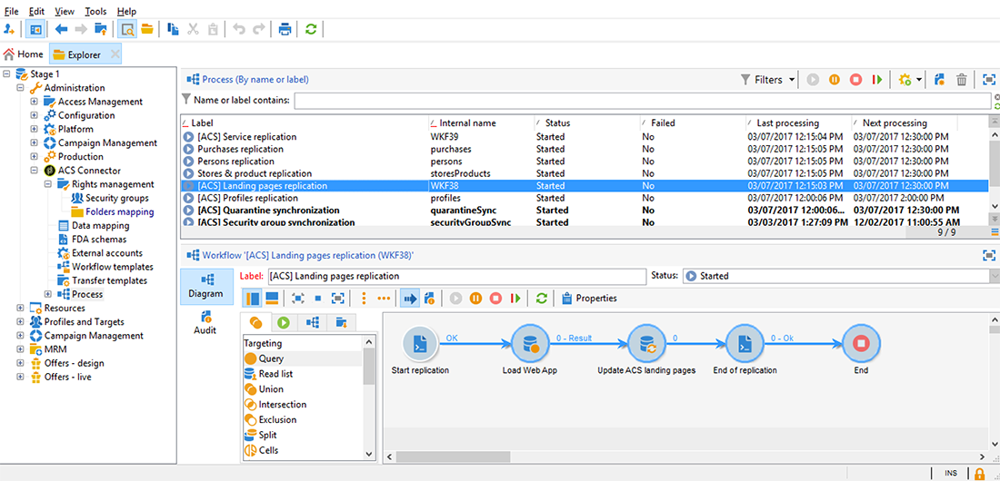

# 同步 Web 应用程序{#synchronizing-web-applications}

在此用例中，我们将使用Campaign Standard发送通信，该通信中包括指向Campaign v7 Web应用程序的链接。 当收件人单击电子邮件中的链接时，Web应用程序会显示一个表单，其中包含预先加载了收件人数据的多个字段以及指向新闻稿的订阅链接。 收件人可以更新其数据并订阅服务。 他的个人资料将在Campaign v7中更新，信息将在Campaign Standard中复制。

如果您在Campaign v7中拥有许多服务和Web应用程序，则可能选择不在Campaign Standard中重新创建它们。 ACS Connector允许您使用所有现有的Campaign v7 Web应用程序和服务，并将它们链接到由Campaign Standard发送的投放。

## 先决条件 {#prerequisites}

要实现此目的，您需要：

* 收件人存储在Campaign v7数据库中，并与Campaign Standard同步。 请参阅[同步配置文件](../../integrations/using/synchronizing-profiles.md)一节。
* 在Campaign v7中创建并发布的服务和web应用程序。
* web应用程序必须包含使用&#x200B;**[!UICONTROL Adobe Campaign encryption]**&#x200B;标识方法的&#x200B;**[!UICONTROL Pre-loading]**&#x200B;活动。

## 创建Web应用程序和服务 {#creating-the-web-application-and-service}

在Campaign v7中，您可以创建允许收件人订阅服务的Web应用程序。 Web应用程序和服务在Campaign v7中设计并存储，您可以通过Campaign Standard通信更新此服务。 要了解有关Campaign v7中Web应用程序的更多信息，请参阅[此部分](../../web/using/adding-fields-to-a-web-form.md#subscription-checkboxes)。

在Campaign v7中，已创建以下对象：

* 新闻稿服务
* 包含&#x200B;**[!UICONTROL Pre-loading]**、**[!UICONTROL Page]**&#x200B;和&#x200B;**[!UICONTROL Storage]**&#x200B;活动的web应用程序。

1. 转到&#x200B;**[!UICONTROL Resources > Online > Web applications]**&#x200B;并选择现有Web应用程序。

   

1. 编辑&#x200B;**[!UICONTROL Preloading]**&#x200B;活动。 选中&#x200B;**[!UICONTROL Auto-load data referenced in the form]**&#x200B;框并选择&#x200B;**[!UICONTROL Adobe Campaign encryption]**&#x200B;识别方法。 这将允许Web应用程序预载表单的字段，其中包含存储在Adobe Campaign数据库中的数据。 请参阅[本文档](../../web/using/publishing-a-web-form.md#pre-loading-the-form-data)。

   

1. 编辑&#x200B;**[!UICONTROL Page]**。 包含三个字段（名称、电子邮件和电话），以及一个复选框，可邀请收件人订阅新闻通讯（**[!UICONTROL Newsletter]**&#x200B;服务）。

   

1. 转到&#x200B;**[!UICONTROL Profiles and Target > Services and subscriptions]**&#x200B;并打开&#x200B;**[!UICONTROL Newsletter]**&#x200B;服务。 这是将从Campaign Standard通信更新的服务。 您可以看到尚未有收件人订阅此服务。

   

1. 转到&#x200B;**[!UICONTROL Profiles and Targets > Recipient]**&#x200B;并选择收件人。 您可以看到此用户档案尚未订阅服务。

   

## 复制数据 {#replicating-the-data}

为了在Campaign v7和Campaign Standard之间复制所需的数据，可使用多个复制工作流模板。 **[!UICONTROL Profiles replication]**&#x200B;工作流会自动复制所有Campaign v7收件人以进行Campaign Standard。 请参阅[技术和复制工作流](../../integrations/using/acs-connector-principles-and-data-cycle.md#technical-and-replication-workflows)。 **[!UICONTROL Landing pages replication]**&#x200B;工作流允许复制我们要在Campaign Standard中使用的Web应用程序。

要检查数据是否已正确复制，请在Campaign Standard中执行以下步骤：

1. 在主屏幕中，单击&#x200B;**[!UICONTROL Customer profiles]**。

   

1. 搜索您的Campaign v7收件人，并检查此收件人是否显示在Campaign Standard中。

   

1. 在顶部栏中，单击&#x200B;**[!UICONTROL Marketing activities]**，然后搜索Campaign v7 Web应用程序。 它在Campaign Standard中显示为登陆页面。

   

1. 单击左上角的&#x200B;**[!UICONTROL Adobe Campaign]**&#x200B;徽标，然后选择&#x200B;**Profiles &amp; audiences > Services**&#x200B;并检查Newsletter服务是否也存在。

   

## 设计和发送电子邮件 {#designing-and-sending-the-email}

在本部分中，我们将了解如何在Campaign Standard电子邮件中包含从Campaign v7 Web应用程序复制的登陆页面的链接。

创建、设计和发送电子邮件的步骤与经典电子邮件的步骤相同。 请参阅[Adobe Campaign Standard](https://experienceleague.adobe.com/docs/campaign-standard.html?lang=zh-Hans)文档。

1. 创建新电子邮件，并选择一个或多个复制的用户档案作为受众。
1. 编辑内容并插入&#x200B;**[!UICONTROL Link to a landing page]**。

   

1. 选择从Campaign v7 Web应用程序复制的登陆页面。

   

1. 准备电子邮件、发送校样并发送最终电子邮件。
1. 其中一个收件人打开电子邮件，并单击指向新闻稿订阅的链接。

   

1. 此收件人添加电话号码并选中新闻稿订阅框。

   

## 检索更新的信息 {#retrieving-the-updated-information}

当收件人通过Web应用程序从更新其数据时，Adobe Campaign v7会同步检索更新的信息。 然后，它会从Campaign v7复制到Campaign Standard。

1. 在Campaign v7中，转到&#x200B;**[!UICONTROL Profiles and Target > Services and subscriptions]**&#x200B;并打开&#x200B;**[!UICONTROL Newsletter]**&#x200B;服务。 现在，您可以看到订阅者列表中显示了收件人。

   

1. 转到&#x200B;**[!UICONTROL Profiles and Targets > Recipient]**&#x200B;并选择收件人。 您现在可以看到电话号码已存储。

   

1. 在&#x200B;**[!UICONTROL Subscriptions]**&#x200B;选项卡中，我们还可以看到此收件人已订阅了Newsletter服务。

   

1. 等待几分钟，以运行配置文件复制工作流。
1. 在Campaign Standard中，访问您的收件人用户档案，以检查更新的数据是否已正确从Campaign v7复制。

   

1. 编辑用户档案。 您可以看到电话号码已更新。

   

1. 单击&#x200B;**[!UICONTROL Subscriptions]**&#x200B;选项卡。 此时将显示新闻稿服务。

   
