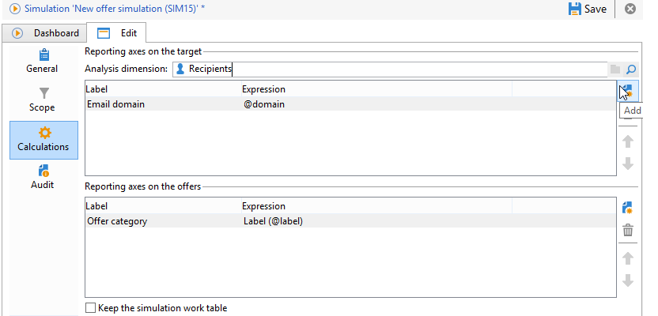

# 关于优惠模拟{#about-offers-simulation}

的 **模拟** 利用模块，可在向收件人发送建议之前，测试属于类别或环境的选件的分发。

模拟会考虑以前应用于选件的上下文和资格规则(请参阅 [优惠目录概述](../../interaction/using/offer-catalog-overview.md))及其演示规则(请参阅 [管理优惠演示](../../interaction/using/managing-offer-presentation.md))。 这样，您就可以测试和优化选件建议的各种版本，而无需实际使用选件，或者超量/不限次地吸引目标，因为模拟对目标收件人没有影响。

要了解如何模拟优惠，请阅读以下步骤。

[您也可以观看此视频](https://helpx.adobe.com/campaign/classic/how-to/simulate-offer-in-acv6.html?playlist=/ccx/v1/collection/product/campaign/classic/segment/digital-marketers/explevel/intermediate/applaunch/introduction/collection.ccx.js&amp;ref=helpx.adobe.com)。

## 创建模拟的主要步骤 {#main-steps-for-creating-a-simulation}

要运行选件模拟，请应用以下步骤：

1. 在 **[!UICONTROL Profiles and Targets]** ，单击 **[!UICONTROL Simulations]** 链接，然后单击 **[!UICONTROL Create]** 按钮。

   

1. 保存并编辑之前创建的模拟。
1. 转到 **[!UICONTROL Edit]** 选项卡，然后指定执行设置。

   有关更多信息，请参阅 [执行设置](../../interaction/using/execution-settings.md).

   

   >[!NOTE]
   >
   >仅当您使用与Campaign的交互时，才可使用执行设置。

1. 指定模拟范围。

   有关更多信息，请参阅 [范围的定义](../../interaction/using/simulation-scope.md#definition-of-the-scope).

   

1. 添加报表轴以增强 **[!UICONTROL Offer distribution by rank]** 报表（可选）。

   有关更多信息，请参阅 [添加报表轴](../../interaction/using/simulation-scope.md#adding-reporting-axes).

   

1. 单击 **[!UICONTROL Save]** 以记录模拟设置。
1. 通过仪表板启动模拟。

   

1. 检查模拟结果并显示分析报告。

   有关更多信息，请参阅 [模拟跟踪](../../interaction/using/simulation-tracking.md).

   
