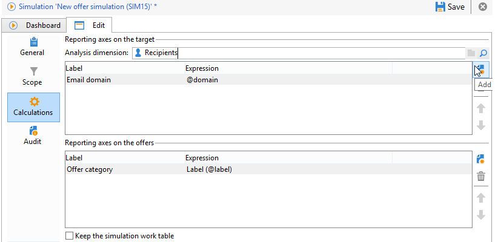

# 关于产品建议模拟{#about-offers-simulation}

使用&#x200B;**Simulation**&#x200B;模块，您可以在向收件人发送建议之前测试属于某个类别或某个环境的选件分布。

模拟会考虑先前应用于优惠的上下文和资格规则（请参阅[优惠目录概述](../../interaction/using/offer-catalog-overview.md)）及其呈现规则（请参阅[管理优惠呈现](../../interaction/using/managing-offer-presentation.md)）。 这样，您就可以测试和优化各种版本的优惠建议，而无需实际使用优惠或过度/缺征询目标，因为模拟对目标收件人没有影响。

要了解如何模拟优惠，请阅读以下步骤。

您也可以观看此[视频](https://helpx.adobe.com/campaign/classic/how-to/simulate-offer-in-acv6.html?playlist=/ccx/v1/collection/product/campaign/classic/segment/digital-marketers/explevel/intermediate/applaunch/introduction/collection.ccx.js&ref=helpx.adobe.com)。

## 创建模拟的主要步骤 {#main-steps-for-creating-a-simulation}

要运行优惠模拟，请应用以下步骤：

1. 在&#x200B;**[!UICONTROL Profiles and Targets]**&#x200B;选项卡中，单击&#x200B;**[!UICONTROL Simulations]**&#x200B;链接，然后单击&#x200B;**[!UICONTROL Create]**&#x200B;按钮。

   

1. 保存并编辑刚刚创建的模拟。
1. 转到&#x200B;**[!UICONTROL Edit]**&#x200B;选项卡并指定执行设置。

   有关详细信息，请参阅[执行设置](../../interaction/using/execution-settings.md)。

   

   >[!NOTE]
   >
   >执行设置仅在与Campaign使用交互时才可用。

1. 指定模拟范围。

   有关详细信息，请参阅作用域](../../interaction/using/simulation-scope.md#definition-of-the-scope)的[定义。

   

1. 添加报告轴以增强&#x200B;**[!UICONTROL Offer distribution by rank]**&#x200B;报告（可选）。

   有关详细信息，请参阅[添加报告轴](../../interaction/using/simulation-scope.md#adding-reporting-axes)。

   

1. 单击&#x200B;**[!UICONTROL Save]**&#x200B;以记录模拟设置。
1. 通过仪表板开始模拟。

   

1. 检查仿真结果并显示分析报告。

   有关详细信息，请参阅[模拟跟踪](../../interaction/using/simulation-tracking.md)。

   
