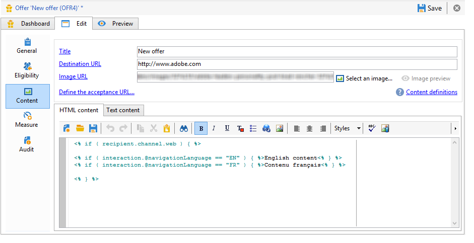
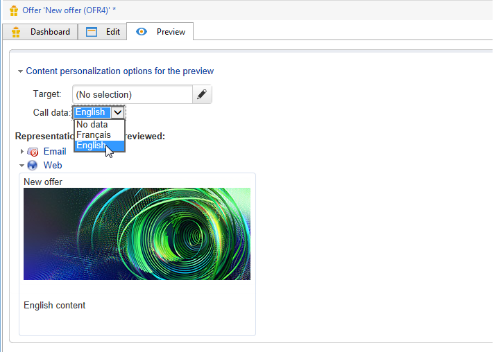

# 其他数据{#additional-data}


在调用交互引擎期间，您可以传输上下文附加信息。 该数据可以来自存储在工作流工作表中的目标数据（出站频道），也可以来自网站在呼叫（入站频道）期间发送的呼叫数据。 您可以在资格规则、选件个性化中使用这些附加数据，还可以将其存储在建议表中。

对于入站渠道，取回诸如咨询选件的人员的浏览器语言或呼叫中心代理姓名之类的信息可能很有用。 然后，您可以在资格规则中使用此调用数据，仅向使用法文或英语查看网页的人提供优惠。

在定位工作流（出站渠道）中，您可以在调用引擎期间使用目标数据。 例如，您可以通过FDA，使用来自收件人链接事务或外部数据库的数据扩充目标。

## 其他数据配置 {#additional-data-configuration}

您必须扩展 **nms：interaction** 链接到环境的架构，并声明在调用交互引擎期间将使用的其他字段列表。 在创建资格规则或个性化优惠时，这些字段将可从 **互动** 节点(请参阅 [使用其他数据](#using-additional-data))。

对于入站渠道，您必须将呼叫数据字段添加到 **互动** 节点。

```
<element label="Interactions" labelSingular="Interaction" name="interaction">
  <attribute label="Navigation language" name="navigationLanguage" type="string"/>
</element>
```

>[!NOTE]
>
>入站渠道支持XML收藏集，但不支持指向其他架构的链接。

对于出站渠道，必须添加 **targetdata** 元素中包含附加字段 **互动** 节点。

```
<element label="Interactions" labelSingular="Interaction" name="interaction">
  <element name="targetData">
    <attribute label="Date of last transaction" name="lastTransactionDate" type="datetime"/>
  </element>
</element>
```

>[!NOTE]
>
>出站渠道不支持收藏集。 但是，您可以创建指向其他架构的链接。

如果您想将此数据存储在建议表中，则还必须扩展 **nms：propositionRcp** 架构并声明这些字段。

```
<element label="Recipient offer propositions" labelSingular="Recipient offer proposition" name="propositionRcp">
  <attribute label="Last transaction date" name="lastTransactionDate" type="datetime"/>
  <attribute label="Navigation language" name="navigationLanguage" type="string"/>
</element>
```

## 其他数据实施 {#additional-data-implementation}

### 输入渠道（网页） {#input-channel--web-page-}

要在调用引擎时传输其他数据，您必须添加 **interactionGlobalCtx** 变量导入网页的JavaScript代码。 插入 **互动** 包含此变量中的调用数据的节点。 您必须遵循中的相同xml结构 **nms：interaction** 架构。 请参阅： [其他数据配置](#additional-data-configuration).

```
interactionGlobalCtx = "<interaction navigationLanguage='"+myLanguage+"'/>";
```

### 输出通道 {#output-channel}

您必须创建一个定向工作流，通过遵循与中相同的xml结构和相同的内部名称，在工作表中加载其他数据。 **nms：interaction** 架构。 请参阅： [其他数据配置](#additional-data-configuration).

## 使用其他数据 {#using-additional-data}

### 资格规则 {#eligibility-rules}

您可以将资格规则中的附加数据用于优惠、类别和权重。

例如，您可以选择仅向使用英语查看页面的用户显示选件。


>[!NOTE]
>
>您必须在为其定义数据的渠道上限制规则。 在我们的示例中，我们将限制入站Web渠道上的规则(**[!UICONTROL Taken into account if]** 字段)。

### 个性化 {#personalization}

在对优惠进行个性化设置时，您还可以使用此附加数据。 例如，您可以为导航语言添加条件



>[!NOTE]
>
>您必须限制定义数据的渠道上的个性化。 在我们的示例中，我们将限制入站Web渠道上的规则。

如果您使用附加数据对优惠进行了个性化，则默认情况下，此数据不会显示在预览中，因为它在数据库中不可用。 在环境的 **[!UICONTROL Example of call data]** 选项卡，必须添加要在预览中使用的值示例。 请遵循中的相同xml结构 **nms：interaction** 模式扩展。 有关详细信息，请参见 [其他数据配置](#additional-data-configuration).


预览时，单击 **[!UICONTROL Content personalization options for the preview]** 并在 **[!UICONTROL Call data]** 字段。



### 存储 {#storage}

在调用引擎期间，您可以在建议表中存储其他数据，以扩充数据库。 例如，可在报告、ROI计算或以后的流程中使用此数据。

>[!NOTE]
>
>您必须已扩展 **nms：propositionRcp** 架构并声明了包含要存储的数据的字段。 有关此内容的更多信息： [其他数据配置](#additional-data-configuration).

在优惠空间，转到 **[!UICONTROL Storage]** 选项卡，然后单击 **[!UICONTROL Add]** 按钮。

在 **[!UICONTROL Storage path]** 列中，选择建议表中的存储字段。 在 **[!UICONTROL Expression]** 列中，选择附加字段 **[!UICONTROL Interaction]** 节点。

您可以在生成建议或接受建议时（当人员单击优惠时）检索呼叫数据。


