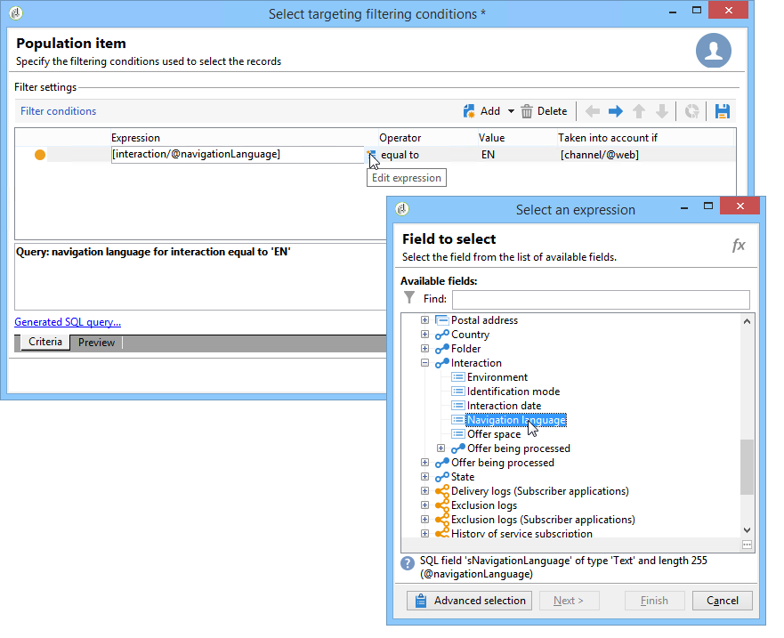

# 其他数据{#additional-data}

在调用交互引擎期间，您可以传输上下文附加信息。 此目标可以来自存储在工作流(出站渠道)的工作表中的数据，或来自网站在呼叫(入站渠道)期间发送的呼叫数据。 您可以在合格规则中、优惠个性化中使用此附加数据，还可以将其存储在建议表中。

对于入站渠道，可能有用于恢复诸如咨询优惠的人员的浏览器语言或呼叫中心代理的名称等信息。 然后，您可以在合格规则中使用此呼叫数据，仅向那些以法语或英语查看网页的用户显示优惠。

在定位工作流(出站渠道)中，您可以在调用引擎时使用目标数据。 例如，您可以通过目标从收件人链接的事务或外部数据库中获取数据来丰富联合数据访问。

## 其他数据配置 {#additional-data-configuration}

您必须扩展链 **接到环境的** nms:interaction模式，并声明将在调用交互引擎时使用的其他字段的列表。 创建合格规则或个性化优惠时，这些字段将可从“交互”节 **点访** 问(请参阅 [使用其他数据](#using-additional-data))。

对于入站渠道，必须将调用数据字段添加到“交互 **”节点** 。

```
<element label="Interactions" labelSingular="Interaction" name="interaction">
  <attribute label="Navigation language" name="navigationLanguage" type="string"/>
</element>
```

>[!NOTE]
>
>入站渠道支持XML集合，但到其他模式的链接不支持。

对于出站渠道，必须向“交互 **”节点中** 添加一个包含附加字段 **的targetData元素** 。

```
<element label="Interactions" labelSingular="Interaction" name="interaction">
  <element name="targetData">
    <attribute label="Date of last transaction" name="lastTransactionDate" type="datetime"/>
  </element>
</element>
```

>[!NOTE]
>
>出站渠道不支持集合。 但是，您可以创建指向其他模式的链接。

如果要将此模式存储在命题表中，则还必须扩展nms: **postitionRcp** 并声明这些字段。

```
<element label="Recipient offer propositions" labelSingular="Recipient offer proposition" name="propositionRcp">
  <attribute label="Last transaction date" name="lastTransactionDate" type="datetime"/>
  <attribute label="Navigation language" name="navigationLanguage" type="string"/>
</element>
```

## 其他数据实施 {#additional-data-implementation}

### 输入渠道（网页） {#input-channel--web-page-}

要在调用引擎时传输其他数据，必 **须将interactionGlobalCtx** 变量添加到网页的JavaScript代码中。 将包含调 **用数据** 的“交互”节点插入此变量。 您必须遵循nms:interaction模式中的 **相同xml结构** 。 请参阅： [其他数据配置](#additional-data-configuration)。

```
interactionGlobalCtx = "<interaction navigationLanguage='"+myLanguage+"'/>";
```

### 输出渠道 {#output-channel}

必须创建一个定位工作流，通过遵循与nms:interaction模式相同的xml结构和相同的内部名称在工作表中加载 **其他** 。 请参阅： [其他数据配置](#additional-data-configuration)。

## 使用其他数据 {#using-additional-data}

### 合格规则 {#eligibility-rules}

您可以在合格规则中为优惠、类别和权重使用其他数据。

例如，您可以选择仅向查看页面的人员显示优惠。



>[!NOTE]
>
>必须限制定义渠道的规则。 在我们的示例中，我们将限制入站Web渠道(字&#x200B;**[!UICONTROL Taken into account if]** 段)的规则。

### 个性化{#personalization}

在个性化优惠时，您还可以使用此附加数据。 例如，您可以为导航语言添加一个条件


>[!NOTE]
>
>您必须对定义数据的渠道限制个性化。 在我们的示例中，我们将限制入站Web渠道上的规则。

如果您已使用其他数据对优惠进行个性化，则此数据默认不会显示在预览中，因为数据库中不提供此数据。 在环境标 **[!UICONTROL Example of call data]** 签中，您必须添加值样本才能在预览中使用。 请遵循nms:interaction模式扩展中 **的相同xml** 结构。 有关此的详细信息，请参 [阅其他数据配置](#additional-data-configuration)。


预览时，单 **[!UICONTROL Content personalization options for the preview]** 击并在字段中选择 **[!UICONTROL Call data]** 值。


### 存储 {#storage}

在调用引擎期间，您可以在命题表中存储其他数据以丰富数据库。 这些数据可用于报表、ROI计算或后续流程。

>[!NOTE]
>
>您必须已扩展 **nms:postitionRcp** 模式并声明将包含要存储的数据的字段。 有关此内容的更多信息： [其他数据配置](#additional-data-configuration)。

在优惠空间中，转到选 **[!UICONTROL Storage]** 项卡并单击按 **[!UICONTROL Add]** 钮。

在列 **[!UICONTROL Storage path]** 中，选择命题表中的存储字段。 在列 **[!UICONTROL Expression]** 中，选择节点中的其他 **[!UICONTROL Interaction]** 字段。

在生成建议或接受建议时(当用户单击优惠时)，您可以检索呼叫数据。


